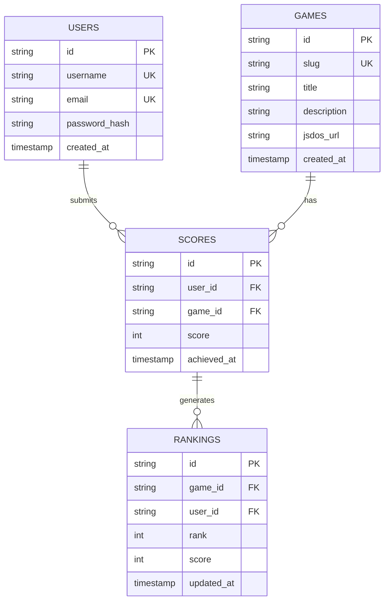
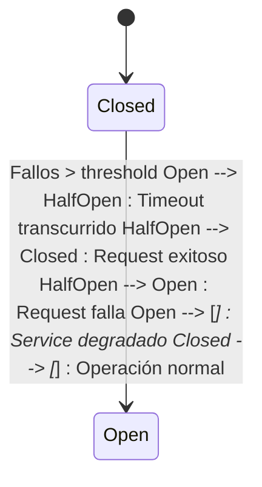
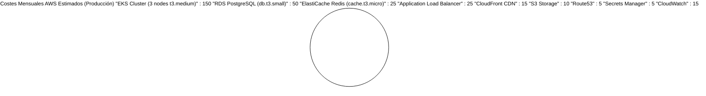

```mermaid
sequenceDiagram actor U as Usuario participant F as Frontend participant K as Kong Gateway participant SS as Score Service participant DB as PostgreSQL participant R as Redis participant RS as Ranking Service U->>F: Envía score (gameId, score) F->>K: POST /api/scores + JWT K->>K: Valida JWT K->>SS: Forward request SS->>DB: SELECT current_score WHERE user_id AND game_id alt score > current_score SS->>DB: UPDATE scores SET score=new_score SS->>R: DEL cache:ranking:{gameId} SS->>RS: Trigger ranking update (async) RS->>DB: SELECT TOP 10 scores RS->>R: SET cache:ranking:{gameId} TTL 300s SS-->>F: 200 OK {updated: true} else score <= current_score SS-->>F: 200 OK {updated: false} end F->>U: Mostrar confirmación
```

# 🤖 Análisis Inteligente de Documentación

**Fecha**: 2025-11-22 03:18:22  
**Generado por**: Claude Sonnet 4.5  
**Puntuación General**: 7.2/10

## 📊 Resumen Ejecutivo

La documentación está bien estructurada pero presenta gaps críticos: falta arquitectura de datos detallada, patrones de resiliencia, guías de migración/rollback, métricas de observabilidad, y diagramas de componentes internos de servicios. La estructura es sólida pero necesita consolidación en secciones redundantes y profundización en aspectos operacionales.

## 🎯 Mejoras Prioritarias


### Prioridad Alta ⚡

#### Arquitectura de Datos y Modelos

**Categoría**: content  
**Descripción**: Falta documentación completa de los modelos de datos, esquemas de base de datos, relaciones entre entidades, estrategia de caché en Redis y políticas de consistencia. Es crítico para desarrolladores que necesitan entender el dominio.  
**Razón**: Sin conocer los modelos de datos es imposible contribuir efectivamente al backend. Los desarrolladores necesitan ver las relaciones, índices y constraints para escribir queries eficientes y evitar bugs de integridad referencial.  

**Archivos a crear**: architecture/data-architecture.mdx, architecture/database-schemas.mdx, architecture/cache-strategy.mdx  
**Archivos a modificar**: architecture.mdx  

**Diagrama propuesto**:



---

#### Diagrama de Componentes Detallado por Servicio

**Categoría**: diagrams  
**Descripción**: Cada microservicio necesita un diagrama de componentes mostrando su arquitectura interna: controladores, servicios, repositorios, middlewares, y dependencias externas. Actualmente solo hay diagramas de alto nivel.  
**Razón**: Los desarrolladores necesitan entender la arquitectura interna de cada servicio para debuggear, extender funcionalidad o refactorizar sin romper dependencias. Sin esto, la curva de aprendizaje es muy alta.  

**Archivos a crear**: services/auth-service-architecture.mdx, services/score-service-architecture.mdx, services/catalog-service-architecture.mdx  
**Archivos a modificar**: services/auth-service.mdx, services/score-service.mdx, services/game-catalog.mdx  

**Diagrama propuesto**:
```mermaid
graph TB subgraph AuthService A[API Routes] --> B[AuthController] B --> C[AuthService] C --> D[UserRepository] C --> E[JWTService] D --> F[(PostgreSQL)] E --> G[(Redis)] B --> H[ValidationMiddleware] B --> I[ErrorHandler] end subgraph Dependencies J[bcrypt] K[jsonwebtoken] C --> J C --> K end
```


---

#### Estrategia de Resiliencia y Manejo de Fallos

**Categoría**: content  
**Descripción**: No existe documentación sobre patrones de resiliencia: circuit breakers, retries, timeouts, fallbacks, health checks detallados. Crítico para producción robusta.  
**Razón**: Sin patrones de resiliencia, un fallo en un servicio puede causar cascada de fallos. La documentación debe guiar implementación de circuit breakers, especialmente en llamadas entre microservicios y a Redis/PostgreSQL.  

**Archivos a crear**: architecture/resilience-patterns.mdx, operations/health-monitoring.mdx, operations/failure-scenarios.mdx  
**Archivos a modificar**: architecture.mdx, troubleshooting.mdx  

**Diagrama propuesto**:



---

#### Guía de Migración y Rollback

**Categoría**: content  
**Descripción**: Falta documentación sobre cómo realizar migraciones de base de datos, actualizaciones de esquemas, y procedimientos de rollback en caso de despliegue fallido. Esencial para operaciones seguras.  
**Razón**: Las migraciones de BD son el punto más riesgoso en despliegues. Sin procedimientos claros de rollback, un fallo puede resultar en downtime prolongado o pérdida de datos. Esto debe estar perfectamente documentado.  

**Archivos a crear**: operations/migration-guide.mdx, operations/rollback-procedures.mdx, operations/blue-green-deployment.mdx  
**Archivos a modificar**: deployment.mdx, cicd/gitops-workflow.mdx  

**Diagrama propuesto**:
```mermaid
sequenceDiagram participant DevOps participant ArgoCD participant EKS participant PostgreSQL participant Monitoring DevOps->>ArgoCD: Sync nueva versión ArgoCD->>EKS: Deploy green environment EKS->>PostgreSQL: Aplicar migraciones forward-compatible DevOps->>Monitoring: Verificar métricas alt Despliegue exitoso DevOps->>EKS: Cambiar tráfico a green DevOps->>EKS: Eliminar blue environment else Fallo detectado DevOps->>ArgoCD: Rollback a versión anterior ArgoCD->>EKS: Restaurar blue environment DevOps->>PostgreSQL: Ejecutar rollback SQL end
```


---

#### Métricas y Observabilidad Detallada

**Categoría**: content  
**Descripción**: La sección de monitorización es superficial. Falta especificar qué métricas exactas recoger (RED method, USE method), dashboards de Grafana, alertas de Prometheus, traces distribuidos, y logs estructurados.  
**Razón**: Sin observabilidad detallada es imposible detectar degradación de servicio antes de que afecte usuarios. Necesitamos métricas específicas, dashboards útiles y alertas accionables, no solo mencionar que existe Prometheus.  

**Archivos a crear**: operations/metrics-catalog.mdx, operations/alerting-rules.mdx, operations/distributed-tracing.mdx, operations/log-aggregation.mdx  
**Archivos a modificar**: infrastructure/monitoring.mdx  

**Diagrama propuesto**:
```mermaid
graph LR subgraph Servicios A[Auth Service] --> M1[Prometheus Metrics] B[Score Service] --> M2[Prometheus Metrics] C[Catalog Service] --> M3[Prometheus Metrics] end subgraph Observabilidad M1 --> P[Prometheus] M2 --> P M3 --> P P --> G[Grafana Dashboards] P --> AM[AlertManager] A --> J[Jaeger Tracing] B --> J C --> J A --> L[Loki Logs] B --> L C --> L end subgraph Alertas AM --> S[Slack] AM --> PS[PagerDuty] end
```


---


### Prioridad Media 📌

#### Gestión de Secretos y Seguridad

**Categoría**: content  
**Descripción**: Falta documentación sobre gestión segura de secretos (AWS Secrets Manager, K8s Secrets, Sealed Secrets), rotación de credenciales, políticas de RBAC, y auditoría de seguridad.  
**Razón**: La seguridad es crítica en aplicaciones con autenticación. Debe haber guías claras sobre cómo gestionar secretos sin exponerlos en Git, cómo rotarlos, y cómo auditar accesos. Actualmente solo menciona variables de entorno sin contexto seguro.  

**Archivos a crear**: security/secrets-management.mdx, security/rbac-policies.mdx, security/security-audit.mdx, security/compliance.mdx  
**Archivos a modificar**: configuration.mdx  

**Diagrama propuesto**:
```mermaid
graph TB A[AWS Secrets Manager] --> B[External Secrets Operator] B --> C[Kubernetes Secrets] C --> D[Pod: Auth Service] A --> E[RDS Credentials] A --> F[Redis Credentials] A --> G[JWT Secret] H[GitHub Repo] --> I[Sealed Secrets] I --> B J[Developer] -.No acceso directo.-> A J --> K[kubectl con RBAC] K --> L[Namespace dev]
```


---

#### Flujo Completo de Datos de Puntuaciones

**Categoría**: diagrams  
**Descripción**: Falta un diagrama de secuencia detallado mostrando el flujo completo desde que un usuario envía un score hasta que aparece en el ranking, incluyendo validaciones, actualizaciones de caché, y propagación.  
**Razón**: El flujo de scores es crítico para la lógica de negocio. Los desarrolladores necesitan ver todas las validaciones, transacciones DB, y actualizaciones de caché para entender el comportamiento y optimizar performance.  

**Archivos a crear**: architecture/score-data-flow.mdx  
**Archivos a modificar**: sequence-diagrams.mdx, services/score-service.mdx  

**Diagrama propuesto**:



---

#### Optimización de Rendimiento y Caching

**Categoría**: content  
**Descripción**: No hay documentación sobre estrategias de optimización: query optimization, índices de BD, políticas de caching, CDN caching, lazy loading, paginación. Necesario para escalabilidad.  
**Razón**: La performance es clave para buena UX. Sin guías de optimización, los desarrolladores pueden escribir queries lentos, no cachear apropiadamente, o saturar la BD. Documentar best practices previene problemas de escalabilidad.  

**Archivos a crear**: performance/optimization-guide.mdx, performance/database-indexing.mdx, performance/caching-strategies.mdx  
**Archivos a modificar**: architecture/cache-strategy.mdx  

**Diagrama propuesto**:
```mermaid
graph TB U[Usuario] --> CF[CloudFront CDN] CF -->|Cache HIT| A[Assets estáticos] CF -->|Cache MISS| S3[S3 Bucket] U --> ALB[Application LB] ALB --> K[Kong Gateway] K --> SS[Score Service] SS -->|Check L1| R1[Redis: Rankings Cache] R1 -->|HIT| SS R1 -->|MISS| SS SS -->|Query| DB[(PostgreSQL)] DB -->|Índices optimizados| SS SS -->|Store| R1 K --> CS[Catalog Service] CS -->|Check L2| R2[Redis: Games Cache] R2 -->|HIT| CS R2 -->|MISS| CS CS --> DB
```


---

#### Pruebas y Calidad de Código

**Categoría**: content  
**Descripción**: Falta documentación sobre estrategia de testing: unit tests, integration tests, e2e tests, test coverage mínimo, mocking, test fixtures, y CI pipelines para testing.  
**Razón**: Sin tests automatizados, cada cambio es riesgoso. Debe haber guías claras sobre qué testear, cómo estructurar tests, y qué herramientas usar. La cobertura debe medirse y enforcearse en CI.  

**Archivos a crear**: development/testing-strategy.mdx, development/unit-tests.mdx, development/integration-tests.mdx, development/e2e-tests.mdx  
**Archivos a modificar**: development.mdx, cicd/github-actions.mdx  

**Diagrama propuesto**:
```mermaid
graph TB subgraph Developer Machine D[Desarrollador] --> U[Unit Tests: Jest] U --> I[Integration Tests: Supertest] I --> L[Lint: ESLint] end subgraph CI Pipeline GitHub Actions G[Git Push] --> B[Build Docker Image] B --> UT[Run Unit Tests] UT --> IT[Run Integration Tests] IT --> SC[SonarQube Scan] SC --> COV{Coverage > 80%} COV -->|Yes| PUSH[Push to Registry] COV -->|No| FAIL[Build Failed] end subgraph CD Pipeline ArgoCD PUSH --> A[ArgoCD Detect] A --> DS[Deploy to Staging] DS --> E2E[E2E Tests: Cypress] E2E --> PROD{Tests Pass} PROD -->|Yes| DP[Deploy to Prod] PROD -->|No| RB[Rollback] end
```


---

#### Consolidar Documentación API Redundante

**Categoría**: structure  
**Descripción**: Existe duplicación entre api-reference/* y services/*. Por ejemplo, auth-service.mdx y api-reference/auth-service.mdx. Consolidar en una estructura única referenciando OpenAPI/Swagger.  
**Razón**: La duplicación genera inconsistencias y dificulta mantenimiento. Mejor tener una única fuente de verdad: servicios documentan arquitectura, API reference apunta a specs OpenAPI autogeneradas desde el código.  

**Archivos a crear**: api-reference/openapi-spec.mdx  
**Archivos a modificar**: services/auth-service.mdx, services/score-service.mdx, services/game-catalog.mdx  

---

#### Costes y Estimaciones de AWS

**Categoría**: content  
**Descripción**: Falta documentación sobre costes estimados de infraestructura AWS, breakdown por servicio (EKS, RDS, CloudFront, S3), y estrategias de optimización de costes.  
**Razón**: Los usuarios necesitan saber cuánto costará ejecutar la plataforma antes de desplegarla. Sin estimaciones, pueden tener sorpresas en la factura. También necesitan estrategias para optimizar costes sin sacrificar performance.  

**Archivos a crear**: operations/cost-estimation.mdx, operations/cost-optimization.mdx  
**Archivos a modificar**: quickstart.mdx, deployment.mdx  

**Diagrama propuesto**:



---


### Prioridad Baja 💡

#### Guía de Contribución y Estándares de Código

**Categoría**: content  
**Descripción**: Falta un CONTRIBUTING.md detallado con guías de estilo, convenciones de código, proceso de PR, branching strategy, y cómo contribuir a la documentación.  
**Razón**: Para que el proyecto sea sostenible y escalable con múltiples contribuidores, necesita guías claras de contribución. Sin esto, el código se vuelve inconsistente, los PRs son difíciles de revisar, y la calidad degrada.  

**Archivos a crear**: CONTRIBUTING.md, development/code-standards.mdx, development/git-workflow.mdx  
**Archivos a modificar**: README.md  

**Diagrama propuesto**:


---

#### Casos de Uso y User Stories

**Categoría**: content  
**Descripción**: La documentación es muy técnica pero falta contexto de negocio: casos de uso reales, user journeys, personas, y decisiones de producto. Útil para entender el por qué detrás de decisiones técnicas.  
**Razón**: Documentar el contexto de producto ayuda a que los contribuidores entiendan el propósito del sistema, no solo cómo funciona técnicamente. Esto guía mejores decisiones de arquitectura alineadas con necesidades de usuarios.  

**Archivos a crear**: product/use-cases.mdx, product/user-journeys.mdx, product/roadmap.mdx  
**Archivos a modificar**: index.mdx  

**Diagrama propuesto**:


---

#### Actualizar Referencias a Mintlify

**Categoría**: quality  
**Descripción**: El archivo development.mdx contiene contenido genérico de Mintlify (Preview changes locally to update your docs) que no aplica a este proyecto. Debe actualizarse con instrucciones específicas de Retro Game Hub.  
**Razón**: El contenido genérico confunde a los desarrolladores. La documentación debe ser 100% específica del proyecto, sin templates ni placeholders.  

**Archivos a modificar**: development.mdx  

---

#### Disaster Recovery y Backup

**Categoría**: content  
**Descripción**: Falta documentación sobre estrategias de disaster recovery: backups automáticos de RDS, snapshots de volúmenes, restore procedures, RPO/RTO targets, y plan de continuidad de negocio.  
**Razón**: Sin plan de DR, un desastre (fallo de región AWS, corrupción de datos, ataque) puede significar pérdida permanente de datos. Debe haber procedimientos claros, testados regularmente, para recuperarse de cualquier escenario.  

**Archivos a crear**: operations/disaster-recovery.mdx, operations/backup-strategy.mdx  
**Archivos a modificar**: deployment.mdx  

**Diagrama propuesto**:
```mermaid
graph TB subgraph Producción P[RDS Primary eu-west-1] --> B1[Automated Backup Diario] P --> S1[Manual Snapshot Pre-deploy] P --> R[Read Replica eu-west-1] end subgraph Disaster Recovery B1 --> S3[S3 Backup Bucket] S1 --> S3 P -.Cross-region replication.-> DR[RDS Standby us-east-1] DR --> B2[Automated Backup Diario] end subgraph Restore Procedure S3 --> RT{Restore Type} RT -->|Full| RFULL[Create new RDS from snapshot] RT -->|Point-in-time| RPIT[PITR desde backup] RFULL --> V[Validar datos] RPIT --> V V --> SW[Switch DNS] end
```


---


## 📁 Nuevas Secciones Propuestas

### Arquitectura de Datos

Sección dedicada a modelos de datos, esquemas de base de datos, relaciones entre entidades, y estrategias de persistencia y caché  

**Archivos**:
- `architecture/data-architecture.mdx`: Arquitectura de Datos  
- `architecture/database-schemas.mdx`: Esquemas de Base de Datos  
- `architecture/cache-strategy.mdx`: Estrategia de Caché  

### Operaciones y SRE

Sección para Site Reliability Engineering: observabilidad, incident response, disaster recovery, runbooks, y operational excellence  

**Archivos**:
- `operations/metrics-catalog.mdx`: Catálogo de Métricas  
- `operations/alerting-rules.mdx`: Reglas de Alertas  
- `operations/incident-response.mdx`: Respuesta a Incidentes  
- `operations/disaster-recovery.mdx`: Recuperación ante Desastres  

### Seguridad

Sección dedicada a seguridad, compliance, gestión de secretos, y mejores prácticas de seguridad en cloud-native  

**Archivos**:
- `security/secrets-management.mdx`: Gestión de Secretos  
- `security/rbac-policies.mdx`: Políticas RBAC  


---
*Análisis generado automáticamente*
