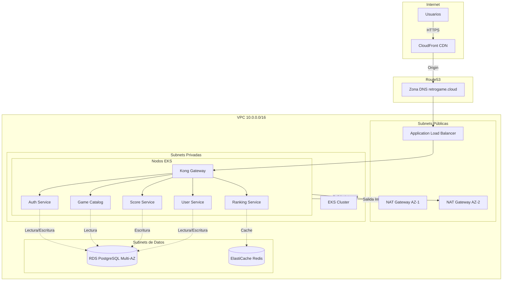
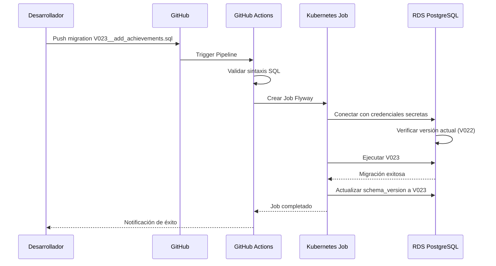
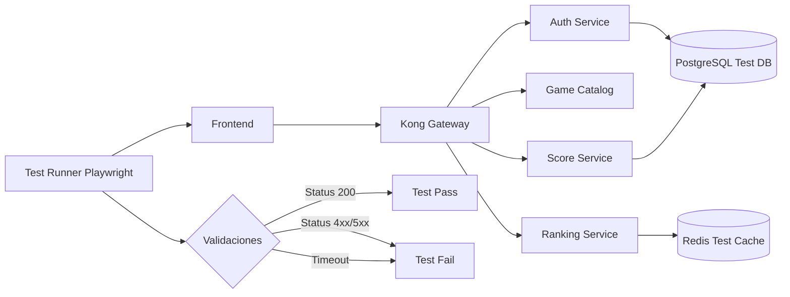
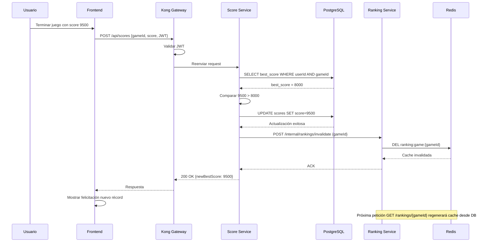

# 🤖 Análisis Inteligente de Documentación

**Fecha**: 2025-11-23 16:10:57  
**Generado por**: Claude Sonnet 4.5  
**Puntuación General**: 7.8/10

## 📊 Resumen Ejecutivo

Documentación robusta con buena cobertura técnica (50 archivos). Principales gaps: falta guía de migración de datos, documentación de tests end-to-end, arquitectura de decisiones (ADRs), y diagramas de infraestructura AWS detallados. Estructura sólida pero mejorable en navegación y consistencia.

## 🎯 Mejoras Prioritarias

### Prioridad Alta ⚡

#### Documentación de Arquitectura de Decisiones (ADRs)

**Categoría**: content  
**Descripción**: Faltan registros de decisiones arquitectónicas que expliquen por qué se eligieron tecnologías específicas (Kong vs alternativas, EKS vs ECS, PostgreSQL vs MongoDB, etc). Esto es crítico para onboarding de nuevos desarrolladores y mantenimiento a largo plazo.  
**Razón**: Los ADRs documentan el 'por qué' de decisiones técnicas, reduciendo deuda técnica y facilitando refactorizaciones futuras. Es una práctica estándar en arquitecturas complejas que aquí falta completamente.  

**Archivos a crear**: architecture/decision-records/adr-001-api-gateway.mdx, architecture/decision-records/adr-002-kubernetes-eks.mdx, architecture/decision-records/adr-003-database-selection.mdx, architecture/decision-records/index.mdx  
**Archivos a modificar**: architecture.mdx  

---

#### Diagrama de Infraestructura AWS Completo

**Categoría**: diagrams  
**Descripción**: No existe un diagrama visual que muestre la topología completa de AWS: VPC, subnets, security groups, NAT gateways, load balancers, RDS, CloudFront, Route53. Solo hay descripciones textuales fragmentadas.  
**Razón**: Un diagrama visual de infraestructura es esencial para troubleshooting, auditorías de seguridad, y planificación de DR. Actualmente la información está dispersa en múltiples archivos sin visión unificada.  

**Archivos a crear**: infrastructure/aws-topology.mdx  
**Archivos a modificar**: infrastructure/overview.mdx  

**Diagrama propuesto**:

---

#### Guía de Migración y Rollback de Base de Datos

**Categoría**: content  
**Descripción**: Falta documentación sobre cómo ejecutar migraciones de esquema en RDS PostgreSQL de forma segura, estrategias de versionado de esquema, y procedimientos de rollback en caso de fallos.  
**Razón**: Las migraciones de base de datos son una de las operaciones más riesgosas en producción. Sin documentación clara, los equipos cometen errores que resultan en downtime o pérdida de datos.  

**Archivos a crear**: infrastructure/database-migrations.mdx  
**Archivos a modificar**: infrastructure/database.mdx, cicd/gitops-workflow.mdx  

**Diagrama propuesto**:

---

#### Estrategia de Tests End-to-End

**Categoría**: content  
**Descripción**: Existe testing-guide.mdx pero no documenta tests E2E que validen flujos completos de usuario (registro -> login -> jugar -> submit score -> ver ranking). Crítico para CI/CD confiable.  
**Razón**: Los tests E2E son la última línea de defensa antes de producción. Sin ellos, los despliegues dependen de tests manuales, aumentando el riesgo de regresiones.  

**Archivos a crear**: development/e2e-testing.mdx  
**Archivos a modificar**: development/testing-guide.mdx, cicd/github-actions.mdx  

**Diagrama propuesto**:

---

#### Diagrama de Flujo de Datos de Puntuaciones

**Categoría**: diagrams  
**Descripción**: El proceso de submit score -> actualización de ranking -> invalidación de cache no está visualizado. Esto es crítico porque involucra múltiples servicios y Redis.  
**Razón**: Este flujo es complejo y tiene implicaciones de consistencia eventual. Documentarlo previene bugs donde el ranking no se actualiza correctamente tras un nuevo score.  

**Archivos a modificar**: services/score-service.mdx, services/ranking-service.mdx  

**Diagrama propuesto**:

---

### Prioridad Media 📌

#### Guía de Troubleshooting de Redis

**Categoría**: content  
**Descripción**: El sistema usa Redis para rankings pero no hay documentación específica sobre problemas comunes: cache eviction, conexiones máximas, cluster vs standalone, persistence RDB/AOF.  
**Razón**:   

**Archivos a crear**: infrastructure/redis-troubleshooting.mdx  
**Archivos a modificar**: troubleshooting-production.mdx, infrastructure/monitoring.mdx  

---

---
*Análisis generado automáticamente*
