```mermaid
sequenceDiagram participant Dev as Developer participant GH as GitHub participant GHA as GitHub Actions participant ECR as AWS ECR participant K8s as Manifests Repo participant ArgoCD as ArgoCD participant EKS as Cluster EKS Dev->>GH: git push feature-branch GH->>GHA: Trigger Workflow GHA->>GHA: Ejecutar tests (2min) GHA->>GHA: Lint y security scan (1min) GHA->>GHA: Build imagen Docker GHA->>ECR: Push imagen:sha-abc123 GHA->>K8s: Update deployment.yaml con nueva imagen K8s->>ArgoCD: Detecta cambio (30s) ArgoCD->>EKS: Apply manifests ArgoCD->>EKS: Health check pods (2min) alt Despliegue exitoso EKS-->>ArgoCD: Pods healthy ArgoCD-->>Dev: Notificación Slack éxito else Despliegue fallido EKS-->>ArgoCD: Pods CrashLoopBackOff ArgoCD->>EKS: Rollback a versión anterior ArgoCD-->>Dev: Notificación Slack fallo end
```

```mermaid
sequenceDiagram participant U as Usuario participant F as Frontend participant OP as OAuth2 Proxy participant GH as GitHub OAuth participant AS as Auth Service participant Kong as Kong Gateway U->>F: Click 'Login con GitHub' F->>OP: GET /oauth2/start OP->>GH: Redirect con client_id y scopes GH->>U: Mostrar pantalla autorización U->>GH: Aprobar permisos GH->>OP: Callback /oauth2/callback?code=xyz OP->>GH: POST /access_token (exchange code) GH-->>OP: access_token + user info OP->>OP: Crear sesión segura OP->>F: Redirect con cookie httpOnly F->>AS: POST /auth/oauth-login (cookie) AS->>AS: Validar sesión OAuth2 Proxy AS->>AS: Crear o actualizar usuario en DB AS-->>F: JWT token (exp: 24h) F->>F: Guardar JWT en localStorage F->>Kong: GET /api/games (Header: Authorization Bearer JWT) Kong->>Kong: Validar JWT signature Kong->>AS: Forward request AS-->>Kong: Response Kong-->>F: Juegos
```

```mermaid
sequenceDiagram participant JS as js-dos Emulator participant F as Frontend participant Kong as Kong Gateway participant SS as Score Service participant DB as PostgreSQL participant RS as Ranking Service participant Cache as Redis Cache JS->>F: gameCompleted(score: 9500) F->>F: Validar score localmente F->>Kong: POST /api/scores/submit {gameId, score, JWT} Kong->>SS: Forward con JWT validado SS->>DB: SELECT best_score WHERE user_id AND game_id DB-->>SS: current_best: 8000 SS->>SS: Comparar: 9500 > 8000 alt Nuevo récord personal SS->>DB: UPDATE scores SET score=9500 DB-->>SS: OK SS->>RS: Evento ScoreUpdated (async) RS->>DB: SELECT TOP 10 scores WHERE game_id RS->>Cache: INVALIDATE ranking:game:123 RS->>Cache: SET ranking:game:123 (nuevo top 10) SS-->>Kong: 200 OK {newBest: true, rank: 3} else Score no supera récord SS-->>Kong: 200 OK {newBest: false} end Kong-->>F: Response F->>F: Mostrar notificación nuevo récord
```

# 🤖 Análisis Inteligente de Documentación

**Fecha**: 2025-11-23 12:53:28  
**Generado por**: Claude Sonnet 4.5  
**Puntuación General**: 6.5/10

## 📊 Resumen Ejecutivo

Documentación extensa pero desorganizada. Faltan diagramas de infraestructura AWS, guías de monitorización, y documentación de seguridad. Estructura confusa con duplicaciones (development.mdx genérico vs desarrollo-local.mdx). Necesita consolidación y estandarización.

## 🎯 Mejoras Prioritarias


### Prioridad Alta ⚡

#### Consolidar y reorganizar documentación duplicada

**Categoría**: structure  
**Descripción**: Existen múltiples archivos con contenido solapado o genérico (development.mdx de Mintlify, essentials/* de plantilla). La estructura mezcla guías de usuario con referencias de API. Necesita jerarquía clara: Getting Started > Arquitectura > Servicios > Infraestructura > API Reference > Operaciones.  
**Razón**: La documentación actual tiene archivos de plantilla Mintlify sin personalizar y contenido duplicado que confunde a desarrolladores nuevos. Una estructura clara reduce el tiempo de onboarding en 50%.  

**Archivos a modificar**: index.mdx, quickstart.mdx, desarrollo-local.mdx  

---

#### Diagrama completo de infraestructura AWS

**Categoría**: diagrams  
**Descripción**: Falta un diagrama detallado que muestre todos los componentes de AWS: EKS con nodos, RDS PostgreSQL, S3 para assets, CloudFront, ALB, Route53, VPC con subredes públicas/privadas, NAT Gateway, Security Groups. El diagrama actual en architecture.mdx es demasiado abstracto.  
**Razón**: Desarrolladores e ingenieros de infraestructura necesitan entender la topología completa para debuggear problemas de red, optimizar costos y planificar escalabilidad. Sin esto, cada persona tiene una visión incompleta del sistema.  

**Archivos a crear**: infrastructure/arquitectura-aws-detallada.mdx  
**Archivos a modificar**: infrastructure/overview.mdx  

**Diagrama propuesto**:
```mermaid
graph TB subgraph Internet[Internet] U[Usuario] CF[CloudFront CDN] end subgraph AWS_Region[Región AWS us-east-1] subgraph VPC[VPC 10.0.0.0/16] subgraph PublicSubnet[Subredes Públicas] ALB[Application Load Balancer] NAT[NAT Gateway] end subgraph PrivateSubnet[Subredes Privadas EKS] subgraph EKS[Cluster EKS] OP[OAuth2 Proxy Pod] Kong[Kong Gateway Pod] Auth[Auth Service Pod] Game[Game Catalog Pod] Score[Score Service Pod] Rank[Ranking Service Pod] User[User Service Pod] end RDS[(RDS PostgreSQL Multi-AZ)] end end R53[Route53 DNS] end S3[S3 Bucket Assets] U -->|HTTPS| CF CF -->|retrogamehub.com| R53 R53 --> ALB ALB -->|SSL Term| OP OP --> Kong Kong --> Auth Kong --> Game Kong --> Score Kong --> Rank Kong --> User Auth --> RDS Game --> RDS Score --> RDS Rank --> RDS User --> RDS CF -->|CDN Pull| S3 NAT -->|Salida Internet| Internet EKS -.->|Logs| CW[CloudWatch]
```


---

#### Documentación de seguridad y compliance

**Categoría**: content  
**Descripción**: No existe documentación sobre prácticas de seguridad, gestión de secretos, políticas de IAM, encriptación de datos en tránsito y reposo, rotación de credenciales, auditoría de accesos. Esto es crítico para producción.  
**Razón**: La seguridad no puede ser una ocurrencia tardía. Necesitas esta documentación antes de certificaciones, auditorías, o cuando un incidente de seguridad requiera respuesta inmediata. Es requisito para cumplimiento RGPD.  

**Archivos a crear**: seguridad/vision-general.mdx, seguridad/gestion-secretos.mdx, seguridad/politicas-iam.mdx, seguridad/encriptacion.mdx, seguridad/auditoria-logs.mdx  
**Archivos a modificar**: architecture.mdx  

---

#### Guía completa de monitorización y observabilidad

**Categoría**: content  
**Descripción**: infrastructure/monitoring.mdx existe pero sin contenido detallado. Falta documentación de métricas clave por servicio, dashboards en Grafana, alertas en AlertManager, traces distribuidos, SLIs/SLOs, runbooks para oncall.  
**Razón**: Sin observabilidad adecuada, diagnosticar problemas en producción toma horas en lugar de minutos. Los dashboards y runbooks reducen MTTR (Mean Time To Recovery) dramáticamente y permiten identificar problemas antes de que afecten usuarios.  

**Archivos a crear**: operaciones/metricas-slis.mdx, operaciones/dashboards-grafana.mdx, operaciones/alertas-oncall.mdx, operaciones/troubleshooting-playbooks.mdx  
**Archivos a modificar**: infrastructure/monitoring.mdx  

**Diagrama propuesto**:
```mermaid
graph LR subgraph Servicios S[Auth/Game/Score/Rank/User Services] end subgraph Recolección P[Prometheus Server] L[Loki para Logs] T[Tempo para Traces] end subgraph Visualización G[Grafana Dashboards] end subgraph Alertas AM[AlertManager] PD[PagerDuty] SL[Slack] end S -->|Métricas /metrics| P S -->|Logs stdout| L S -->|Traces OTLP| T P --> G L --> G T --> G P -->|Reglas| AM AM -->|Crítico| PD AM -->|Warning| SL
```


---


### Prioridad Media 📌

#### Diagrama de flujo completo de CI/CD con GitOps

**Categoría**: diagrams  
**Descripción**: cicd/gitops-workflow.mdx y github-actions.mdx no tienen diagrama visual del flujo completo desde commit hasta despliegue en EKS vía ArgoCD. Necesita mostrar stages, checks, rollback.  
**Razón**: El flujo GitOps es complejo y los desarrolladores necesitan entender cada stage para debuggear fallos de despliegue. Un diagrama de secuencia visual reduce preguntas recurrentes sobre 'por qué mi cambio no se desplegó' en un 70%.  

**Archivos a modificar**: cicd/gitops-workflow.mdx  

**Diagrama propuesto**:



---

#### Diagrama de flujo de autenticación OAuth2 + JWT completo

**Categoría**: diagrams  
**Descripción**: sequence-diagrams.mdx tiene diagrama de registro/login básico pero no muestra el flujo completo de OAuth2 con GitHub, incluyendo callback, token exchange, creación de sesión, refresh tokens.  
**Razón**: El flujo OAuth2 + JWT es la parte más confusa para nuevos desarrolladores. Sin un diagrama completo, pierden tiempo entendiendo por qué hay dos tipos de tokens (OAuth session cookie + JWT) y cuándo se usa cada uno.  

**Archivos a modificar**: sequence-diagrams.mdx  

**Diagrama propuesto**:



---

#### Guía de dimensionamiento y estimación de costos AWS

**Categoría**: content  
**Descripción**: No hay documentación sobre sizing de instancias EKS, cálculo de costos mensuales estimados, estrategias de optimización (Spot instances, Savings Plans), escalado automático basado en métricas.  
**Razón**: Los stakeholders necesitan conocer costos operacionales antes de aprobar producción. Sin esta info, hay sorpresas en la factura AWS. La optimización proactiva puede reducir costos 40-60% sin afectar rendimiento.  

**Archivos a crear**: infraestructura/dimensionamiento-costos.mdx, infraestructura/optimizacion-costos.mdx  
**Archivos a modificar**: infrastructure/eks-cluster.mdx  

---

#### Estrategia de backup y disaster recovery

**Categoría**: content  
**Descripción**: No hay documentación sobre backups de base de datos RDS, snapshots de volúmenes persistentes, procedimientos de restore, RPO/RTO objetivos, plan de disaster recovery.  
**Razón**: Sin estrategia de backup documentada, estás a un comando 'DROP DATABASE' de perder todos los datos de usuarios. Los reguladores y auditorías requieren evidencia de plan de DR. El costo de no tenerlo puede ser catastrófico.  

**Archivos a crear**: operaciones/backups-restore.mdx, operaciones/disaster-recovery.mdx  

**Diagrama propuesto**:
```mermaid
graph TB subgraph Producción P[RDS Producción] PV[EBS Volumes] end subgraph Backups Automáticos AB[RDS Automated Backups 7 días] SN[Snapshots Semanales 30 días] end subgraph Almacenamiento Largo Plazo S3[S3 Glacier Backups Mensuales] end subgraph Recuperación RS[Restore desde Snapshot] DR[Plan DR Multi-Región] end P -->|Diario 2 AM UTC| AB P -->|Domingo| SN SN -->|Mensual| S3 AB --> RS SN --> RS RS --> P2[RDS Recuperada] DR -.->|Failover| P_DR[Región Secundaria]
```


---

#### Diagrama de arquitectura de datos y flujo de scores

**Categoría**: diagrams  
**Descripción**: No hay diagrama que muestre cómo fluyen los datos de scores desde el juego js-dos en frontend hasta la base de datos, pasando por validaciones, rankings, y notificaciones. Necesario para entender integridad de datos.  
**Razón**: El flujo de scores es crítico para la experiencia de usuario y es propenso a cheating. Sin un diagrama claro, es difícil identificar dónde añadir validaciones adicionales o debuggear por qué un score no se guardó.  

**Archivos a modificar**: services/score-service.mdx, services/ranking-service.mdx  

**Diagrama propuesto**:



---


### Prioridad Baja 💡

#### Documentación de testing: unitarios, integración, e2e

**Categoría**: content  
**Descripción**: No hay documentación sobre estrategia de testing, cómo ejecutar tests localmente, cobertura mínima requerida, tests de integración entre servicios, tests e2e con Cypress/Playwright.  
**Razón**: Sin documentación de testing, los desarrolladores no saben qué tests escribir ni cómo ejecutarlos. Esto lleva a PRs sin tests o tests que no aportan valor. Una estrategia clara mejora calidad del código y reduce bugs en producción.  

**Archivos a crear**: desarrollo/estrategia-testing.mdx, desarrollo/ejecutar-tests.mdx  
**Archivos a modificar**: desarrollo-local.mdx  

---

#### Guía de contribución y estándares de código

**Categoría**: content  
**Descripción**: No existe CONTRIBUTING.md ni documentación de estándares: convenciones de nombres, estructura de commits, proceso de code review, branching strategy, políticas de merge.  
**Razón**: Sin estándares claros, cada desarrollador usa su propio estilo, lo que dificulta mantenimiento y code reviews. Un CONTRIBUTING.md reduce fricción para contribuciones externas y mantiene consistencia en el codebase.  

**Archivos a crear**: CONTRIBUTING.md, desarrollo/estandares-codigo.mdx  

---

#### Estandarizar formato de frontmatter en archivos MDX

**Categoría**: quality  
**Descripción**: Los archivos MDX tienen frontmatter inconsistente: algunos usan numeración en títulos (1.1, 2.2), otros no; algunos tienen icon, otros no; descripciones de longitud variable.  
**Razón**: La inconsistencia en frontmatter dificulta la navegación y búsqueda. Estandarizar mejora la experiencia de usuario y facilita mantenimiento automatizado (scripts que procesan MDX).  

**Archivos a modificar**: *.mdx  

---

#### Glosario de términos técnicos

**Categoría**: content  
**Descripción**: No hay glosario que defina términos específicos del proyecto: qué es un .jsdos bundle, diferencia entre slug y gameId, qué significa 'ranking global' vs 'ranking por juego'.  
**Razón**: Nuevos desarrolladores y stakeholders no técnicos se pierden con términos específicos. Un glosario centralizado reduce malentendidos y acelera onboarding, especialmente útil en documentación externa o presentaciones.  

**Archivos a crear**: referencia/glosario.mdx  

---


## 📁 Nuevas Secciones Propuestas

### Operaciones y SRE

Sección dedicada a operaciones en producción: monitorización, alertas, incident response, postmortems, capacity planning, oncall procedures  

**Archivos**:
- `operaciones/vision-general.mdx`: Visión General de Operaciones  
- `operaciones/runbooks/pod-crashloop.mdx`: Runbook: Pod en CrashLoopBackOff  
- `operaciones/runbooks/alta-latencia.mdx`: Runbook: Alta Latencia en Respuestas  
- `operaciones/postmortem-template.mdx`: Plantilla de Postmortem  

### Seguridad

Documentación completa de prácticas de seguridad, políticas, procedimientos de respuesta a incidentes, cumplimiento normativo  

**Archivos**:
- `seguridad/vision-general.mdx`: Visión General de Seguridad  
- `seguridad/threat-model.mdx`: Modelo de Amenazas  
- `seguridad/incident-response.mdx`: Plan de Respuesta a Incidentes  
- `seguridad/compliance-rgpd.mdx`: Cumplimiento RGPD  

### Arquitectura de Decisiones (ADRs)

Registro de decisiones arquitectónicas importantes tomadas en el proyecto con contexto, alternativas consideradas y consecuencias  

**Archivos**:
- `adr/0001-microservicios-vs-monolito.mdx`: ADR-0001: Arquitectura de Microservicios  
- `adr/0002-kubernetes-orchestration.mdx`: ADR-0002: Kubernetes como Orquestador  
- `adr/0003-postgresql-database.mdx`: ADR-0003: PostgreSQL como Base de Datos  
- `adr/0004-jwt-authentication.mdx`: ADR-0004: JWT para Autenticación  


## 📈 Diagramas Requeridos

### Vista de Componentes Detallada con Dependencias

**Tipo**: architecture  
**Ubicación**: architecture.mdx  
**Descripción**: Diagrama que muestre todos los microservicios, sus dependencias (base de datos, cache, external APIs), protocolos de comunicación (REST, eventos), y datos que fluyen entre ellos  

graph TB subgraph Frontend F[React App + js-dos] end subgraph API Gateway OP[OAuth2 Proxy] Kong[Kong Gateway] end subgraph Microservicios Auth[Auth Service<br/>Node.js + Express] Game[Game Catalog Service<br/>Node.js + Express] Score[Score Service<br/>Node.js + Express] Rank[Ranking Service<br/>Node.js + Express] User[User Service<br/>Node.js + Express] end subgraph Datos DB[(PostgreSQL RDS<br/>Multi-AZ)] Cache[(Redis ElastiCache<br/>Rankings Cache)] S3[S3 Bucket<br/>Game Assets .jsdos] end subgraph External GH[GitHub OAuth API] end F -->|HTTPS| OP OP --> Kong Kong -->|REST /auth| Auth Kong -->|REST /games| Game Kong -->|REST /scores| Score Kong -->|REST /rankings| Rank Kong -->|REST /users| User Auth --> DB Auth --> GH Game --> DB Game --> S3 Score --> DB Score -.->|Event| Rank Rank --> DB Rank --> Cache User --> DB

### Flujo de Despliegue con Rollback Automático

**Tipo**: flow  
**Ubicación**: N/A  
**Descripción**: Diagrama de flujo mostrando decision points en pipeline CI/CD: cuándo hacer roll  


---
*Análisis generado automáticamente*
