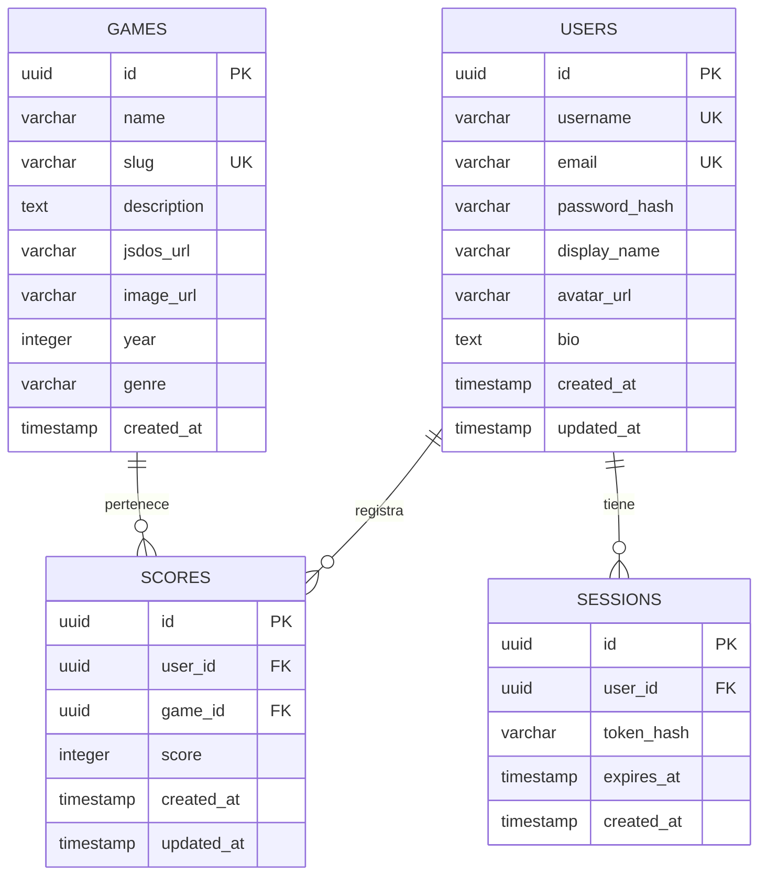
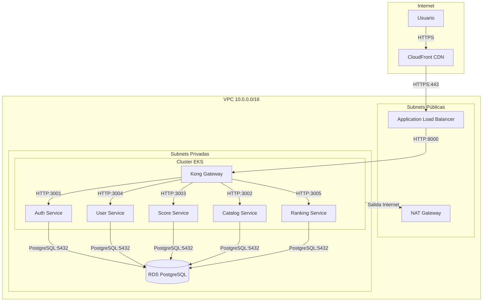
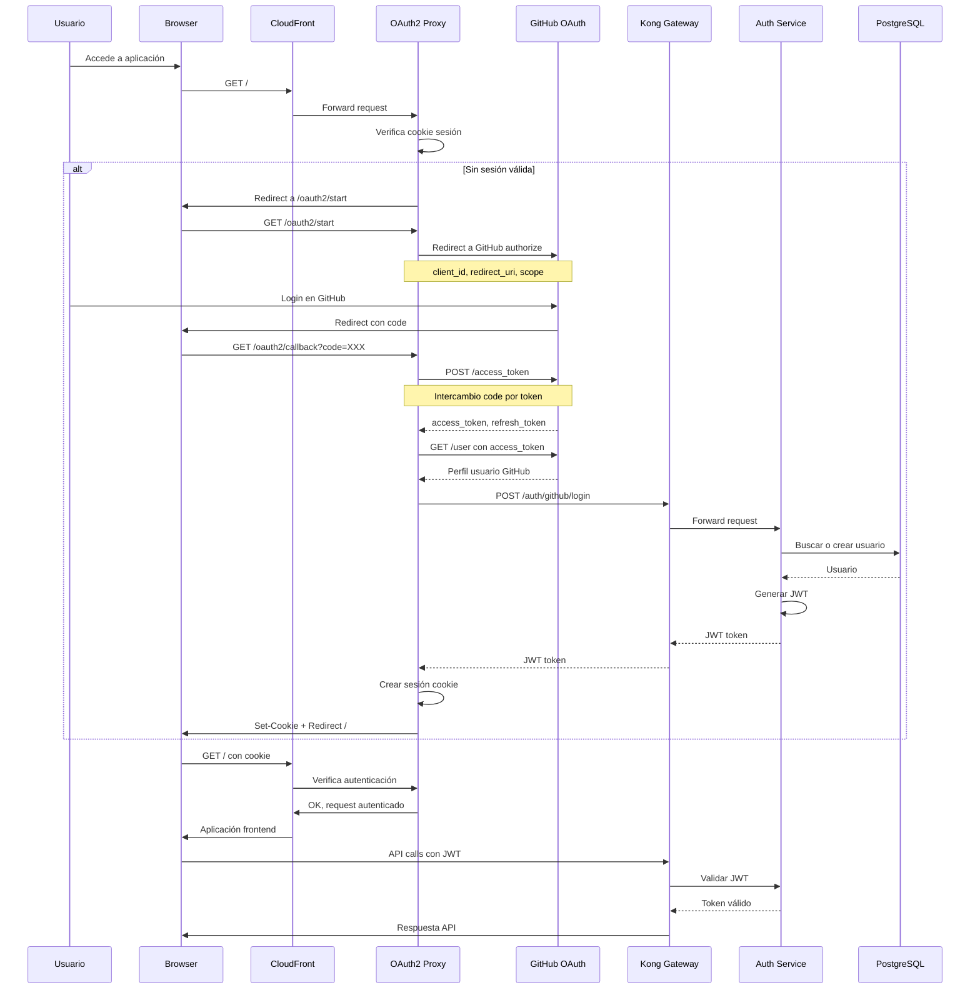
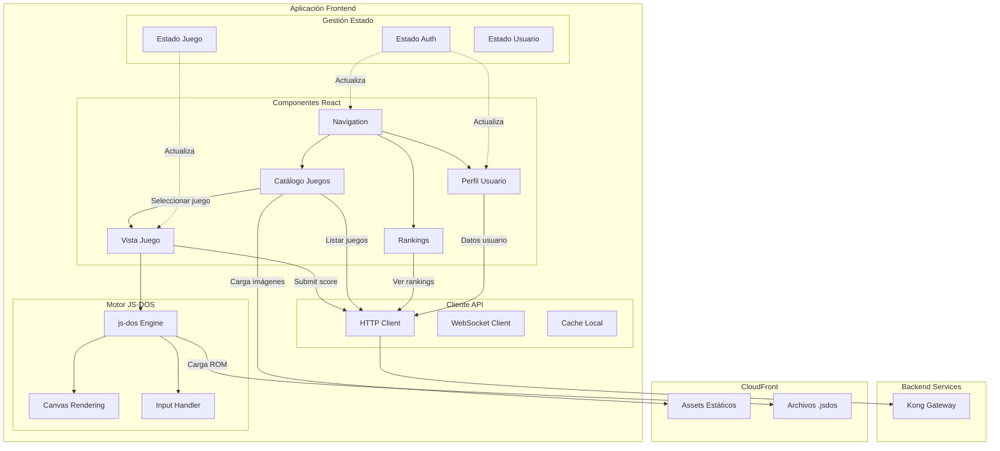

```mermaid
graph LR
    subgraph Developer[Desarrollador]
        COMMIT[git commit]
        PUSH[git push]
    end
    subgraph GitHub[GitHub]
        PR[Pull Request]
        MAIN[Branch main]
    end
    subgraph GitHubActions[GitHub Actions]
        LINT[Linting]
        TEST[Tests Unitarios]
        BUILD[Build Docker]
        PUSH_ECR[Push a ECR]
        UPDATE_MANIFEST[Update K8s Manifest]
    end
    subgraph ECR[Amazon ECR]
        REGISTRY[Container Registry]
    end
    subgraph ArgoCD[ArgoCD]
        DETECT[Detectar Cambio]
        SYNC[Sync con Cluster]
        HEALTH[Health Check]
    end
    subgraph EKS[Cluster EKS]
        DEPLOY[Deploy Nuevo Pod]
        ROLLING[Rolling Update]
        READY[Pod Ready]
    end
    COMMIT --> PUSH
    PUSH --> PR
    PR -->|Merge| MAIN
    MAIN --> LINT
    LINT --> TEST
    TEST -->|Pasan| BUILD
    BUILD --> PUSH_ECR
    PUSH_ECR --> REGISTRY
    PUSH_ECR --> UPDATE_MANIFEST
    UPDATE_MANIFEST -->|Git commit| DETECT
    DETECT --> SYNC
    SYNC --> DEPLOY
    DEPLOY --> ROLLING
    ROLLING --> HEALTH
    HEALTH -->|OK| READY
    HEALTH -->|Falla| ROLLING
```

# 🤖 Análisis Inteligente de Documentación

**Fecha**: 2025-11-23 12:06:04  
**Generado por**: Claude Sonnet 4.5  
**Puntuación General**: 7.2/10

## 📊 Resumen Ejecutivo

Sistema bien estructurado pero con gaps críticos: falta documentación de seguridad, disaster recovery, métricas de monitorización, arquitectura de datos y guías de contribución. Diagramas de secuencia incompletos y necesidad de consolidar documentación duplicada.

## 🎯 Mejoras Prioritarias

### Prioridad Alta ⚡

#### Documentación de Seguridad Completa

**Categoría**: content  
**Descripción**: Falta documentación crítica sobre seguridad: gestión de secretos en Kubernetes, políticas de RBAC, rotación de JWT, hardening de contenedores, escaneo de vulnerabilidades y respuesta a incidentes. Es fundamental para producción.  
**Razón**: La seguridad es crítica en producción. Sin documentación clara sobre gestión de secretos, RBAC y políticas de seguridad, el sistema es vulnerable y dificulta auditorías de cumplimiento.  

**Archivos a crear**: security/overview.mdx, security/secrets-management.mdx, security/rbac-policies.mdx, security/vulnerability-scanning.mdx, security/incident-response.mdx  
**Archivos a modificar**: infrastructure/eks-cluster.mdx  

---

#### Arquitectura de Datos y Esquemas de Base de Datos

**Categoría**: content  
**Descripción**: No existe documentación del modelo de datos, esquemas de tablas, relaciones entre entidades ni estrategia de migraciones. Crítico para desarrollo y mantenimiento.  
**Razón**: Sin documentación del modelo de datos, los desarrolladores no pueden entender las relaciones, constraints ni diseñar queries eficientes. Esencial para onboarding y evolución del sistema.  

**Archivos a crear**: architecture/data-model.mdx, architecture/database-schemas.mdx, architecture/migrations.mdx  
**Archivos a modificar**: services/auth-service.mdx, services/user-service.mdx, services/score-service.mdx  

**Diagrama propuesto**:

---

#### Diagrama de Arquitectura de Red Completo

**Categoría**: diagrams  
**Descripción**: Falta diagrama detallado mostrando VPC, subnets públicas/privadas, NAT Gateway, Security Groups, flujo de tráfico y puntos de entrada/salida.  
**Razón**: El diagrama de red es fundamental para entender la segmentación, debugging de conectividad y configuración de firewalls. Actualmente no hay visualización clara de la topología de red.  

**Archivos a crear**: infrastructure/network-architecture.mdx  
**Archivos a modificar**: infrastructure/networking.mdx  

**Diagrama propuesto**:

---

#### Plan de Disaster Recovery y Backups

**Categoría**: content  
**Descripción**: No existe documentación sobre estrategia de backups, RPO/RTO, procedimientos de restauración, ni plan de disaster recovery. Crítico para producción.  
**Razón**: Sin plan de DR documentado, la recuperación ante desastres sería caótica. Los RPO/RTO no definidos impiden SLAs claros y la falta de procedimientos aumenta el tiempo de inactividad.  

**Archivos a crear**: operations/disaster-recovery.mdx, operations/backup-strategy.mdx, operations/incident-runbooks.mdx  
**Archivos a modificar**: deployment.mdx  

---

#### Guía de Monitorización y Métricas

**Categoría**: content  
**Descripción**: El archivo monitoring.mdx existe pero falta detalle sobre qué métricas monitorizar, alertas configuradas, dashboards disponibles y procedimientos de troubleshooting basados en métricas.  
**Razón**: La monitorización efectiva requiere saber qué métricas son críticas y cuándo alertar. Sin esta guía, los equipos no saben qué vigilar ni cómo responder a degradaciones del servicio.  

**Archivos a crear**: operations/metrics-guide.mdx, operations/alerting.mdx, operations/dashboards.mdx  
**Archivos a modificar**: infrastructure/monitoring.mdx  

---

#### Diagrama de Flujo CI/CD Completo

**Categoría**: diagrams  
**Descripción**: Documentar visualmente el pipeline completo desde commit hasta producción: GitHub Actions, build, tests, push a registry, ArgoCD sync, health checks.  
**Razón**: El pipeline CI/CD es el corazón del delivery. Un diagrama completo ayuda a entender el flujo, identificar puntos de fallo y optimizar tiempos de despliegue.  

**Archivos a modificar**: cicd/overview.mdx, cicd/github-actions.mdx  

**Diagrama propuesto**:

---

### Prioridad Media 📌

#### Diagrama de Flujo de Autenticación OAuth2 Completo

**Categoría**: diagrams  
**Descripción**: Existe documentación de OAuth2 pero falta diagrama detallado del flujo completo incluyendo OAuth2 Proxy, callbacks, refresh tokens y manejo de sesiones.  
**Razón**: El flujo OAuth2 es complejo y crítico. Un diagrama completo ayuda a desarrolladores y operaciones a entender el proceso, debuggear problemas de autenticación y configurar correctamente los componentes.  

**Archivos a modificar**: infrastructure/oauth2-authentication.mdx, sequence-diagrams.mdx  

**Diagrama propuesto**:

---

#### Guía de Contribución y Estándares de Código

**Categoría**: content  
**Descripción**: Falta documentación sobre cómo contribuir al proyecto: estándares de código, proceso de PR, convenciones de commit, testing requirements y code review checklist.  
**Razón**: Sin guías de contribución claras, la calidad del código es inconsistente y el onboarding de nuevos desarrolladores es lento. Los estándares documentados mejoran la mantenibilidad.  

**Archivos a crear**: contributing/overview.mdx, contributing/code-standards.mdx, contributing/pull-requests.mdx, contributing/testing.mdx  
**Archivos a modificar**: README.md  

---

#### Documentación de Performance y Optimización

**Categoría**: content  
**Descripción**: Falta documentación sobre optimizaciones implementadas, benchmarks, límites de escalado y best practices para rendimiento de cada servicio.  
**Razón**: Conocer los límites de performance y las optimizaciones ayuda a dimensionar correctamente, identificar cuellos de botella y tomar decisiones informadas sobre escalado.  

**Archivos a crear**: operations/performance.mdx, operations/scaling-limits.mdx, operations/optimization-guide.mdx  

---

#### Consolidar Documentación de API Duplicada

**Categoría**: structure  
**Descripción**: Existe duplicación entre api-reference/* y docs/api/*. La estructura api-reference tiene múltiples archivos para el mismo servicio (ej: auth-service.mdx y luego auth/login.mdx). Consolidar en una jerarquía clara.  
**Razón**: La duplicación confunde a los usuarios y dificulta mantenimiento. Una estructura clara tipo OpenAPI Spec (servicio -> operación) es estándar y más navegable.  

---

#### Diagrama de Componentes de Frontend

**Categoría**: diagrams  
**Descripción**: Falta diagrama mostrando arquitectura del frontend: componentes React, integración JS-DOS, gestión de estado, comunicación con backend y flujo de usuario jugando.  
**Razón**: Entender la arquitectura del frontend es crucial para desarrollo. Actualmente solo hay documentación de integración JS-DOS pero no vista global de componentes y flujos de datos.  

**Archivos a crear**: frontend/architecture.mdx  
**Archivos a modificar**: frontend/overview.mdx  

**Diagrama propuesto**:

---

#### Documentación de Estrategia de Testing

**Categoría**: content  
**Descripción**: No existe documentación sobre estrategia de testing: tipos de tests, cobertura esperada, herramientas usadas, cómo ejecutar tests y CI/CD integration.  
**Razón**: La estrategia de testing no está documentada, lo que lleva a tests inconsistentes y bajo coverage. Documentar claramente qué testear y cómo mejora la calidad del código.  

**Archivos a crear**: development/testing-strategy.mdx, development/unit-tests.mdx, development/integration-tests.mdx, development/e2e-tests.mdx  
**Archivos a modificar**: cicd/github-actions.mdx  

---

### Prioridad Baja 💡

#### Glosario de Términos Técnicos

**Categoría**: content  
**Descripción**: Añadir glosario con definiciones de términos técnicos usados: JWT, OAuth2, GitOps, HPA, Ingress, ServiceMesh, etc. Útil para onboarding.  
**Razón**: Un glosario facilita el onboarding de nuevos miembros del equipo y sirve como referencia rápida. Aunque no es crítico, mejora la accesibilidad de la documentación.  

**Archivos a crear**: reference/glossary.mdx  
**Archivos a modificar**: index.mdx  

---

#### Estandarizar Formato de Ejemplos de Código

**Categoría**: quality  
**Descripción**: Los ejemplos de código tienen formatos inconsistentes: algunos con comentarios, otros sin, diferentes estilos de respuesta. Estandarizar con plantilla común.  
**Razón**: Ejemplos consistentes mejoran la experiencia del desarrollador y reducen confusión. Aunque no es urgente, aumenta la profesionalidad de la documentación.  

**Archivos a crear**: contributing/code-examples-template.mdx  
**Archivos a modificar**: api-reference/auth/login.mdx, api-reference/auth/register.mdx, api-reference/scores/submit.mdx  

---

#### Sección de FAQs (Preguntas Frecuentes)

**Categoría**: new_section  
**Descripción**: Añadir sección de preguntas frecuentes agrupadas por tema: desarrollo, despliegue, troubleshooting, arquitectura. Complementa la documentación existente.  
**Razón**: FAQs reducen repetición de preguntas comunes y sirven como quick reference. Aunque no es prioritario, mejora la experiencia del usuario de la documentación.  

**Archivos a crear**: faq/overview.mdx, faq/development.mdx, faq/deployment.mdx, faq/architecture.mdx  
**Archivos a modificar**: index.mdx  

---

---
*Análisis generado automáticamente*
