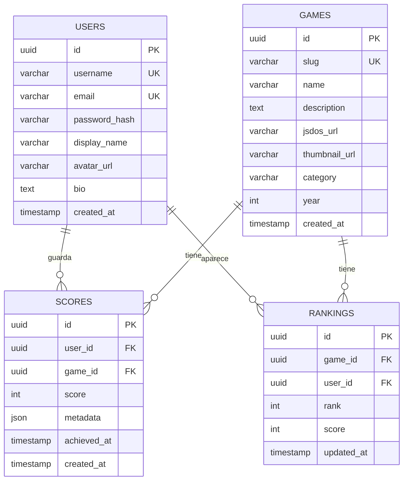
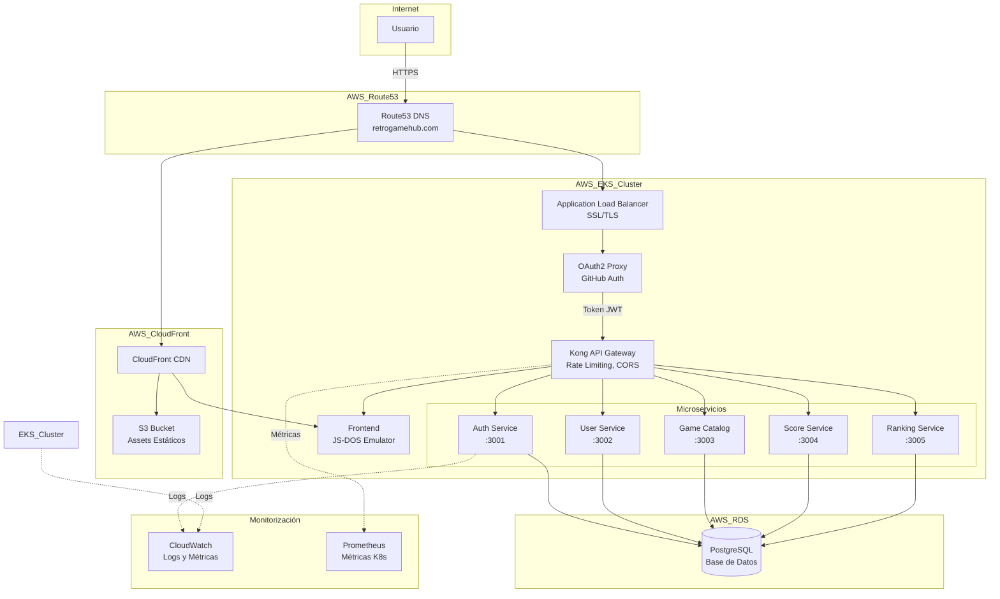
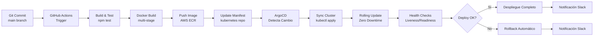
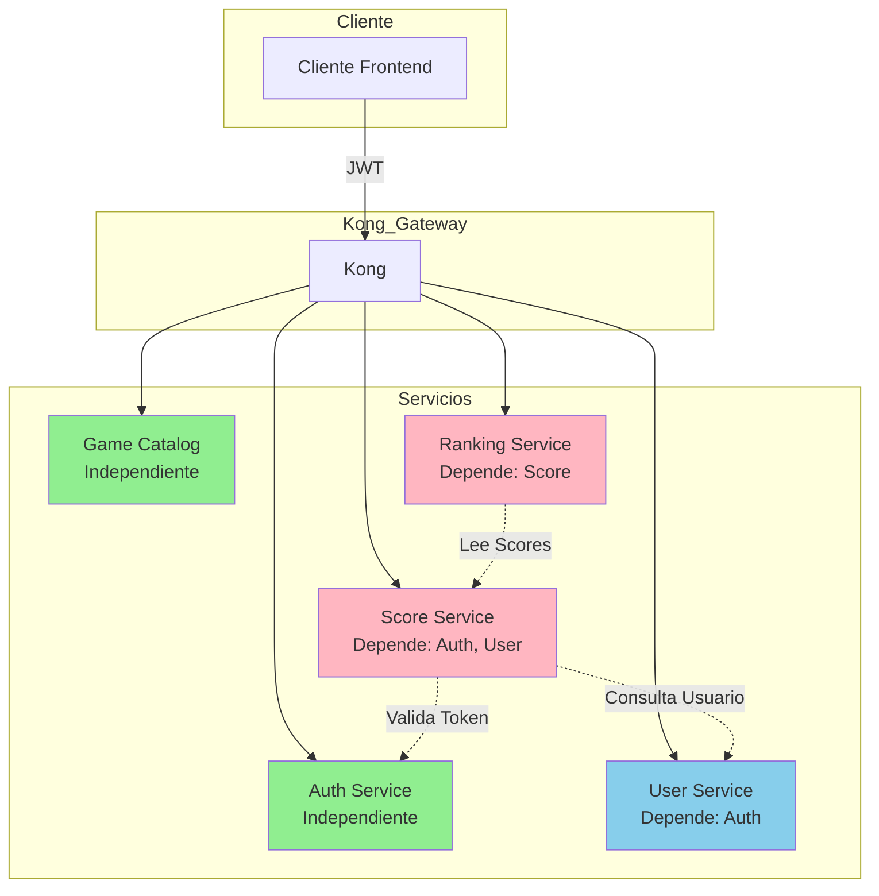
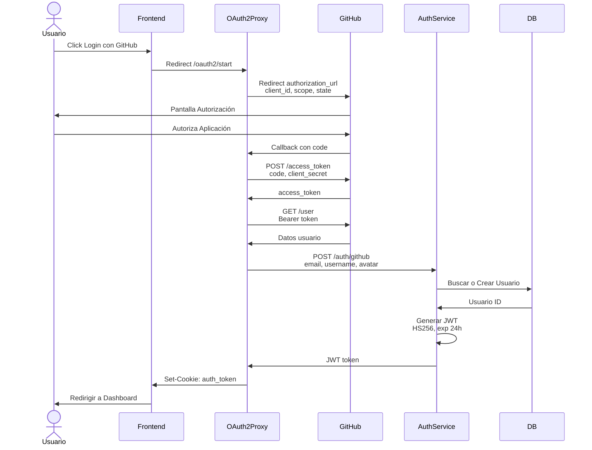

# 🤖 Análisis Inteligente de Documentación

**Fecha**: 2025-11-23 14:56:47  
**Generado por**: Claude Sonnet 4.5  
**Puntuación General**: 6.5/10

## 📊 Resumen Ejecutivo

Documentación extensa pero desorganizada. Mezcla contenido duplicado (essentials, development.mdx obsoleto), falta documentación técnica crítica (base de datos, seguridad, respaldo), y necesita consolidación en estructura más coherente. Puntos fuertes: cobertura de servicios y CI/CD.

## 🎯 Mejoras Prioritarias

### Prioridad Alta ⚡

#### Eliminar documentación obsoleta y duplicada

**Categoría**: structure  
**Descripción**: Varios archivos están duplicados o son plantillas no utilizadas. development.mdx es plantilla de Mintlify, essentials/* son ejemplos genéricos, y docs/api/auth-register.mdx duplica api-reference/auth/register.mdx  
**Razón**: Reduce confusión, mejora mantenibilidad y evita información contradictoria. La carpeta essentials son ejemplos de Mintlify sin contenido real del proyecto.  

---

#### Documentar esquema y arquitectura de base de datos

**Categoría**: content  
**Descripción**: No existe documentación del modelo de datos, esquema PostgreSQL, relaciones entre tablas ni estrategias de indexación. Crítico para desarrollo y debugging.  
**Razón**: Base de datos es componente crítico sin documentación. Desarrolladores necesitan entender modelo de datos para modificar servicios o diagnosticar problemas.  

**Archivos a crear**: infrastructure/database.mdx, infrastructure/database-schema.mdx  
**Archivos a modificar**: infrastructure/overview.mdx  

**Diagrama propuesto**:

---

#### Diagrama de arquitectura completa con flujo de datos

**Categoría**: diagrams  
**Descripción**: El diagrama actual en architecture.mdx está incompleto. Falta mostrar flujo de datos completo desde CDN hasta base de datos, incluyendo Kong, servicios, y comunicación interna.  
**Razón**: Diagrama actual está simplificado y no muestra flujo real de datos. Equipo necesita entender path completo de requests para debugging y optimización.  

**Archivos a modificar**: architecture.mdx  

**Diagrama propuesto**:

---

#### Documentar seguridad y gestión de secretos

**Categoría**: content  
**Descripción**: No existe documentación sobre cómo se gestionan secretos (JWT secrets, DB passwords, OAuth tokens), políticas de seguridad, rotación de credenciales ni mejores prácticas.  
**Razón**: Seguridad es crítica en producción. Falta documentación sobre gestión de credenciales, lo cual es riesgo de seguridad y bloquea despliegues seguros.  

**Archivos a crear**: infrastructure/security.mdx, infrastructure/secrets-management.mdx  
**Archivos a modificar**: infrastructure/overview.mdx  

---

#### Documentar estrategia de respaldo y recuperación ante desastres

**Categoría**: content  
**Descripción**: No hay documentación sobre backups de base de datos, estrategia de DR (Disaster Recovery), RPO/RTO, ni procedimientos de restauración.  
**Razón**: En producción es obligatorio tener plan de DR documentado. Pérdida de datos o downtime prolongado son riesgos críticos sin documentación de recuperación.  

**Archivos a crear**: infrastructure/backup-recovery.mdx  
**Archivos a modificar**: infrastructure/overview.mdx  

---

### Prioridad Media 📌

#### Consolidar documentación de API duplicada

**Categoría**: structure  
**Descripción**: Existe duplicación entre carpetas api-reference/auth/, api-reference/games/, etc. y services/. La estructura services/ documenta servicios desde perspectiva arquitectónica, mientras api-reference/ documenta endpoints. Falta claridad en separación.  
**Razón**: Separación clara entre documentación de arquitectura y referencia de API mejora usabilidad. Desarrolladores backend leen services/, consumidores de API leen api-reference/.  

**Archivos a crear**: api-reference/README.mdx  
**Archivos a modificar**: services/auth-service.mdx, services/game-catalog.mdx, services/score-service.mdx, services/ranking-service.mdx, services/user-service.mdx  

---

#### Diagrama de flujo de despliegue CI/CD completo

**Categoría**: diagrams  
**Descripción**: La documentación de CI/CD está fragmentada entre cicd/github-actions.mdx y cicd/gitops-workflow.mdx. Falta diagrama visual del pipeline completo desde commit hasta producción.  
**Razón**: Pipeline CI/CD es complejo y visual ayuda a entender flujo completo. Nuevo desarrollador necesita ver proceso end-to-end de despliegue.  

**Archivos a modificar**: cicd/overview.mdx  

**Diagrama propuesto**:

---

#### Documentar límites y cuotas de API (rate limiting)

**Categoría**: content  
**Descripción**: Se menciona rate limiting en Kong pero no hay documentación de límites específicos por endpoint, cuotas por usuario, ni manejo de errores 429.  
**Razón**: Consumidores de API necesitan conocer límites para implementar lógica de retry correctamente. Evita sorpresas y mejora experiencia de desarrollo.  

**Archivos a crear**: api-reference/rate-limits.mdx  
**Archivos a modificar**: api-reference/introduction.mdx  

---

#### Diagrama de comunicación entre microservicios

**Categoría**: diagrams  
**Descripción**: No está claro cómo se comunican los servicios entre sí. Por ejemplo, cuando Score Service guarda un score, ¿cómo se actualiza Ranking Service? ¿Event-driven? ¿Llamadas síncronas?  
**Razón**: Entender dependencias entre servicios es fundamental para debugging, planificación de cambios y entender impacto de fallos en cascada.  

**Archivos a modificar**: architecture.mdx  

**Diagrama propuesto**:

---

#### Documentar proceso de subida de nuevos juegos

**Categoría**: content  
**Descripción**: No está documentado cómo se agregan juegos al catálogo: ¿dónde se suben archivos .jsdos?, ¿cómo se crea metadata?, ¿hay interfaz admin?, ¿es proceso manual?  
**Razón**: Operación común que necesita documentación clara. Sin proceso definido, agregar juegos es ad-hoc y propenso a errores.  

**Archivos a crear**: operations/game-management.mdx  
**Archivos a modificar**: services/game-catalog.mdx  

---

#### Estandarizar formato de frontmatter en archivos MDX

**Categoría**: quality  
**Descripción**: Los archivos tienen frontmatter inconsistente: algunos usan 'icon: file-lines' genérico, otros tienen iconos específicos. Descripciones varían en longitud y detalle.  
**Razón**: Consistencia mejora profesionalismo y usabilidad. Guía de estilo facilita contribuciones y mantiene calidad uniforme.  

**Archivos a crear**: CONTRIBUTING.md  

---

### Prioridad Baja 💡

#### Documentar costos estimados de infraestructura AWS

**Categoría**: content  
**Descripción**: No hay información sobre costos mensuales estimados de ejecutar la infraestructura (EKS, RDS, CloudFront, etc.).  
**Razón**: Información financiera ayuda en planificación y toma de decisiones. Equipos necesitan estimar budget antes de despliegue.  

**Archivos a crear**: infrastructure/cost-estimation.mdx  
**Archivos a modificar**: infrastructure/overview.mdx  

---

#### Documentar estrategia de testing

**Categoría**: content  
**Descripción**: No hay documentación sobre tipos de tests (unitarios, integración, e2e), cobertura esperada, ni cómo ejecutar test suites.  
**Razón**: Testing es práctica crítica pero no documentada. Desarrolladores necesitan saber qué tests escribir y cómo ejecutarlos.  

**Archivos a crear**: development/testing.mdx  
**Archivos a modificar**: desarrollo-local.mdx  

---

#### Diagrama de flujo de autenticación OAuth2 completo

**Categoría**: diagrams  
**Descripción**: sequence-diagrams.mdx tiene diagrama de autenticación pero falta detalle del flujo OAuth2 con GitHub (redirects, callbacks, exchange de tokens).  
**Razón**: OAuth2 es complejo y diagrama detallado ayuda a entender flujo completo, especialmente útil para debugging de problemas de autenticación.  

**Archivos a modificar**: sequence-diagrams.mdx  

**Diagrama propuesto**:

---

#### Agregar sección de troubleshooting por servicio

**Categoría**: new_section  
**Descripción**: troubleshooting.mdx es genérico. Sería útil tener troubleshooting específico por servicio con problemas comunes y soluciones.  
**Razón**: Troubleshooting específico por servicio acelera resolución de problemas. Problemas comunes documentados evitan escalaciones innecesarias.  

**Archivos a crear**: troubleshooting/auth-service.mdx, troubleshooting/score-service.mdx, troubleshooting/ranking-service.mdx  
**Archivos a modificar**: troubleshooting.mdx  

---

## 📁 Nuevas Secciones Propuestas

### Operaciones

Documentación de tareas operativas comunes: gestión de juegos, monitorización, escalado, mantenimiento  

**Archivos**:
- `operations/overview.mdx`: Operaciones - Visión General  
- `operations/game-management.mdx`: Gestión de Catálogo de Juegos  
- `operations/scaling.mdx`: Escalado y Dimensionamiento  
- `operations/maintenance.mdx`: Mantenimiento Programado  

### Arquitectura de Datos

Documentación completa del modelo de datos, esquema de BD, migraciones y queries comunes  

**Archivos**:
- `data-architecture/overview.mdx`: Arquitectura de Datos - Visión General  
- `data-architecture/schema.mdx`: Esquema de Base de Datos  
- `data-architecture/migrations.mdx`: Migraciones de Base de Datos  
- `data-architecture/queries.mdx`: Consultas Comunes  

### Monitorización y Observabilidad

Guías de monitorización, dashboards, alertas y análisis de logs  

**Archivos**:
- `monitoring/overview.mdx`: Monitorización - Visión General  
- `monitoring/metrics.mdx`: Métricas Clave  
- `monitoring/alerts.mdx`: Configuración de Alertas  
- `monitoring/logs.mdx`: Análisis de Logs  

## 📈 Diagramas Requeridos

### Diagrama de Componentes y Dependencias

**Tipo**: component  
**Ubicación**: architecture.mdx - nueva sección Componentes Detallados  
**Descripción**: Muestra todos los componentes del sistema con sus dependencias externas (AWS services, librerías) y puertos de comunicación  

graph TB
    subgraph Frontend
        FE[React App Port 3000]
        JSDOS[JS-DOS Emulator v7.x]
    end
    subgraph Backend_Services
        Auth[Auth Service Node.js + Express Port 3001]
        User[User Service Node.js + Express Port 3002]
        Catalog[Catalog Service Node.js + Express Port 3003]
        Score[Score Service Node.js + Express Port 3004]
        Ranking[Ranking Service Node.js + Express Port 3005]
    end
    subgraph Dependencias_NPM
        JWT[jsonwebtoken]
        Bcrypt[bcrypt]
        PG[pg - PostgreSQL Client]
        Express[express]
        Cors[cors]
    end
    subgraph AWS_Services
        RDS[(RDS PostgreSQL Port 5432)]
        S3[S3 Bucket Game Assets]
        Secrets[Secrets Manager]
        CW[CloudWatch Logs]
    end
    FE --> JSDOS
    Auth --> JWT
    Auth --> Bcrypt
    Auth --> PG
    Auth --> Express
    User --> PG
    User --> Express
    Catalog --> PG
    Score --> PG
    Ranking --> PG
    PG --> RDS
    Catalog --> S3
    Auth --> Secrets
    Auth --> CW
    User --> CW
    Catalog --> CW
    Score --> CW
    Ranking --> CW

### Flujo Completo de Guardado de Score

**Tipo**: sequence  
**Ubicación**: sequence-diagrams.mdx - nueva sección Guardado de Score  
**Descripción**: Muestra interacción completa cuando usuario guarda un score: desde frontend hasta actualización de ranking  

sequenceDiagram
    actor Jugador
    participant Frontend
    participant Kong
    participant ScoreService
    participant RankingService
    participant DB
    Jugador->>Frontend: Termina Juego Score: 9500
    Frontend->>Frontend: Captura Score gameId, score
    Frontend->>Kong: POST /api/scores Bearer JWT {gameId, score, metadata}
    Kong->>Kong: Valida Rate Limit Verifica JWT
    Kong->>ScoreService: Forward Request
    ScoreService->>ScoreService: Extrae userId de JWT
    ScoreService->>DB: BEGIN TRANSACTION
    ScoreService->>DB: SELECT score FROM scores WHERE userId AND gameId
    DB->>ScoreService: currentScore: 8000
    ScoreService->>ScoreService: Comparar 9500 > 8000
    ScoreService->>DB: UPDATE scores SET score=9500 WHERE userId AND gameId
    DB->>ScoreService: Updated 1 row
    ScoreService->>DB: COMMIT TRANSACTION
    ScoreService->>RankingService: POST /internal/recalculate {gameId}
    RankingService->>DB: SELECT TOP 100 ORDER BY score DESC
    DB->>RankingService: Lista ordenada
    RankingService->>DB: UPDATE rankings SET rank positions
    RankingService->>ScoreService: 200 OK
    ScoreService->>Kong: 200 OK {score: 9500, rank: 3}
    Kong->>Frontend: 200 OK
    Frontend->>Jugador: Mostrar Nuevo Rank #3

### Flujo de Decisión de Rate Limiting en Kong

**Tipo**: flow  
**Ubicación**: api-reference/rate-limits.mdx  
**Descripción**: Diagrama de flujo mostrando cómo Kong aplica rate limiting según tipo de usuario y endpoint  

flowchart TD
    A[Request Entrante

---
*Análisis generado automáticamente*
