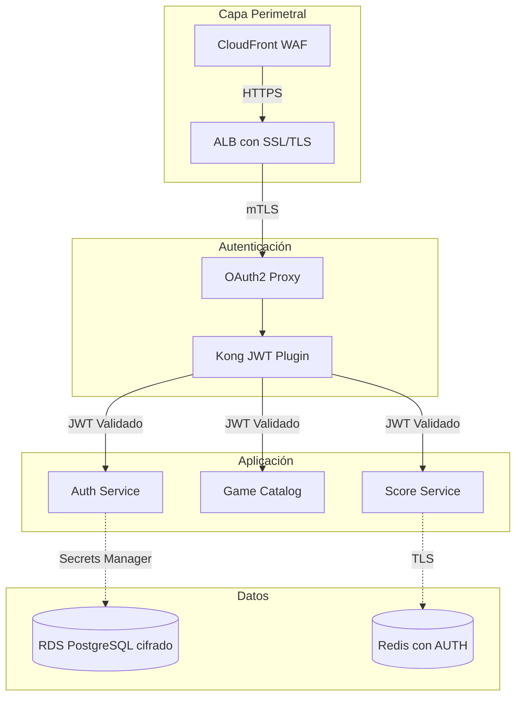
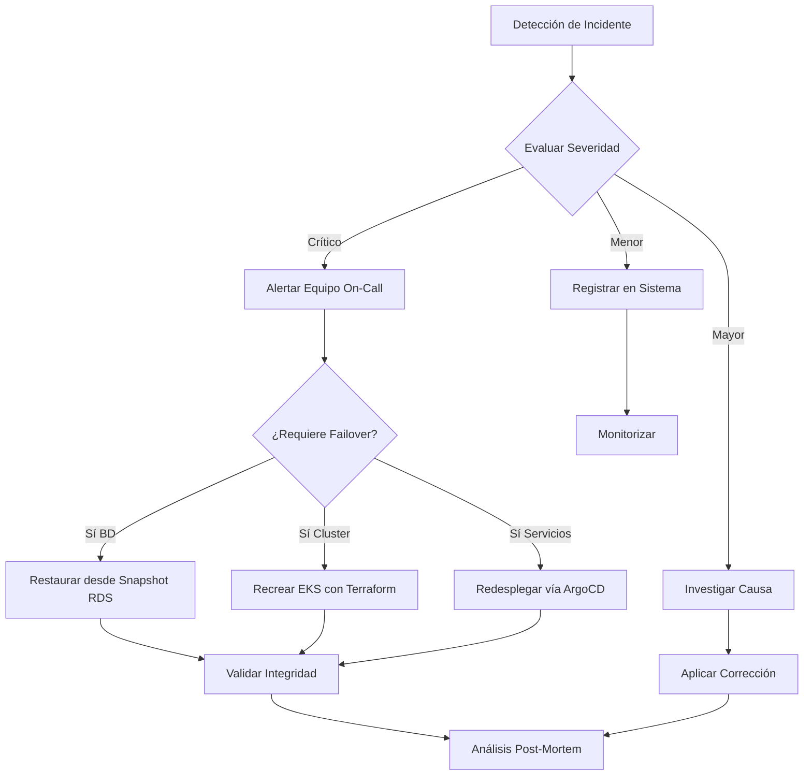
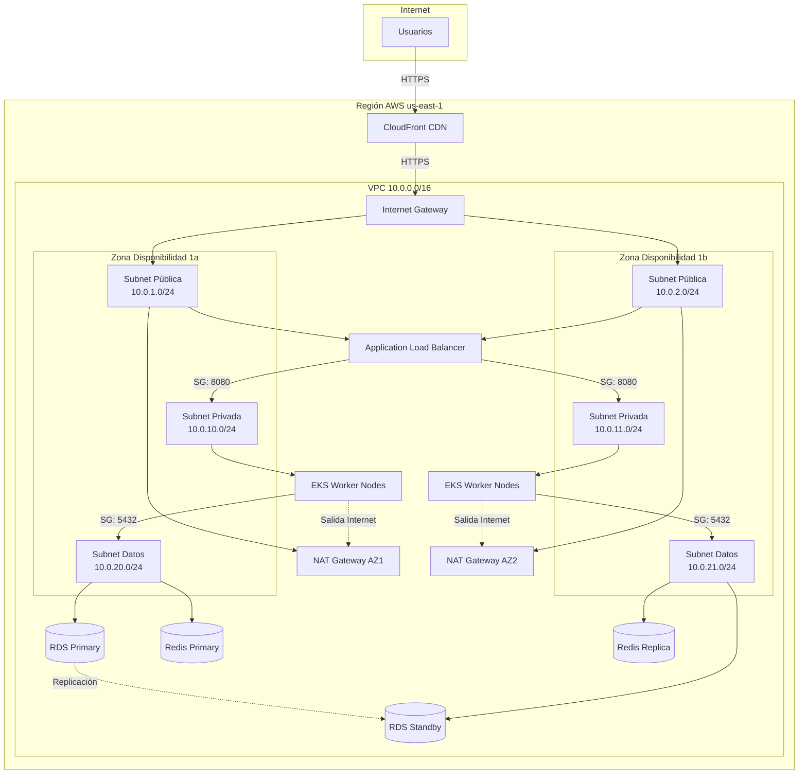

# 🤖 Análisis Inteligente de Documentación

**Fecha**: 2025-11-23 11:45:32  
**Generado por**: Claude Sonnet 4.5  
**Puntuación General**: 7.5/10

## 📊 Resumen Ejecutivo

La documentación está bien estructurada pero presenta gaps críticos: falta documentación de seguridad y DR, los diagramas de arquitectura son insuficientes, hay inconsistencias en nomenclatura (Retro Game Hub vs RetroGameCloud), y faltan guías operativas para producción. Score general: 7.5/10.

## 🎯 Mejoras Prioritarias

### Prioridad Alta ⚡

#### Documentación de Seguridad Completa

**Categoría**: content  
**Descripción**: Falta documentación crítica sobre seguridad: políticas de secretos, gestión de credenciales en K8s, rotación de tokens JWT, hardening de contenedores, políticas de red, y escaneo de vulnerabilidades. Es fundamental para producción.  
**Razón**: La seguridad es crítica para producción. Sin documentación clara, los desarrolladores pueden cometer errores que expongan datos sensibles o credenciales.  

**Archivos a crear**: security/overview.mdx, security/secrets-management.mdx, security/network-policies.mdx, security/container-security.mdx, security/jwt-best-practices.mdx  
**Archivos a modificar**: architecture.mdx, deployment.mdx  

**Diagrama propuesto**:

---

#### Plan de Recuperación ante Desastres (DR)

**Categoría**: content  
**Descripción**: No existe documentación sobre backups, RTO/RPO, procedimientos de restauración, o planes de continuidad. Fundamental para entornos productivos con datos críticos de usuarios.  
**Razón**: Sin un plan DR documentado, la recuperación ante fallos será caótica, incrementando el downtime y posible pérdida de datos de usuarios.  

**Archivos a crear**: operations/disaster-recovery.mdx, operations/backup-strategy.mdx, operations/incident-response.mdx  
**Archivos a modificar**: deployment.mdx  

**Diagrama propuesto**:

---

#### Diagrama de Arquitectura de Red Completo

**Categoría**: diagrams  
**Descripción**: El diagrama actual de arquitectura es muy básico. Falta mostrar VPCs, subnets públicas/privadas, NAT Gateways, Security Groups, y flujo de tráfico detallado.  
**Razón**: Un diagrama de red detallado es esencial para entender la segmentación, troubleshooting de conectividad, y auditorías de seguridad.  

**Archivos a crear**: infrastructure/network-architecture.mdx  
**Archivos a modificar**: architecture.mdx, infrastructure/networking.mdx  

**Diagrama propuesto**:

---

#### Inconsistencia en Nombres del Proyecto

**Categoría**: quality  
**Descripción**: La documentación usa indistintamente 'Retro Game Hub' y 'RetroGameCloud'. Esto confunde y resta profesionalismo. Debe estandarizarse un solo nombre en toda la documentación.  
**Razón**: La consistencia en branding y nomenclatura es fundamental para credibilidad y usabilidad. Los usuarios se confunden cuando ven nombres diferentes en distintas secciones.  

**Archivos a modificar**: index.mdx, quickstart.mdx, architecture.mdx, troubleshooting.mdx, configuration.mdx, deployment.mdx, README.md  

---

#### Guía de Operaciones y Runbooks

**Categoría**: content  
**Descripción**: Falta documentación operativa diaria: procedimientos de escalado, actualizaciones de servicios, rollback, manejo de incidentes comunes, y playbooks para operadores.  
**Razón**:   

**Archivos a crear**: operations/overview.mdx, operations/scaling.mdx, operations/updates-rollback.mdx, operations/runbooks.mdx, operations/on-call-guide.mdx  
**Archivos a modificar**: troubleshooting.mdx  

---

---
*Análisis generado automáticamente*
