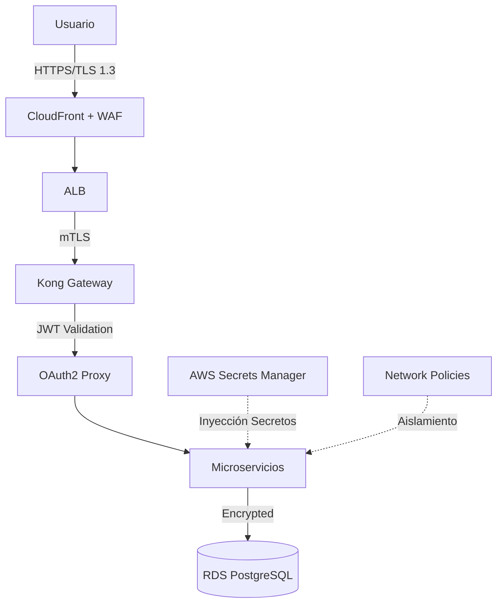
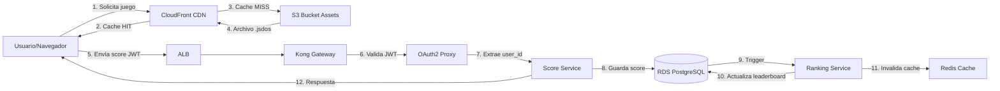
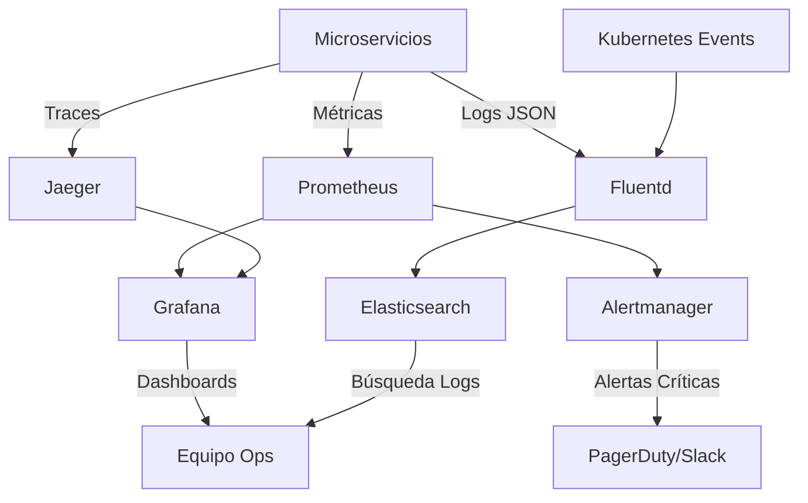
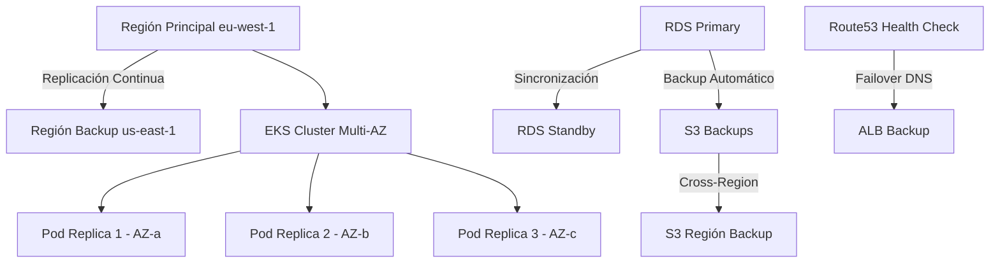
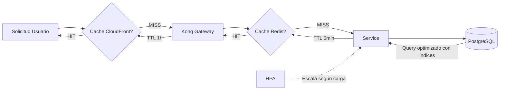
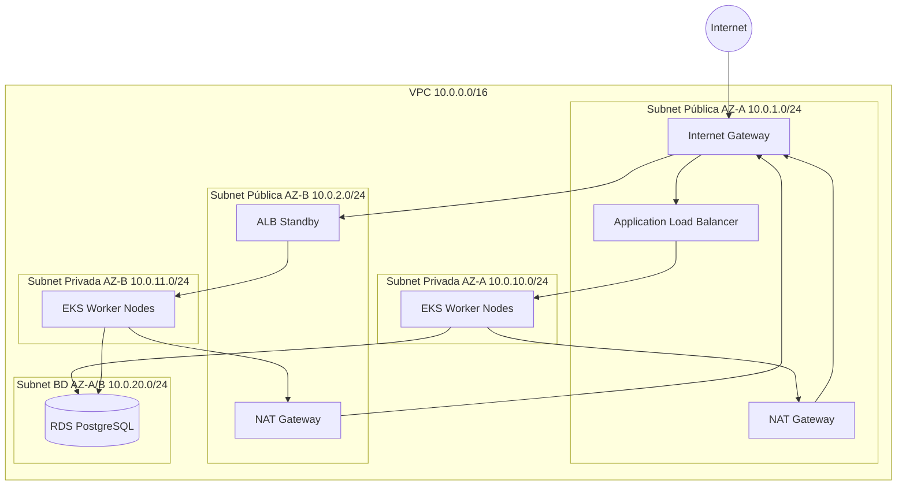
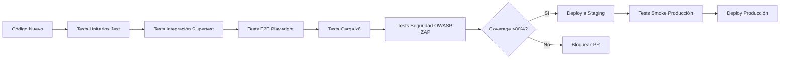
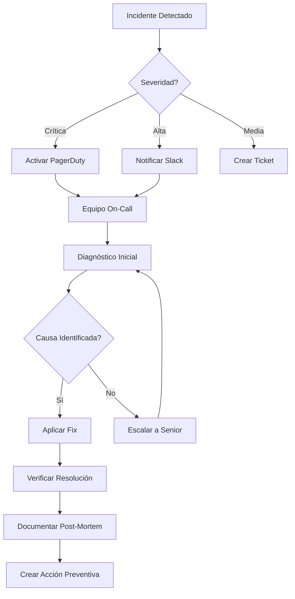

```mermaid
graph LR; A[Push a main] --> B[GitHub Actions Trigger]; B --> C[Checkout Código]; C --> D[Build Docker Image]; D --> E[Tests Unitarios]; E --> F[Tests Integración]; F --> G[Scan Seguridad Trivy]; G --> H{Vulnerabilidades?}; H -->|Críticas| I[Bloquear]; H -->|Ninguna/Bajas| J[Push a ECR]; J --> K[Update ArgoCD Manifest]; K --> L[ArgoCD Sync Staging]; L --> M[Tests Smoke Staging]; M --> N{Tests OK?}; N -->|Sí| O[Aprobar Deploy Producción]; N -->|No| P[Rollback]; O --> Q[ArgoCD Sync Producción]; Q --> R[Tests Smoke Producción]; R --> S[Notificar Slack]
```

# 🤖 Análisis Inteligente de Documentación

**Fecha**: 2025-11-23 14:09:55  
**Generado por**: Claude Sonnet 4.5  
**Puntuación General**: 6.8/10

## 📊 Resumen Ejecutivo

Documentación bien estructurada pero con gaps críticos en seguridad, monitorización, disaster recovery y procesos operativos. Falta arquitectura de datos detallada y guías de migración. Puntos fuertes: buena cobertura de APIs y despliegue básico.

## 🎯 Mejoras Prioritarias


### Prioridad Alta ⚡

#### Documentación de Seguridad Completa

**Categoría**: content  
**Descripción**: Falta documentación crítica sobre políticas de seguridad, gestión de secretos, escaneo de vulnerabilidades, políticas de red en Kubernetes, rotación de credenciales y cumplimiento normativo. Es esencial para producción.  
**Razón**: La seguridad es crítica en producción. Sin documentación clara sobre gestión de secretos, políticas de red y cumplimiento, el sistema está en riesgo. Los desarrolladores necesitan guías claras para implementar seguridad correctamente.  

**Archivos a crear**: security/overview.mdx, security/secrets-management.mdx, security/network-policies.mdx, security/vulnerability-scanning.mdx, security/compliance.mdx  
**Archivos a modificar**: architecture.mdx  

**Diagrama propuesto**:



---

#### Arquitectura de Datos y Modelos

**Categoría**: content  
**Descripción**: No existe documentación sobre el modelo de datos, esquemas de base de datos, relaciones entre entidades, estrategias de migración, backup/restore y políticas de retención. Crítico para mantenimiento.  
**Razón**: Sin documentación del modelo de datos, los desarrolladores no pueden entender las relaciones, hacer queries eficientes ni planificar migraciones. Es fundamental para escalabilidad y mantenimiento a largo plazo.  

**Archivos a crear**: data/data-architecture.mdx, data/database-schema.mdx, data/migrations.mdx, data/backup-restore.mdx  
**Archivos a modificar**: architecture.mdx  

**Diagrama propuesto**:
```mermaid
erDiagram; USERS ||--o{ SCORES : tiene; USERS { int user_id PK; string username UK; string email UK; string password_hash; timestamp created_at }; GAMES ||--o{ SCORES : recibe; GAMES { int game_id PK; string slug UK; string name; string description; string jsdos_url }; SCORES { int score_id PK; int user_id FK; int game_id FK; int points; timestamp achieved_at }; SCORES ||--o{ RANKINGS : genera; RANKINGS { int rank; int game_id FK; int user_id FK; int score }
```


---

#### Diagrama de Flujo Completo de Datos

**Categoría**: diagrams  
**Descripción**: Falta un diagrama que muestre cómo fluyen los datos desde el usuario hasta la base de datos y viceversa, incluyendo cachés, CDN y servicios intermedios.  
**Razón**: Un diagrama de flujo de datos completo ayuda a entender el sistema end-to-end, identificar cuellos de botella y optimizar el rendimiento. Es esencial para debugging y optimización.  

**Archivos a modificar**: architecture.mdx  

**Diagrama propuesto**:



---

#### Guía de Monitorización y Observabilidad

**Categoría**: content  
**Descripción**: La sección de monitorización en infrastructure/monitoring.mdx está incompleta. Falta documentación sobre métricas clave, alertas, dashboards, distributed tracing, logs centralizados y SLIs/SLOs.  
**Razón**: Sin observabilidad adecuada, es imposible detectar y resolver problemas en producción rápidamente. Los SLOs son necesarios para medir la calidad del servicio y tomar decisiones basadas en datos.  

**Archivos a crear**: observability/metrics-and-alerts.mdx, observability/logging.mdx, observability/tracing.mdx, observability/dashboards.mdx, observability/slos.mdx  
**Archivos a modificar**: infrastructure/monitoring.mdx  

**Diagrama propuesto**:



---

#### Plan de Disaster Recovery y Alta Disponibilidad

**Categoría**: content  
**Descripción**: No existe documentación sobre estrategias de disaster recovery, RTO/RPO, procedimientos de failover, backups multi-región y planes de contingencia ante caídas completas.  
**Razón**: En producción, la capacidad de recuperarse de desastres es fundamental. Sin un plan claro y documentado, una caída puede resultar en pérdida de datos y tiempo de inactividad prolongado, afectando la confianza del usuario.  

**Archivos a crear**: operations/disaster-recovery.mdx, operations/high-availability.mdx, operations/incident-response.mdx  
**Archivos a modificar**: deployment.mdx  

**Diagrama propuesto**:



---


### Prioridad Media 📌

#### Guía de Performance y Optimización

**Categoría**: content  
**Descripción**: Falta documentación sobre estrategias de optimización, caching, compresión de assets, lazy loading, optimización de queries, dimensionamiento de recursos y tuning de base de datos.  
**Razón**: La performance es clave para la experiencia de usuario. Sin estrategias de caching y optimización documentadas, los servicios pueden ser lentos y costosos. Las guías ayudan al equipo a mantener el sistema eficiente.  

**Archivos a crear**: performance/optimization-guide.mdx, performance/caching-strategy.mdx, performance/database-tuning.mdx  

**Diagrama propuesto**:



---

#### Reorganizar Documentación de APIs

**Categoría**: structure  
**Descripción**: La estructura actual de api-reference/ tiene inconsistencias: algunos endpoints están en subcarpetas (scores/, games/, auth/) y otros en raíz (backend-main.mdx, frontend.mdx). Esto dificulta la navegación.  
**Razón**: Una estructura consistente mejora la navegabilidad y reduce la fricción para encontrar documentación. Los archivos genéricos en endpoint/ no están claros y deberían ser específicos por servicio.  

**Archivos a modificar**: api-reference/introduction.mdx  

---

#### Diagrama de Arquitectura de Red Detallado

**Categoría**: diagrams  
**Descripción**: Falta un diagrama que muestre la topología de red completa: VPC, subnets públicas/privadas, security groups, NACLs, routing, NAT gateways e Internet gateway.  
**Razón**: Un diagrama de red detallado es esencial para entender la segmentación, troubleshooting de conectividad y planificación de cambios en infraestructura. Ayuda a visualizar cómo se aíslan los componentes y cómo fluye el tráfico.  

**Archivos a modificar**: infrastructure/networking.mdx  

**Diagrama propuesto**:



---

#### Guía de Testing Completa

**Categoría**: content  
**Descripción**: No existe documentación sobre estrategias de testing: unitarios, integración, e2e, carga, seguridad. Tampoco hay guías de cómo ejecutar tests ni coverage mínimo requerido.  
**Razón**: Sin tests automatizados y documentados, cada cambio es un riesgo. Una estrategia de testing clara asegura calidad, reduce bugs en producción y da confianza para hacer cambios rápidos. Es fundamental para CI/CD efectivo.  

**Archivos a crear**: testing/overview.mdx, testing/unit-testing.mdx, testing/integration-testing.mdx, testing/e2e-testing.mdx, testing/load-testing.mdx  

**Diagrama propuesto**:



---

#### Sección de Operaciones y Runbooks

**Categoría**: new_section  
**Descripción**: Crear sección completa con procedimientos operativos: escalado manual, rotación de secretos, actualización de certificados SSL, procedimientos de rollback, manejo de incidentes críticos, análisis post-mortem.  
**Razón**: Los runbooks son críticos para operaciones 24/7. Sin procedimientos claros y documentados, el equipo pierde tiempo en incidentes y puede cometer errores. Los runbooks reducen MTTR y estandarizan respuestas.  

**Archivos a crear**: operations/runbooks/scale-services.mdx, operations/runbooks/rotate-secrets.mdx, operations/runbooks/update-ssl-certs.mdx, operations/runbooks/rollback-deployment.mdx, operations/runbooks/incident-response.mdx  

**Diagrama propuesto**:



---

#### Documentación de Costos y Optimización

**Categoría**: content  
**Descripción**: Falta documentación sobre estimación de costos AWS, estrategias de optimización (Reserved Instances, Spot Instances, rightsizing), monitorización de costos y presupuestos.  
**Razón**: Los costos cloud pueden crecer rápidamente sin control. Documentar estrategias de optimización ayuda al equipo a tomar decisiones informadas y mantener el presupuesto bajo control, especialmente importante para startups.  

**Archivos a crear**: operations/cost-optimization.mdx  

---


### Prioridad Baja 💡

#### Consolidar Archivos de Cambios y Reportes

**Categoría**: quality  
**Descripción**: Existen múltiples archivos de changelog y reportes en la raíz que deberían estar en una carpeta separada: AUTO_FIXES_REPORT.md, STRUCTURE_CHANGELOG.md, CHANGELOG_WIKI_2025-11-20.md, BROKEN_LINKS_REPORT.md.  
**Razón**: Una raíz limpia mejora la experiencia de navegación. Los reportes técnicos y changelogs internos no son documentación de usuario y deberían estar separados para evitar confusión.  


---

#### Ampliar Documentación de Integración JS-DOS

**Categoría**: content  
**Descripción**: El archivo frontend/jsdos-integration.mdx está presente pero podría ampliarse con casos de uso avanzados, troubleshooting específico de emulación, configuración de controles personalizados y optimización de rendimiento.  
**Razón**: JS-DOS es el corazón de la experiencia de usuario en juegos. Una documentación más profunda ayuda a desarrolladores a personalizar la experiencia y resolver problemas específicos de emulación que pueden surgir con diferentes juegos.  

**Archivos a modificar**: frontend/jsdos-integration.mdx  

---

#### Eliminar Contenido Genérico de Mintlify

**Categoría**: quality  
**Descripción**: Existen archivos con contenido de plantilla de Mintlify que no están personalizados: essentials/markdown.mdx, essentials/code.mdx, essentials/settings.mdx, essentials/navigation.mdx, essentials/images.mdx.  
**Razón**: El contenido genérico de plantillas no aporta valor y puede confundir a los usuarios. Si no se va a personalizar, es mejor eliminarlo para mantener la documentación limpia y relevante.  


---

#### Diagrama de Pipeline CI/CD Completo

**Categoría**: diagrams  
**Descripción**: Ampliar la documentación de CI/CD con un diagrama detallado que muestre todas las etapas del pipeline: build, test, security scan, push imagen, deploy staging, tests smoke, deploy producción.  
**Razón**: Un diagrama visual del pipeline CI/CD ayuda a entender el flujo completo de código a producción, identificar puntos de validación y mejorar el proceso continuamente. Es especialmente útil para nuevos miembros del equipo.  

**Archivos a modificar**: cicd/github-actions.mdx  

**Diagrama propuesto**:



---


## 📁 Nuevas Secciones Propuestas

### Seguridad

Sección completa dedicada a políticas de seguridad, gestión de secretos, cumplimiento, escaneo de vulnerabilidades y hardening del sistema.  

**Archivos**:
- `security/overview.mdx`: Visión General de Seguridad  
- `security/secrets-management.mdx`: Gestión de Secretos  
- `security/network-policies.mdx`: Políticas de Red  
- `security/vulnerability-scanning.mdx`: Escaneo de Vulnerabilidades  
- `security/compliance.mdx`: Cumplimiento Normativo  

### Arquitectura de Datos

Documentación completa del modelo de datos, esquemas de base de datos, estrategias de migración y gestión de backups.  

**Archivos**:
- `data/data-architecture.mdx`: Arquitectura de Datos  
- `data/database-schema.mdx`: Esquemas de Base de Datos  
- `data/migrations.mdx`: Gestión de Migraciones  
- `data/backup-restore.mdx`: Backup y Restauración  

### Observabilidad

Documentación completa de monitorización, logging, tracing, alertas y SLIs/SLOs para asegurar visibilidad operacional.  

**Archivos**:
- `observability/metrics-and-alerts.mdx`: Métricas y Alertas  
- `observability/logging.mdx`: Logging Centralizado  
- `observability/tracing.mdx`: Distributed Tracing  
- `observability/dashboards.mdx`: Dashboards  
- `observability/slos.mdx`: SLIs y SLOs  

### Operaciones

Runbooks, procedimientos operativos, disaster recovery, gestión de incidentes y optimización de costos para operaciones día a día.  

**Archivos**:
- `operations/disaster-recovery.mdx`: Plan de Disaster Recovery  
- `operations/high-availability.mdx`: Alta Disponibilidad  
- `operations/incident-response.mdx`: Respuesta a Incidentes  
- `operations/cost-optimization.mdx`: Optimización de Costos  


---
*Análisis generado automáticamente*
