```mermaid
sequenceDiagram participant U as Usuario participant F as Frontend participant CF as CloudFront participant K as Kong Gateway participant A as Auth Service participant R as Redis (Sesiones) participant DB as PostgreSQL U->>F: 1. Clic en Registrar F->>CF: 2. POST /auth/register CF->>K: 3. Forward request K->>K: 4. Rate limit check K->>A: 5. POST /register A->>DB: 6. Validar username único DB-->>A: 7. Username disponible A->>A: 8. Hash password (bcrypt) A->>DB: 9. INSERT user DB-->>A: 10. User created A->>A: 11. Generar JWT (exp: 24h) A->>R: 12. Guardar sesión (TTL: 24h) A-->>K: 13. {token, user} K-->>CF: 14. Response + Set-Cookie CF-->>F: 15. Token + user data F->>F: 16. Almacenar token (localStorage) F-->>U: 17. Redirigir a dashboard Note over U,DB: Siguientes peticiones U->>F: 18. Acción autenticada F->>CF: 19. Request + Authorization: Bearer token CF->>K: 20. Forward con header K->>K: 21. JWT validation plugin K->>A: 22. Verify token (opcional) A->>R: 23. Check sesión activa R-->>A: 24. Sesión válida A-->>K: 25. Token OK K->>A: 26. Forward a endpoint protegido A-->>K: 27. Response K-->>F: 28. Response F-->>U: 29. Mostrar resultado
```

```mermaid
sequenceDiagram participant U as Usuario participant F as Frontend participant K as Kong participant SS as Score Service participant RS as Ranking Service participant DB as PostgreSQL participant R as Redis U->>F: 1. Enviar puntuación final F->>K: 2. POST /scores {gameId, score, JWT} K->>SS: 3. Forward con userId extraído Note over SS: Validación SS->>SS: 4. Validar score > 0 SS->>DB: 5. SELECT max(score) WHERE userId + gameId DB-->>SS: 6. Current best score alt Score nuevo es mayor SS->>DB: 7. UPDATE/INSERT score DB-->>SS: 8. Score guardado SS->>R: 9. DEL cache:ranking:{gameId} R-->>SS: 10. Cache invalidado SS->>RS: 11. POST /rankings/recalculate {gameId} Note over RS: Recálculo asíncrono RS->>DB: 12. SELECT TOP 100 scores ORDER BY score DESC DB-->>RS: 13. Rankings calculados RS->>R: 14. SET cache:ranking:{gameId} (TTL: 300s) R-->>RS: 15. Cache actualizado RS-->>SS: 16. OK SS-->>K: 17. {success, newBest: true, rank: 5} else Score no supera mejor marca SS-->>K: 17. {success, newBest: false} end K-->>F: 18. Response F-->>U: 19. Mostrar nuevo ranking
```

# 🤖 Análisis Inteligente de Documentación

**Fecha**: 2025-11-23 17:14:18  
**Generado por**: Claude Sonnet 4.5  
**Puntuación General**: 6.8/10

## 📊 Resumen Ejecutivo

La documentación es extensa pero presenta desorganización estructural, duplicación de contenido entre archivos raíz y subdirectorios, gaps críticos en arquitectura técnica detallada, monitoring operacional y procesos de desarrollo. Falta coherencia en profundidad entre secciones.

## 🎯 Mejoras Prioritarias


### Prioridad Alta ⚡

#### Consolidar y eliminar documentación duplicada en raíz

**Categoría**: structure  
**Descripción**: Existen múltiples archivos en raíz que duplican contenido de subdirectorios: troubleshooting.mdx vs troubleshooting/*, development.mdx (plantilla Mintlify) vs development/*, architecture.mdx vs infrastructure/*. Esto genera confusión sobre cuál es la fuente única de verdad. Se debe establecer una jerarquía clara donde los archivos raíz sean índices que redirijan a las secciones detalladas.  
**Razón**: La duplicación genera mantenimiento doble, inconsistencias y confusión para usuarios nuevos que no saben qué archivo consultar. Una estructura jerárquica clara mejora la navegabilidad y reduce errores de documentación desincronizada.  

**Archivos a modificar**: ./index.mdx, ./troubleshooting/index.mdx  

---

#### Documentar arquitectura de datos y modelos de dominio

**Categoría**: content  
**Descripción**: No existe documentación detallada de los modelos de datos, esquemas de base de datos por servicio, relaciones entre entidades ni estrategias de consistencia eventual entre microservicios. Solo se menciona database-schema.mdx pero falta el detalle por servicio y las decisiones de diseño de datos distribuidos.  
**Razón**: Los modelos de datos son la base de cualquier sistema. Sin documentación clara, los desarrolladores no entienden las decisiones de diseño, generan duplicación, rompen consistencia y dificultan el mantenimiento evolutivo del sistema.  

**Archivos a crear**: infrastructure/data-architecture.mdx, services/data-models.mdx  

---

#### Diagrama de arquitectura completo de infraestructura AWS

**Categoría**: diagrams  
**Descripción**: Aunque existe aws-topology.mdx, no hay un diagrama visual completo que muestre todos los componentes de AWS interconectados: VPC, subnets, security groups, EKS, RDS, ElastiCache, CloudFront, Route53, ALB, NAT Gateway, etc. con sus relaciones y flujos de tráfico.  
**Razón**: Un diagrama visual completo permite a ingenieros nuevos y auditores entender rápidamente la topología de red, identificar puntos únicos de fallo, planificar disaster recovery y comprender el flujo de tráfico end-to-end.  

**Archivos a modificar**: infrastructure/aws-topology.mdx  

**Diagrama propuesto**:
```mermaid
graph TB subgraph Internet[Internet] CF[CloudFront CDN] R53[Route53 DNS] end subgraph VPC[VPC 10.0.0.0/16] subgraph PublicSubnets[Subnets Públicas] ALB[Application Load Balancer] NAT[NAT Gateway] end subgraph PrivateSubnets[Subnets Privadas] subgraph EKS[EKS Cluster] Kong[Kong API Gateway] AuthPod[Auth Service] GamePod[Game Catalog] ScorePod[Score Service] RankPod[Ranking Service] UserPod[User Service] FrontPod[Frontend] end RDS[(RDS PostgreSQL Multi-AZ)] Redis[(ElastiCache Redis)] end end R53 --> CF CF --> ALB ALB --> Kong Kong --> AuthPod Kong --> GamePod Kong --> ScorePod Kong --> RankPod Kong --> UserPod Kong --> FrontPod AuthPod --> RDS UserPod --> RDS GamePod --> RDS ScorePod --> RDS RankPod --> Redis ScorePod --> Redis EKS --> NAT NAT --> Internet
```


---

#### Documentar estrategia de versionado de APIs y compatibilidad

**Categoría**: content  
**Descripción**: Existe version-compatibility.mdx pero solo para versiones de herramientas. Falta documentación sobre cómo se versionan las APIs REST de los microservicios, estrategia de deprecación, manejo de breaking changes, y cómo garantizar compatibilidad hacia atrás con clientes móviles o integraciones externas.  
**Razón**: Sin una estrategia clara de versionado, cualquier cambio en APIs puede romper clientes en producción. La documentación previene incidentes, facilita evolución controlada y establece expectativas claras sobre soporte de versiones legacy.  

**Archivos a crear**: api-reference/api-versioning-strategy.mdx  

---

#### Diagrama de flujo completo de autenticación OAuth2 + JWT

**Categoría**: diagrams  
**Descripción**: Aunque sequence-diagrams.mdx tiene flujo básico, falta diagrama detallado del flujo OAuth2 completo incluyendo: authorization code flow, token refresh, revocación, interacción con Kong OAuth2 plugin, y manejo de sesiones. El diagrama actual es muy simplificado.  
**Razón**: El flujo de autenticación es crítico para seguridad. Un diagrama detallado ayuda a developers entender cada paso, identificar puntos de validación, debuggear problemas de tokens y planificar mejoras de seguridad como rotación de tokens.  

**Archivos a modificar**: sequence-diagrams.mdx  

**Diagrama propuesto**:



---

#### Documentar estrategia completa de observabilidad (logs, métricas, trazas)

**Categoría**: content  
**Descripción**: Aunque existen logging.mdx, monitoring.mdx y observabilidad.mdx, la información está fragmentada. Falta una guía unificada que explique: qué herramientas se usan (Prometheus, Grafana, ELK, Jaeger), dashboards específicos por servicio, métricas clave (SLIs), alertas configuradas, y cómo correlacionar logs-métricas-trazas para debugging.  
**Razón**: La observabilidad fragmentada dificulta el troubleshooting en producción. Una guía unificada reduce MTTR (Mean Time To Repair), estandariza prácticas entre equipos y facilita onboarding de SREs nuevos.  

**Archivos a crear**: infrastructure/observability-unified-guide.mdx  
**Archivos a modificar**: infrastructure/monitoring.mdx, infrastructure/logging.mdx  

---


### Prioridad Media 📌

#### Diagrama de flujo de datos para guardado de puntuación y actualización de ranking

**Categoría**: diagrams  
**Descripción**: El flujo más complejo del sistema: usuario guarda score → validación → persistencia → invalidación de cache Redis → recalculo de ranking. Este flujo crítico no tiene diagrama de secuencia detallado que muestre interacciones entre Score Service, Ranking Service, PostgreSQL y Redis.  
**Razón**: Este es el flujo de negocio core de la plataforma. Documentarlo detalladamente ayuda a entender decisiones de consistencia eventual, optimizaciones de cache y coordinar cambios entre Score y Ranking services sin romper la lógica.  

**Archivos a crear**: guides/score-ranking-flow.mdx  

**Diagrama propuesto**:



---

#### Documentar proceso completo de CI/CD con ejemplos de pipelines

**Categoría**: content  
**Descripción**: Existen archivos cicd/* pero carecen de ejemplos concretos de pipelines GitHub Actions. Falta mostrar: stages (build, test, scan, deploy), integración con ArgoCD, promoción entre ambientes (dev→staging→prod), rollback automático, y gates de calidad.  
**Razón**: Los pipelines CI/CD son críticos para velocidad de desarrollo segura. Ejemplos concretos aceleran onboarding, estandarizan prácticas entre repos y reducen errores en configuración de nuevos servicios.  

**Archivos a modificar**: cicd/github-actions.mdx  

---

#### Guía de desarrollo de nuevo microservicio end-to-end

**Categoría**: content  
**Descripción**: Aunque existe development/new-microservice-guide.mdx, probablemente carece de ejemplo completo paso a paso: desde scaffolding del código, configuración de BD, creación de Dockerfile, manifiestos K8s, configuración Kong, CI/CD, hasta validación en producción.  
**Razón**: Un tutorial end-to-end reduce tiempo de desarrollo de 0 a producción de semanas a días. Garantiza consistencia arquitectónica, evita olvidos en configuración y empodera a developers junior.  

**Archivos a modificar**: development/new-microservice-guide.mdx  

---

#### Diagrama de componentes de la arquitectura de microservicios

**Categoría**: diagrams  
**Descripción**: Falta un diagrama de componentes estilo C4 que muestre: frontend, Kong Gateway, cada microservicio como caja, bases de datos, Redis, S3, y las dependencias entre ellos. Esto complementa el diagrama de secuencia con una vista estática.  
**Razón**: Un diagrama de componentes proporciona vista rápida de alto nivel del sistema. Útil para presentaciones a stakeholders, onboarding de arquitectos y planificación de cambios estructurales que afectan múltiples servicios.  

**Archivos a modificar**: architecture.mdx  

**Diagrama propuesto**:
```mermaid
graph TB subgraph Usuarios Usuario[Usuario Web] end subgraph CDN CF[CloudFront + S3] end subgraph Gateway Kong[Kong API Gateway<br/>Rate Limit, JWT, OAuth2] end subgraph Microservicios Auth[Auth Service<br/>Node.js + Express] User[User Service<br/>Node.js + Express] Game[Game Catalog Service<br/>Node.js + Express] Score[Score Service<br/>Node.js + Express] Rank[Ranking Service<br/>Node.js + Express] end subgraph Almacenamiento RDS[(PostgreSQL RDS<br/>Multi-AZ)] Redis[(ElastiCache Redis<br/>Cache + Sesiones)] S3Games[S3 Bucket<br/>Archivos .jsdos] end Usuario --> CF CF --> Kong Kong --> Auth Kong --> User Kong --> Game Kong --> Score Kong --> Rank Auth --> RDS User --> RDS Game --> RDS Game --> S3Games Score --> RDS Score --> Redis Rank --> RDS Rank --> Redis Auth -.JWT validation.-> Kong
```


---

#### Documentar estrategia de testing: unitarios, integración, E2E, carga

**Categoría**: content  
**Descripción**: Existe testing-guide.mdx y e2e-testing.mdx pero probablemente carecen de estrategia global: qué nivel de cobertura se espera, frameworks usados (Jest, Supertest, Cypress), mocking de dependencias, fixtures de datos, ejecución en CI, y política de tests obligatorios.  
**Razón**: Una estrategia de testing clara reduce bugs en producción, acelera refactorings seguros y establece cultura de calidad. Sin ella, los equipos suelen saltarse tests o implementar niveles incorrectos.  

**Archivos a modificar**: development/testing-guide.mdx, development/e2e-testing.mdx  

---

#### Documentar gestión de secretos y rotación de credenciales

**Categoría**: content  
**Descripción**: Aunque existe secrets-management.mdx, probablemente falta profundizar en: herramientas usadas (AWS Secrets Manager, HashiCorp Vault), proceso de rotación automática, acceso desde pods K8s (CSI driver), auditoría de accesos, y procedimiento de rotación sin downtime.  
**Razón**: La gestión incorrecta de secretos es causa #1 de brechas de seguridad. Documentación detallada previene hardcodeo de credenciales, facilita auditorías de seguridad y cumple estándares de compliance.  

**Archivos a modificar**: infrastructure/secrets-management.mdx  

---

#### Estandarizar formato y estructura de todos los archivos MDX

**Categoría**: quality  
**Descripción**: Revisando los archivos hay inconsistencias en: uso de frontmatter (algunos tienen icon, otros no), profundidad de encabezados, estilo de callouts (Warning, Info), formato de bloques de código (algunos con lenguaje, otros sin), y uso de componentes personalizados (CardGroup, Steps).  
**Razón**: La consistencia mejora profesionalismo, facilita navegación y reduce fricción cognitiva. Un style guide permite automatizar validaciones y mantener calidad a medida que crece el equipo de documentación.  

**Archivos a modificar**: Todos los .mdx  

---


### Prioridad Baja 💡

#### Documentar estrategia de optimización de costos AWS

**Categoría**: content  
**Descripción**: Existe cost-optimization.mdx pero probablemente es genérico. Falta análisis específico: uso de Spot Instances en EKS, rightsizing de RDS, S3 Intelligent-Tiering, CloudFront caching agresivo, Reserved Instances, análisis de costos por servicio con tags, y alertas de presupuesto.  
**Razón**: La optimización de costos es crítica para sostenibilidad del proyecto. Documentación específica con números reales permite tomar decisiones informadas, justificar inversiones y evitar sorpresas en facturas mensuales.  

**Archivos a modificar**: infrastructure/cost-optimization.mdx  

---

#### Documentar proceso de disaster recovery y RPO/RTO

**Categoría**: content  
**Descripción**: Aunque existe disaster-recovery-playbook.mdx, probablemente falta definir claramente: RPO (Recovery Point Objective) y RTO (Recovery Time Objective) por criticidad de servicio, procedimientos automatizados de backup, tests de recovery periódicos, y escenarios específicos (pérdida región AWS, corrupción BD, eliminación accidental).  
**Razón**: Sin DR claro, un desastre puede significar pérdida permanente de datos o días de downtime. RPO/RTO definidos permiten dimensionar inversión en backup, justificar multi-región y cumplir SLAs comprometidos con usuarios.  

**Archivos a modificar**: infrastructure/disaster-recovery-playbook.mdx, infrastructure/backup-recovery.mdx  

---

#### Diagrama de red detallado de VPC con security groups

**Categoría**: diagrams  
**Descripción**: El diagrama AWS topology muestra componentes pero falta detalle de red: CIDRs de subnets, rutas en route tables, reglas de security groups (qué puertos abiertos entre qué componentes), NACLs, y flujo de tráfico ingress/egress.  
**Razón**: El diagrama de red detallado es crítico para auditorías de seguridad, troubleshooting de conectividad y planificación de cambios en security groups. Facilita validar principio de least privilege y detectar configuraciones inseguras.  

**Archivos a crear**: infrastructure/network-diagram-detailed.mdx  

**Diagrama propuesto**:
```mermaid
graph TB subgraph VPC[VPC 10.0.0.0/16] subgraph AZ1[Availability Zone 1a] PubSub1[Public Subnet<br/>10.0.1.0/24] PrivSub1[Private Subnet<br/>10.0.10.0/24] end subgraph AZ2[Availability Zone 1b] PubSub2[Public Subnet<br/>10.0.2.0/24] PrivSub2[Private Subnet<br/>10.0.20.0/24] end IGW[Internet Gateway] NAT1[NAT Gateway AZ1] NAT2[NAT Gateway AZ2] ALB[Application LB<br/>SG: 80,443 from 0.0.0.0/0] EKS1[EKS Nodes AZ1<br/>SG: 8000-8005 from ALB] EKS2[EKS Nodes AZ2<br/>SG: 8000-8005 from ALB] RDS[RDS PostgreSQL<br/>SG: 5432 from EKS] Redis[ElastiCache Redis<br/>SG: 6379 from EKS] end IGW --> PubSub1 IGW --> PubSub2 PubSub1 --> NAT1 PubSub2 --> NAT2 PubSub1 --> ALB PubSub2 --> ALB ALB --> EKS1 ALB --> EKS2 PrivSub1 --> EKS1 PrivSub2 --> EKS2 PrivSub1 --> NAT1 PrivSub2 --> NAT2 EKS1 --> RDS EKS2 --> RDS EKS1 --> Redis EKS2 --> Redis
```


---


## 📁 Nuevas Secciones Propuestas

### Guías de Operación (Runbooks)

Sección con procedimientos operacionales paso a paso para incidentes comunes: escalar servicio, rotar credenciales, ejecutar migración BD, restaurar backup, hacer rollback de deployment, investigar latencia elevada, responder a incidente de seguridad.  

**Archivos**:
- `operations/runbooks-index.mdx`: Índice de Runbooks Operacionales  
- `operations/runbook-scale-service.mdx`: Runbook: Escalar Microservicio Manualmente  
- `operations/runbook-db-migration.mdx`: Runbook: Ejecutar Migración de Base de Datos  
- `operations/runbook-high-latency.mdx`: Runbook: Investigar Latencia Elevada  

### Arquitectura de Decisiones (ADRs)

Registro de decisiones arquitectónicas importantes con contexto, opciones evaluadas, decisión tomada y consecuencias. Ejemplos: por qué Kong vs Istio, por qué PostgreSQL vs MongoDB, por qué monorepo vs multirepo, por qué ArgoCD vs FluxCD.  

**Archivos**:
- `architecture/adr-index.mdx`: Registro de Decisiones Arquitectónicas  
- `architecture/adr-001-kong-api-gateway.mdx`: ADR-001: Elección de Kong como API Gateway  
- `architecture/adr-002-postgresql-database.mdx`: ADR-002: PostgreSQL como Base de Datos Principal  

### Métricas y SLIs/SLOs

Documentación de indicadores de servicio (SLIs), objetivos de nivel de servicio (SLOs) y presupuesto de err  


---
*Análisis generado automáticamente*
