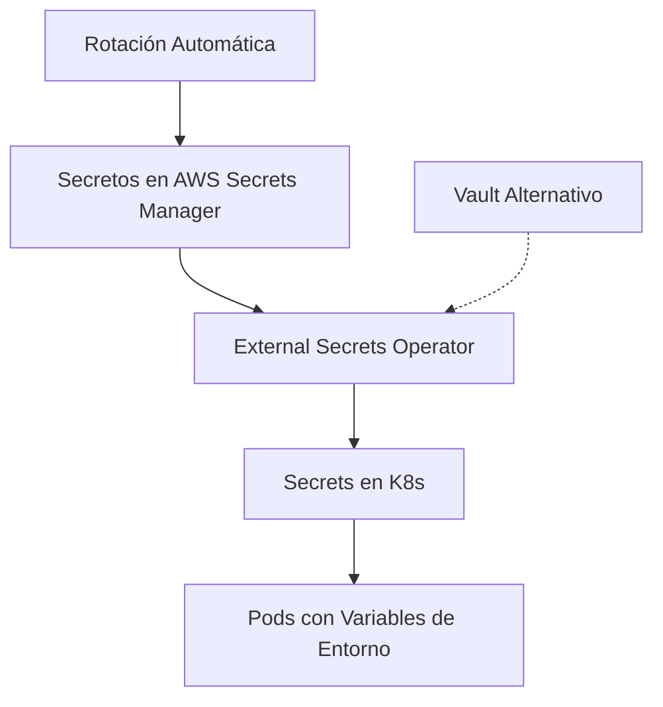
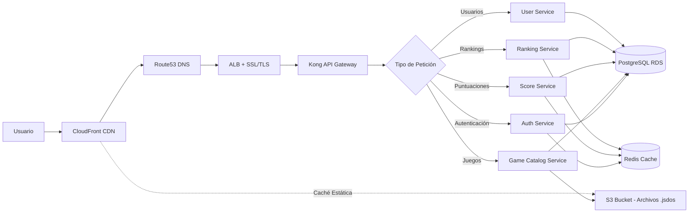
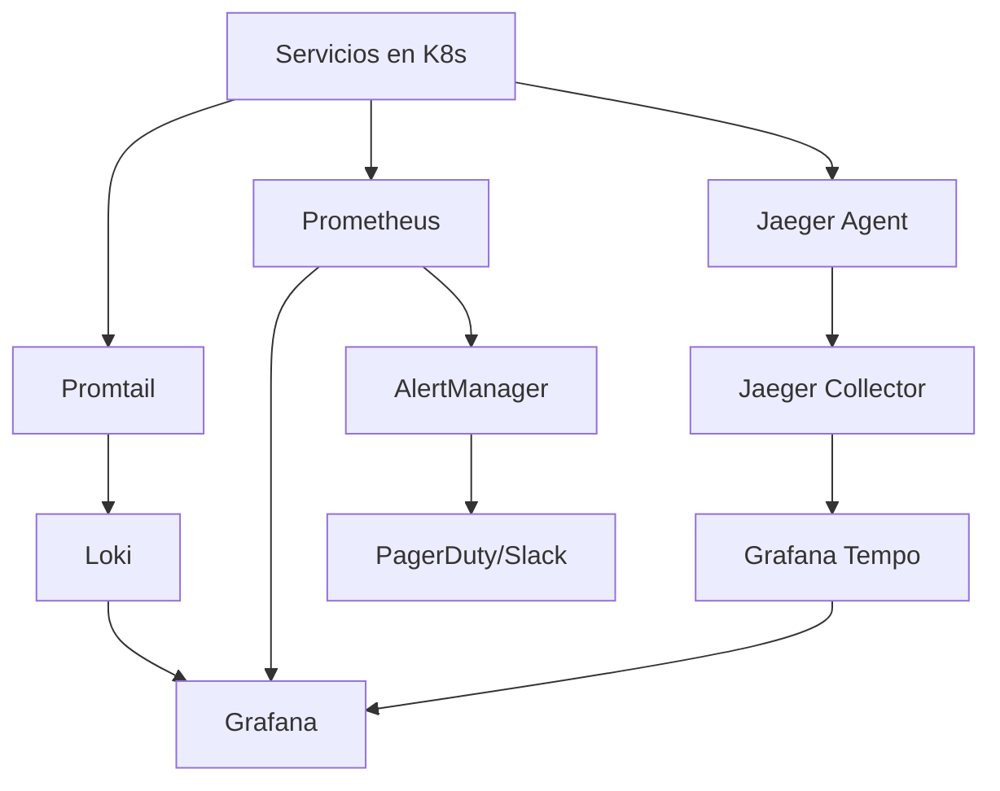

# 🤖 Análisis Inteligente de Documentación

**Fecha**: 2025-11-23 11:33:42  
**Generado por**: Claude Sonnet 4.5  
**Puntuación General**: 6.8/10

## 📊 Resumen Ejecutivo

La documentación tiene una estructura sólida pero presenta gaps críticos en seguridad, disaster recovery, observabilidad avanzada y guías de contribución. Falta documentación técnica profunda sobre decisiones de arquitectura, patrones de resiliencia y runbooks operacionales. Se requieren más diagramas de flujo de datos y componentes de infraestructura.

## 🎯 Mejoras Prioritarias

### Prioridad Alta ⚡

#### Documentación de Seguridad Completa

**Categoría**: content  
**Descripción**: Falta documentación crítica sobre políticas de seguridad, gestión de secretos, escaneo de vulnerabilidades, políticas de red en Kubernetes, y hardening de servicios. Es fundamental para producción.  
**Razón**: La seguridad es crítica en producción y actualmente no hay documentación sobre cómo se manejan secretos, certificados, políticas de red ni respuesta a incidentes. Esto es un riesgo operacional.  

**Archivos a crear**: security/overview.mdx, security/secrets-management.mdx, security/network-policies.mdx, security/vulnerability-scanning.mdx, security/incident-response.mdx  
**Archivos a modificar**: architecture.mdx, deployment.mdx  

**Diagrama propuesto**:

---

#### Disaster Recovery y Backup

**Categoría**: content  
**Descripción**: No existe documentación sobre estrategias de backup, recuperación ante desastres, RPO/RTO, procedimientos de restauración de bases de datos ni planes de contingencia.  
**Razón**: Sin documentación de DR, el equipo no sabe cómo actuar ante fallos catastróficos. Los RPO/RTO deben estar claramente definidos y los procedimientos de recuperación documentados y probados.  

**Archivos a crear**: operations/disaster-recovery.mdx, operations/backup-strategy.mdx, operations/rpo-rto.mdx  
**Archivos a modificar**: infrastructure/overview.mdx  

---

#### Diagrama de Flujo de Datos Completo

**Categoría**: diagrams  
**Descripción**: Falta un diagrama que muestre el flujo completo de datos desde el usuario hasta la persistencia, incluyendo todos los componentes intermedios (CloudFront, ALB, Kong, servicios, bases de datos, caché).  
**Razón**: El diagrama de arquitectura actual es de alto nivel. Se necesita uno detallado que muestre exactamente cómo fluyen las peticiones y datos a través de todos los componentes para debugging y onboarding.  

**Archivos a modificar**: architecture.mdx  

**Diagrama propuesto**:

---

#### Documentación de Observabilidad Avanzada

**Categoría**: content  
**Descripción**: La sección de monitoring es básica. Falta documentación sobre logs centralizados, trazabilidad distribuida, alertas específicas, dashboards, SLIs/SLOs y prácticas de observabilidad.  
**Razón**: La observabilidad actual es limitada. Para operar en producción se necesita trazabilidad completa, logs centralizados, alertas proactivas y SLOs definidos. Esto reduce MTTR dramáticamente.  

**Archivos a crear**: operations/observability.mdx, operations/logging.mdx, operations/tracing.mdx, operations/alerting.mdx, operations/slos.mdx  
**Archivos a modificar**: infrastructure/monitoring.mdx  

**Diagrama propuesto**:

---

### Prioridad Media 📌

#### Runbooks Operacionales

**Categoría**: content  
**Descripción**: Faltan runbooks detallados para operaciones comunes: escalar servicios, rotar secretos, actualizar bases de datos, gestionar incidentes, rollback de despliegues.  
**Razón**:   

**Archivos a crear**: operations/runbooks/scaling.mdx, operations/runbooks/secret-rotation.mdx, operations/runbooks/database-maintenance.mdx, operations/runbooks/rollback.mdx, operations/runbooks/index.mdx  
**Archivos a modificar**: troubleshooting.mdx  

---

---
*Análisis generado automáticamente*
