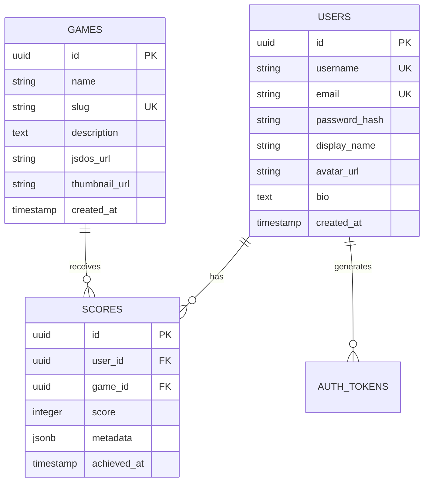
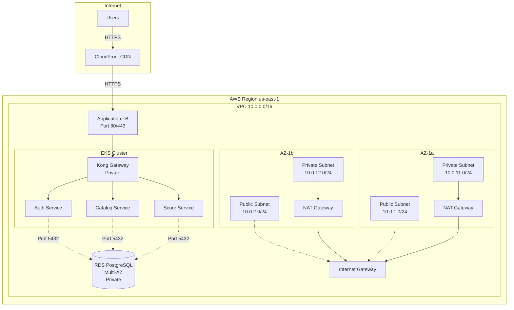
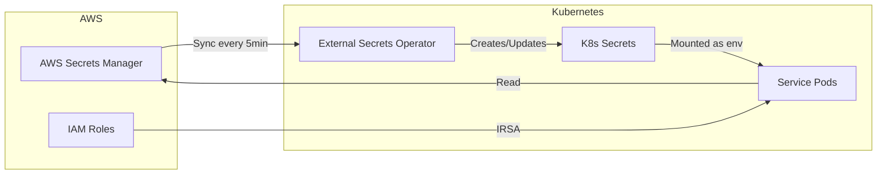
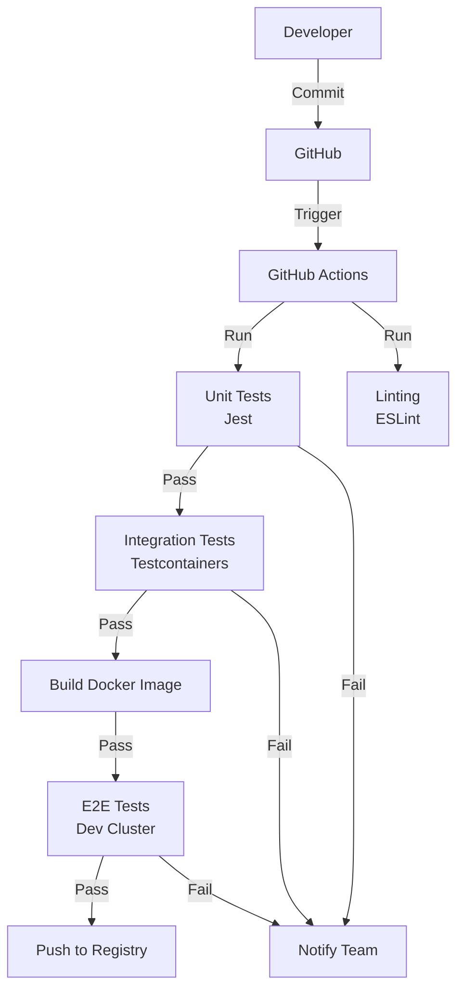
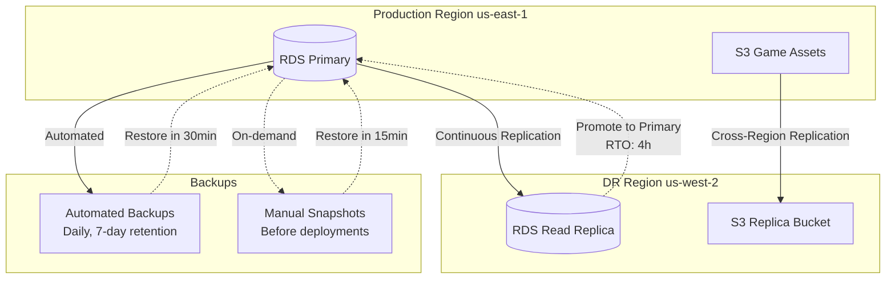
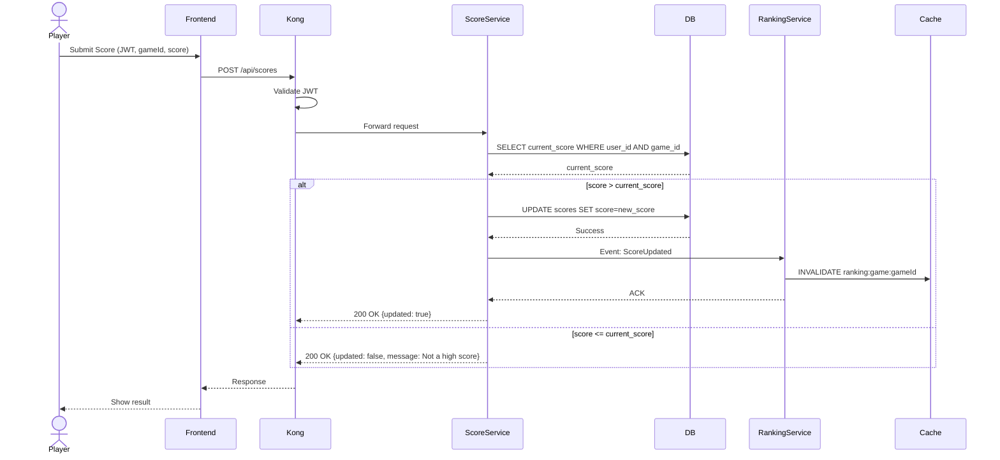
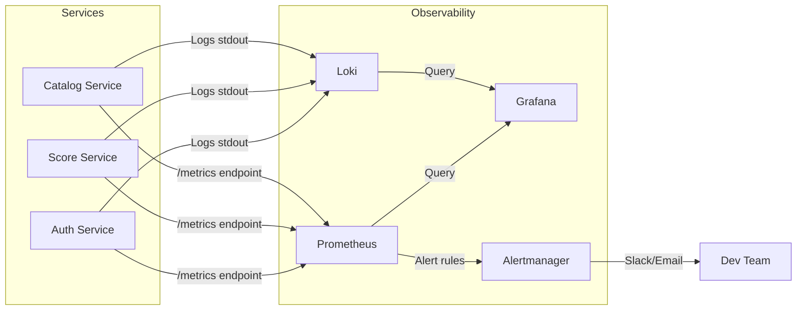
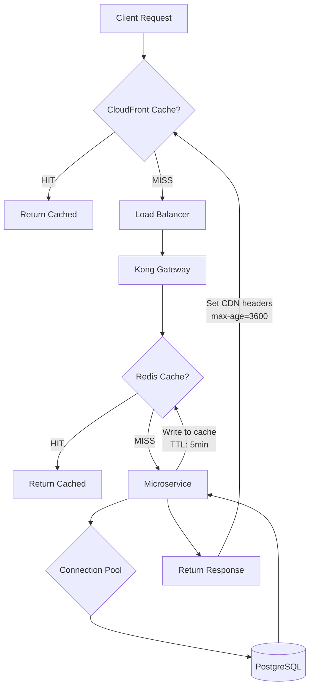

# 🤖 Análisis Inteligente de Documentación

**Fecha**: 2025-11-21 13:02:44  
**Generado por**: Claude Sonnet 4.5  
**Puntuación General**: 7.2/10

## 📊 Resumen Ejecutivo

Documentación bien estructurada pero con gaps críticos: falta documentación de base de datos (schemas, migraciones), seguridad (políticas, secrets), disaster recovery, y testing. La estructura de API reference tiene redundancia y falta consistencia entre servicios.

## 🎯 Mejoras Prioritarias

### Prioridad Alta ⚡

#### Documentación de Schemas de Base de Datos

**Categoría**: content  
**Descripción**: Falta documentación completa de los schemas de PostgreSQL para cada servicio. Los desarrolladores necesitan ver tablas, relaciones, índices y constraints para entender el modelo de datos.  
**Razón**: La base de datos es el core del sistema. Sin documentación de schemas, los desarrolladores no pueden entender dependencias, optimizar queries, o hacer migraciones seguras.  

**Archivos a crear**: infrastructure/database-architecture.mdx, services/schemas/auth-schema.mdx, services/schemas/game-catalog-schema.mdx, services/schemas/score-schema.mdx, services/schemas/user-schema.mdx  

**Diagrama propuesto**:

---

#### Diagrama de Arquitectura de Red Completo

**Categoría**: diagrams  
**Descripción**: El architecture.mdx tiene un diagrama básico pero falta detalle de VPC, subnets, security groups, routing tables, NAT gateways, y flujo de tráfico real en AWS.  
**Razón**: Los equipos de DevOps necesitan entender la topología de red real para troubleshooting, configurar firewalls, y planear cambios de infraestructura.  

**Archivos a crear**: infrastructure/network-architecture.mdx  
**Archivos a modificar**: infrastructure/networking.mdx  

**Diagrama propuesto**:

---

#### Guía de Seguridad y Secrets Management

**Categoría**: content  
**Descripción**: No hay documentación sobre cómo se gestionan secrets (AWS Secrets Manager, K8s secrets), políticas de seguridad, rotación de credenciales, o hardening de servicios.  
**Razón**: Seguridad es crítica. Sin documentación clara, los desarrolladores pueden hardcodear secrets, no rotar credenciales, o exponer endpoints sin protección.  

**Archivos a crear**: infrastructure/security-overview.mdx, infrastructure/secrets-management.mdx, infrastructure/security-policies.mdx  
**Archivos a modificar**: configuration.mdx  

**Diagrama propuesto**:

---

#### Documentación de Testing Strategy

**Categoría**: content  
**Descripción**: No existe documentación sobre testing: unit tests, integration tests, e2e tests, test coverage esperado, cómo ejecutar tests localmente o en CI/CD.  
**Razón**: Testing es fundamental para calidad. Sin guías claras, el código de producción puede no tener tests, causando bugs y dificultando refactoring.  

**Archivos a crear**: development/testing-strategy.mdx, development/unit-testing.mdx, development/integration-testing.mdx, development/e2e-testing.mdx  
**Archivos a modificar**: development.mdx  

**Diagrama propuesto**:

---

#### Disaster Recovery y Backup Strategy

**Categoría**: content  
**Descripción**: Falta documentación sobre backups de BD, RTO/RPO, procedimientos de restore, DR drills, y planes de continuidad de negocio.  
**Razón**: Sin DR documentado, un incidente puede causar pérdida de datos o downtime prolongado. Los SREs necesitan runbooks claros para recuperación.  

**Archivos a crear**: infrastructure/disaster-recovery.mdx, infrastructure/backup-restore.mdx  
**Archivos a modificar**: infrastructure/overview.mdx  

**Diagrama propuesto**:

---

### Prioridad Media 📌

#### Consolidar API Reference Redundante

**Categoría**: structure  
**Descripción**: Hay redundancia entre api-reference/[service].mdx y services/[service].mdx. La estructura no es clara y confunde a los usuarios sobre dónde buscar información.  
**Razón**: La documentación duplicada confunde y es difícil de mantener. Usuarios no saben si están viendo información actualizada.  

**Archivos a modificar**: api-reference/auth-service.mdx, api-reference/game-catalog-service.mdx, api-reference/score-service.mdx, api-reference/user-service.mdx  

---

#### Diagramas de Secuencia para Flujos Críticos Faltantes

**Categoría**: diagrams  
**Descripción**: sequence-diagrams.mdx tiene flujo de auth, pero faltan: submit score con validación, get ranking con cache, game load con CDN fallback, token refresh.  
**Razón**: Los desarrolladores necesitan entender flows complejos para debugging. Los diagramas de secuencia son ideales para mostrar interacciones entre servicios con lógica condicional.  

**Archivos a modificar**: sequence-diagrams.mdx  

**Diagrama propuesto**:

---

#### Documentación de Observability Stack

**Categoría**: content  
**Descripción**: infrastructure/monitoring.mdx existe pero falta detalle sobre Prometheus metrics específicos, Grafana dashboards disponibles, alerting rules, logs aggregation con ELK/Loki.  
**Razón**: Observability es crítica para operar en producción. Sin métricas y alertas documentadas, los equipos reaccionan tarde a incidentes.  

**Archivos a crear**: infrastructure/metrics-and-alerts.mdx, infrastructure/logging.mdx, infrastructure/dashboards.mdx  
**Archivos a modificar**: infrastructure/monitoring.mdx  

**Diagrama propuesto**:

---

#### Performance Tuning y Optimization Guide

**Categoría**: content  
**Descripción**: No hay guías sobre cómo optimizar performance: DB query optimization, caching strategies, K8s resource limits tuning, CDN cache policies.  
**Razón**: Performance es clave para UX. Sin guías, los servicios pueden ser lentos, consumir recursos innecesarios, y generar costos altos en AWS.  

**Archivos a crear**: infrastructure/performance-tuning.mdx, services/caching-strategy.mdx  

**Diagrama propuesto**:

---

#### Runbooks para Incidentes Comunes

**Categoría**: content  
**Descripción**: troubleshooting.mdx tiene algunos casos pero falta runbooks estructurados para incidentes: servicio down, DB connection pool exhausted, alta latencia, disk full.  
**Razón**: Durante incidentes, el equipo necesita instrucciones claras y rápidas. Runbooks bien documentados reducen MTTR (Mean Time To Recovery).  

**Archivos a crear**: operations/runbooks/service-down.mdx, operations/runbooks/high-latency.mdx, operations/runbooks/database-issues.mdx, operations/runbooks/disk-full.mdx  
**Archivos a modificar**: troubleshooting.mdx  

---

### Prioridad Baja 💡

#### Inconsistencia en Formato de Variables de Entorno

**Categoría**: quality  
**Descripción**: configuration.mdx muestra variables de entorno pero no hay un formato estándar. Algunas tienen valores default, otras no. Falta indicar cuáles son required vs optional.  
**Razón**: Configuración inconsistente causa errores en deployments. Un formato claro ayuda a desarrolladores y ops a configurar correctamente.  

**Archivos a modificar**: configuration.mdx  

---

#### Documentación de Convenciones de Código

**Categoría**: content  
**Descripción**: No hay guías sobre coding standards: naming conventions, code structure, error handling patterns, logging standards.  
**Razón**: Convenciones claras mejoran la consistencia del código y facilitan code reviews. Nuevos desarrolladores pueden onboardearse más rápido.  

**Archivos a crear**: development/coding-standards.mdx, development/error-handling.mdx  

---

#### Sección de ADRs (Architecture Decision Records)

**Categoría**: new_section  
**Descripción**: No hay registro de decisiones de arquitectura importantes. ADRs ayudan a entender por qué se tomaron ciertas decisiones técnicas.  
**Razón**: ADRs documentan el contexto histórico de decisiones. Cuando el equipo crece o cambia, evita re-discutir decisiones ya tomadas y explica trade-offs.  

**Archivos a crear**: architecture/adr-index.mdx, architecture/adr-001-microservices.mdx, architecture/adr-002-postgres-per-service.mdx, architecture/adr-003-kong-gateway.mdx  

---

#### Eliminar Archivos de Template de Mintlify

**Categoría**: quality  
**Descripción**: Archivos como essentials/, development.mdx (template), custom-script.js parecen ser de la plantilla de Mintlify y no son específicos del proyecto.  
**Razón**: Archivos de template confunden a usuarios. La documentación debe contener solo información relevante al proyecto RetroGameCloud.  

---

## 📁 Nuevas Secciones Propuestas

### Database

Sección dedicada a la arquitectura de base de datos, schemas, migraciones, y best practices  

**Archivos**:
- `database/overview.mdx`: Database Architecture Overview  
- `database/schemas.mdx`: Database Schemas  
- `database/migrations.mdx`: Database Migrations  
- `database/query-patterns.mdx`: Common Query Patterns  

### Operations

Sección para SRE/DevOps con runbooks, incident management, y operational procedures  

**Archivos**:
- `operations/overview.mdx`: Operations Overview  
- `operations/incident-response.mdx`: Incident Response  
- `operations/runbooks-index.mdx`: Runbooks Index  

### Security

Sección dedicada a seguridad, compliance, secrets management, y hardening  

**Archivos**:
- `security/overview.mdx`: Security Overview  
- `security/authentication-authorization.mdx`: Authentication & Authorization  
- `security/secrets-management.mdx`: Secrets Management  
- `security/network-security.mdx`: Network Security  

### Testing

Sección completa sobre estrategia de testing, frameworks, y best practices  

**Archivos**:
- `testing/overview.mdx`: Testing Strategy  
- `testing/unit-testing.mdx`: Unit Testing  
- `testing/integration-testing.mdx`: Integration Testing  
- `testing/e2e-testing.mdx`: End-to-End Testing  

## 📈 Diagramas Requeridos

### Complete AWS Infrastructure Diagram

**Tipo**: architecture  
**Ubicación**: infrastructure/overview.mdx  
**Descripción**: Diagrama completo mostrando todos los componentes de AWS con nombres de recursos reales, security groups, y networking detallado  

graph TB
    subgraph Internet
        Users[Users]
    end
    subgraph Route53[Route 53]
        DNS[retrogamehub.com]
    end
    subgraph CloudFront[CloudFront Distribution]
        CFOrigin1[Origin: ALB]
        CFOrigin2[Origin: S3 Static]
    end
    subgraph VPC[VPC retro-game-vpc 10.0.0.0/16]
        subgraph PublicSubnets[Public Subnets]
            ALB[Application Load Balancer retro-alb]
            NAT1[NAT Gateway AZ-1a]
            NAT2[NAT Gateway AZ-1b]
        end
        subgraph PrivateSubnets[Private Subnets]
            subgraph EKS[EKS Cluster retro-game-eks]
                NodeGroup[Node Group t3.medium x3]
                Kong[Kong Gateway Pods]
                AuthPods[Auth Service Pods x2]
                CatalogPods[Catalog Service Pods x2]
                ScorePods[Score Service Pods x2]
                RankingPods[Ranking Service Pods x2]
            end
            RDS[(RDS PostgreSQL retro-game-db Multi-AZ)]
            Redis[(ElastiCache Redis retro-cache)]
        end
    end
    subgraph S3Buckets[S3]
        S3Games[retrogame-assets Game .jsdos files]
        S3Static[retrogame-static Frontend build]
    end
    subgraph Secrets[AWS Secrets Manager]
        DBSecret[database-credentials]
        JWTSecret[jwt-secret]
        GHSecret[github-oauth-secret]
    end
    Users --> DNS
    DNS --> CloudFront
    CloudFront --> CFOrigin1
    CloudFront --> CFOrigin2
    CFOrigin1 --> ALB
    CFOrigin2 --> S3Static
    ALB --> Kong
    Kong --> AuthPods
    Kong --> CatalogPods
    Kong --> ScorePods
    Kong --> RankingPods
    AuthPods -.->|Port 5432| RDS
    ScorePods -.->|Port 5432| RDS
    CatalogPods -.->|Port 5432| RDS
    RankingPods -.->|Port 6379| Redis
    CatalogPods -.->|Load .jsdos| S3Games
    NodeGroup -.->|NAT| NAT1
    NodeGroup -.->|NAT| NAT2
    EKS -.->|Read secrets| Secrets

### Complete User Journey: Register to Play Game

**Tipo**: sequence  
**Ubicación**: N/A  
**Descripción**: Flujo completo desde registro hasta jugar un juego, incluyendo todos los servicios involucrados  

---
*Análisis generado automáticamente*
