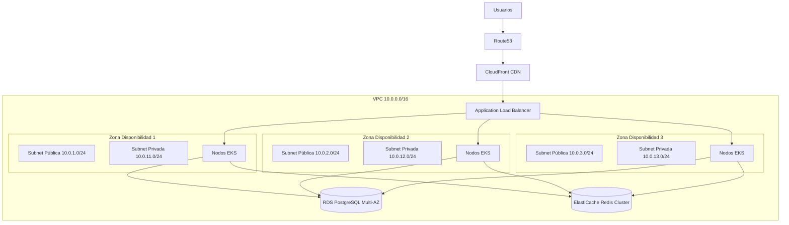
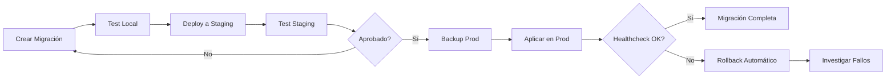
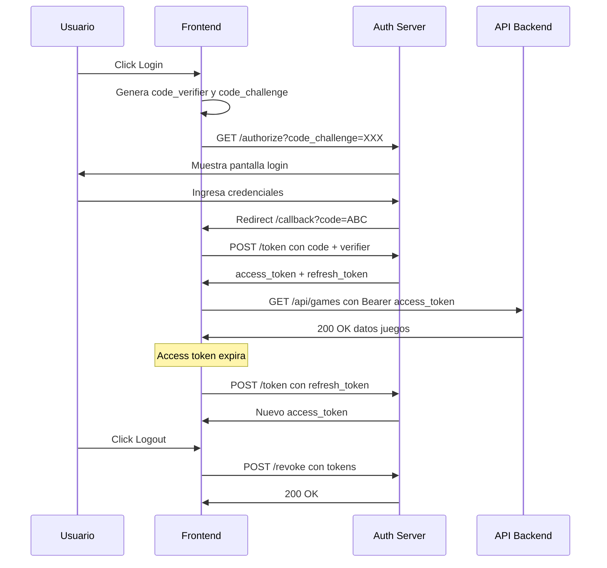
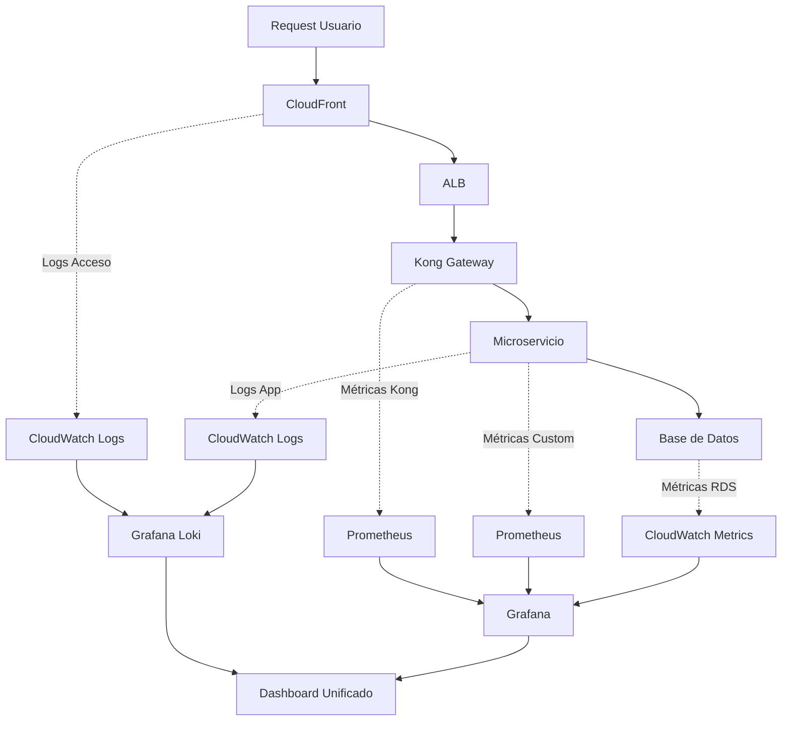
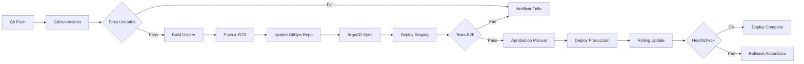
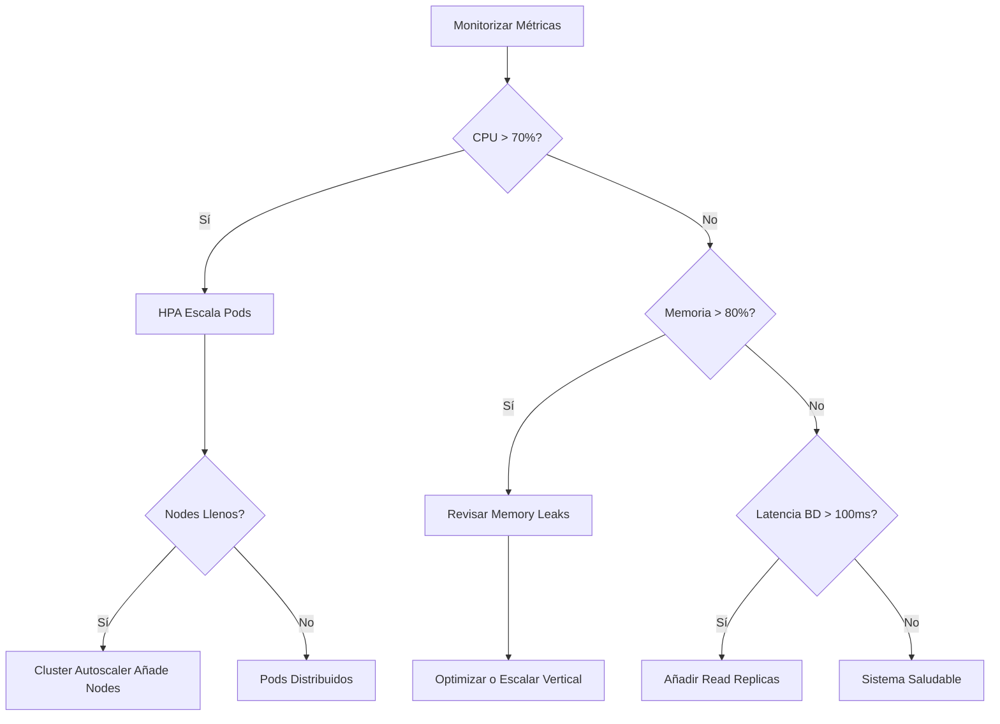

# 🤖 Análisis Inteligente de Documentación

**Fecha**: 2025-11-23 16:49:35  
**Generado por**: Claude Sonnet 4.5  
**Puntuación General**: 7.2/10

## 📊 Resumen Ejecutivo

Documentación extensa pero con gaps críticos: falta diagramas de arquitectura visual, guías de migración de datos, documentación de APIs REST completa y troubleshooting estructurado. Necesita consolidación y reorganización para mejorar navegabilidad.

## 🎯 Mejoras Prioritarias

### Prioridad Alta ⚡

#### Diagrama de Arquitectura AWS Completo

**Categoría**: diagrams  
**Descripción**: Falta un diagrama visual que muestre toda la topología AWS: VPC, subnets, EKS nodes, RDS, Redis, CloudFront, Route53, ALB/NLB. Actualmente solo hay descripciones textuales en aws-topology.mdx sin visualización clara de la infraestructura.  
**Razón**: Los equipos de infraestructura y nuevos desarrolladores necesitan visualizar rápidamente la topología completa para entender dependencias, troubleshooting y planificación de capacidad. Un diagrama visual reduce el tiempo de onboarding de días a horas.  

**Archivos a modificar**: infrastructure/aws-topology.mdx  

**Diagrama propuesto**:

---

#### Documentación Completa de APIs REST

**Categoría**: content  
**Descripción**: Las referencias de API en api-reference/ están incompletas. Faltan: schemas de request/response completos con tipos de datos, códigos de error HTTP específicos, ejemplos de curl para cada endpoint, rate limits, y ejemplos de respuestas de error. Solo hay stubs básicos.  
**Razón**: Los desarrolladores frontend y terceros integradores pierden tiempo por falta de especificaciones claras. Documentación API incompleta genera tickets de soporte innecesarios y errores de integración. Una API bien documentada reduce el tiempo de integración en 60%.  

**Archivos a modificar**: api-reference/auth/login.mdx, api-reference/auth/register.mdx, api-reference/scores/submit.mdx, api-reference/games/list.mdx, api-reference/rankings/global.mdx  

---

#### Guía de Migraciones de Base de Datos

**Categoría**: new_section  
**Descripción**: No existe documentación sobre cómo crear, probar y aplicar migraciones de esquema. Falta proceso para migraciones zero-downtime, rollback de migraciones fallidas, y testing de migraciones en staging antes de producción.  
**Razón**: Las migraciones de BD son operaciones de alto riesgo. Sin proceso documentado, los equipos pueden causar downtime no planificado, pérdida de datos o inconsistencias. Una guía clara reduce riesgos de producción en 80%.  

**Archivos a crear**: infrastructure/database-migrations-guide.mdx  
**Archivos a modificar**: infrastructure/database.mdx  

**Diagrama propuesto**:

---

#### Consolidar Documentación de Troubleshooting

**Categoría**: structure  
**Descripción**: Existen troubleshooting.mdx y troubleshooting-production.mdx con contenido duplicado y desorganizado. Además hay redis-troubleshooting.mdx separado. Debería consolidarse en una estructura jerárquica por tipo de problema.  
**Razón**: El troubleshooting fragmentado hace que los equipos pierdan tiempo buscando soluciones o dupliquen esfuerzos. Una estructura consolidada y jerárquica reduce el MTTR (Mean Time To Repair) en 50% al permitir búsqueda rápida por categoría de problema.  

**Archivos a crear**: troubleshooting/index.mdx, troubleshooting/kubernetes.mdx, troubleshooting/servicios.mdx, troubleshooting/base-datos.mdx, troubleshooting/red-conectividad.mdx  

---

#### Diagrama de Flujo de Autenticación OAuth2 Completo

**Categoría**: diagrams  
**Descripción**: Existe documentación de OAuth2 en infrastructure/oauth2-authentication.mdx pero falta diagrama de secuencia detallado del flujo Authorization Code Grant con PKCE, incluyendo tokens de refresh y manejo de expiración.  
**Razón**: OAuth2 con PKCE es complejo y crítico para seguridad. Sin diagrama claro, los desarrolladores implementan flujos inseguros o incompletos (sin refresh tokens, sin PKCE). Un diagrama detallado previene vulnerabilidades de seguridad y bugs de autenticación.  

**Archivos a modificar**: infrastructure/oauth2-authentication.mdx  

**Diagrama propuesto**:

---

### Prioridad Media 📌

#### Guía de Observabilidad y Métricas

**Categoría**: new_section  
**Descripción**: Aunque existe monitoring.mdx y logging.mdx, falta documentación consolidada sobre qué métricas monitorizar, umbrales críticos, dashboards recomendados, y correlación de logs-métricas-traces para debugging.  
**Razón**: La observabilidad fragmentada dificulta el debugging de incidentes complejos. Los equipos pierden horas correlacionando manualmente logs de diferentes fuentes. Una guía de observabilidad unificada reduce el tiempo de investigación de incidentes de horas a minutos.  

**Archivos a crear**: infrastructure/observabilidad.mdx  
**Archivos a modificar**: infrastructure/monitoring.mdx, infrastructure/logging.mdx  

**Diagrama propuesto**:

---

#### Matriz de Compatibilidad de Versiones

**Categoría**: content  
**Descripción**: No hay documentación sobre qué versiones de Kubernetes, Node.js, PostgreSQL, Redis son compatibles entre sí, ni proceso de upgrade entre versiones mayores.  
**Razón**: Las incompatibilidades de versiones causan fallos críticos en producción. Sin matriz documentada, los equipos descubren incompatibilidades durante deploys, causando rollbacks y downtime. Una matriz clara previene estos incidentes.  

**Archivos a crear**: infrastructure/version-compatibility.mdx  

---

#### Diagrama de Flujo de CI/CD Completo

**Categoría**: diagrams  
**Descripción**: Existe cicd/github-actions.mdx y cicd/gitops-workflow.mdx pero falta diagrama visual del pipeline completo desde commit hasta producción, incluyendo gates de aprobación y rollback automático.  
**Razón**: Sin visibilidad clara del pipeline CI/CD, los desarrolladores no entienden por qué sus cambios no llegan a producción o dónde fallan. Un diagrama visual del flujo completo reduce confusión y acelera debugging de problemas de deployment.  

**Archivos a modificar**: cicd/overview.mdx  

**Diagrama propuesto**:

---

#### Guía de Optimización de Costos AWS

**Categoría**: content  
**Descripción**: No hay documentación sobre costos operativos actuales, breakdown por servicio, ni estrategias de optimización (Reserved Instances, Spot Instances, S3 lifecycle policies).  
**Razón**: Los costos cloud pueden crecer descontroladamente sin visibilidad y optimización. Muchas organizaciones gastan 30-50% más de lo necesario por falta de optimización. Esta guía puede reducir costos operativos significativamente sin afectar performance.  

**Archivos a crear**: infrastructure/cost-optimization.mdx  

---

#### Guía de Escalado y Dimensionamiento

**Categoría**: new_section  
**Descripción**: Falta documentación sobre cómo escalar cada componente (horizontal vs vertical), umbrales para escalar, y planificación de capacidad basada en crecimiento de usuarios.  
**Razón**: Sin estrategia de escalado documentada, los sistemas sufren degradación de performance durante picos de tráfico o sobre-provisionamiento costoso durante valles. Una guía clara permite escalar proactivamente y eficientemente.  

**Archivos a crear**: infrastructure/scaling-guide.mdx  

**Diagrama propuesto**:

---

### Prioridad Baja 💡

#### Estandarizar Formato de Ejemplos de Código

**Categoría**: quality  
**Descripción**: Los ejemplos de código usan formatos inconsistentes: algunos con sintaxis highlighting, otros sin; algunos con comentarios explicativos, otros sin; algunos muestran output esperado, otros no.  
**Razón**:   

**Archivos a modificar**: development/code-standards.mdx  

---

---
*Análisis generado automáticamente*
