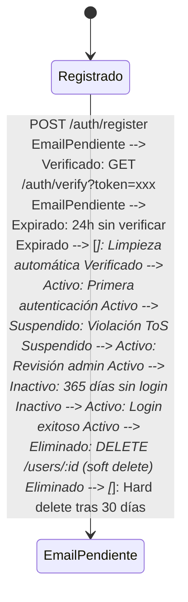

```mermaid
sequenceDiagram participant U as Usuario<br/>Navegador participant CF as CloudFront participant R53 as Route53 participant ALB as Application<br/>Load Balancer participant K as Kong<br/>Gateway participant A as Auth<br/>Service participant S as Score<br/>Service participant RDS as PostgreSQL<br/>RDS participant Redis as ElastiCache<br/>Redis U->>CF: GET /assets/game.jsdos CF-->>U: Asset (caché) U->>R53: POST api.retrogame.es/scores R53->>ALB: Resolución DNS ALB->>K: HTTPS (TLS terminado) K->>K: Verificar JWT K->>K: Rate Limiting K->>S: Proxy request S->>Redis: Verificar caché Redis-->>S: Cache miss S->>RDS: INSERT/UPDATE score RDS-->>S: Confirmación S->>Redis: Actualizar caché S-->>K: Response 200 K-->>ALB: Response ALB-->>U: Response
```

# 🤖 Análisis Inteligente de Documentación

**Fecha**: 2025-11-21 13:19:34  
**Generado por**: Claude Sonnet 4.5  
**Puntuación General**: 6.8/10

## 📊 Resumen Ejecutivo

La documentación está bien estructurada pero presenta gaps críticos: falta documentación de seguridad, estrategias de respaldo/recuperación, guías operativas de producción, y diagramas de arquitectura de infraestructura. Hay inconsistencias en profundidad entre secciones y contenido duplicado en 'essentials' y 'api-reference'.

## 🎯 Mejoras Prioritarias


### Prioridad Alta ⚡

#### Documentación de Seguridad Completa

**Categoría**: content  
**Descripción**: Falta documentación crítica sobre políticas de seguridad, gestión de secretos, RBAC en Kubernetes, políticas de red, y cumplimiento normativo. Esto es fundamental para operaciones en producción.  
**Razón**: La seguridad es fundamental en producción. Sin documentación clara sobre políticas de seguridad, gestión de secretos y RBAC, el sistema queda vulnerable y dificulta auditorías y cumplimiento normativo.  

**Archivos a crear**: security/overview.mdx, security/secrets-management.mdx, security/network-policies.mdx, security/rbac.mdx, security/compliance.mdx  

---

#### Diagrama de Arquitectura de Infraestructura AWS Completo

**Categoría**: diagrams  
**Descripción**: No existe un diagrama completo que muestre toda la infraestructura AWS (VPC, subnets, security groups, EKS, RDS, S3, CloudFront, Route53) y sus interconexiones.  
**Razón**: Un diagrama de infraestructura completo es esencial para entender la arquitectura, planificar cambios, diagnosticar problemas y onboarding de nuevos ingenieros. Actualmente esta información está fragmentada.  

**Archivos a crear**: infrastructure/architecture-diagram.mdx  
**Archivos a modificar**: infrastructure/overview.mdx  

**Diagrama propuesto**:
```mermaid
graph TB subgraph Internet[Internet] User[Usuario] end subgraph Route53[Route53 DNS] DNS[retrogame.es] end subgraph CloudFront[CloudFront CDN] CF[Distribución CDN<br/>Assets Estáticos] end subgraph VPC[VPC 10.0.0.0/16] subgraph PublicSubnets[Subnets Públicas Multi-AZ] ALB[Application Load Balancer<br/>SSL/TLS Termination] NAT[NAT Gateway] end subgraph PrivateSubnets[Subnets Privadas Multi-AZ] subgraph EKS[EKS Cluster] Kong[Kong API Gateway] Auth[Auth Service] Catalog[Catalog Service] Score[Score Service] Rank[Ranking Service] Users[User Service] end RDS[(RDS PostgreSQL<br/>Multi-AZ)] Redis[(ElastiCache Redis)] end end subgraph S3[S3 Buckets] Games[retrogame-games<br/>Archivos .jsdos] Assets[retrogame-assets<br/>Imágenes] end User --> DNS DNS --> CF CF --> Games CF --> ALB ALB --> Kong Kong --> Auth Kong --> Catalog Kong --> Score Kong --> Rank Kong --> Users Auth --> RDS Catalog --> RDS Score --> RDS Rank --> RDS Users --> RDS Auth --> Redis EKS -.-> NAT NAT -.-> Internet
```


---

#### Estrategias de Respaldo y Recuperación ante Desastres

**Categoría**: content  
**Descripción**: No existe documentación sobre backups de RDS, estrategias de recuperación ante desastres (DR), RPO/RTO, ni procedimientos de restauración.  
**Razón**: Sin estrategias documentadas de backup y DR, el sistema está en riesgo ante fallos. Es crítico para business continuity y debe estar documentado antes de incidentes reales.  

**Archivos a crear**: operations/backup-restore.mdx, operations/disaster-recovery.mdx  
**Archivos a modificar**: infrastructure/overview.mdx  

---

#### Diagrama de Flujo de Datos Completo Usuario-a-Base de Datos

**Categoría**: diagrams  
**Descripción**: Falta un diagrama que muestre el flujo completo de una petición desde el navegador hasta la base de datos, incluyendo todos los componentes intermedios.  
**Razón**: Esencial para entender la arquitectura en profundidad, diagnosticar problemas de latencia, y optimizar el rendimiento. Actualmente cada componente está documentado aisladamente.  

**Archivos a crear**: architecture/data-flow.mdx  
**Archivos a modificar**: architecture.mdx  

**Diagrama propuesto**:



---

#### Guía de Monitorización y Observabilidad Operativa

**Categoría**: content  
**Descripción**: infrastructure/monitoring.mdx existe pero está incompleto. Falta documentación sobre dashboards específicos, alertas críticas, runbooks, y procedimientos de on-call.  
**Razón**: Monitorización efectiva es crítica en producción. Sin documentación clara de alertas y runbooks, los incidentes tardan más en resolverse y aumenta el MTTR (Mean Time To Recovery).  

**Archivos a crear**: operations/monitoring-dashboards.mdx, operations/alerting.mdx, operations/on-call-runbook.mdx  
**Archivos a modificar**: infrastructure/monitoring.mdx  

---


### Prioridad Media 📌

#### Guía de Escalado Horizontal y Vertical

**Categoría**: content  
**Descripción**: No existe documentación sobre cuándo y cómo escalar servicios, configuración de HPA (Horizontal Pod Autoscaler), límites de recursos, ni estrategias de capacity planning.  
**Razón**: Sin documentación de escalado, el equipo no sabe cómo responder a aumentos de carga. Esto es crítico para mantener SLAs durante picos de tráfico.  

**Archivos a crear**: operations/scaling.mdx, operations/capacity-planning.mdx  
**Archivos a modificar**: infrastructure/eks-cluster.mdx  

---

#### Diagrama de Estados del Ciclo de Vida del Usuario

**Categoría**: diagrams  
**Descripción**: Falta un diagrama que muestre los estados del usuario (registrado, verificado, activo, suspendido, eliminado) y las transiciones entre estados.  
**Razón**: Clarifica el comportamiento del sistema respecto a usuarios, ayuda a implementar features como verificación de email y políticas de retención de datos (GDPR compliance).  

**Archivos a crear**: services/user-lifecycle.mdx  
**Archivos a modificar**: services/user-service.mdx  

**Diagrama propuesto**:



---

#### Documentación de Pipeline CI/CD Detallado

**Categoría**: content  
**Descripción**: cicd/github-actions.mdx y cicd/gitops-workflow.mdx existen pero están superficiales. Falta detalle sobre stages del pipeline, tests ejecutados, políticas de merge, y rollback automático.  
**Razón**: Pipeline CI/CD bien documentado acelera onboarding, reduce errores de despliegue, y facilita troubleshooting cuando el pipeline falla. Actualmente la documentación es demasiado general.  

**Archivos a crear**: cicd/pipeline-stages.mdx, cicd/testing-strategy.mdx, cicd/rollback-procedures.mdx  
**Archivos a modificar**: cicd/github-actions.mdx, cicd/gitops-workflow.mdx  

**Diagrama propuesto**:
```mermaid
graph LR A[Git Push] --> B[GitHub Actions Trigger] B --> C[Lint & Format] C --> D[Unit Tests] D --> E[Integration Tests] E --> F[Build Docker Image] F --> G[Security Scan Trivy] G --> H{Vulnerabilidades<br/>críticas?} H -->|Sí| I[Pipeline Falla] H -->|No| J[Push to ECR] J --> K[Update K8s Manifests] K --> L[Git Commit to k8s repo] L --> M[ArgoCD Sync] M --> N[Deploy to EKS] N --> O[Health Checks] O --> P{Healthy?} P -->|No| Q[Auto Rollback] P -->|Sí| R[Smoke Tests] R --> S[Success]
```


---

#### Diagrama de Arquitectura de Microservicios con Dependencias

**Categoría**: diagrams  
**Descripción**: Falta un diagrama que muestre las dependencias entre microservicios, qué servicios llaman a qué otros, y las dependencias externas (RDS, Redis, S3).  
**Razón**: Entender dependencias entre servicios es fundamental para planificar cambios, identificar puntos únicos de fallo (SPOF), y diseñar estrategias de circuit breaking y resilience.  

**Archivos a crear**: architecture/service-dependencies.mdx  
**Archivos a modificar**: architecture.mdx  

**Diagrama propuesto**:
```mermaid
graph TB subgraph Frontend FE[Frontend React<br/>js-dos] end subgraph Gateway GW[Kong API Gateway] end subgraph Microservicios AUTH[Auth Service<br/>:3001] CAT[Catalog Service<br/>:3002] SCORE[Score Service<br/>:3003] RANK[Ranking Service<br/>:3004] USER[User Service<br/>:3005] end subgraph DataStores DB[(PostgreSQL RDS)] REDIS[(ElastiCache Redis)] S3[S3 Buckets] end FE -->|HTTPS| GW GW -->|JWT Auth| AUTH GW --> CAT GW --> SCORE GW --> RANK GW --> USER AUTH -.->|Validate JWT| GW SCORE --> AUTH SCORE -.->|Update trigger| RANK RANK --> SCORE USER --> AUTH AUTH --> DB AUTH --> REDIS CAT --> DB CAT --> S3 SCORE --> DB RANK --> DB RANK --> REDIS USER --> DB
```


---

#### Guía de Contribución y Estándares de Código

**Categoría**: content  
**Descripción**: Falta documentación sobre cómo contribuir al proyecto: estándares de código, convenciones de commits, process de code review, y branching strategy.  
**Razón**: Sin guías de contribución claras, el código se vuelve inconsistente, las PRs tardan más en revisarse, y los nuevos contribuidores no saben cómo empezar.  

**Archivos a crear**: development/contributing.mdx, development/code-standards.mdx, development/git-workflow.mdx  
**Archivos a modificar**: development.mdx  

---

#### Consolidar Contenido Duplicado en essentials y api-reference

**Categoría**: quality  
**Descripción**: Existe contenido duplicado y genérico en carpetas 'essentials' (markdown.mdx, code.mdx, etc.) y contenido genérico en 'api-reference/endpoint' que parece ser boilerplate no relacionado con el proyecto.  
**Razón**: La carpeta 'essentials' contiene documentación genérica sobre Mintlify que no aporta valor al proyecto. Los endpoints en 'api-reference/endpoint' parecen ejemplos genéricos. Eliminarlos reduce ruido y mejora navegación.  


---


### Prioridad Baja 💡

#### Documentación de Testing End-to-End

**Categoría**: content  
**Descripción**: No existe documentación sobre estrategia de tests E2E, herramientas utilizadas (Cypress, Playwright), ni suites de tests existentes.  
**Razón**: Tests E2E son la última línea de defensa contra regresiones. Sin documentación, los desarrolladores no saben qué está cubierto ni cómo agregar nuevos tests.  

**Archivos a crear**: development/e2e-testing.mdx  
**Archivos a modificar**: cicd/testing-strategy.mdx  

---

#### Documentación de Costes de Infraestructura

**Categoría**: content  
**Descripción**: No existe documentación sobre el coste estimado de la infraestructura AWS (EKS, RDS, CloudFront, etc.) ni estrategias de optimización de costes.  
**Razón**: Transparencia en costes ayuda a tomar decisiones informadas sobre arquitectura y evita sorpresas en facturación. Útil especialmente para proyectos educativos o startups.  

**Archivos a crear**: operations/cost-management.mdx  
**Archivos a modificar**: infrastructure/overview.mdx  

---

#### Diagrama de Arquitectura del Frontend

**Categoría**: diagrams  
**Descripción**: frontend/overview.mdx y frontend/jsdos-integration.mdx existen pero sin diagrama de arquitectura del cliente (componentes React, gestión de estado, integración js-dos).  
**Razón**: Aunque el backend está bien documentado, el frontend carece de diagramas arquitectónicos. Esto ayuda a entender el flujo de datos en el cliente y facilita refactorizaciones.  

**Archivos a crear**: frontend/architecture.mdx  
**Archivos a modificar**: frontend/overview.mdx  

**Diagrama propuesto**:
```mermaid
graph TB subgraph Frontend Application APP[App Component] NAV[Navigation] AUTH[Auth Context] end subgraph Pages HOME[Home/GameList] PLAYER[Game Player] LEAD[Leaderboards] PROFILE[User Profile] end subgraph Components GAME[GameCard] JSDOS[js-dos Emulator] SCORE[ScoreForm] RANK[RankingTable] end subgraph Services API[API Service] STORAGE[LocalStorage] end APP --> NAV APP --> AUTH NAV --> HOME NAV --> PLAYER NAV --> LEAD NAV --> PROFILE HOME --> GAME PLAYER --> JSDOS PLAYER --> SCORE LEAD --> RANK SCORE --> API RANK --> API AUTH --> API API -->|Kong Gateway| BACKEND[Backend Services] JSDOS -->|Load| S3[S3 .jsdos files]
```


---

#### Glosario de Términos Técnicos

**Categoría**: content  
**Descripción**: Para facilitar onboarding, sería útil un glosario con definiciones de términos clave usados en el proyecto (microservicios, Kong, js-dos, GitOps, etc.).  
**Razón**: Facilita onboarding de personas menos familiarizadas con la stack tecnológica. Reduce tiempo necesario para entender documentación técnica.  

**Archivos a crear**: reference/glossary.mdx  
**Archivos a modificar**: index.mdx  

---


## 📁 Nuevas Secciones Propuestas

### Operaciones (Operations)

Nueva sección dedicada a operaciones en producción: monitorización, alertas, escalado, backups, disaster recovery, y gestión de incidentes.  

**Archivos**:
- `operations/overview.mdx`: 5.1. Visión General de Operaciones  
- `operations/monitoring-dashboards.mdx`: 5.2. Dashboards de Monitorización  
- `operations/alerting.mdx`: 5.3. Sistema de Alertas  
- `operations/on-call-runbook.mdx`: 5.4. Runbook de Guardia On-Call  
- `operations/backup-restore.mdx`: 5.5. Respaldos y Restauración  
- `operations/disaster-recovery.mdx`: 5.6. Recuperación ante Desastres  
- `operations/scaling.mdx`: 5.7. Estrategias de Escalado  
- `operations/capacity-planning.mdx`: 5.8. Planificación de Capacidad  
- `operations/cost-management.mdx`: 5.9. Gestión de Costes  

### Seguridad (Security)

Nueva sección dedicada a seguridad: gestión de secretos, RBAC, políticas de red, cumplimiento normativo, y escaneo de vulnerabilidades.  

**Archivos**:
- `security/overview.mdx`: 6.1. Visión General de Seguridad  
- `security/secrets-management.mdx`: 6.2. Gestión de Secretos  
- `security/rbac.mdx`: 6.3. Control de Acceso Basado en Roles (RBAC)  
- `security/network-policies.mdx`: 6.4. Políticas de Red  
- `security/compliance.mdx`: 6.5. Cumplimiento Normativo  
- `security/vulnerability-scanning.mdx`: 6.6. Escaneo de Vulnerabilidades  

### Referencia (Reference)

Nueva sección para material de referencia rápida: glosario, comandos útiles, tablas de puertos/servicios, y FAQs.  

**Archivos**:
- `reference/glossary.mdx`: 7.1. Glosario de Términos  
- `reference/useful-commands.mdx`: 7.2. Comandos Útiles  
- `reference/ports-services.mdx`: 7.3. Tabla de Puertos y Servicios  


---
*Análisis generado automáticamente*
