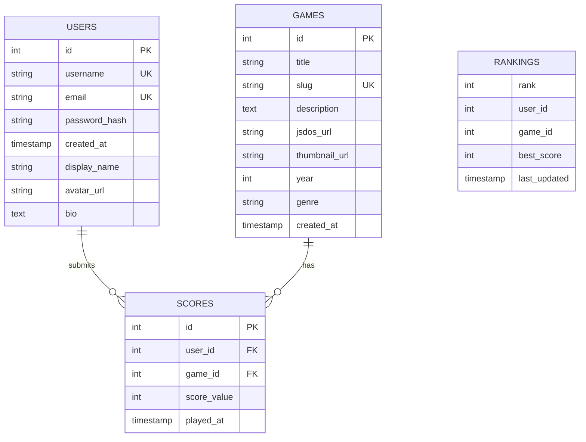
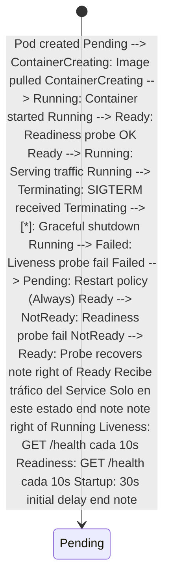

```mermaid
sequenceDiagram participant Dev as Desarrollador participant GH as GitHub participant GHA as GitHub Actions participant ECR as AWS ECR participant K8s as Repositorio K8s participant Argo as ArgoCD participant EKS as EKS Cluster Dev->>GH: git push código GH->>GHA: Trigger workflow GHA->>GHA: Ejecutar tests (Jest) GHA->>GHA: Build Docker image GHA->>GHA: Tag con git SHA + semver GHA->>ECR: Push imagen GHA->>K8s: Update image tag en manifests K8s->>Argo: Cambio detectado (polling 3min) Argo->>Argo: Git pull manifests Argo->>EKS: kubectl apply -f manifests EKS->>EKS: Rolling update pods EKS->>EKS: Health checks (readiness probe) alt Health checks OK EKS->>Argo: Deployment exitoso Argo->>GH: Update status commit else Health checks FAIL EKS->>Argo: Deployment fallido Argo->>EKS: Rollback automático Argo->>GH: Notificar fallo end
```

# 🤖 Análisis Inteligente de Documentación

**Fecha**: 2025-11-23 03:53:31  
**Generado por**: Claude Sonnet 4.5  
**Puntuación General**: 6.8/10

## 📊 Resumen Ejecutivo

La documentación tiene una base sólida pero presenta gaps críticos en seguridad, operaciones y monitorización. Falta coherencia en la estructura de servicios vs API reference (duplicación), ausencia de guías de troubleshooting operacional, diagramas de arquitectura incompletos y carencia de documentación sobre estrategias de migración, backup/recovery y runbooks operacionales.

## 🎯 Mejoras Prioritarias


### Prioridad Alta ⚡

#### Consolidar duplicación entre /services y /api-reference

**Categoría**: structure  
**Descripción**: Existe duplicación confusa entre services/*.mdx y api-reference/*-service.mdx. Los archivos en /services deberían enfocarse en arquitectura y diseño del servicio, mientras que /api-reference debe contener solo especificaciones OpenAPI/Swagger. Actualmente ambos mezclan conceptos.  
**Razón**: Eliminar confusión entre documentación arquitectónica y especificación de API. Facilita mantenimiento y evita información contradictoria. Mejora experiencia de desarrolladores al separar concerns claramente.  

**Archivos a modificar**: services/auth-service.mdx, services/game-catalog.mdx, services/score-service.mdx, services/user-service.mdx, services/ranking-service.mdx  

---

#### Documentar estrategia de Disaster Recovery y Backups

**Categoría**: content  
**Descripción**: No existe documentación sobre políticas de backup para RDS PostgreSQL, estrategias de recuperación ante desastres, RPO/RTO definidos, ni procedimientos de restauración de datos. Crítico para producción.  
**Razón**: Requisito fundamental para cualquier sistema en producción. Define expectativas claras de recuperación y protege contra pérdida de datos. Cumplimiento con estándares de operación.  

**Archivos a crear**: operations/disaster-recovery.mdx, operations/backup-strategy.mdx  
**Archivos a modificar**: infrastructure/overview.mdx  

---

#### Diagrama de arquitectura de red detallado

**Categoría**: diagrams  
**Descripción**: Falta diagrama que muestre VPCs, subnets públicas/privadas, security groups, NACLs, y flujo de tráfico entre componentes. El diagrama actual en architecture.mdx es demasiado alto nivel.  
**Razón**: Esencial para entender segregación de red, troubleshooting de conectividad, auditorías de seguridad y planificación de cambios de infraestructura. Facilita onboarding de nuevos ingenieros.  

**Archivos a crear**: infrastructure/network-architecture.mdx  
**Archivos a modificar**: infrastructure/networking.mdx  

**Diagrama propuesto**:
```mermaid
graph TB subgraph VPC[VPC 10.0.0.0/16] subgraph PublicSubnets[Subnets Públicas] ALB[Application Load Balancer<br/>Puerto 443] NAT[NAT Gateway] end subgraph PrivateSubnets[Subnets Privadas] subgraph EKS[EKS Cluster] Kong[Kong Gateway<br/>:8000] Auth[Auth Service<br/>:3001] Catalog[Catalog Service<br/>:3002] Score[Score Service<br/>:3003] User[User Service<br/>:3004] Ranking[Ranking Service<br/>:3005] end RDS[(RDS PostgreSQL<br/>:5432)] Redis[(ElastiCache Redis<br/>:6379)] end end Internet[Internet] --> CloudFront[CloudFront CDN] CloudFront --> ALB ALB --> Kong Kong --> Auth Kong --> Catalog Kong --> Score Kong --> User Kong --> Ranking Auth --> RDS Catalog --> RDS Score --> RDS User --> RDS Ranking --> RDS Auth --> Redis subgraph SecurityGroups[Security Groups] SG1[ALB SG<br/>IN: 443 from 0.0.0.0/0] SG2[EKS SG<br/>IN: 8000-9000 from ALB SG] SG3[RDS SG<br/>IN: 5432 from EKS SG] end
```


---

#### Documentar gestión de secretos y rotación de credenciales

**Categoría**: content  
**Descripción**: No hay documentación sobre dónde se almacenan secretos (AWS Secrets Manager, Kubernetes Secrets), política de rotación de credenciales de RDS, claves JWT, tokens OAuth, ni procedimientos de rotación sin downtime.  
**Razón**: Seguridad crítica. Previene exposición de credenciales, cumple con mejores prácticas de seguridad cloud, facilita auditorías y compliance. Reduce riesgo de brechas de seguridad.  

**Archivos a crear**: security/secrets-management.mdx, security/credential-rotation.mdx  
**Archivos a modificar**: configuration.mdx  

---

#### Crear sección de Runbooks Operacionales

**Categoría**: new_section  
**Descripción**: Crear sección completa con playbooks para incidentes comunes: servicio caído, base de datos lenta, disco lleno, CPU alta, problemas de autenticación, degradación de CloudFront.  
**Razón**: Fundamental para operación 24/7. Reduce MTTR (Mean Time To Repair), estandariza respuesta a incidentes, facilita on-call, mejora confiabilidad del sistema. Documenta conocimiento tribal.  

**Archivos a crear**: operations/runbooks/overview.mdx, operations/runbooks/service-down.mdx, operations/runbooks/database-performance.mdx, operations/runbooks/high-cpu-memory.mdx, operations/runbooks/authentication-issues.mdx  

---

#### Diagrama de flujo de despliegue CI/CD completo

**Categoría**: diagrams  
**Descripción**: Falta diagrama que muestre el flujo end-to-end desde git push hasta pods actualizados en producción, incluyendo GitHub Actions, builds Docker, push a ECR, ArgoCD sync, health checks.  
**Razón**: Visualiza pipeline completo de entrega, facilita debugging de problemas de deployment, documenta proceso para nuevos miembros del equipo, identifica posibles mejoras de automatización.  

**Archivos a modificar**: cicd/gitops-workflow.mdx  

**Diagrama propuesto**:



---


### Prioridad Media 📌

#### Documentar límites y cuotas del sistema

**Categoría**: content  
**Descripción**: Falta documentación sobre rate limiting en Kong, límites de tamaño de archivos .jsdos, cuotas de API por usuario, límites de conexiones concurrentes a base de datos, thresholds de autoscaling.  
**Razón**: Previene abusos del sistema, documenta límites técnicos para desarrolladores frontend, facilita capacity planning, ayuda a diagnosticar errores 429/413.  

**Archivos a crear**: architecture/system-limits.mdx  
**Archivos a modificar**: api-reference/kong.mdx  

---

#### Diagrama de modelo de datos relacional

**Categoría**: diagrams  
**Descripción**: No existe diagrama ER que muestre relaciones entre tablas: users, games, scores, rankings. Crítico para entender integridad referencial y queries complejas.  
**Razón**: Esencial para desarrolladores que añaden features, facilita optimización de queries, documenta reglas de negocio en base de datos, previene errores de integridad referencial.  

**Archivos a crear**: architecture/data-model.mdx  

**Diagrama propuesto**:



---

#### Documentar estrategia de versionado de API

**Categoría**: content  
**Descripción**: No está documentado cómo se manejan cambios breaking en APIs: versionado en URL, headers, deprecation policy, ventana de soporte de versiones antiguas.  
**Razón**: Define expectativas claras para clientes de la API, previene breaking changes inesperados, facilita evolución del sistema sin romper integraciones existentes.  

**Archivos a crear**: api-reference/versioning-strategy.mdx  
**Archivos a modificar**: api-reference/introduction.mdx  

---

#### Documentar estrategia de logging y correlación de requests

**Categoría**: content  
**Descripción**: Falta documentación sobre formato de logs (JSON structured logging), niveles de log por entorno, correlation IDs para tracing distribuido entre microservicios, integración con CloudWatch.  
**Razón**: Facilita debugging distribuido, permite seguir requests a través de múltiples servicios, mejora observabilidad, cumple con mejores prácticas de microservicios.  

**Archivos a crear**: operations/logging-strategy.mdx  
**Archivos a modificar**: infrastructure/monitoring.mdx  

---

#### Estandarizar formato de ejemplos de código

**Categoría**: quality  
**Descripción**: Los ejemplos de código en la documentación usan formatos inconsistentes: algunos muestran curl, otros JavaScript, algunos incluyen responses, otros no. Falta consistencia.  
**Razón**: Mejora experiencia de desarrolladores, reduce preguntas de soporte, facilita copy-paste de ejemplos funcionales, mantiene profesionalismo de la documentación.  

**Archivos a crear**: contributing/documentation-guidelines.mdx  
**Archivos a modificar**: api-reference/auth/register.mdx, api-reference/auth/login.mdx, api-reference/scores/submit.mdx  

---

#### Diagrama de estados de pods y health checks

**Categoría**: diagrams  
**Descripción**: Documentar ciclo de vida de pods Kubernetes: Pending, Running, Failed, CrashLoopBackOff, y cómo funcionan readiness/liveness probes en cada servicio.  
**Razón**: Fundamental para troubleshooting de deployments, entender por qué pods no reciben tráfico, diagnosticar CrashLoopBackOff, optimizar configuración de probes.  

**Archivos a crear**: operations/pod-lifecycle.mdx  
**Archivos a modificar**: api-reference/kubernetes-manifests.mdx  

**Diagrama propuesto**:



---

#### Crear sección de Métricas y KPIs del sistema

**Categoría**: new_section  
**Descripción**: Documentar métricas clave monitorizadas: latencia p50/p95/p99 por endpoint, tasa de errores 5xx, throughput requests/seg, utilización CPU/memoria por servicio, tasas de conversión (registros, partidas jugadas).  
**Razón**: Define éxito del sistema de forma cuantificable, facilita identificación de degradaciones, permite tomar decisiones data-driven sobre optimizaciones, base para SLAs con usuarios.  

**Archivos a crear**: operations/metrics-kpis.mdx, operations/slos-slis.mdx  
**Archivos a modificar**: infrastructure/monitoring.mdx  

---


### Prioridad Baja 💡

#### Documentar proceso de onboarding de nuevos desarrolladores

**Categoría**: content  
**Descripción**: Crear guía completa para que un nuevo desarrollador pueda contribuir al proyecto: setup local, acceso a AWS/GitHub, estructura del código, convenciones, cómo hacer primer PR.  
**Razón**: Acelera productividad de nuevos miembros, reduce carga de mentoring, estandariza conocimiento base requerido, mejora retención de talento con buena experiencia inicial.  

**Archivos a crear**: contributing/developer-onboarding.mdx, contributing/code-conventions.mdx  
**Archivos a modificar**: desarrollo-local.mdx  

---

#### Documentar política de testing y cobertura

**Categoría**: content  
**Descripción**: No existe documentación sobre niveles de testing: unitarios, integración, e2e. Cobertura mínima requerida, herramientas usadas (Jest, Supertest), cómo ejecutar tests localmente.  
**Razón**: Define estándares de calidad, previene regresiones, facilita refactoring con confianza, documenta cómo contribuir tests junto con código.  

**Archivos a crear**: development/testing-strategy.mdx  
**Archivos a modificar**: development.mdx  

---

#### Consolidar y actualizar CHANGELOGs dispersos

**Categoría**: quality  
**Descripción**: Existen múltiples archivos de changelog (STRUCTURE_CHANGELOG.md, CHANGELOG_WIKI_2025-11-20.md) con formatos inconsistentes. Consolidar en único CHANGELOG.md siguiendo Keep a Changelog format.  
**Razón**: Facilita tracking de cambios para usuarios y desarrolladores, mejora comunicación de releases, estándar de industria ampliamente reconocido, compatible con herramientas automatización.  


---

#### Documentar estrategia de caché en todos los niveles

**Categoría**: content  
**Descripción**: Falta documentación sobre uso de Redis, caché HTTP en CloudFront, caché de assets estáticos, políticas de invalidación, TTLs configurados en cada nivel.  
**Razón**: Mejora performance y reduce costes AWS, documenta comportamiento esperado del sistema, facilita debugging de datos stale, optimiza estrategia de invalidación.  

**Archivos a crear**: architecture/caching-strategy.mdx  
**Archivos a modificar**: infrastructure/cdn-cloudfront.mdx  

---

#### Diagrama de estrategia de escalado horizontal y vertical

**Categoría**: diagrams  
**Descripción**: Documentar cómo escalan los servicios: HPA (Horizontal Pod Autoscaler) configurado, métricas que disparan scaling, límites de replicas, cuándo considerar scaling vertical de RDS.  
**Razón**: Documenta comportamiento de autoscaling para capacity planning, ayuda a entender por qué número de pods cambia, facilita tuning de thresholds para optimizar costes vs performance.  

**Archivos a crear**: operations/scaling-strategy.mdx  

**Diagrama propuesto**:
```mermaid
graph LR subgraph AutoScaling HPA[HPA Controller] Metrics[Metrics Server] Prom[Prometheus] end subgraph Services Auth[Auth Service<br/>2-10 replicas] Catalog[Catalog Service<br/>2-10 replicas] Score[Score Service<br/>2-10 replicas] end Metrics --> HPA Prom --> HPA HPA -->|CPU > 70%| Auth HPA -->|CPU > 70%| Catalog HPA -->|CPU > 70%| Score subgraph DecisionLogic Current[Réplicas actuales: 3] CPU[CPU promedio: 75%] Target[Target: 70%] Calc[Nuevo: 3 * 75/70 = 4] end
```


---


## 📁 Nuevas Secciones Propuestas

### Operaciones y SRE

Sección completa dedicada a operación del sistema en producción: runbooks, incident response, post-mortems, on-call procedures  

**Archivos**:
- `operations/overview.mdx`: Visión General de Operaciones  
- `operations/incident-response.mdx`: Respuesta a Incidentes  
- `operations/on-call-guide.mdx`: Guía de Guardias (On-Call)  
- `operations/capacity-planning.mdx`: Planificación de Capacidad  

### Seguridad y Compliance

Documentación completa de políticas de seguridad, gestión de vulnerabilidades, auditorías y cumplimiento normativo  

**Archivos**:
- `security/overview.mdx`: Visión General de Seguridad  
- `security/vulnerability-management.mdx`: Gestión de Vulnerabilidades  
- `security/access-control.mdx`: Control de Accesos  
- `security/data-privacy.mdx`: Privacidad de Datos  


---
*Análisis generado automáticamente*
