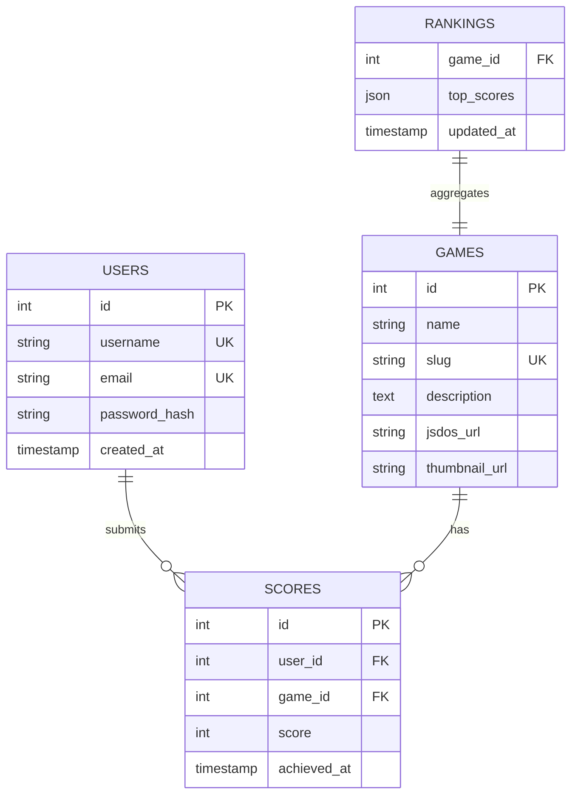
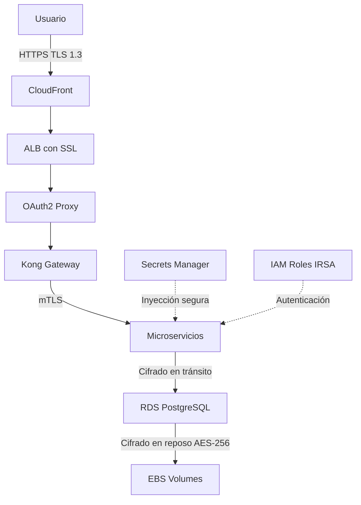
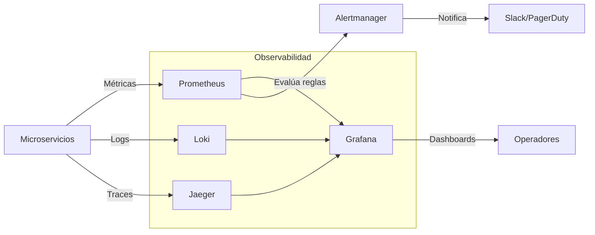
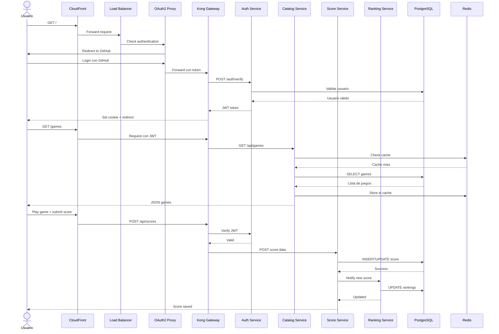
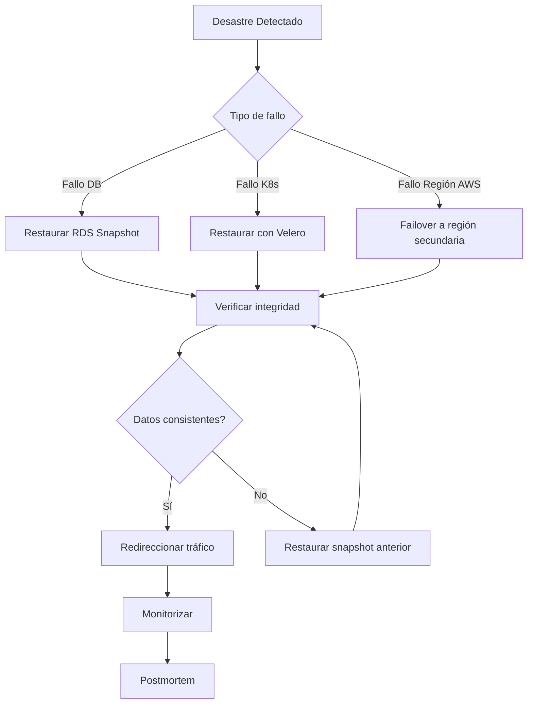
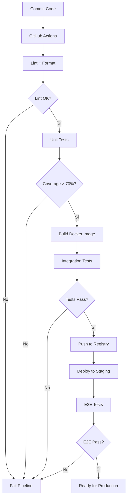
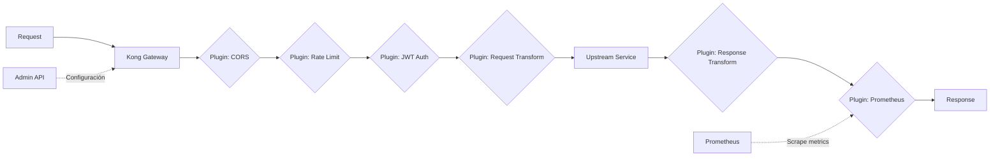
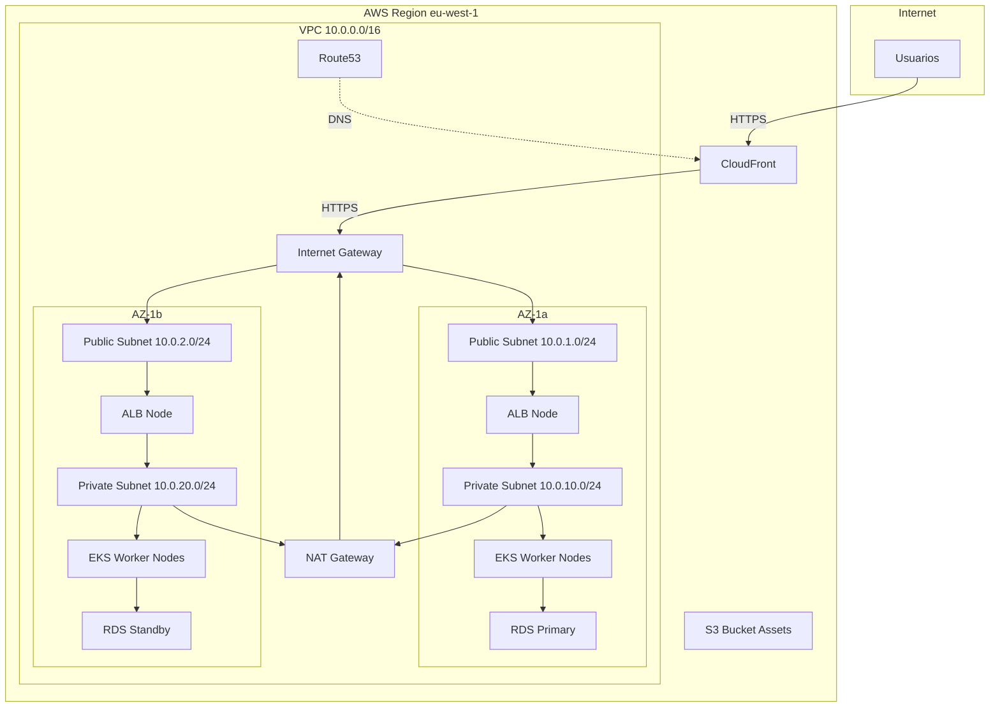
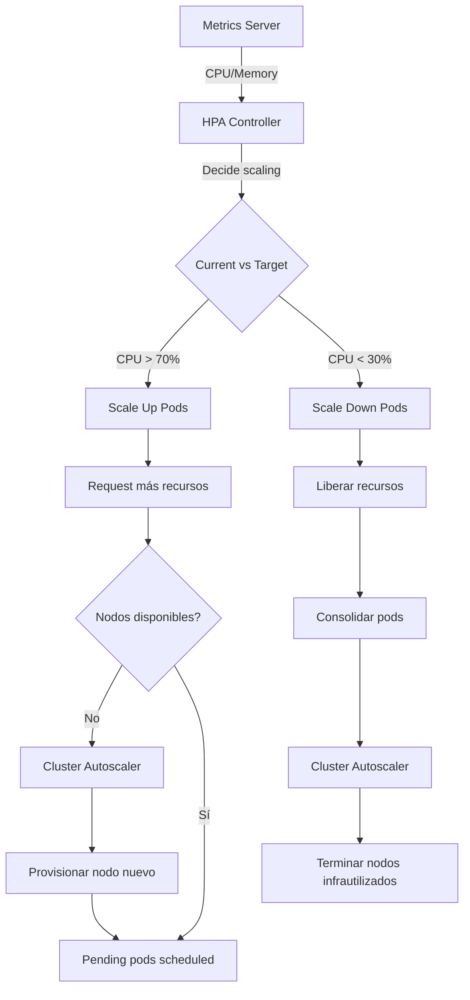
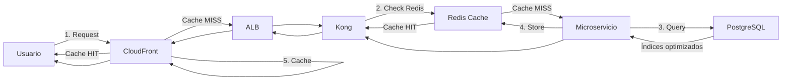

# 🤖 Análisis Inteligente de Documentación

**Fecha**: 2025-11-23 13:47:36  
**Generado por**: Claude Sonnet 4.5  
**Puntuación General**: 6.8/10

## 📊 Resumen Ejecutivo

Documentación bien estructurada pero con gaps críticos: falta arquitectura de datos (esquemas DB), guías de monitorización operativa, documentación de seguridad, disaster recovery y estrategias de testing. Necesita consolidación de archivos duplicados y diagramas técnicos detallados.

## 🎯 Mejoras Prioritarias

### Prioridad Alta ⚡

#### Documentar Esquemas de Base de Datos y Modelo de Datos

**Categoría**: content  
**Descripción**: Falta completamente la documentación de los esquemas de base de datos PostgreSQL para cada servicio. Es crítico documentar las tablas, relaciones, índices y constraints para entender la persistencia de datos.  
**Razón**: Los desarrolladores necesitan entender el modelo de datos para contribuir efectivamente. Sin esta documentación es imposible entender las relaciones entre servicios y diseñar migraciones.  

**Archivos a crear**: architecture/data-model.mdx, services/database-schemas.mdx  

**Diagrama propuesto**:

---

#### Crear Sección de Seguridad y Compliance

**Categoría**: new_section  
**Descripción**: No existe documentación sobre prácticas de seguridad, gestión de secretos, políticas de acceso IAM, cifrado de datos en tránsito/reposo, cumplimiento GDPR o auditoría de seguridad.  
**Razón**: La seguridad es fundamental en producción. Sin esta documentación, el equipo no puede auditar, cumplir normativas ni responder a incidentes de seguridad de forma efectiva.  

**Archivos a crear**: security/overview.mdx, security/secrets-management.mdx, security/iam-policies.mdx, security/data-protection.mdx, security/security-checklist.mdx  
**Archivos a modificar**: index.mdx  

**Diagrama propuesto**:

---

#### Documentar Estrategia de Monitorización y Observabilidad

**Categoría**: content  
**Descripción**: Existe infrastructure/monitoring.mdx pero está vacío o incompleto. Falta documentar métricas clave, alertas, dashboards, logging centralizado y tracing distribuido.  
**Razón**: Sin monitorización efectiva es imposible mantener SLAs, diagnosticar problemas en producción o tomar decisiones basadas en datos. Es un gap operativo crítico.  

**Archivos a crear**: operations/monitoring-guide.mdx, operations/alerting.mdx, operations/logging.mdx, operations/dashboards.mdx  
**Archivos a modificar**: infrastructure/monitoring.mdx  

**Diagrama propuesto**:

---

#### Crear Diagrama de Flujo Completo de Datos

**Categoría**: diagrams  
**Descripción**: Falta un diagrama que muestre el flujo end-to-end desde que un usuario hace login hasta que juega y guarda un score, incluyendo todos los servicios, bases de datos y cachés involucrados.  
**Razón**: Un diagrama de flujo completo ayuda a nuevos desarrolladores a entender rápidamente cómo interactúan todos los componentes del sistema en escenarios reales.  

**Archivos a modificar**: sequence-diagrams.mdx  

**Diagrama propuesto**:

---

#### Crear Documentación de Disaster Recovery y Backup

**Categoría**: new_section  
**Descripción**: No existe documentación sobre estrategias de backup, restauración de datos, RTO/RPO, procedimientos de failover o planes de continuidad de negocio.  
**Razón**: En producción es inevitable tener incidentes. Sin un plan documentado de DR, el tiempo de recuperación será mucho mayor y puede haber pérdida de datos críticos.  

**Archivos a crear**: operations/disaster-recovery.mdx, operations/backup-restore.mdx, operations/incident-response.mdx  

**Diagrama propuesto**:

---

### Prioridad Media 📌

#### Documentar Estrategia de Testing y QA

**Categoría**: content  
**Descripción**: No hay documentación sobre pruebas unitarias, de integración, e2e, cobertura de código, estrategias de testing o pipelines de QA.  
**Razón**: La calidad del código debe ser verificable y automatizada. Sin estrategia de testing clara, aumenta el riesgo de bugs en producción y disminuye la confianza en deployments.  

**Archivos a crear**: development/testing-strategy.mdx, development/unit-tests.mdx, development/integration-tests.mdx, development/e2e-tests.mdx  

**Diagrama propuesto**:

---

#### Consolidar Documentación Duplicada de Desarrollo

**Categoría**: structure  
**Descripción**: Existen desarrollo-local.mdx y development.mdx con contenido potencialmente duplicado o inconsistente. Deben consolidarse en una estructura clara.  
**Razón**: La duplicación de documentación causa confusión y divergencia de contenido. Es mejor tener una sola fuente de verdad para desarrollo local.  

**Archivos a modificar**: desarrollo-local.mdx  

---

#### Documentar API Gateway Kong en Detalle

**Categoría**: content  
**Descripción**: Existe api-reference/kong.mdx y api-reference/kong-config.mdx pero falta documentación sobre configuración de rate limiting, CORS, autenticación, plugins personalizados y troubleshooting de Kong.  
**Razón**: Kong es el punto de entrada crítico del sistema. Documentar su configuración avanzada es esencial para troubleshooting, optimización y seguridad.  

**Archivos a crear**: infrastructure/kong-advanced.mdx, infrastructure/kong-plugins.mdx  
**Archivos a modificar**: api-reference/kong.mdx  

**Diagrama propuesto**:

---

#### Crear Diagrama de Arquitectura de Red AWS

**Categoría**: diagrams  
**Descripción**: Falta un diagrama detallado que muestre VPCs, subnets, security groups, NACLs, route tables y flujo de tráfico en la infraestructura AWS.  
**Razón**: Entender la topología de red es crucial para troubleshooting de conectividad, optimización de latencia y configuración de seguridad a nivel de red.  

**Archivos a modificar**: infrastructure/networking.mdx  

**Diagrama propuesto**:

---

#### Documentar Procedimientos de Escalado y Auto-scaling

**Categoría**: content  
**Descripción**: Falta documentación sobre HPA (Horizontal Pod Autoscaler), métricas de escalado, límites de recursos, estrategias de escalado de RDS y dimensionamiento de nodos EKS.  
**Razón**: El escalado eficiente es clave para mantener performance bajo carga variable y optimizar costos. Sin documentación clara, el sistema puede estar sobre o sub-provisionado.  

**Archivos a crear**: operations/scaling.mdx, operations/capacity-planning.mdx  

**Diagrama propuesto**:

---

#### Crear Guía de Performance y Optimización

**Categoría**: new_section  
**Descripción**: No existe documentación sobre benchmarks, optimización de queries, caché strategies, CDN optimization o best practices de performance.  
**Razón**: La performance es un factor crítico de experiencia de usuario. Documentar estrategias de optimización permite mantener latencias bajas y reducir costos de infraestructura.  

**Archivos a crear**: operations/performance.mdx, operations/caching-strategy.mdx, operations/cdn-optimization.mdx  

**Diagrama propuesto**:

---

### Prioridad Baja 💡

#### Estandarizar Formato de Frontmatter en Todos los MDX

**Categoría**: quality  
**Descripción**: Los archivos MDX tienen formatos inconsistentes en el frontmatter. Algunos usan 'icon', otros no, las descripciones varían en longitud. Debe haber un estándar documentado.  
**Razón**:   

**Archivos a crear**: contributing/documentation-style-guide.mdx  

---

---
*Análisis generado automáticamente*
