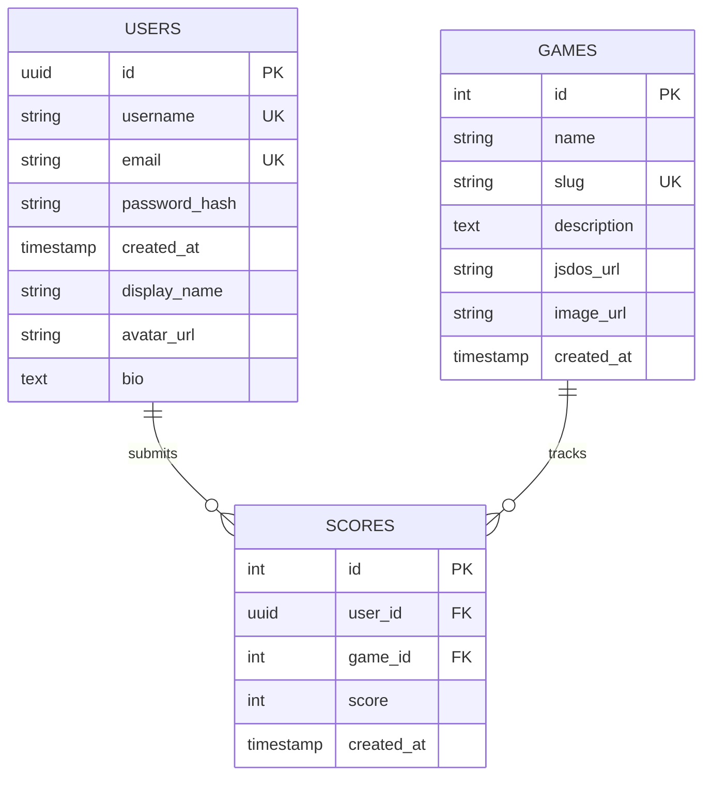

# 🤖 Análisis Inteligente de Documentación

**Fecha**: 2025-11-23 15:12:12  
**Generado por**: Claude Sonnet 4.5  
**Puntuación General**: 6.8/10

## 📊 Resumen Ejecutivo

Documentación sólida pero fragmentada. Falta cohesión entre servicios, diagramas de despliegue completos y guías de monitorización. Estructura dispersa con duplicación entre api-reference y services. Gaps críticos en troubleshooting de producción y recovery.

## 🎯 Mejoras Prioritarias


### Prioridad Alta ⚡

#### Consolidar documentación duplicada de servicios

**Categoría**: structure  
**Descripción**: Existe duplicación entre /services/ y /api-reference/ para cada microservicio. Los archivos en services/ son más descriptivos mientras que api-reference/ tiene endpoints específicos. Se debe consolidar en una estructura unificada donde cada servicio tenga una página principal con overview y enlaces a sus endpoints específicos.  
**Razón**: La duplicación confunde a los desarrolladores y dificulta el mantenimiento. Una estructura clara servicios->endpoints mejora la navegación y evita información contradictoria.  

**Archivos a crear**: services/overview.mdx  
**Archivos a modificar**: services/auth-service.mdx, services/user-service.mdx, services/game-catalog.mdx, services/score-service.mdx, services/ranking-service.mdx  

---

#### Diagrama de arquitectura de componentes por capas

**Categoría**: diagrams  
**Descripción**: Falta un diagrama que muestre claramente las capas de la arquitectura: capa de entrada (CloudFront, ALB), capa de gateway (Kong, OAuth2 Proxy), capa de aplicación (microservicios), capa de datos (RDS, S3), y capa de infraestructura (EKS, VPC). El diagrama actual en architecture.mdx es demasiado simplificado.  
**Razón**: Un diagrama por capas facilita entender la separación de responsabilidades, flujo de datos y ayuda en troubleshooting identificando en qué capa ocurre un problema.  

**Archivos a modificar**: architecture.mdx  

**Diagrama propuesto**:
```mermaid
graph TB subgraph Internet[Capa de Internet] CF[CloudFront CDN<br/>Activos estáticos y juegos] R53[Route53<br/>retrogamehub.com] end subgraph Ingreso[Capa de Ingreso - AWS] ALB[Application Load Balancer<br/>SSL/TLS Terminación] OAuth[OAuth2 Proxy<br/>GitHub Authentication] end subgraph Gateway[Capa API Gateway] Kong[Kong Gateway<br/>Rate Limiting, CORS, Routing] end subgraph Aplicacion[Capa de Aplicación - EKS] Auth[Auth Service:3001<br/>JWT, Registro, Login] User[User Service:3002<br/>Perfiles, Preferencias] Catalog[Game Catalog:3003<br/>Gestión de juegos] Score[Score Service:3004<br/>Puntuaciones] Ranking[Ranking Service:3005<br/>Leaderboards] Frontend[Frontend:80<br/>React + JS-DOS] end subgraph Datos[Capa de Datos] RDS[(RDS PostgreSQL<br/>Datos relacionales)] S3[(S3 Bucket<br/>Archivos .jsdos)] end subgraph Infra[Capa de Infraestructura] EKS[EKS Cluster<br/>Kubernetes 1.28] VPC[VPC<br/>Redes privadas] Secrets[Secrets Manager<br/>Credenciales] end R53 --> CF R53 --> ALB CF --> ALB ALB --> OAuth OAuth --> Kong Kong --> Auth Kong --> User Kong --> Catalog Kong --> Score Kong --> Ranking Kong --> Frontend Auth --> RDS User --> RDS Catalog --> RDS Catalog --> S3 Score --> RDS Ranking --> RDS Frontend --> S3 Auth -.-> EKS User -.-> EKS Catalog -.-> EKS Score -.-> EKS Ranking -.-> EKS Frontend -.-> EKS EKS -.-> VPC Auth -.-> Secrets User -.-> Secrets Catalog -.-> Secrets Score -.-> Secrets Ranking -.-> Secrets
```


---

#### Documentación de monitorización y observabilidad

**Categoría**: content  
**Descripción**: El archivo infrastructure/monitoring.mdx está mencionado pero falta contenido detallado sobre métricas clave, dashboards, alertas y logs. Es crítico para producción documentar qué métricas monitorizar por servicio, umbrales de alerta, y cómo acceder a logs centralizados.  
**Razón**: Sin observabilidad adecuada es imposible detectar y resolver problemas en producción. Los equipos necesitan saber qué monitorizar y cómo reaccionar ante alertas.  

**Archivos a crear**: infrastructure/logging.mdx, infrastructure/alerting.mdx  
**Archivos a modificar**: infrastructure/monitoring.mdx  

---

#### Procedimientos de recuperación ante desastres completos

**Categoría**: content  
**Descripción**: infrastructure/backup-recovery.mdx necesita expandirse con procedimientos específicos de disaster recovery: RPO/RTO definidos, procedimiento paso a paso de restauración de base de datos desde snapshot, recuperación de configuración de Kong desde Git, recreación de cluster EKS desde Terraform, y simulacros de DR.  
**Razón**: En producción real, la capacidad de recuperarse de un desastre rápidamente es crítica. Los equipos necesitan procedimientos claros y probados, no solo teoría.  

**Archivos a crear**: infrastructure/disaster-recovery-playbook.mdx  
**Archivos a modificar**: infrastructure/backup-recovery.mdx  

---

#### Diagrama de flujo de despliegue CI/CD completo

**Categoría**: diagrams  
**Descripción**: Falta visualización clara del pipeline completo desde commit hasta producción, incluyendo GitHub Actions, construcción de imágenes Docker, push a ECR, actualización de manifiestos, sincronización de ArgoCD y validaciones.  
**Razón**: Los equipos necesitan entender todo el flujo de CI/CD para diagnosticar problemas de despliegue y optimizar tiempos. Un diagrama visual es más efectivo que texto descriptivo.  

**Archivos a modificar**: cicd/overview.mdx  

**Diagrama propuesto**:
```mermaid
graph LR A[Git Push a main] --> B[GitHub Actions Trigger] B --> C{Tests Unitarios} C -->|Failed| D[Notificar error] C -->|Success| E[Build Docker Image] E --> F[Scan de seguridad<br/>Trivy] F -->|Vulnerabilidades| D F -->|Clean| G[Push a ECR] G --> H[Actualizar imagen tag<br/>en repo kubernetes/] H --> I[Commit a repo kubernetes] I --> J[ArgoCD detecta cambio] J --> K{ArgoCD Sync} K --> L[Aplicar manifiestos<br/>a EKS] L --> M[Health Checks] M -->|Failed| N[Rollback automático] M -->|Success| O[Deployment completo] N --> D O --> P[Notificar éxito]
```


---


### Prioridad Media 📌

#### Guía de troubleshooting de producción real

**Categoría**: content  
**Descripción**: troubleshooting.mdx se enfoca en problemas de desarrollo local. Falta documentación de problemas reales de producción: pods en CrashLoopBackOff, OOMKilled, problemas de conectividad entre servicios, latencia alta en base de datos, agotamiento de conexiones RDS, problemas de OAuth2.  
**Razón**: El troubleshooting de producción es radicalmente diferente al local. Los equipos de ops necesitan guías específicas para diagnosticar y resolver incidentes bajo presión.  

**Archivos a crear**: troubleshooting-production.mdx  
**Archivos a modificar**: troubleshooting.mdx  

---

#### Diagrama de red y seguridad

**Categoría**: diagrams  
**Descripción**: Falta visualización de la topología de red: VPC, subnets públicas/privadas, security groups, NACLs, flujo de tráfico entre capas, y reglas de firewall. Esto es crítico para entender y troubleshootear problemas de conectividad.  
**Razón**: La arquitectura de red es fundamental para seguridad y troubleshooting. Un diagrama visual permite entender rápidamente flujos permitidos y posibles puntos de fallo en conectividad.  

**Archivos a modificar**: infrastructure/networking.mdx  

**Diagrama propuesto**:
```mermaid
graph TB subgraph VPC[VPC 10.0.0.0/16] subgraph PublicSubnets[Subnets Públicas] PubA[Public Subnet A<br/>10.0.1.0/24<br/>AZ us-east-1a] PubB[Public Subnet B<br/>10.0.2.0/24<br/>AZ us-east-1b] ALB[ALB<br/>Security Group:<br/>0.0.0.0/0:443] end subgraph PrivateSubnets[Subnets Privadas] PrivA[Private Subnet A<br/>10.0.10.0/24<br/>AZ us-east-1a] PrivB[Private Subnet B<br/>10.0.11.0/24<br/>AZ us-east-1b] EKS[EKS Worker Nodes<br/>Security Group:<br/>ALB:8000-8080] end subgraph DataSubnets[Subnets de Datos] DataA[Data Subnet A<br/>10.0.20.0/24<br/>AZ us-east-1a] DataB[Data Subnet B<br/>10.0.21.0/24<br/>AZ us-east-1b] RDS[(RDS PostgreSQL<br/>Security Group:<br/>EKS:5432)] end IGW[Internet Gateway] NAT[NAT Gateway] end Internet[Internet] --> IGW IGW --> PubA IGW --> PubB PubA --> ALB PubB --> ALB PubA --> NAT NAT --> PrivA NAT --> PrivB ALB --> EKS EKS --> RDS
```


---

#### Guía de desarrollo de nuevos microservicios

**Categoría**: new_section  
**Descripción**: Falta documentación sobre cómo agregar un nuevo microservicio al sistema siguiendo los patrones establecidos. Esto incluye estructura de código, configuración de Kong, manifiestos K8s, CI/CD, y registro en ArgoCD.  
**Razón**: Facilita que nuevos desarrolladores contribuyan manteniendo consistencia en patrones arquitectónicos, reduce tiempo de onboarding y evita divergencias en estándares de código e infraestructura.  

**Archivos a crear**: development/new-microservice-guide.mdx  

---

#### Documentación de esquema de base de datos completo

**Categoría**: content  
**Descripción**: infrastructure/database-schema.mdx necesita expandirse con todas las tablas, relaciones, índices, constraints y ejemplos de queries comunes. Actualmente es muy básico.  
**Razón**: El esquema de base de datos es la piedra angular del sistema. Desarrolladores necesitan entender relaciones para escribir queries eficientes y evitar inconsistencias de datos.  

**Archivos a modificar**: infrastructure/database-schema.mdx  

**Diagrama propuesto**:



---

#### Guía de optimización de rendimiento

**Categoría**: content  
**Descripción**: Falta documentación sobre optimización: caching strategies, índices de BD recomendados, límites de recursos K8s apropiados, configuración de Kong para caching, optimización de imágenes Docker, y métricas de performance a monitorizar.  
**Razón**: La optimización de rendimiento impacta directamente en experiencia de usuario y costos de infraestructura. Guías concretas ayudan a mantener el sistema eficiente conforme crece.  

**Archivos a crear**: performance/optimization-guide.mdx  

---

#### Diagrama de flujo de autenticación OAuth2 detallado

**Categoría**: diagrams  
**Descripción**: Aunque existe diagrama de secuencia de autenticación, falta uno específico para el flujo OAuth2 con GitHub mostrando redirects, tokens, y rol del OAuth2 Proxy.  
**Razón**: OAuth2 es complejo y los desarrolladores necesitan entender el flujo completo para troubleshootear problemas de autenticación y configurar correctamente callbacks y scopes.  

**Archivos a modificar**: infrastructure/oauth2-authentication.mdx  

**Diagrama propuesto**:
```mermaid
sequenceDiagram participant Usuario participant Navegador participant OAuth2Proxy participant GitHub participant AuthService participant Frontend Usuario->>Navegador: Accede a retrogamehub.com Navegador->>OAuth2Proxy: GET / OAuth2Proxy->>OAuth2Proxy: Verifica cookie de sesión alt Sin sesión OAuth2Proxy->>Navegador: Redirect a /oauth2/start Navegador->>OAuth2Proxy: GET /oauth2/start OAuth2Proxy->>GitHub: Redirect con client_id y scopes GitHub->>Usuario: Solicita autorización Usuario->>GitHub: Aprueba acceso GitHub->>OAuth2Proxy: Redirect con code OAuth2Proxy->>GitHub: POST /access_token con code GitHub->>OAuth2Proxy: access_token OAuth2Proxy->>GitHub: GET /user con token GitHub->>OAuth2Proxy: Datos usuario OAuth2Proxy->>OAuth2Proxy: Crea sesión cookie OAuth2Proxy->>Navegador: Set-Cookie + Redirect a / end Navegador->>Frontend: GET / con cookie Frontend->>AuthService: POST /api/auth/github con cookie header AuthService->>AuthService: Valida o crea usuario AuthService->>Frontend: JWT token Frontend->>Usuario: Aplicación cargada con sesión
```


---


### Prioridad Baja 💡

#### Guía de contribución y estándares de código

**Categoría**: content  
**Descripción**: Falta documentación sobre cómo contribuir al proyecto: proceso de pull requests, estándares de código, testing requirements, convenciones de commits, code review checklist.  
**Razón**: Estándares claros mejoran calidad de código, facilitan code reviews y reducen deuda técnica. Esencial para proyectos con múltiples contribuidores.  

**Archivos a crear**: development/contributing.mdx, development/code-standards.mdx  

---

#### Casos de uso y ejemplos end-to-end

**Categoría**: content  
**Descripción**: Falta documentación de casos de uso completos desde perspectiva de usuario: registro, login, jugar juego, guardar score, ver ranking. Con ejemplos de API calls y respuestas.  
**Razón**: Ejemplos end-to-end ayudan a desarrolladores frontend y consumidores de API a entender flujos completos sin tener que leer documentación de cada endpoint por separado.  

**Archivos a crear**: guides/end-to-end-examples.mdx  

---

#### Limpieza de archivos obsoletos y esenciales de plantilla

**Categoría**: quality  
**Descripción**: Existen archivos que parecen ser de plantilla por defecto y no específicos del proyecto: essentials/markdown.mdx, essentials/code.mdx, essentials/settings.mdx, essentials/images.mdx, essentials/navigation.mdx, development.mdx (genérico de Mintlify).  
**Razón**: Archivos de plantilla genéricos confunden a usuarios y no aportan valor específico al proyecto. Limpiarlos mejora claridad y profesionalismo de la documentación.  


---

#### Revisar y limpiar archivos de AI tools

**Categoría**: quality  
**Descripción**: Los archivos ai-tools/claude-code.mdx, ai-tools/cursor.mdx, ai-tools/windsurf.mdx parecen documentar herramientas de IA usadas en desarrollo. Considerar si esto es relevante para usuarios finales de la documentación o si debe estar en docs internas de equipo.  
**Razón**: Documentar herramientas internas puede distraer de la documentación técnica del sistema. Debe evaluarse relevancia y audiencia objetivo.  


---

#### Documentación de testing y QA

**Categoría**: content  
**Descripción**: Falta documentación sobre estrategia de testing: tests unitarios, de integración, end-to-end, cómo ejecutarlos localmente, coverage esperado, y proceso de QA antes de despliegue.  
**Razón**: Testing robusto previene regresiones y bugs en producción. Documentar estrategia asegura que todos los contribuidores sigan las mismas prácticas de calidad.  

**Archivos a crear**: development/testing-guide.mdx  

---


## 📁 Nuevas Secciones Propuestas

### Guías de Operaciones

Sección dedicada a procedimientos operativos diarios: despliegues, rollbacks, escalado, mantenimiento de BD, rotación de secrets, y procedimientos de emergencia.  

**Archivos**:
- `operations/daily-procedures.mdx`: Procedimientos Diarios de Operaciones  
- `operations/scaling-guide.mdx`: Guía de Escalado de Servicios  
- `operations/rollback-procedures.mdx`: Procedimientos de Rollback  

### Seguridad y Compliance

Documentación de políticas de seguridad, mejores prácticas, auditorías, gestión de vulnerabilidades y compliance con estándares.  

**Archivos**:
- `security/security-policies.mdx`: Políticas de Seguridad  
- `security/vulnerability-management.mdx`: Gestión de Vulnerabilidades  
- `security/audit-logging.mdx`: Auditoría y Logging de Seguridad  

### Análisis de Costos

Documentación sobre optimización de costos AWS, análisis de gasto por servicio, estrategias de ahorro y forecasting.  

**Archivos**:
- `cost-management/cost-breakdown.mdx`: Desglose de Costos AWS  
- `cost-management/optimization-strategies.mdx`: Estrategias de Optimización de Costos  


## 📈 Diagramas Requeridos

### Mapa de dependencias entre microservicios

**Tipo**: component  
**Ubicación**: architecture.mdx  
**Descripción**: Diagrama que muestra qué servicios dependen de otros, qué bases de datos usan, qué secrets necesitan, y qué puertos exponen. Ayuda a entender el impacto de cambios.  

graph TD Frontend[Frontend:80

### Diagrama

**Tipo**: N/A  
**Ubicación**: N/A  
**Descripción**:   

### Diagrama

**Tipo**: N/A  
**Ubicación**: N/A  
**Descripción**:   

### Diagrama

**Tipo**: N/A  
**Ubicación**: N/A  
**Descripción**:   


---
*Análisis generado automáticamente*
