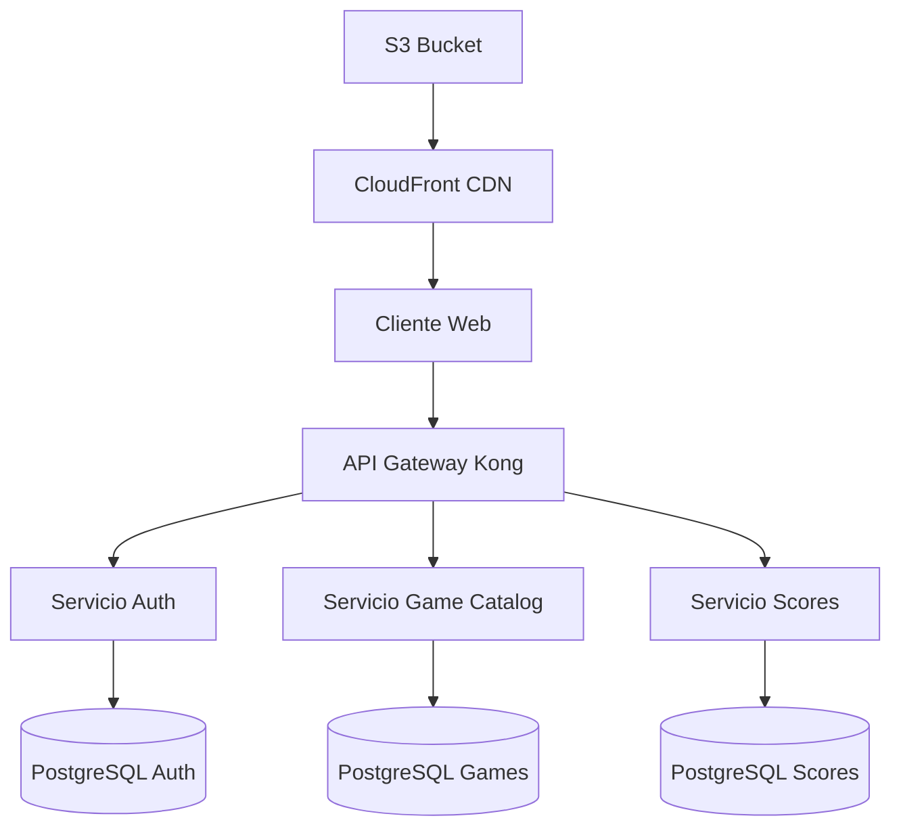

# 8.5. Guía de Estilo para Documentación

Esta guía establece los estándares y convenciones para mantener consistencia en toda la documentación técnica de RetroGameCloud.

## Estructura de Frontmatter

Todos los archivos MDX deben incluir frontmatter completo con los siguientes campos obligatorios:

```yaml
---
title: "X.Y. Nombre del Documento"
description: "Descripción concisa del contenido (máximo 160 caracteres)"
icon: "icon-name"
---
```

<Tabs>
<Tab title="Iconos Recomendados">
- `rocket`: Primeros pasos y configuración inicial
- `building-columns`: Arquitectura y diseño del sistema
- `browser`: Frontend y interfaces de usuario
- `server`: Backend y microservicios
- `shield-check`: Seguridad y autenticación
- `cloud`: Infraestructura y AWS
- `workflow`: CI/CD y automatización
- `code`: Desarrollo y herramientas
- `book-open`: Documentación y guías
</Tab>
<Tab title="Ejemplo Completo">
```yaml
---
title: "6.3. Configuración de EKS"
description: "Guía completa para configurar y desplegar el clúster de Kubernetes en AWS EKS"
icon: "cloud"
---
```
</Tab>
</Tabs>

## Jerarquía de Encabezados

<Warning>
Sigue estrictamente esta jerarquía para mantener la estructura SEO y navegación consistente.
</Warning>

- **H1 (`#`)**: Título principal del documento (solo uno por archivo)
- **H2 (`##`)**: Secciones principales
- **H3 (`###`)**: Subsecciones dentro de cada sección
- **H4 (`####`)**: Detalles específicos (usar con moderación)

```markdown
# 4.2. Microservicio de Autenticación

## Configuración del Servicio

### Variables de Entorno

#### Configuración de Base de Datos
```

## Uso de Callouts

<Tabs>
<Tab title="Tipos de Callouts">
- **`<Warning>`**: Para información crítica, errores comunes o configuraciones que pueden romper el sistema
- **`<Note>`**: Para información adicional, aclaraciones o contexto importante
- **`<Tip>`**: Para mejores prácticas, optimizaciones o consejos útiles
- **`<Info>`**: Para información general o referencias adicionales
</Tab>
<Tab title="Ejemplos de Uso">
```markdown
<Warning>
Este comando eliminará permanentemente todos los datos de la base de datos.
</Warning>

<Note>
El puerto 3000 debe estar disponible antes de iniciar el servidor de desarrollo.
</Note>

<Tip>
Utiliza variables de entorno para gestionar configuraciones sensibles.
</Tip>

<Info>
Consulta la documentación oficial de AWS para obtener más detalles sobre IAM.
</Info>
```
</Tab>
</Tabs>

## Formato de Bloques de Código

<Warning>
Siempre especifica el lenguaje en los bloques de código para el resaltado de sintaxis.
</Warning>

### Lenguajes Comunes

<Tabs>
<Tab title="Backend">
```javascript
// Ejemplo de configuración Express
const express = require('express');
const app = express();

app.get('/health', (req, res) => {
  res.json({ status: 'OK' });
});
```

```dockerfile
FROM node:18-alpine
WORKDIR /app
COPY package*.json ./
RUN npm ci --only=production
```
</Tab>
<Tab title="Frontend">
```jsx
// Componente React
import React from 'react';

const GameCard = ({ game }) => {
  return (
    <div className="game-card">
      <h3>{game.title}</h3>
      <p>{game.description}</p>
    </div>
  );
};
```

```css
.game-card {
  border-radius: 8px;
  box-shadow: 0 2px 8px rgba(0, 0, 0, 0.1);
  padding: 1rem;
}
```
</Tab>
<Tab title="Infraestructura">
```yaml
# Kubernetes Deployment
apiVersion: apps/v1
kind: Deployment
metadata:
  name: auth-service
spec:
  replicas: 3
  selector:
    matchLabels:
      app: auth-service
```

```bash
# Comandos de despliegue
kubectl apply -f deployment.yaml
kubectl rollout status deployment/auth-service
```
</Tab>
</Tabs>

## Componentes de Mintlify

### Cards y CardGroup

Utiliza `<Card>` para destacar enlaces importantes o secciones relacionadas:

```markdown
<CardGroup cols={2}>
  <Card title="Configuración Local" icon="laptop-code" href="/development/local-setup">
    Guía para configurar el entorno de desarrollo local
  </Card>
  <Card title="Despliegue en AWS" icon="cloud" href="/infrastructure/aws-deployment">
    Instrucciones para desplegar en producción
  </Card>
</CardGroup>
```

### Steps para Procesos

Para procedimientos paso a paso, utiliza el componente `<Steps>`:

```markdown
<Steps>
  <Step title="Instalar dependencias">
    Ejecuta `npm install` en el directorio raíz del proyecto.
  </Step>
  <Step title="Configurar variables">
    Copia `.env.example` a `.env` y configura las variables necesarias.
  </Step>
  <Step title="Iniciar servicios">
    Ejecuta `docker-compose up -d` para iniciar los servicios de base de datos.
  </Step>
</Steps>
```

## Gestión de Imágenes

### Convención de Nombres

<Note>
Todas las imágenes deben almacenarse en el directorio `/images` con nombres descriptivos.
</Note>

Estructura de nombres:
```
/images/
  ├── architecture/
  │   ├── microservices-overview.png
  │   └── aws-infrastructure-diagram.png
  ├── frontend/
  │   ├── game-library-interface.png
  │   └── user-dashboard-mockup.png
  └── deployment/
      ├── kubernetes-dashboard.png
      └── cicd-pipeline-flow.png
```

### Uso en Documentación

```markdown


<Note>
Mantén las imágenes en formato PNG para capturas de pantalla y SVG para diagramas vectoriales.
</Note>
```

## Diagramas con Mermaid

Para diagramas técnicos, utiliza la sintaxis Mermaid:



<Tip>
Utiliza colores consistentes: azul para servicios, verde para bases de datos, naranja para infraestructura AWS.
</Tip>

## Validación Automática

### Pre-commit Hooks

El proyecto incluye validación automática mediante pre-commit hooks:

```yaml
# .pre-commit-config.yaml
repos:
  - repo: local
    hooks:
      - id: mdx-lint
        name: MDX Linter
        entry: npm run lint:mdx
        language: system
        files: \.mdx$
```

### Reglas de Validación

<Warning>
Los siguientes elementos son validados automáticamente y causarán errores en el commit si no se cumplen.
</Warning>

- ✅ Frontmatter completo (title, description, icon)
- ✅ Numeración correcta en títulos (formato X.Y.)
- ✅ Lenguaje especificado en bloques de código
- ✅ Cierre correcto de componentes (`<Tab>` debe tener `</Tab>`)
- ✅ Imágenes existentes en rutas referenciadas
- ✅ Enlaces internos válidos

## Lista de Verificación

Antes de crear o modificar documentación, verifica:

<Steps>
  <Step title="Frontmatter">
    ✅ Título con numeración correcta (X.Y.)
    ✅ Descripción concisa y clara
    ✅ Icono apropiado para el contenido
  </Step>
  <Step title="Estructura">
    ✅ Jerarquía de encabezados correcta
    ✅ Uso apropiado de callouts
    ✅ Componentes Mintlify cerrados correctamente
  </Step>
  <Step title="Código e Imágenes">
    ✅ Bloques de código con lenguaje especificado
    ✅ Imágenes con nombres descriptivos
    ✅ Diagramas Mermaid bien formateados
  </Step>
  <Step title="Validación">
    ✅ Pre-commit hooks ejecutados sin errores
    ✅ Enlaces internos y externos verificados
    ✅ Ortografía y gramática revisadas
  </Step>
</Steps>

<Info>
Esta guía evoluciona con el proyecto. Propón mejoras mediante pull requests al repositorio de documentación.
</Info>
</Note>
</Warning>
</Info>
</Tip>
</Card>
</Steps>