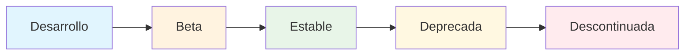
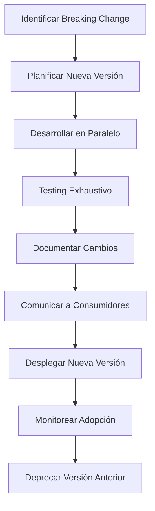

# 4.5. Versionado de APIs y Compatibilidad

Esta guía documenta la estrategia completa de versionado de APIs REST para los microservicios de RetroGameCloud, incluyendo políticas de deprecación, manejo de breaking changes y compatibilidad hacia atrás.

## Estrategia de Versionado

### Formato de Versionado

<Tabs>
<Tab title="URL Path Versioning">
```bash
# Estructura recomendada
https://api.retrogamecloud.com/v1/auth/login
https://api.retrogamecloud.com/v1/games
https://api.retrogamecloud.com/v2/user/profile
https://api.retrogamecloud.com/v2/ranking

# Configuración Kong
curl -X POST http://kong-admin:8001/services \
  --data name=game-catalog-v1 \
  --data url=http://game-catalog:3000/v1

curl -X POST http://kong-admin:8001/routes \
  --data service.name=game-catalog-v1 \
  --data paths[]=/v1/games
```
</Tab>
<Tab title="Header Versioning">
```bash
# Header de versión
curl -H "API-Version: v2" \
     -H "Accept: application/vnd.retrogamecloud.v2+json" \
     https://api.retrogamecloud.com/games

# Implementación en microservicio
app.use((req, res, next) => {
  const version = req.headers['api-version'] || 'v1';
  req.apiVersion = version;
  next();
});
```
</Tab>
<Tab title="Content Negotiation">
```bash
# Accept header con versión
curl -H "Accept: application/vnd.retrogamecloud.v2+json" \
     https://api.retrogamecloud.com/games

# Respuesta con versión
HTTP/1.1 200 OK
Content-Type: application/vnd.retrogamecloud.v2+json
API-Version: v2
```
</Tab>
</Tabs>

### Esquema de Numeración

<Note>
RetroGameCloud utiliza **versionado semántico simplificado** con formato `vX` donde X es un número entero incremental.
</Note>

```yaml
# Incremento de versiones
v1: Versión inicial estable
v2: Breaking changes mayores
v3: Reestructuración significativa

# Criterios para nueva versión mayor
- Cambios en estructura de respuesta
- Eliminación de campos existentes
- Modificación de tipos de datos
- Cambios en autenticación/autorización
```

## Política de Deprecación

### Ciclo de Vida de Versiones

<Tabs>
<Tab title="Fases del Ciclo">

</Tab>
<Tab title="Tiempos de Soporte">
```yaml
# Política de soporte temporal
Versión Estable: Soporte completo indefinido
Versión Deprecada: 12 meses de soporte
Versión Descontinuada: 6 meses adicionales (solo bugs críticos)

# Comunicación de cambios
- 6 meses antes: Anuncio de deprecación
- 3 meses antes: Notificaciones por email
- 1 mes antes: Headers de advertencia en respuestas
```
</Tab>
<Tab title="Headers de Deprecación">
```bash
# Headers automáticos en versiones deprecadas
HTTP/1.1 200 OK
Warning: 299 - "This API version is deprecated"
Deprecation: true
Sunset: Sat, 31 Dec 2024 23:59:59 GMT
Link: <https://api.retrogamecloud.com/v2/games>; rel="successor-version"
```
</Tab>
</Tabs>

## Manejo de Breaking Changes

### Proceso de Introducción

<Warning>
Los breaking changes requieren **nueva versión mayor** y seguimiento del proceso establecido.
</Warning>

<Tabs>
<Tab title="Proceso Completo">

</Tab>
<Tab title="Checklist de Validación">
```yaml
Breaking Changes Checklist:
  □ Nueva versión mayor creada
  □ Documentación actualizada
  □ Tests de compatibilidad ejecutados
  □ Guía de migración creada
  □ Comunicación enviada (email/Slack)
  □ Kong configurado para enrutamiento
  □ Monitoreo configurado
  □ Plan de rollback preparado
```
</Tab>
<Tab title="Implementación Gradual">
```javascript
// Middleware para A/B testing de versiones
const versionMiddleware = (req, res, next) => {
  const clientVersion = req.headers['api-version'] || 'v1';
  const rolloutPercentage = process.env.V2_ROLLOUT_PERCENTAGE || 0;
  
  // Gradual rollout para nuevos usuarios
  if (clientVersion === 'v1' && Math.random() * 100 < rolloutPercentage) {
    req.forceVersion = 'v2';
    res.set('API-Version-Override', 'v2');
  }
  
  next();
};
```
</Tab>
</Tabs>

## Versionado de Contratos OpenAPI

### Estructura de Documentación

<Tabs>
<Tab title="Organización de Archivos">
```bash
docs/
├── openapi/
│   ├── v1/
│   │   ├── auth-service.yaml
│   │   ├── game-catalog.yaml
│   │   ├── user-service.yaml
│   │   └── score-service.yaml
│   ├── v2/
│   │   ├── auth-service.yaml
│   │   ├── game-catalog.yaml
│   │   └── user-service.yaml
│   └── common/
│       ├── components.yaml
│       └── security-schemes.yaml
```
</Tab>
<Tab title="Metadatos de Versión">
```yaml
# openapi/v2/game-catalog.yaml
openapi: 3.0.3
info:
  title: Game Catalog API
  version: 2.0.0
  description: |
    Servicio de catálogo de juegos retro - Versión 2
    
    **Cambios principales desde v1:**
    - Nuevo campo `tags` en respuesta de juegos
    - Eliminado campo `deprecated_categories`
    - Paginación mejorada con cursors
  contact:
    name: RetroGameCloud API Team
    email: api-support@retrogamecloud.com
  x-api-lifecycle: stable
  x-predecessor-version: "1.0.0"
  x-sunset-date: "2025-12-31"
```
</Tab>
<Tab title="Generación Automática">
```yaml
# .github/workflows/openapi-docs.yml
name: Generate OpenAPI Docs
on:
  push:
    paths: ['src/routes/**', 'docs/openapi/**']

jobs:
  generate-docs:
    runs-on: ubuntu-latest
    steps:
      - uses: actions/checkout@v3
      - name: Generate OpenAPI specs
        run: |
          # Generar desde código fuente
          swagger-jsdoc -d docs/openapi/v2/base.yaml src/routes/v2/*.js > docs/openapi/v2/game-catalog.yaml
          
          # Validar especificaciones
          swagger-codegen validate -i docs/openapi/v2/game-catalog.yaml
          
          # Generar documentación estática
          redoc-cli build docs/openapi/v2/game-catalog.yaml --output public/docs/v2/game-catalog.html
```
</Tab>
</Tabs>

## Compatibilidad hacia Atrás

### Estrategias de Mantenimiento

<Tabs>
<Tab title="Adaptadores de Respuesta">
```javascript
// middleware/version-adapter.js
const responseAdapters = {
  'v1': {
    adaptGameResponse: (gameData) => {
      // Convertir v2 response a formato v1
      return {
        id: gameData.id,
        title: gameData.title,
        category: gameData.categories[0], // v1 solo soporta una categoría
        year: gameData.releaseYear,
        // Omitir campos nuevos como 'tags', 'metadata'
      };
    }
  }
};

app.get('/games/:id', (req, res) => {
  const version = req.apiVersion || 'v2';
  const gameData = await gameService.getGame(req.params.id);
  
  if (version === 'v1') {
    const adaptedData = responseAdapters.v1.adaptGameResponse(gameData);
    res.json(adaptedData);
  } else {
    res.json(gameData);
  }
});
```
</Tab>
<Tab title="Campos Opcionales">
```javascript
// Manejo de campos opcionales para compatibilidad
const gameSchema = {
  v1: {
    required: ['id', 'title', 'category'],
    optional: ['description', 'year']
  },
  v2: {
    required: ['id', 'title', 'categories'], 
    optional: ['description', 'releaseYear', 'tags', 'metadata']
  }
};

// Validación por versión
const validateGameData = (data, version) => {
  const schema = gameSchema[version];
  // Implementar validación específica por versión
};
```
</Tab>
<Tab title="Base de Datos Agnóstica">
```sql
-- Diseño de esquema compatible con múltiples versiones
CREATE TABLE games (
  id UUID PRIMARY KEY,
  title VARCHAR(255) NOT NULL,
  
  -- Campos v1 (legacy)
  category VARCHAR(100),          -- deprecated, usar game_categories
  year INTEGER,                   -- deprecated, usar release_year
  
  -- Campos v2+
  release_year INTEGER,
  created_at TIMESTAMP DEFAULT NOW(),
  updated_at TIMESTAMP DEFAULT NOW(),
  
  -- Metadatos extensibles
  metadata JSONB DEFAULT '{}'::jsonb
);

-- Tabla de categorías (v2+)
CREATE TABLE game_categories (
  game_id UUID REFERENCES games(id),
  category_name VARCHAR(100),
  PRIMARY KEY (game_id, category_name)
);
```
</Tab>
</Tabs>

## Estrategia de Comunicación

### Canales de Notificación

<Tabs>
<Tab title="Comunicación Automatizada">
```javascript
// services/api-communication.js
const notificationService = {
  async notifyDeprecation(version, sunsetDate) {
    const consumers = await getAPIConsumers(version);
    
    for (const consumer of consumers) {
      // Email notification
      await emailService.send({
        to: consumer.email,
        template: 'api-deprecation',
        data: {
          version,
          sunsetDate: sunsetDate.toISOString(),
          migrationGuide: `https://docs.retrogamecloud.com/migration/${version}`
        }
      });
      
      // Slack notification para equipos internos
      if (consumer.isInternal) {
        await slackService.postMessage({
          channel: consumer.slackChannel,
          text: `🚨 API v${version} será deprecada el ${sunsetDate.toLocaleDateString()}`
        });
      }
    }
  }
};
```
</Tab>
<Tab title="Dashboard de Versiones">
```yaml
# Métricas en Grafana dashboard
API Version Usage:
  - Requests por versión (últimos 30 días)
  - Distribución de consumers por versión
  - Tiempo promedio de migración
  - Errores por versión deprecated

Alertas Configuradas:
  - Usage de versión deprecated > 10%
  - Nuevos consumers usando versión deprecated
  - Fallos en migración > 5%
```
</Tab>
<Tab title="Documentación Centralizada">
```markdown
# Portal de desarrolladores
## Estado de Versiones API

| Versión | Estado | Sunset Date | Documentación | Migración |
|---------|--------|-------------|---------------|-----------|
| v1      | 🟡 Deprecated | 2024-12-31 | [Docs v1] | [Guía v1→v2] |
| v2      | 🟢 Stable | - | [Docs v2] | - |
| v3      | 🔵 Beta | - | [Docs v3 Beta] | [Preview v2→v3] |

## Changelog Detallado
- **v2.1.0** (2024-01-15): Nuevos campos metadata en respuesta de juegos
- **v2.0.0** (2023-11-01): Breaking change - reestructuración de categorías
```
</Tab>
</Tabs>

## Ejemplos de Migración

### Migración v1 → v2

<Tabs>
<Tab title="Cambios en Game Catalog">
```javascript
// v1 - Estructura antigua
{
  "id": "game-123",
  "title": "Pac-Man",
  "category": "arcade",      // String único
  "year": 1980,              // Campo year
  "description": "Classic arcade game"
}

// v2 - Nueva estructura  
{
  "id": "game-123",
  "title": "Pac-Man",
  "categories": ["arcade", "classic"],  // Array de categorías
  "releaseYear": 1980,                  // Campo renombrado
  "tags": ["maze", "ghosts"],           // Nuevo campo
  "metadata": {                         // Metadatos extensibles
    "difficulty": "medium",
    "players": "1"
  },
  "description": "Classic arcade game"
}
```
</Tab>
<Tab title="Código de Cliente - Antes">
```javascript
// Cliente v1 - Código existente
async function getGameInfo(gameId) {
  const response = await fetch(`/v1/games/${gameId}`);
  const game = await response.json();
  
  return {
    name: game.title,
    type: game.category,        // Una sola categoría
    releaseYear: game.year,
    info: game.description
  };
}

// Mostrar en UI
const gameInfo = await getGameInfo('pac-man');
console.log(`${gameInfo.name} (${gameInfo.type})`);
```
</Tab>
<Tab title="Código de Cliente - Después">
```javascript
// Cliente v2 - Código actualizado
async function getGameInfo(gameId) {
  const response = await fetch(`/v2/games/${gameId}`);
  const
</Tab>
</Tabs>
```