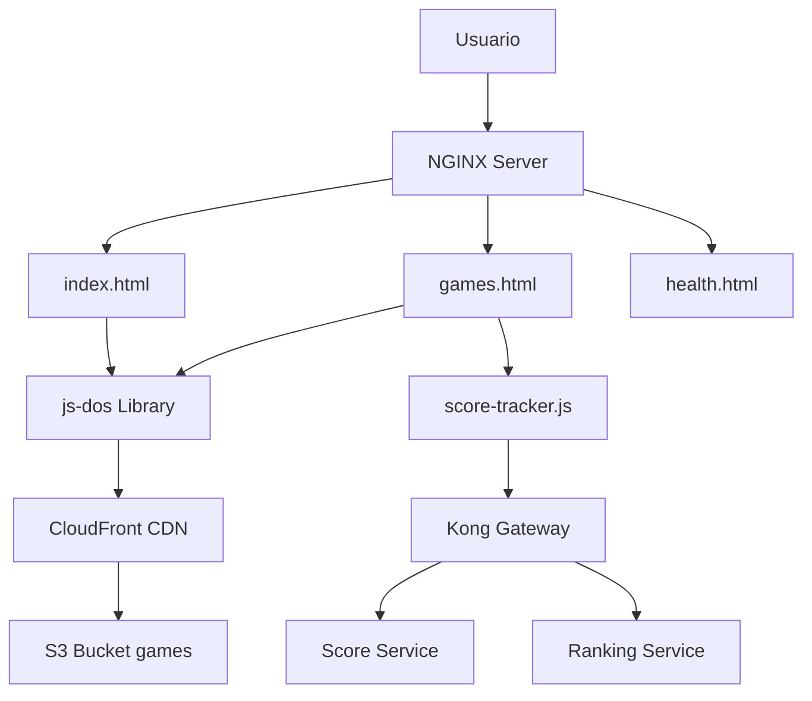

## Visión General

El frontend de Retro Game Hub es una aplicación web estática que permite a los usuarios jugar juegos DOS clásicos directamente en el navegador usando **js-dos**, una implementación de DOSBox compilada a WebAssembly.

## Arquitectura



## Estructura del Proyecto

```
frontend/
├── index.html              # Página principal con catálogo
├── games.html              # Emulador js-dos embebido
├── health.html             # Health check endpoint
├── retro.css               # Estilos retro 80s
├── score-tracker.js        # Integración con backend
├── server.js               # Servidor Express (dev)
├── Dockerfile              # Imagen Docker con NGINX
├── package.json
└── jsdos/                  # Librería js-dos
    ├── js-dos.js           # API principal
    ├── js-dos.css          # Estilos del emulador
    ├── wdosbox.js          # DOSBox WebAssembly
    ├── wlibzip.js          # Librería ZIP
    └── emulators/          # Emuladores compilados
        ├── wdosbox-x.js
        └── types/          # TypeScript definitions
```

## Páginas

### index.html - Catálogo de Juegos

Página principal que muestra el catálogo de juegos disponibles.

```html
<!DOCTYPE html>
<html lang="es">
<head>
    <meta charset="UTF-8">
    <meta name="viewport" content="width=device-width, initial-scale=1.0">
    <title>Retro Game Hub - Juegos Clásicos DOS</title>
    <link rel="stylesheet" href="retro.css">
</head>
<body>
    <header class="header">
        <h1 class="glitch" data-text="RETRO GAME HUB">RETRO GAME HUB</h1>
        <p class="tagline">Revive los clásicos de MS-DOS en tu navegador</p>
    </header>

    <main class="container">
        <div class="game-grid" id="gameGrid">
            <!-- Juegos cargados dinámicamente desde el catálogo -->
        </div>
    </main>

    <script>
        // Cargar catálogo desde API
        async function loadGames() {
            try {
                const response = await fetch('/api/games');
                const games = await response.json();
                renderGames(games);
            } catch (error) {
                console.error('Error loading games:', error);
            }
        }

        function renderGames(games) {
            const grid = document.getElementById('gameGrid');
            games.forEach(game => {
                const card = document.createElement('div');
                card.className = 'game-card';
                card.innerHTML = `
                    
                    <h3>${game.name}</h3>
                    <p>${game.description}</p>
                    <div class="game-meta">
                        <span class="year">${game.year}</span>
                        <span class="genre">${game.genre}</span>
                    </div>
                    <a href="games.html?game=${game.slug}" class="play-btn">
                        JUGAR AHORA
                    </a>
                `;
                grid.appendChild(card);
            });
        }

        // Inicializar
        loadGames();
    </script>
</body>
</html>
```

### games.html - Emulador js-dos

Página que ejecuta el emulador DOSBox con el juego seleccionado.

```html
<!DOCTYPE html>
<html lang="es">
<head>
    <meta charset="UTF-8">
    <meta name="viewport" content="width=device-width, initial-scale=1.0">
    <title>Playing Game - Retro Game Hub</title>
    <link rel="stylesheet" href="retro.css">
    <link rel="stylesheet" href="jsdos/js-dos.css">
    <script src="jsdos/js-dos.js"></script>
    <script src="score-tracker.js"></script>
</head>
<body class="game-page">
    <div class="game-container">
        <div id="jsdos"></div>
        
        <div class="game-controls">
            <button id="fullscreenBtn">Pantalla Completa</button>
            <button id="saveBtn">Guardar Estado</button>
            <button id="loadBtn">Cargar Estado</button>
            <button id="exitBtn">Salir</button>
        </div>
        
        <div class="game-info">
            <h2 id="gameTitle"></h2>
            <div class="stats">
                <div class="stat">
                    <span class="label">Tiempo:</span>
                    <span id="playTime">00:00:00</span>
                </div>
                <div class="stat">
                    <span class="label">Puntuación:</span>
                    <span id="currentScore">0</span>
                </div>
                <div class="stat">
                    <span class="label">Mejor:</span>
                    <span id="bestScore">0</span>
                </div>
            </div>
        </div>
    </div>

    <script>
        // Obtener parámetros de URL
        const urlParams = new URLSearchParams(window.location.search);
        const gameSlug = urlParams.get('game');
        
        // Configuración del emulador
        const dosboxConfig = {
            wdosboxUrl: "jsdos/wdosbox.js",
            cycles: "auto",
            autolock: true
        };

        // Inicializar js-dos
        async function initEmulator() {
            const gameUrl = `/cdn/juegos/${gameSlug}.jsdos`;
            
            try {
                // Crear instancia del emulador
                const dos = await Dos(document.getElementById("jsdos"), dosboxConfig);
                
                // Cargar juego
                const fs = await dos.fs(gameUrl);
                const main = await fs.extract();
                await main.run();
                
                // Iniciar tracking de sesión
                ScoreTracker.startSession(gameSlug);
                
            } catch (error) {
                console.error('Error loading game:', error);
                alert('Error al cargar el juego. Intenta de nuevo.');
            }
        }

        // Controles
        document.getElementById('fullscreenBtn').addEventListener('click', () => {
            const canvas = document.querySelector('canvas');
            if (canvas.requestFullscreen) {
                canvas.requestFullscreen();
            }
        });

        document.getElementById('saveBtn').addEventListener('click', () => {
            // Implementar guardado de estado
            alert('Estado guardado');
        });

        document.getElementById('loadBtn').addEventListener('click', () => {
            // Implementar carga de estado
            alert('Estado cargado');
        });

        document.getElementById('exitBtn').addEventListener('click', () => {
            if (confirm('¿Seguro que quieres salir?')) {
                ScoreTracker.endSession();
                window.location.href = '/';
            }
        });

        // Actualizar timer
        let startTime = Date.now();
        setInterval(() => {
            const elapsed = Date.now() - startTime;
            const hours = Math.floor(elapsed / 3600000);
            const minutes = Math.floor((elapsed % 3600000) / 60000);
            const seconds = Math.floor((elapsed % 60000) / 1000);
            document.getElementById('playTime').textContent = 
                `${hours.toString().padStart(2, '0')}:${minutes.toString().padStart(2, '0')}:${seconds.toString().padStart(2, '0')}`;
        }, 1000);

        // Inicializar
        initEmulator();
    </script>
</body>
</html>
```

### health.html - Health Check

Endpoint para health checks de Kubernetes.

```html
<!DOCTYPE html>
<html>
<head>
    <meta charset="UTF-8">
    <title>Health Check</title>
</head>
<body>
    <script>
        document.write(JSON.stringify({
            status: 'ok',
            timestamp: new Date().toISOString(),
            service: 'frontend'
        }));
    </script>
</body>
</html>
```

## Estilos CSS (retro.css)

Tema retro inspirado en los años 80 con efectos CRT y neón.

```css
/* Variables CSS */
:root {
    --neon-green: #39ff14;
    --neon-pink: #ff10f0;
    --neon-blue: #00ffff;
    --dark-bg: #0a0a0a;
    --grid-color: #1a1a1a;
    --font-mono: 'VT323', 'Courier New', monospace;
}

/* Reset */
* {
    margin: 0;
    padding: 0;
    box-sizing: border-box;
}

body {
    font-family: var(--font-mono);
    background-color: var(--dark-bg);
    color: var(--neon-green);
    min-height: 100vh;
    background-image: 
        repeating-linear-gradient(
            0deg,
            transparent,
            transparent 2px,
            var(--grid-color) 2px,
            var(--grid-color) 4px
        );
    animation: scanlines 8s linear infinite;
}

/* Efecto CRT scanlines */
@keyframes scanlines {
    0% { background-position: 0 0; }
    100% { background-position: 0 100%; }
}

/* Header */
.header {
    text-align: center;
    padding: 4rem 2rem;
    background: linear-gradient(180deg, rgba(57,255,20,0.1) 0%, transparent 100%);
}

.glitch {
    font-size: 4rem;
    font-weight: bold;
    text-transform: uppercase;
    position: relative;
    text-shadow: 
        0 0 10px var(--neon-green),
        0 0 20px var(--neon-green),
        0 0 30px var(--neon-green);
    animation: glitch 1s infinite;
}

@keyframes glitch {
    0%, 90%, 100% {
        transform: translate(0);
    }
    92% {
        transform: translate(-2px, 2px);
    }
    94% {
        transform: translate(2px, -2px);
    }
    96% {
        transform: translate(-2px, -2px);
    }
    98% {
        transform: translate(2px, 2px);
    }
}

.tagline {
    font-size: 1.5rem;
    color: var(--neon-pink);
    margin-top: 1rem;
    text-shadow: 0 0 10px var(--neon-pink);
}

/* Game Grid */
.container {
    max-width: 1400px;
    margin: 0 auto;
    padding: 2rem;
}

.game-grid {
    display: grid;
    grid-template-columns: repeat(auto-fill, minmax(300px, 1fr));
    gap: 2rem;
}

.game-card {
    background: rgba(26, 26, 26, 0.8);
    border: 2px solid var(--neon-green);
    border-radius: 10px;
    padding: 1.5rem;
    transition: all 0.3s ease;
    box-shadow: 
        0 0 10px rgba(57, 255, 20, 0.3),
        inset 0 0 20px rgba(57, 255, 20, 0.1);
}

.game-card:hover {
    transform: translateY(-10px);
    box-shadow: 
        0 0 30px rgba(57, 255, 20, 0.6),
        inset 0 0 40px rgba(57, 255, 20, 0.2);
    border-color: var(--neon-pink);
}

.game-card img {
    width: 100%;
    height: 200px;
    object-fit: cover;
    border-radius: 5px;
    margin-bottom: 1rem;
    filter: contrast(1.2) brightness(0.9);
}

.game-card h3 {
    font-size: 1.8rem;
    margin-bottom: 0.5rem;
    color: var(--neon-blue);
    text-shadow: 0 0 10px var(--neon-blue);
}

.game-card p {
    font-size: 1rem;
    line-height: 1.5;
    margin-bottom: 1rem;
    color: #ccc;
}

.game-meta {
    display: flex;
    justify-content: space-between;
    margin-bottom: 1rem;
    font-size: 0.9rem;
}

.year {
    color: var(--neon-pink);
}

.genre {
    color: var(--neon-blue);
    text-transform: uppercase;
}

.play-btn {
    display: block;
    width: 100%;
    padding: 1rem;
    background: var(--neon-green);
    color: var(--dark-bg);
    text-align: center;
    text-decoration: none;
    font-size: 1.2rem;
    font-weight: bold;
    border: none;
    border-radius: 5px;
    cursor: pointer;
    transition: all 0.3s ease;
    box-shadow: 0 0 20px var(--neon-green);
}

.play-btn:hover {
    background: var(--neon-pink);
    box-shadow: 0 0 30px var(--neon-pink);
    transform: scale(1.05);
}

/* Game Page */
.game-page {
    display: flex;
    justify-content: center;
    align-items: center;
    min-height: 100vh;
    padding: 2rem;
}

.game-container {
    width: 100%;
    max-width: 1200px;
}

#jsdos {
    width: 100%;
    height: 600px;
    border: 3px solid var(--neon-green);
    border-radius: 10px;
    box-shadow: 
        0 0 30px rgba(57, 255, 20, 0.5),
        inset 0 0 50px rgba(0, 0, 0, 0.5);
    margin-bottom: 2rem;
}

.game-controls {
    display: flex;
    gap: 1rem;
    margin-bottom: 2rem;
    flex-wrap: wrap;
}

.game-controls button {
    flex: 1;
    min-width: 150px;
    padding: 1rem;
    background: rgba(57, 255, 20, 0.2);
    border: 2px solid var(--neon-green);
    color: var(--neon-green);
    font-family: var(--font-mono);
    font-size: 1rem;
    cursor: pointer;
    transition: all 0.3s ease;
    text-transform: uppercase;
}

.game-controls button:hover {
    background: var(--neon-green);
    color: var(--dark-bg);
    box-shadow: 0 0 20px var(--neon-green);
}

.game-info {
    background: rgba(26, 26, 26, 0.8);
    border: 2px solid var(--neon-blue);
    border-radius: 10px;
    padding: 2rem;
}

.game-info h2 {
    color: var(--neon-blue);
    font-size: 2rem;
    margin-bottom: 1.5rem;
    text-shadow: 0 0 15px var(--neon-blue);
}

.stats {
    display: grid;
    grid-template-columns: repeat(auto-fit, minmax(200px, 1fr));
    gap: 1.5rem;
}

.stat {
    background: rgba(57, 255, 20, 0.1);
    padding: 1rem;
    border-radius: 5px;
    border: 1px solid var(--neon-green);
}

.stat .label {
    display: block;
    font-size: 0.9rem;
    color: var(--neon-pink);
    margin-bottom: 0.5rem;
}

.stat span:last-child {
    font-size: 1.8rem;
    color: var(--neon-green);
    text-shadow: 0 0 10px var(--neon-green);
}

/* Responsive */
@media (max-width: 768px) {
    .glitch {
        font-size: 2.5rem;
    }
    
    .game-grid {
        grid-template-columns: 1fr;
    }
    
    #jsdos {
        height: 400px;
    }
    
    .game-controls {
        flex-direction: column;
    }
}
```

## JavaScript - Score Tracker

Integración con el backend para tracking de sesiones y puntuaciones.

```javascript
// score-tracker.js

class ScoreTracker {
    constructor() {
        this.sessionId = null;
        this.gameSlug = null;
        this.startTime = null;
        this.token = localStorage.getItem('authToken');
    }

    // Iniciar sesión de juego
    async startSession(gameSlug) {
        this.gameSlug = gameSlug;
        this.startTime = Date.now();
        
        try {
            const response = await fetch('/api/scores/session/start', {
                method: 'POST',
                headers: {
                    'Content-Type': 'application/json',
                    'Authorization': `Bearer ${this.token}`
                },
                body: JSON.stringify({
                    game_slug: gameSlug,
                    started_at: new Date().toISOString()
                })
            });
            
            const data = await response.json();
            this.sessionId = data.session_id;
            
            console.log('Session started:', this.sessionId);
            
            // Actualizar UI con mejor puntuación
            this.loadBestScore(gameSlug);
            
        } catch (error) {
            console.error('Error starting session:', error);
        }
    }

    // Finalizar sesión
    async endSession() {
        if (!this.sessionId) return;
        
        const duration = Math.floor((Date.now() - this.startTime) / 1000);
        
        try {
            await fetch(`/api/scores/session/${this.sessionId}/end`, {
                method: 'POST',
                headers: {
                    'Content-Type': 'application/json',
                    'Authorization': `Bearer ${this.token}`
                },
                body: JSON.stringify({
                    ended_at: new Date().toISOString(),
                    duration_seconds: duration
                })
            });
            
            console.log('Session ended');
            
        } catch (error) {
            console.error('Error ending session:', error);
        }
    }

    // Enviar puntuación
    async submitScore(score, metadata = {}) {
        if (!this.sessionId) {
            console.warn('No active session');
            return;
        }
        
        try {
            const response = await fetch('/api/scores', {
                method: 'POST',
                headers: {
                    'Content-Type': 'application/json',
                    'Authorization': `Bearer ${this.token}`
                },
                body: JSON.stringify({
                    game_slug: this.gameSlug,
                    session_id: this.sessionId,
                    score: score,
                    metadata: metadata
                })
            });
            
            const data = await response.json();
            
            if (data.validated) {
                console.log('Score submitted:', score);
                this.updateScoreDisplay(score);
                
                // Verificar si es nuevo récord
                if (data.is_personal_best) {
                    this.showNewRecordAlert(score);
                }
            } else {
                console.warn('Score validation failed:', data.reason);
            }
            
        } catch (error) {
            console.error('Error submitting score:', error);
        }
    }

    // Cargar mejor puntuación
    async loadBestScore(gameSlug) {
        try {
            const response = await fetch(`/api/rankings/game/${gameSlug}/user`, {
                headers: {
                    'Authorization': `Bearer ${this.token}`
                }
            });
            
            const data = await response.json();
            
            if (data.best_score) {
                document.getElementById('bestScore').textContent = 
                    data.best_score.toLocaleString();
            }
            
        } catch (error) {
            console.error('Error loading best score:', error);
        }
    }

    // Actualizar display de puntuación
    updateScoreDisplay(score) {
        const scoreElement = document.getElementById('currentScore');
        if (scoreElement) {
            scoreElement.textContent = score.toLocaleString();
            
            // Animación
            scoreElement.style.transform = 'scale(1.5)';
            setTimeout(() => {
                scoreElement.style.transform = 'scale(1)';
            }, 300);
        }
    }

    // Mostrar alerta de nuevo récord
    showNewRecordAlert(score) {
        const alert = document.createElement('div');
        alert.className = 'record-alert';
        alert.innerHTML = `
            <h3>¡NUEVO RÉCORD!</h3>
            <p>${score.toLocaleString()} puntos</p>
        `;
        document.body.appendChild(alert);
        
        setTimeout(() => {
            alert.remove();
        }, 5000);
    }

    // Cargar ranking
    async loadRanking(gameSlug, limit = 10) {
        try {
            const response = await fetch(`/api/rankings/game/${gameSlug}?limit=${limit}`);
            const ranking = await response.json();
            
            return ranking;
            
        } catch (error) {
            console.error('Error loading ranking:', error);
            return [];
        }
    }
}

// Instancia global
const ScoreTracker = new ScoreTracker();

// Auto-finalizar sesión al cerrar ventana
window.addEventListener('beforeunload', () => {
    if (ScoreTracker.sessionId) {
        // Usar sendBeacon para garantizar envío
        navigator.sendBeacon(
            `/api/scores/session/${ScoreTracker.sessionId}/end`,
            JSON.stringify({
                ended_at: new Date().toISOString()
            })
        );
    }
});
```

## Dockerfile

```dockerfile
# Etapa 1: Build (si se necesita compilación)
FROM node:18-alpine AS builder

WORKDIR /app

COPY package*.json ./
RUN npm ci --only=production

COPY . .

# Etapa 2: Servidor NGINX
FROM nginx:alpine

# Copiar archivos estáticos
COPY --from=builder /app /usr/share/nginx/html

# Configuración NGINX
COPY nginx.conf /etc/nginx/nginx.conf

# Exponer puerto
EXPOSE 80

# Health check
HEALTHCHECK --interval=30s --timeout=3s --start-period=5s --retries=3 \
    CMD wget --no-verbose --tries=1 --spider http://localhost/health.html || exit 1

CMD ["nginx", "-g", "daemon off;"]
```

## Configuración NGINX

```nginx
# nginx.conf
worker_processes auto;

events {
    worker_connections 1024;
}

http {
    include /etc/nginx/mime.types;
    default_type application/octet-stream;

    # Logging
    access_log /var/log/nginx/access.log;
    error_log /var/log/nginx/error.log warn;

    # Performance
    sendfile on;
    tcp_nopush on;
    tcp_nodelay on;
    keepalive_timeout 65;
    types_hash_max_size 2048;

    # Gzip
    gzip on;
    gzip_vary on;
    gzip_proxied any;
    gzip_comp_level 6;
    gzip_types text/plain text/css text/xml text/javascript 
               application/json application/javascript application/xml+rss;

    server {
        listen 80;
        server_name _;
        
        root /usr/share/nginx/html;
        index index.html;

        # Cache estático
        location ~* \.(js|css|png|jpg|jpeg|gif|ico|svg|wasm)$ {
            expires 1y;
            add_header Cache-Control "public, immutable";
        }

        # js-dos files
        location /jsdos/ {
            expires 1y;
            add_header Cache-Control "public, immutable";
            add_header Cross-Origin-Embedder-Policy "require-corp";
            add_header Cross-Origin-Opener-Policy "same-origin";
        }

        # Health check
        location /health.html {
            access_log off;
            add_header Content-Type application/json;
        }

        # SPA fallback
        location / {
            try_files $uri $uri/ /index.html;
        }

        # Proxy API requests to Kong
        location /api/ {
            proxy_pass http://kong-gateway:8000/;
            proxy_set_header Host $host;
            proxy_set_header X-Real-IP $remote_addr;
            proxy_set_header X-Forwarded-For $proxy_add_x_forwarded_for;
            proxy_set_header X-Forwarded-Proto $scheme;
        }

        # Proxy CDN requests to CloudFront
        location /cdn/ {
            proxy_pass https://d1234567890.cloudfront.net/;
            proxy_set_header Host d1234567890.cloudfront.net;
            proxy_ssl_server_name on;
            proxy_cache_valid 200 7d;
        }
    }
}
```

## Variables de Entorno (package.json)

```json
{
  "name": "retrogame-frontend",
  "version": "1.0.0",
  "description": "Frontend para Retro Game Hub con js-dos",
  "scripts": {
    "dev": "node server.js",
    "build": "echo 'No build required - static files'",
    "start": "node server.js"
  },
  "dependencies": {
    "express": "^4.18.2",
    "compression": "^1.7.4",
    "helmet": "^7.0.0"
  },
  "devDependencies": {
    "nodemon": "^3.0.1"
  }
}
```

## Servidor de Desarrollo (server.js)

```javascript
const express = require('express');
const compression = require('compression');
const helmet = require('helmet');
const path = require('path');

const app = express();
const PORT = process.env.PORT || 8080;

// Security
app.use(helmet({
    contentSecurityPolicy: false, // js-dos requiere inline scripts
    crossOriginEmbedderPolicy: true,
    crossOriginOpenerPolicy: { policy: "same-origin" }
}));

// Compression
app.use(compression());

// Static files
app.use(express.static(path.join(__dirname), {
    maxAge: '1y',
    etag: true
}));

// Health check
app.get('/health', (req, res) => {
    res.json({
        status: 'ok',
        timestamp: new Date().toISOString(),
        service: 'frontend'
    });
});

// API proxy (en desarrollo)
app.use('/api', (req, res) => {
    const apiUrl = process.env.API_URL || 'http://localhost:8000';
    // Implementar proxy simple o usar http-proxy-middleware
    res.status(503).json({ error: 'API proxy not configured' });
});

// SPA fallback
app.get('*', (req, res) => {
    res.sendFile(path.join(__dirname, 'index.html'));
});

app.listen(PORT, () => {
    console.log(`Frontend running on http://localhost:${PORT}`);
});
```

## Integración con js-dos

### Inicialización Básica

```javascript
// Cargar juego desde .jsdos bundle
async function loadGame(gameUrl) {
    const dos = await Dos(document.getElementById("jsdos"), {
        wdosboxUrl: "jsdos/wdosbox.js",
    });
    
    const fs = await dos.fs(gameUrl);
    const main = await fs.extract();
    await main.run();
}

// Ejemplo
loadGame("/cdn/juegos/doom.jsdos");
```

### Configuración Avanzada

```javascript
const dosConfig = {
    wdosboxUrl: "jsdos/wdosbox.js",
    cycles: "auto",          // CPU cycles
    autolock: true,          // Capturar mouse automáticamente
    theme: "dark",
    dosboxConf: `
        [cpu]
        cycles=auto
        
        [mixer]
        rate=44100
        
        [render]
        aspect=true
        scaler=normal2x
    `
};
```

### Control Programático

```javascript
// Guardar estado
const state = await dos.save();
localStorage.setItem('gameState', state);

// Cargar estado
const savedState = localStorage.getItem('gameState');
await dos.load(savedState);

// Pausar
await dos.pause();

// Reanudar
await dos.resume();

// Detener
await dos.exit();
```

## Despliegue en Kubernetes

```yaml
# frontend-deployment.yaml
apiVersion: apps/v1
kind: Deployment
metadata:
  name: frontend
  namespace: retrogame
spec:
  replicas: 2
  selector:
    matchLabels:
      app: frontend
  template:
    metadata:
      labels:
        app: frontend
    spec:
      containers:
      - name: frontend
        image: retrogame/frontend:latest
        ports:
        - containerPort: 80
        resources:
          requests:
            memory: "64Mi"
            cpu: "50m"
          limits:
            memory: "128Mi"
            cpu: "100m"
        livenessProbe:
          httpGet:
            path: /health.html
            port: 80
          initialDelaySeconds: 10
          periodSeconds: 30
        readinessProbe:
          httpGet:
            path: /health.html
            port: 80
          initialDelaySeconds: 5
          periodSeconds: 10
---
apiVersion: v1
kind: Service
metadata:
  name: frontend
  namespace: retrogame
spec:
  selector:
    app: frontend
  ports:
  - port: 80
    targetPort: 80
  type: ClusterIP
```

## Pruebas

### Prueba de Carga de Juego

```bash
# Verificar que el juego se carga correctamente
curl -I http://localhost/cdn/juegos/doom.jsdos

# Debe retornar 200 OK
```

### Prueba de API Integration

```bash
# Verificar proxy a backend
curl http://localhost/api/games

# Debe retornar JSON con catálogo
```

## Métricas

El frontend expone métricas a través de NGINX:

- **Requests totales**: Total de peticiones HTTP
- **Response time**: Tiempo de respuesta promedio
- **Cache hit ratio**: Ratio de aciertos de caché
- **Bandwidth**: Ancho de banda consumido

## Próximos Pasos

<CardGroup cols={2}>
  <Card title="Backend Main" icon="server" href="/api-reference/backend-main">
    Monorepo de microservicios
  </Card>
  <Card title="Kong Gateway" icon="route" href="/api-reference/kong-config">
    Configuración del API Gateway
  </Card>
  <Card title="CDN CloudFront" icon="cloud" href="/infrastructure/cdn-cloudfront">
    Distribución de contenido estático
  </Card>
  <Card title="Kubernetes" icon="dharmachakra" href="/api-reference/kubernetes-manifests">
    Manifests de despliegue
  </Card>
</CardGroup>
