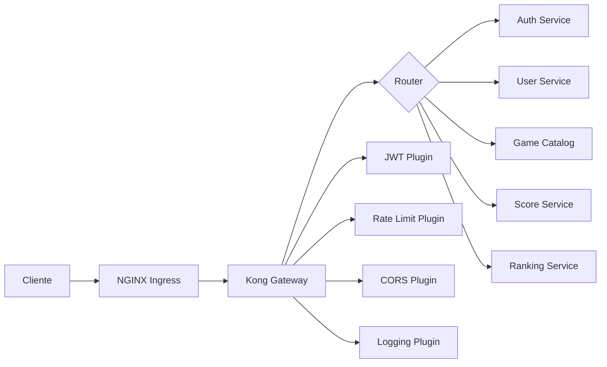

## Visión General

**Kong Gateway** actúa como punto de entrada unificado para todos los microservicios backend, proporcionando:

- **Enrutamiento**: Dirección de tráfico a servicios específicos
- **Autenticación**: Validación de tokens JWT
- **Rate Limiting**: Control de tasa de peticiones
- **Logging**: Registro centralizado de requests
- **CORS**: Políticas de compartición de recursos
- **Transformación**: Modificación de requests/responses

## Arquitectura



## Configuración Declarativa

Kong utiliza un archivo YAML declarativo (`kong.yml`) que define toda la configuración:

```yaml
# kong/kong.yml
_format_version: "3.0"
_transform: true

###############################################################################
# SERVICES & ROUTES
###############################################################################

services:
  # Auth Service
  - name: auth-service
    url: http://auth-service.retrogame.svc.cluster.local:3001
    protocol: http
    host: auth-service.retrogame.svc.cluster.local
    port: 3001
    path: /
    retries: 3
    connect_timeout: 60000
    write_timeout: 60000
    read_timeout: 60000
    
    routes:
      - name: auth-login
        paths:
          - /api/auth/login
        methods:
          - POST
        strip_path: false
        
      - name: auth-register
        paths:
          - /api/auth/register
        methods:
          - POST
        strip_path: false
        
      - name: auth-verify
        paths:
          - /api/auth/verify
        methods:
          - POST
        strip_path: false
        
      - name: auth-refresh
        paths:
          - /api/auth/refresh
        methods:
          - POST
        strip_path: false

  # User Service
  - name: user-service
    url: http://user-service.retrogame.svc.cluster.local:3002
    protocol: http
    host: user-service.retrogame.svc.cluster.local
    port: 3002
    path: /
    retries: 3
    
    routes:
      - name: user-profile
        paths:
          - /api/users/profile
        methods:
          - GET
          - PUT
        strip_path: false
        
      - name: user-avatar
        paths:
          - /api/users/avatar
        methods:
          - POST
          - DELETE
        strip_path: false
        
      - name: user-social
        paths:
          - /api/users/follow
          - /api/users/unfollow
          - /api/users/followers
          - /api/users/following
        methods:
          - GET
          - POST
          - DELETE
        strip_path: false
        
      - name: user-achievements
        paths:
          - /api/users/achievements
        methods:
          - GET
        strip_path: false

  # Game Catalog Service
  - name: game-catalog-service
    url: http://game-catalog-service.retrogame.svc.cluster.local:3003
    protocol: http
    host: game-catalog-service.retrogame.svc.cluster.local
    port: 3003
    path: /
    retries: 3
    
    routes:
      - name: games-list
        paths:
          - /api/games
        methods:
          - GET
        strip_path: false
        
      - name: games-detail
        paths:
          - /api/games/~
        methods:
          - GET
        strip_path: false
        
      - name: games-admin
        paths:
          - /api/games
        methods:
          - POST
          - PATCH
          - DELETE
        strip_path: false

  # Score Service
  - name: score-service
    url: http://score-service.retrogame.svc.cluster.local:3004
    protocol: http
    host: score-service.retrogame.svc.cluster.local
    port: 3004
    path: /
    retries: 3
    
    routes:
      - name: scores-submit
        paths:
          - /api/scores
        methods:
          - POST
        strip_path: false
        
      - name: scores-session
        paths:
          - /api/scores/session
        methods:
          - POST
        strip_path: false
        
      - name: scores-user
        paths:
          - /api/scores/user
        methods:
          - GET
        strip_path: false

  # Ranking Service
  - name: ranking-service
    url: http://ranking-service.retrogame.svc.cluster.local:3005
    protocol: http
    host: ranking-service.retrogame.svc.cluster.local
    port: 3005
    path: /
    retries: 3
    
    routes:
      - name: ranking-global
        paths:
          - /api/rankings/global
        methods:
          - GET
        strip_path: false
        
      - name: ranking-game
        paths:
          - /api/rankings/game/~
        methods:
          - GET
        strip_path: false
        
      - name: ranking-user
        paths:
          - /api/rankings/user
        methods:
          - GET
        strip_path: false

###############################################################################
# PLUGINS
###############################################################################

plugins:
  # CORS Global
  - name: cors
    config:
      origins:
        - "https://retrogamehub.games"
        - "https://*.retrogamehub.games"
      methods:
        - GET
        - POST
        - PUT
        - PATCH
        - DELETE
        - OPTIONS
      headers:
        - Accept
        - Accept-Version
        - Content-Length
        - Content-MD5
        - Content-Type
        - Date
        - Authorization
        - X-Auth-Token
      exposed_headers:
        - X-Auth-Token
        - X-RateLimit-Limit
        - X-RateLimit-Remaining
        - X-RateLimit-Reset
      credentials: true
      max_age: 3600
      preflight_continue: false

  # Rate Limiting Global
  - name: rate-limiting
    config:
      minute: 100
      hour: 1000
      policy: local
      fault_tolerant: true
      hide_client_headers: false
      redis_host: null
      redis_port: 6379
      redis_timeout: 2000

  # Request ID
  - name: correlation-id
    config:
      header_name: X-Request-ID
      generator: uuid
      echo_downstream: true

  # Logging
  - name: file-log
    config:
      path: /var/log/kong/access.log
      reopen: true

  # Prometheus Metrics
  - name: prometheus
    config:
      per_consumer: true
      status_code_metrics: true
      latency_metrics: true
      bandwidth_metrics: true
      upstream_health_metrics: true

  # JWT Authentication para rutas protegidas
  - name: jwt
    service: user-service
    config:
      key_claim_name: kid
      secret_is_base64: false
      claims_to_verify:
        - exp
      uri_param_names:
        - jwt
      cookie_names: []
      maximum_expiration: 604800
      algorithm: HS256
      run_on_preflight: false

  - name: jwt
    service: score-service
    config:
      key_claim_name: kid
      secret_is_base64: false
      claims_to_verify:
        - exp
      uri_param_names:
        - jwt
      cookie_names: []
      maximum_expiration: 604800
      algorithm: HS256
      run_on_preflight: false

  # Rate Limiting específico para Score Service (anti-cheat)
  - name: rate-limiting
    service: score-service
    config:
      minute: 10
      hour: 100
      policy: local
      fault_tolerant: false

  # Request Size Limiting
  - name: request-size-limiting
    config:
      allowed_payload_size: 10
      size_unit: megabytes
      require_content_length: false

  # Response Transformer (headers de seguridad)
  - name: response-transformer
    config:
      add:
        headers:
          - "X-Content-Type-Options:nosniff"
          - "X-Frame-Options:DENY"
          - "X-XSS-Protection:1; mode=block"
          - "Strict-Transport-Security:max-age=31536000; includeSubDomains"

###############################################################################
# CONSUMERS (Ejemplos)
###############################################################################

consumers:
  - username: frontend-app
    custom_id: frontend-client
    
  - username: admin-user
    custom_id: admin-001

###############################################################################
# JWT CREDENTIALS
###############################################################################

jwt_secrets:
  - consumer: frontend-app
    key: retrogame-frontend-key
    secret: your-jwt-secret-key-here
    algorithm: HS256
    
  - consumer: admin-user
    key: retrogame-admin-key
    secret: your-admin-secret-key-here
    algorithm: HS256

###############################################################################
# UPSTREAMS & TARGETS (Load Balancing)
###############################################################################

upstreams:
  - name: auth-service-upstream
    algorithm: round-robin
    hash_on: none
    hash_fallback: none
    healthchecks:
      active:
        healthy:
          interval: 10
          successes: 2
        unhealthy:
          interval: 10
          http_failures: 3
          timeouts: 3
        http_path: /health
        timeout: 5
        https_verify_certificate: false
      passive:
        healthy:
          successes: 2
        unhealthy:
          http_failures: 3
          timeouts: 3
    
    targets:
      - target: auth-service.retrogame.svc.cluster.local:3001
        weight: 100

  - name: user-service-upstream
    algorithm: round-robin
    targets:
      - target: user-service.retrogame.svc.cluster.local:3002
        weight: 100

  - name: game-catalog-upstream
    algorithm: round-robin
    targets:
      - target: game-catalog-service.retrogame.svc.cluster.local:3003
        weight: 100

  - name: score-service-upstream
    algorithm: round-robin
    targets:
      - target: score-service.retrogame.svc.cluster.local:3004
        weight: 100

  - name: ranking-service-upstream
    algorithm: round-robin
    targets:
      - target: ranking-service.retrogame.svc.cluster.local:3005
        weight: 100
```

## Deployment en Kubernetes

### ConfigMap con kong.yml

```yaml
# kong-configmap.yaml
apiVersion: v1
kind: ConfigMap
metadata:
  name: kong-declarative-config
  namespace: retrogame
data:
  kong.yml: |
    # Contenido completo del kong.yml anterior
```

### Deployment de Kong

```yaml
# kong-deployment.yaml
apiVersion: apps/v1
kind: Deployment
metadata:
  name: kong-gateway
  namespace: retrogame
  labels:
    app: kong-gateway
spec:
  replicas: 2
  selector:
    matchLabels:
      app: kong-gateway
  template:
    metadata:
      labels:
        app: kong-gateway
    spec:
      containers:
      - name: kong
        image: kong:3.5-alpine
        env:
          # Modo declarativo
          - name: KONG_DATABASE
            value: "off"
          - name: KONG_DECLARATIVE_CONFIG
            value: /kong/kong.yml
          
          # Proxy
          - name: KONG_PROXY_LISTEN
            value: "0.0.0.0:8000"
          - name: KONG_PROXY_LISTEN_SSL
            value: "0.0.0.0:8443 ssl"
          
          # Admin API
          - name: KONG_ADMIN_LISTEN
            value: "0.0.0.0:8001"
          - name: KONG_ADMIN_ACCESS_LOG
            value: /dev/stdout
          - name: KONG_ADMIN_ERROR_LOG
            value: /dev/stderr
          
          # Logs
          - name: KONG_PROXY_ACCESS_LOG
            value: /dev/stdout
          - name: KONG_PROXY_ERROR_LOG
            value: /dev/stderr
          
          # Performance
          - name: KONG_NGINX_WORKER_PROCESSES
            value: "2"
          - name: KONG_NGINX_HTTP_CLIENT_BODY_BUFFER_SIZE
            value: "10m"
          
        ports:
          - name: proxy
            containerPort: 8000
            protocol: TCP
          - name: proxy-ssl
            containerPort: 8443
            protocol: TCP
          - name: admin
            containerPort: 8001
            protocol: TCP
        
        volumeMounts:
          - name: kong-config
            mountPath: /kong
            readOnly: true
        
        resources:
          requests:
            cpu: 200m
            memory: 256Mi
          limits:
            cpu: 500m
            memory: 512Mi
        
        livenessProbe:
          httpGet:
            path: /status
            port: 8001
          initialDelaySeconds: 30
          periodSeconds: 10
          timeoutSeconds: 5
          failureThreshold: 3
        
        readinessProbe:
          httpGet:
            path: /status
            port: 8001
          initialDelaySeconds: 10
          periodSeconds: 5
          timeoutSeconds: 3
          failureThreshold: 3
      
      volumes:
        - name: kong-config
          configMap:
            name: kong-declarative-config
---
apiVersion: v1
kind: Service
metadata:
  name: kong-gateway
  namespace: retrogame
spec:
  type: ClusterIP
  selector:
    app: kong-gateway
  ports:
    - name: proxy
      port: 8000
      targetPort: 8000
      protocol: TCP
    - name: proxy-ssl
      port: 8443
      targetPort: 8443
      protocol: TCP
    - name: admin
      port: 8001
      targetPort: 8001
      protocol: TCP
```

### Ingress para Kong

```yaml
# kong-ingress.yaml
apiVersion: networking.k8s.io/v1
kind: Ingress
metadata:
  name: kong-ingress
  namespace: retrogame
  annotations:
    kubernetes.io/ingress.class: nginx
    cert-manager.io/cluster-issuer: letsencrypt-prod
    nginx.ingress.kubernetes.io/ssl-redirect: "true"
    nginx.ingress.kubernetes.io/proxy-body-size: "10m"
spec:
  tls:
    - hosts:
        - api.retrogamehub.games
      secretName: kong-tls
  rules:
    - host: api.retrogamehub.games
      http:
        paths:
          - path: /
            pathType: Prefix
            backend:
              service:
                name: kong-gateway
                port:
                  number: 8000
```

## Plugins Principales

### 1. JWT Authentication

**Propósito**: Validar tokens JWT en requests.

```yaml
plugins:
  - name: jwt
    service: user-service
    config:
      uri_param_names:
        - jwt
      cookie_names: []
      claims_to_verify:
        - exp
      key_claim_name: kid
      secret_is_base64: false
      maximum_expiration: 604800
      algorithm: HS256
```

**Headers requeridos**:
```
Authorization: Bearer <JWT_TOKEN>
```

### 2. Rate Limiting

**Propósito**: Limitar requests por minuto/hora.

```yaml
plugins:
  - name: rate-limiting
    config:
      minute: 100
      hour: 1000
      policy: local
      fault_tolerant: true
```

**Headers de respuesta**:
```
X-RateLimit-Limit-Minute: 100
X-RateLimit-Remaining-Minute: 95
X-RateLimit-Limit-Hour: 1000
X-RateLimit-Remaining-Hour: 985
```

### 3. CORS

**Propósito**: Gestionar políticas de compartición de recursos entre orígenes.

```yaml
plugins:
  - name: cors
    config:
      origins:
        - "https://retrogamehub.games"
      methods:
        - GET
        - POST
        - PUT
        - DELETE
        - OPTIONS
      credentials: true
      max_age: 3600
```

### 4. Request Transformer

**Propósito**: Modificar requests antes de enviarlos al upstream.

```yaml
plugins:
  - name: request-transformer
    service: user-service
    config:
      add:
        headers:
          - "X-Service-Name:user-service"
      remove:
        headers:
          - "X-Internal-Header"
      replace:
        headers:
          - "Host:user-service.internal"
```

### 5. Response Transformer

**Propósito**: Modificar responses antes de devolverlos al cliente.

```yaml
plugins:
  - name: response-transformer
    config:
      add:
        headers:
          - "X-Content-Type-Options:nosniff"
          - "X-Frame-Options:DENY"
      remove:
        headers:
          - "X-Internal-Version"
```

### 6. Prometheus

**Propósito**: Exponer métricas para monitoreo.

```yaml
plugins:
  - name: prometheus
    config:
      per_consumer: true
      status_code_metrics: true
      latency_metrics: true
      bandwidth_metrics: true
```

**Endpoint de métricas**:
```
http://kong-gateway:8001/metrics
```

### 7. File Log

**Propósito**: Registrar accesos en archivo.

```yaml
plugins:
  - name: file-log
    config:
      path: /var/log/kong/access.log
      reopen: true
```

## Comandos de Administración

### Verificar configuración

```bash
# Validar kong.yml
kong config parse kong/kong.yml

# Ver configuración cargada
kubectl exec -n retrogame kong-gateway-<pod-id> -- kong config db_export
```

### Recargar configuración

```bash
# Actualizar ConfigMap
kubectl apply -f kong-configmap.yaml

# Reiniciar pods para recargar
kubectl rollout restart deployment/kong-gateway -n retrogame

# Verificar estado
kubectl rollout status deployment/kong-gateway -n retrogame
```

### Revisar logs

```bash
# Logs de proxy
kubectl logs -n retrogame deployment/kong-gateway -c kong --follow

# Logs de admin API
kubectl logs -n retrogame deployment/kong-gateway -c kong | grep admin
```

### Admin API

```bash
# Listar servicios
curl http://localhost:8001/services

# Listar rutas
curl http://localhost:8001/routes

# Listar plugins
curl http://localhost:8001/plugins

# Listar consumers
curl http://localhost:8001/consumers

# Healthcheck
curl http://localhost:8001/status
```

## Testing de Rutas

### Sin autenticación (públicas)

```bash
# Login
curl -X POST https://api.retrogamehub.games/api/auth/login \
  -H "Content-Type: application/json" \
  -d '{
    "username": "testuser",
    "password": "password123"
  }'

# Listar juegos
curl https://api.retrogamehub.games/api/games
```

### Con autenticación (protegidas)

```bash
# Obtener perfil
curl https://api.retrogamehub.games/api/users/profile \
  -H "Authorization: Bearer <JWT_TOKEN>"

# Enviar puntuación
curl -X POST https://api.retrogamehub.games/api/scores \
  -H "Authorization: Bearer <JWT_TOKEN>" \
  -H "Content-Type: application/json" \
  -d '{
    "game_slug": "doom",
    "score": 15000
  }'
```

### Rate limiting

```bash
# Hacer muchas peticiones rápidas
for i in {1..150}; do
  curl https://api.retrogamehub.games/api/games
done

# Eventualmente retornará 429 Too Many Requests
```

## Métricas Prometheus

Kong expone métricas en formato Prometheus:

```prometheus
# HELP kong_bandwidth_bytes Total bandwidth
# TYPE kong_bandwidth_bytes counter
kong_bandwidth_bytes{type="egress",service="auth-service"} 1234567
kong_bandwidth_bytes{type="ingress",service="auth-service"} 987654

# HELP kong_http_requests_total HTTP requests
# TYPE kong_http_requests_total counter
kong_http_requests_total{service="auth-service",route="auth-login",code="200"} 542
kong_http_requests_total{service="auth-service",route="auth-login",code="401"} 23

# HELP kong_latency_ms Request latency in milliseconds
# TYPE kong_latency_ms histogram
kong_latency_ms_bucket{service="auth-service",le="10"} 450
kong_latency_ms_bucket{service="auth-service",le="50"} 520
kong_latency_ms_bucket{service="auth-service",le="100"} 540
```

## Troubleshooting

<AccordionGroup>
  <Accordion title="503 Service Unavailable">
    **Causa**: Upstream service no disponible.
    
    **Solución**:
    ```bash
    # Verificar que el servicio backend existe
    kubectl get svc -n retrogame
    
    # Verificar endpoints
    kubectl get endpoints -n retrogame
    
    # Revisar logs de Kong
    kubectl logs -n retrogame deployment/kong-gateway
    ```
  </Accordion>

  <Accordion title="401 Unauthorized (JWT)">
    **Causa**: Token JWT inválido o expirado.
    
    **Solución**:
    ```bash
    # Verificar que el token es válido
    echo "JWT_TOKEN" | base64 -d
    
    # Verificar configuración de JWT secret
    kubectl get configmap kong-declarative-config -n retrogame -o yaml
    ```
  </Accordion>

  <Accordion title="429 Too Many Requests">
    **Causa**: Rate limit excedido.
    
    **Solución**:
    - Esperar a que se resetee el límite
    - Ajustar configuración de rate limiting
    - Implementar retry logic con backoff en el cliente
  </Accordion>

  <Accordion title="CORS Error">
    **Causa**: Origin no permitido.
    
    **Solución**:
    ```yaml
    # Actualizar configuración CORS en kong.yml
    plugins:
      - name: cors
        config:
          origins:
            - "https://retrogamehub.games"
            - "http://localhost:8080"  # Para desarrollo
    ```
  </Accordion>

  <Accordion title="Configuration Not Loading">
    **Causa**: ConfigMap no actualizado.
    
    **Solución**:
    ```bash
    # Verificar ConfigMap
    kubectl get configmap kong-declarative-config -n retrogame
    
    # Forzar recreación de pods
    kubectl delete pod -n retrogame -l app=kong-gateway
    ```
  </Accordion>
</AccordionGroup>

## Seguridad

### Headers de Seguridad

Kong añade automáticamente headers de seguridad:

```
X-Content-Type-Options: nosniff
X-Frame-Options: DENY
X-XSS-Protection: 1; mode=block
Strict-Transport-Security: max-age=31536000
```

### Secrets Management

```bash
# Crear secret para JWT
kubectl create secret generic kong-jwt-secret \
  --from-literal=secret=your-super-secret-jwt-key \
  -n retrogame

# Referenciar en ConfigMap
env:
  - name: JWT_SECRET
    valueFrom:
      secretKeyRef:
        name: kong-jwt-secret
        key: secret
```

## Costos

Kong en modo DB-less (declarativo) **no tiene costo adicional** ya que:

- Usa imagen open-source de Kong
- No requiere base de datos PostgreSQL adicional
- Se ejecuta en los mismos nodos del clúster EKS

**Recursos consumidos**:
- CPU: ~200m por pod
- Memoria: ~256Mi por pod
- Total con 2 réplicas: 400m CPU, 512Mi RAM

## Próximos Pasos

<CardGroup cols={2}>
  <Card title="Backend Services" icon="server" href="/api-reference/backend-main">
    Microservicios que Kong enruta
  </Card>
  <Card title="Authentication" icon="shield" href="/api-reference/auth-service">
    Servicio de autenticación JWT
  </Card>
  <Card title="Kubernetes Manifests" icon="dharmachakra" href="/api-reference/kubernetes-manifests">
    Deployment completo en K8s
  </Card>
  <Card title="Monitoring" icon="chart-line" href="/infrastructure/monitoring">
    Métricas de Kong en Grafana
  </Card>
</CardGroup>
