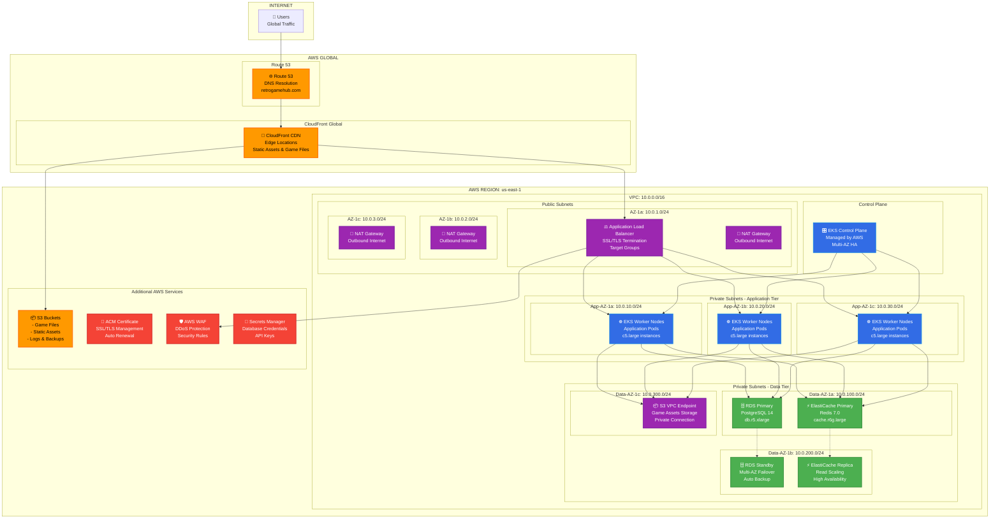
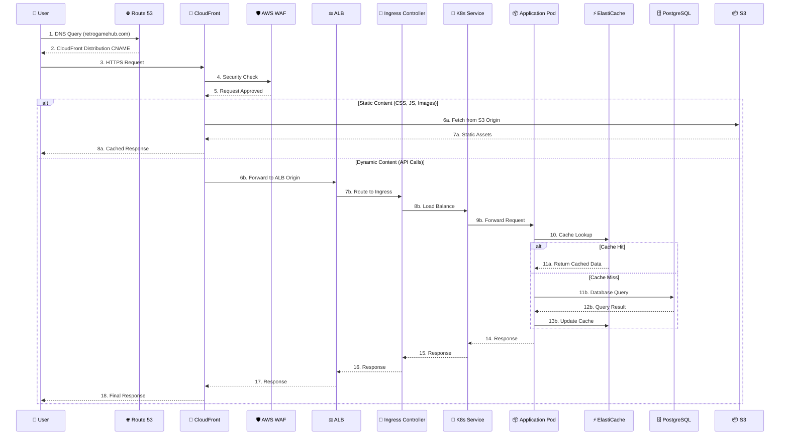

## Visión General de la Arquitectura

Retro Game Hub está construido usando una arquitectura de microservicios cloud-native desplegada en AWS EKS (Kubernetes). La arquitectura sigue principios de escalabilidad, alta disponibilidad y separación de responsabilidades, organizándose en capas claramente definidas que aprovechan servicios gestionados de AWS para optimizar el rendimiento y reducir la complejidad operacional.

## Arquitectura de Alto Nivel



## Flujo de Tráfico Detallado



## Componentes de la Arquitectura

### Capa de Red y CDN

**Route 53**
- Resolución DNS global con health checks
- Routing policies para failover automático
- Subdominios para diferentes servicios (api.retrogamehub.com, cdn.retrogamehub.com)

**CloudFront CDN**
- 200+ edge locations globales
- Cache de contenido estático y assets de juegos
- Compresión automática (Gzip/Brotli)
- Integración con AWS WAF para protección DDoS

### Capa de Seguridad

**AWS WAF**
- Protección contra ataques OWASP Top 10
- Rate limiting personalizado
- Geo-blocking y IP whitelisting
- Reglas personalizadas para gaming

**Application Load Balancer (ALB)**
- SSL/TLS termination con certificados ACM
- Health checks avanzados
- Target groups para diferentes servicios
- WebSocket support para features en tiempo real

### Capa de Aplicación - EKS

**EKS Control Plane**
- Kubernetes 1.28 gestionado por AWS
- Multi-AZ para alta disponibilidad
- Integración nativa con servicios AWS
- Actualizaciones automáticas disponibles

**Worker Nodes**
- Auto Scaling Groups en múltiples AZ
- Instancias c5.large optimizadas para compute
- Node groups separados por workload type
- Spot instances para workloads no críticos

**Microservicios Principales**
```
🎮 game-service        → Gestión de catálogo y metadatos
👤 user-service        → Autenticación y perfiles
🏆 achievement-service → Sistema de logros y progreso
💬 social-service      → Chat y features sociales
🔍 search-service      → Búsqueda y recomendaciones
📊 analytics-service   → Métricas y telemetría
🚀 emulator-service    → Ejecución de juegos retro
```

### Capa de Datos

**Amazon RDS PostgreSQL**
- Multi-AZ deployment para alta disponibilidad
- Read replicas para scaling de lectura
- Automated backups y point-in-time recovery
- Performance Insights para monitoring

**ElastiCache Redis**
- Cluster mode habilitado para alta disponibilidad
- Session storage y application caching
- Pub/Sub para comunicación en tiempo real
- Automatic failover configurado

**Amazon S3**
- Buckets separados por tipo de contenido:
  - `retrogamehub-games`: ROMs y archivos de juego
  - `retrogamehub-assets`: Imágenes, videos, artwork
  - `retrogamehub-backups`: Backups de base de datos
  - `retrogamehub-logs`: Logs de aplicación y audit

### Justificaciones Arquitectónicas

**¿Por qué EKS sobre EC2 directo?**
- Orquestación automática de contenedores
- Auto-scaling basado en métricas personalizadas
- Declarative configuration con GitOps
- Mejor utilización de recursos
- Facilita CI/CD y deployments blue-green

**¿Por qué PostgreSQL sobre DynamoDB?**
- Relationships complejas entre usuarios, juegos, y achievements
- ACID compliance para transacciones críticas
- SQL queries avanzadas para analytics
- Better tooling y ecosystem maduro

**¿Por qué Redis como cache?**
- Sub-millisecond latency para gaming
- Data structures avanzadas (Sets, Sorted Sets)
- Pub/Sub para features en tiempo real
- Persistence opcional para session data

**¿Por qué Multi-AZ deployment?**
- RTO < 2 minutos para database failover
- RPO < 1 minuto con continuous backup
- 99.99% availability SLA requirement
- Disaster recovery automático

## Escalabilidad y Performance

### Horizontal Pod Autoscaler (HPA)
```yaml
Métricas de scaling:
- CPU utilization > 70%
- Memory utilization > 80%
- Custom metrics (requests/second)
- Queue depth para processing jobs
```

### Vertical Pod Autoscaler (VPA)
- Optimización automática de resource requests
- Historico de usage patterns
- Right-sizing de containers

### Cluster Autoscaler
- Escalado automático de worker nodes
- Scale-down de nodos infrautilizados
- Spot instance integration para cost optimization

## Monitoreo y Observabilidad

### CloudWatch Integration
- Container Insights para métricas EKS
- Custom metrics desde aplicación
- Log aggregation centralizado
- Alertas proactivas configuradas

### Distributed Tracing
- AWS X-Ray para request tracing
- Latency analysis entre microservicios
- Performance bottleneck identification
- Error tracking y debugging

Esta arquitectura proporciona una base sólida, escalable y mantenible para Retro Game Hub, aprovechando las mejores prácticas de cloud-native development y la robustez de los servicios gestionados de AWS.