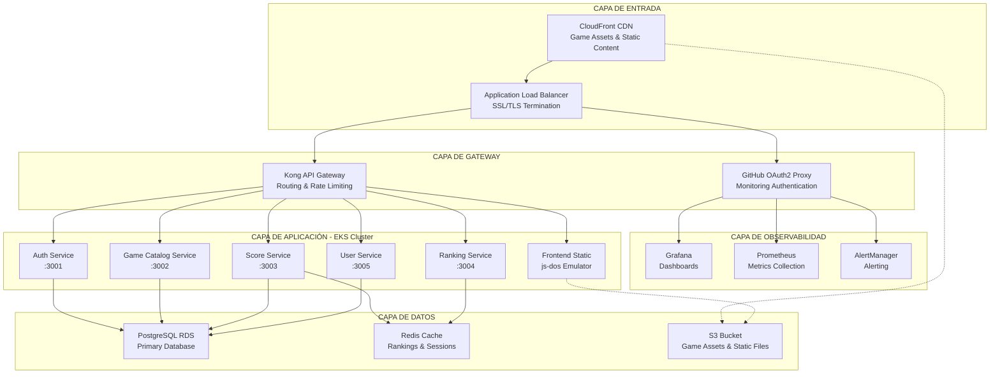
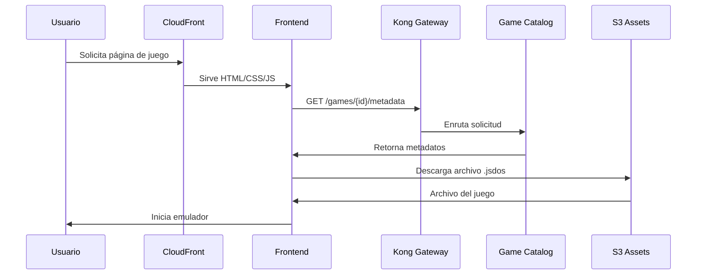
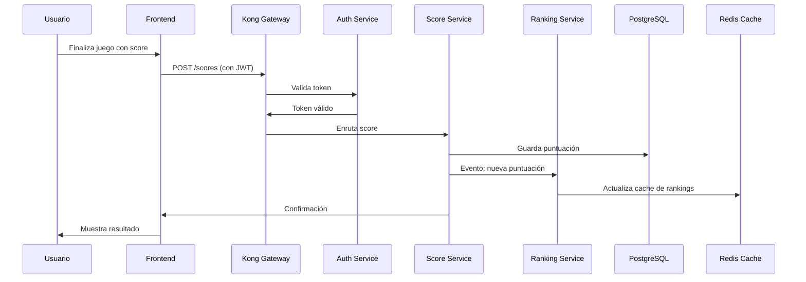
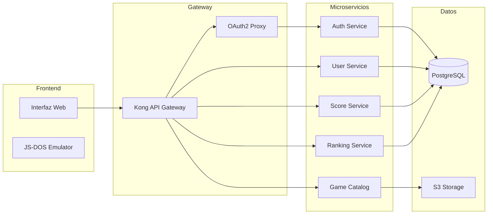

## Visión General de la Arquitectura

Retro Game Hub está construido usando una arquitectura de microservicios cloud-native desplegada en AWS EKS (Kubernetes). La arquitectura sigue principios de escalabilidad, alta disponibilidad y separación de responsabilidades, organizándose en capas claramente definidas.

## Arquitectura de Alto Nivel



## Arquitectura por Capas Detallada

### 1. Capa de Entrada
Esta capa maneja todo el tráfico entrante y la distribución de contenido:

- **CloudFront CDN**: Distribución global de contenido estático y assets de juegos

- **Application Load Balancer**: Terminación SSL/TLS y balanceado de carga

### 2. Capa de Gateway
Proporciona enrutamiento, autenticación y control de acceso:

- **Kong API Gateway**: Enrutamiento inteligente, rate limiting, y middleware

- **GitHub OAuth2 Proxy**: Autenticación para herramientas de monitoreo

### 3. Capa de Observabilidad
Monitoreo y observabilidad del sistema:

- **Prometheus**: Recolección de métricas de todos los servicios

- **Grafana**: Visualización de métricas y dashboards

- **AlertManager**: Gestión de alertas y notificaciones

### 4. Capa de Aplicación
Microservicios desplegados en EKS:

<CardGroup cols={2}>
  <Card title="Auth Service" icon="shield">
    - Generación/validación de tokens JWT
    - Autenticación de usuarios
    - Gestión de sesiones
    - Puerto: 3001
  </Card>

  <Card title="Game Catalog Service" icon="gamepad">
    - Gestión de metadatos de juegos
    - Listado de juegos disponibles
    - Categorización y búsqueda
    - Puerto: 3002
  </Card>

  <Card title="Score Service" icon="trophy">
    - Envío y validación de puntuaciones
    - Publicación de eventos de scoring
    - Prevención de cheating
    - Puerto: 3003
  </Card>

  <Card title="Ranking Service" icon="ranking-star">
    - Generación de tablas de posiciones
    - Rankings globales y por juego
    - Cache de rankings frecuentes
    - Puerto: 3004
  </Card>

  <Card title="User Service" icon="user">
    - Gestión de perfiles de usuario
    - Preferencias y configuración
    - Historial de juegos
    - Puerto: 3005
  </Card>

  <Card title="Frontend Static" icon="browser">
    - Interfaz web estática
    - Integración con js-dos emulator
    - Assets de frontend
  </Card>
</CardGroup>

### 5. Capa de Datos
Almacenamiento persistente y cache:

- **PostgreSQL RDS**: Base de datos principal para usuarios, juegos, puntuaciones

- **Redis Cache**: Cache de rankings y sesiones de usuario

- **S3 Bucket**: Almacenamiento de archivos .jsdos y contenido estático

## Infraestructura como Código

### AWS EKS Cluster

```yaml
Cluster Configuration:

- Kubernetes Version: 1.28

- Node Groups:
  - System: t3.medium (2-4 nodes)
  - Application: t3.large (2-6 nodes)

- Auto Scaling: Habilitado

- VPC: Private subnets con NAT Gateway

```

### Networking

```yaml
VPC Configuration:

- CIDR: 10.0.0.0/16

- Public Subnets: 10.0.1.0/24, 10.0.2.0/24

- Private Subnets: 10.0.10.0/24, 10.0.20.0/24

- Availability Zones: Multi-AZ deployment

```

## Flujo de Datos Típico

### 1. Carga de Juego



### 2. Envío de Puntuación



## Características de la Arquitectura

### Escalabilidad

- **Horizontal**: Auto-scaling de pods en EKS

- **Vertical**: Ajuste dinámico de recursos por servicio

- **CDN**: Distribución global de contenido estático

### Alta Disponibilidad

- **Multi-AZ**: Despliegue en múltiples zonas de disponibilidad

- **Load Balancing**: Distribución de carga entre instancias

- **Health Checks**: Monitoreo continuo de salud de servicios

### Seguridad

- **Network Policies**: Aislamiento de red entre microservicios

- **JWT Authentication**: Autenticación stateless

- **SSL/TLS**: Cifrado en tránsito

- **VPC**: Red privada virtual aislada

### Observabilidad

- **Metrics**: Prometheus para métricas de aplicación e infraestructura

- **Logs**: Agregación centralizada de logs

- **Tracing**: Seguimiento de requests distribuidos

- **Alerting**: Notificaciones proactivas de problemas

Esta arquitectura permite que Retro Game Hub sea altamente escalable, mantenible y resiliente, proporcionando una experiencia de usuario óptima mientras facilita el desarrollo y operación del sistema.

## Arquitectura de Componentes




