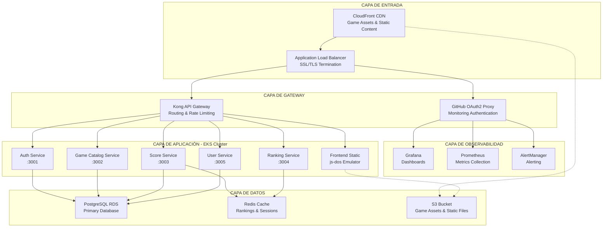

## Visión General de la Arquitectura

Retro Game Hub está construido usando una arquitectura de microservicios cloud-native desplegada en AWS EKS (Kubernetes). La arquitectura sigue principios de escalabilidad, alta disponibilidad y separación de responsabilidades, organizándose en capas claramente definidas.

## Arquitectura de Alto Nivel

## 2.1 Arquitectura por Capas Detallada

### 2.1.1 Capa de Entrada
Esta capa maneja todo el tráfico entrante y la distribución de contenido:

- **CloudFront CDN**: Distribución global de contenido estático (juegos, assets)
- **Application Load Balancer**: Balanceador con terminación SSL/TLS y distribución de tráfico
- **Route 53**: DNS management y routing de tráfico

### 2.1.2 Capa de Gateway
Punto de entrada unificado para todas las peticiones:

- **Kong API Gateway**: 
  - Routing inteligente hacia microservicios
  - Rate limiting y throttling
  - Autenticación y autorización
  - Transformación de requests/responses
- **GitHub OAuth2 Proxy**: Autenticación específica para herramientas de monitoring

### 2.1.3 Capa de Observabilidad
Stack completo de monitoring y alerting:

- **Prometheus**: Recolección de métricas de aplicaciones e infraestructura
- **Grafana**: Dashboards y visualización de métricas
- **AlertManager**: Sistema de alertas basado en reglas
- **Jaeger**: Distributed tracing (futuro)

### 2.1.4 Capa de Aplicación
Microservicios desplegados en AWS EKS:

- **Auth Service** (Puerto 3001): Autenticación y autorización de usuarios
- **Game Catalog Service** (Puerto 3002): Gestión del catálogo de juegos
- **Score Service** (Puerto 3003): Gestión de puntuaciones
- **Ranking Service** (Puerto 3004): Cálculo y gestión de rankings
- **User Service** (Puerto 3005): Gestión de perfiles de usuario
- **Frontend**: Aplicación React con js-dos emulator

### 2.1.5 Capa de Datos
Persistencia y almacenamiento:

- **PostgreSQL RDS**: Base de datos principal (Multi-AZ para HA)
- **Redis ElastiCache**: Cache distribuido para rankings y sesiones
- **S3**: Almacenamiento de assets estáticos y ROMs de juegos

## 2.2 Decisiones Arquitectónicas

### 2.2.1 Microservicios vs Monolito
**Decisión**: Arquitectura de microservicios
**Justificación**:
- Escalabilidad independiente por servicio
- Tecnologías heterogéneas por dominio
- Despliegues independientes
- Tolerancia a fallos mejorada

### 2.2.2 Kubernetes como Orquestador
**Decisión**: AWS EKS
**Justificación**:
- Auto-scaling horizontal y vertical
- Service discovery nativo
- Rolling deployments
- Ecosistema maduro de herramientas

### 2.2.3 API Gateway Centralizado
**Decisión**: Kong API Gateway
**Justificación**:
- Punto de entrada único
- Rate limiting centralizado
- Políticas de seguridad uniformes
- Observabilidad del tráfico API

### 2.2.4 Stack de Observabilidad
**Decisión**: Prometheus + Grafana + AlertManager
**Justificación**:
- Estándar de facto en Kubernetes
- Integración nativa con EKS
- Comunidad activa y plugins abundantes
- Modelo pull-based eficiente

## 2.3 Patrones Arquitectónicos Implementados

### 2.3.1 Circuit Breaker
Implementado en llamadas inter-servicio para prevenir cascading failures.

### 2.3.2 Retry with Exponential Backoff
Manejo de fallos transitorios en comunicación con servicios externos.

### 2.3.3 Cache-Aside Pattern
Redis como cache para rankings y datos de sesión frecuentemente accedidos.

### 2.3.4 Database per Service
Cada microservicio mantiene su propio esquema en PostgreSQL.

### 2.3.5 API Composition
El frontend compone datos de múltiples microservicios para vistas complejas.

## 2.4 Consideraciones de Seguridad

### 2.4.1 Red
- VPC con subnets públicas y privadas
- Security Groups con reglas restrictivas
- NACLs como capa adicional de seguridad

### 2.4.2 Aplicación
- JWT tokens para autenticación
- RBAC implementado en Kubernetes
- Secrets management con AWS Secrets Manager

### 2.4.3 Datos
- Encryption at rest en RDS y S3
- Encryption in transit con TLS 1.3
- Backup automático con point-in-time recovery

## 2.5 Escalabilidad y Performance

### 2.5.1 Horizontal Pod Autoscaler (HPA)
Configurado basado en CPU y memoria para cada microservicio.

### 2.5.2 Cluster Autoscaler
Escala automáticamente los nodos del cluster EKS basado en demanda.

### 2.5.3 CDN Strategy
CloudFront para assets estáticos con invalidación automática en deployments.

### 2.5.4 Caching Strategy
- Redis para datos dinámicos (rankings, sesiones)
- CloudFront para contenido estático
- Application-level caching en servicios críticos