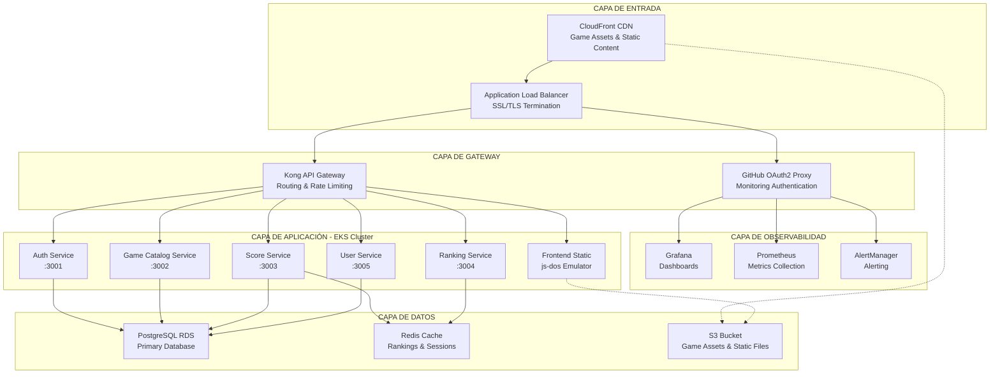
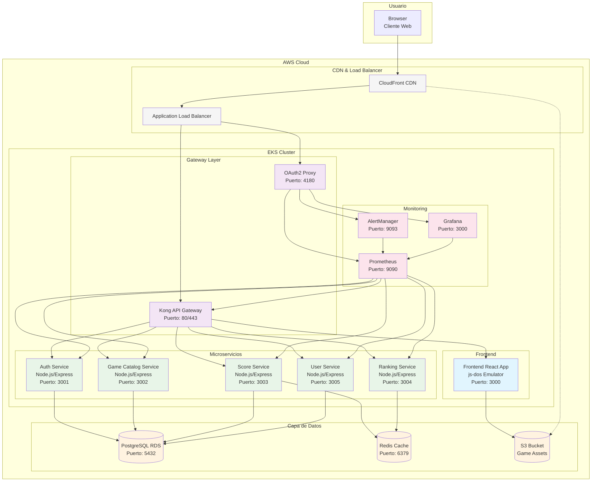

## Visión General de la Arquitectura

Retro Game Hub está construido usando una arquitectura de microservicios cloud-native desplegada en AWS EKS (Kubernetes). La arquitectura sigue principios de escalabilidad, alta disponibilidad y separación de responsabilidades, organizándose en capas claramente definidas.

## Arquitectura de Alto Nivel

## Diagrama de Componentes (Vista C4)

## Arquitectura por Capas Detallada

### 1. Capa de Entrada
Esta capa maneja todo el tráfico entrante y la distribución de contenido:

- **CloudFront CDN**: Distribución global de contenido estático y assets de juegos
- **Application Load Balancer**: Terminación SSL/TLS y balanceo de carga
- **Route 53**: Gestión de DNS y enrutamiento de tráfico

### 2. Capa de Gateway
Actúa como punto de entrada único para todas las solicitudes:

- **Kong API Gateway**: Enrutamiento de solicitudes, rate limiting, autenticación de APIs
- **OAuth2 Proxy**: Autenticación para herramientas de monitoreo usando GitHub OAuth

### 3. Capa de Aplicación
Contiene todos los microservicios y el frontend:

#### Frontend
- **React Application**: Interfaz de usuario con integración del emulador js-dos
- **js-dos Emulator**: Ejecuta juegos DOS directamente en el navegador

#### Microservicios
- **Auth Service** (Puerto 3001): Gestión de autenticación y autorización
- **Game Catalog Service** (Puerto 3002): Catálogo y metadata de juegos
- **Score Service** (Puerto 3003): Gestión de puntuaciones y progreso
- **Ranking Service** (Puerto 3004): Cálculo y gestión de rankings
- **User Service** (Puerto 3005): Gestión de perfiles y datos de usuario

### 4. Capa de Datos
Almacenamiento persistente y caché:

- **PostgreSQL RDS**: Base de datos principal para datos transaccionales
- **Redis Cache**: Caché para rankings, sesiones y datos de alta frecuencia
- **S3 Bucket**: Almacenamiento de assets de juegos y contenido estático

### 5. Capa de Observabilidad
Monitoreo y alertas del sistema:

- **Prometheus**: Recolección de métricas de todos los servicios
- **Grafana**: Dashboards y visualización de métricas
- **AlertManager**: Gestión y envío de alertas

## Decisiones Arquitectónicas

### Microservicios vs Monolito
**Decisión**: Arquitectura de microservicios
**Justificación**:
- Escalabilidad independiente por servicio
- Equipos pueden trabajar de forma independiente
- Tolerancia a fallos mejorada
- Flexibilidad tecnológica por servicio

### Kubernetes en AWS EKS
**Decisión**: AWS EKS como plataforma de orquestación
**Justificación**:
- Gestión automática del plano de control
- Integración nativa con servicios AWS
- Escalado automático de nodos
- Soporte enterprise y comunidad activa

### Kong como API Gateway
**Decisión**: Kong Gateway en lugar de AWS API Gateway
**Justificación**:
- Mayor flexibilidad de configuración
- Plugins extensibles para funcionalidades específicas
- Mejor rendimiento para alto volumen de requests
- Portabilidad entre clouds

### PostgreSQL como Base de Datos Principal
**Decisión**: PostgreSQL RDS
**Justificación**:
- ACID compliance para datos críticos
- Soporte robusto para consultas complejas
- Gestión automática de backups y mantenimiento
- Escalado vertical y horizontal disponible

### Redis para Caché y Rankings
**Decisión**: Redis como sistema de caché
**Justificación**:
- Excelente rendimiento para datos en memoria
- Estructuras de datos especializadas para rankings
- Persistencia opcional para datos importantes
- Integración simple con aplicaciones Node.js

## Patrones Arquitectónicos Implementados

### 1. API Gateway Pattern
Kong actúa como punto de entrada único, proporcionando:
- Enrutamiento centralizado
- Autenticación y autorización
- Rate limiting y throttling
- Transformación de requests/responses

### 2. Database per Service
Cada microservicio tiene su propio esquema/namespace en PostgreSQL:
- Aislamiento de datos
- Evolución independiente de esquemas
- Reducción de acoplamiento entre servicios

### 3. Circuit Breaker Pattern
Implementado en las comunicaciones inter-servicios para:
- Prevenir fallos en cascada
- Degradación gradual de funcionalidades
- Recuperación automática

### 4. Event-Driven Architecture
Para comunicación asíncrona entre servicios:
- Eventos de puntuación para actualización de rankings
- Eventos de usuario para sincronización de datos
- Desacoplamiento temporal entre servicios