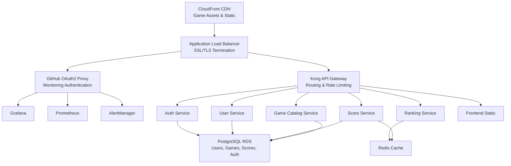

## Visión General de la Arquitectura

RetroGame Cloud está construido usando una arquitectura de microservicios cloud-native desplegada en AWS EKS (Kubernetes).

## Arquitectura de Alto Nivel

## Componentes Principales

### Capa de Frontend
- **Sitio Estático**: HTML/CSS/JS servido vía CloudFront
- **Emulador js-dos**: Emulación DOS basada en navegador
- **Assets de Juegos**: Archivos .jsdos alojados en CDN en S3

### Capa de API Gateway
- **Kong**: Enrutamiento de peticiones, limitación de tasa, reenvío de autenticación
- **Rutas**: `/auth`, `/games`, `/scores`, `/rankings`, `/users`

### Capa de Microservicios

<CardGroup cols={2}>
  <Card title="Servicio de Autenticación" icon="shield">
    - Generación/validación de tokens JWT
    - Autenticación de usuarios
    - Puerto: 3001
  </Card>
  
  <Card title="Servicio de Catálogo de Juegos" icon="gamepad">
    - Gestión de metadatos de juegos
    - Listado de juegos disponibles
    - Puerto: 3002
  </Card>
  
  <Card title="Servicio de Puntuaciones" icon="trophy">
    - Envío de puntuaciones
    - Validación de puntuaciones
    - Publicación de eventos
    - Puerto: 3003
  </Card>
  
  <Card title="Servicio de Rankings" icon="ranking-star">
    - Generación de tablas de clasificación
    - Caché Redis
    - Invalidación de caché
    - Puerto: 3004
  </Card>
  
  <Card title="Servicio de Usuarios" icon="user">
    - Gestión de perfiles de usuario
    - Estadísticas de usuario
    - Puerto: 3005
  </Card>
</CardGroup>

### Capa de Datos

<CardGroup cols={2}>
  <Card title="PostgreSQL (RDS)" icon="database">
    - Almacén de datos principal
    - Transacciones ACID
    - Esquemas: users, games, scores, auth_tokens
  </Card>
  
  <Card title="Redis" icon="bolt">
    - Caché de rankings
    - Almacenamiento de sesiones
    - Tablas de clasificación en tiempo real
  </Card>
</CardGroup>

### Capa de Infraestructura

<CardGroup cols={2}>
  <Card title="AWS EKS" icon="dharmachakra">
    - Orquestación Kubernetes
    - Auto-escalado
    - Despliegues continuos
  </Card>
  
  <Card title="Terraform" icon="code">
    - Infraestructura como Código
    - Gestión de estado (S3)
    - Configuración modular
  </Card>
  
  <Card title="Stack de Monitoreo" icon="chart-line">
    - Prometheus (métricas)
    - Grafana (visualización)
    - AlertManager (alertas)
  </Card>
  
  <Card title="Redes" icon="network-wired">
    - VPC (10.0.0.0/16)
    - 3 subredes públicas + 3 privadas
    - NAT Gateway, ALB
  </Card>
</CardGroup>

## Patrones de Comunicación

### Comunicación Síncrona
- **Protocolo**: REST/HTTP
- **Gateway**: Kong enruta peticiones a servicios
- **Autenticación**: Tokens JWT en cabecera Authorization
- **Formato**: JSON

### Comunicación Asíncrona
- **Publicación de Eventos**: Servicio de puntuaciones publica eventos de puntuación
- **Consumo de Eventos**: Servicio de rankings escucha invalidación de caché
- **Patrón**: Pub/Sub vía Redis o cola de mensajes (futuro: Kafka)

## Seguridad

<Steps>
  <Step title="Aislamiento de Red">
    Servicios en subredes privadas, accesibles solo vía ALB
  </Step>
  <Step title="Autenticación JWT">
    Autenticación basada en tokens sin estado para todas las llamadas API
  </Step>
  <Step title="GitHub OAuth">
    OAuth restringido a organización para servicios de monitoreo
  </Step>
  <Step title="SSL/TLS">
    Cifrado de extremo a extremo con certificados ACM
  </Step>
  <Step title="Grupos de Seguridad">
    Reglas de acceso de red con mínimo privilegio
  </Step>
</Steps>

## Escalabilidad

### Escalado Horizontal
- **Kubernetes HPA**: Auto-escala pods basado en CPU/memoria
- **Grupos de Nodos**: Auto-escala instancias EC2 basado en demanda
- **Base de Datos**: Réplicas de lectura para operaciones intensivas en lectura

### Estrategia de Caché
- **Redis**: Datos de ranking con TTL
- **CloudFront**: Assets estáticos con caché en borde
- **Aplicación**: Caché en memoria para datos accedidos frecuentemente

### Optimización de Rendimiento
- **CDN**: Assets de juegos servidos desde ubicaciones de borde
- **Indexación de Base de Datos**: Consultas optimizadas para tablas de clasificación
- **Pool de Conexiones**: Conexiones eficientes a base de datos

## Próximos Pasos

<CardGroup cols={2}>
  <Card title="Detalles de Infraestructura" icon="server" href="/infrastructure/overview">
    Profundiza en la configuración de Terraform y EKS
  </Card>
  <Card title="Documentación de Servicios" icon="cubes" href="/services/auth-service">
    Explora los microservicios individuales
  </Card>
  <Card title="Referencia API" icon="terminal" href="/api-reference/auth/login">
    Ver documentación completa de la API
  </Card>
  <Card title="Configuración de Monitoreo" icon="chart-line" href="/infrastructure/monitoring">
    Aprende sobre el stack de observabilidad
  </Card>
</CardGroup>
