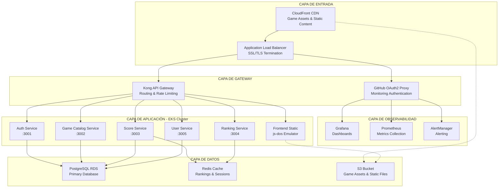

## Visión General de la Arquitectura

Retro Game Hub está construido usando una arquitectura de microservicios cloud-native desplegada en AWS EKS (Kubernetes). La arquitectura sigue principios de escalabilidad, alta disponibilidad y separación de responsabilidades, organizándose en capas claramente definidas.

## Arquitectura de Alto Nivel

## Arquitectura por Capas Detallada

### 1. Capa de Entrada
Esta capa maneja todo el tráfico entrante y la distribución de contenido:

- **CloudFront CDN**: Distribución global de contenido estático y assets de juegos
- **Application Load Balancer**: Terminación SSL/TLS y balanceo de carga

### 2. Capa de Gateway
Proporciona autenticación, autorización y enrutamiento:

- **GitHub OAuth2 Proxy**: Autenticación para herramientas de monitoreo
- **Kong API Gateway**: Gestión de APIs, rate limiting y enrutamiento

### 3. Capa de Observabilidad
Stack de monitoreo y alertas:

- **Grafana**: Visualización de métricas y dashboards
- **Prometheus**: Recolección y almacenamiento de métricas
- **AlertManager**: Sistema de alertas y notificaciones

### 4. Capa de Aplicación
Microservicios desplegados en EKS:

- **Auth Service (3001)**: Autenticación y autorización de usuarios
- **Game Catalog Service (3002)**: Gestión del catálogo de juegos
- **Score Service (3003)**: Manejo de puntuaciones
- **Ranking Service (3004)**: Generación de rankings
- **User Service (3005)**: Gestión de perfiles de usuario
- **Frontend Static**: Interfaz web con emulador js-dos

### 5. Capa de Datos
Almacenamiento persistente y caché:

- **PostgreSQL RDS**: Base de datos principal relacional
- **Redis Cache**: Caché para rankings y sesiones
- **S3 Bucket**: Almacenamiento de assets de juegos y archivos estáticos

## Registros de Decisiones Arquitectónicas (ADR)

### ADR-001: Selección de Kong como API Gateway

**Estado**: Aceptada

**Contexto**: Necesitábamos un API Gateway para gestionar autenticación, rate limiting y enrutamiento entre microservicios.

**Decisión**: Kong Gateway open-source con plugins de autenticación JWT.

**Consecuencias**:
- **Positivas**: Escalable, plugins extensibles, comunidad activa, alto rendimiento
- **Negativas**: Curva de aprendizaje, requiere base de datos PostgreSQL

### ADR-002: Amazon EKS vs Amazon ECS

**Estado**: Aceptada

**Contexto**: Evaluamos entre EKS (Kubernetes gestionado) y ECS (servicio de contenedores de AWS) para orquestar nuestros microservicios.

**Decisión**: Amazon EKS con nodos gestionados.

**Consecuencias**:
- **Positivas**: Estándar de la industria, portabilidad multi-cloud, ecosistema rico de herramientas, mejor para equipos con experiencia en Kubernetes
- **Negativas**: Mayor complejidad operacional, costo más alto que ECS, curva de aprendizaje pronunciada

### ADR-003: PostgreSQL vs MongoDB

**Estado**: Aceptada

**Contexto**: Selección de base de datos principal para almacenar datos de usuarios, juegos y puntuaciones.

**Decisión**: PostgreSQL en Amazon RDS con Multi-AZ deployment.

**Consecuencias**:
- **Positivas**: ACID compliance, consultas complejas con SQL, madurez del ecosistema, excelente soporte para JSON, alta disponibilidad con Multi-AZ
- **Negativas**: Escalado horizontal más complejo que NoSQL, requiere diseño de esquema más rígido

### ADR-004: Redis para Caché y Sesiones

**Estado**: Aceptada

**Contexto**: Necesidad de una solución de caché de alto rendimiento para rankings en tiempo real y gestión de sesiones de usuario.

**Decisión**: Amazon ElastiCache para Redis en configuración de cluster.

**Consecuencias**:
- **Positivas**: Rendimiento extremadamente alto, estructuras de datos ricas, persistencia opcional, pub/sub integrado
- **Negativas**: Datos en memoria (más costoso), requiere gestión de memoria cuidadosa

### ADR-005: Prometheus y Grafana para Observabilidad

**Estado**: Aceptada

**Contexto**: Necesidad de un stack de monitoreo robusto para microservicios en Kubernetes.

**Decisión**: Prometheus para métricas, Grafana para visualización, AlertManager para alertas.

**Consecuencias**:
- **Positivas**: Estándar de facto para Kubernetes, integración nativa, modelo de datos de series temporales, alertas flexibles
- **Negativas**: Almacenamiento local (no distribuido nativamente), requiere configuración de retention policies

### ADR-006: js-dos para Emulación de Juegos Retro

**Estado**: Aceptada

**Contexto**: Necesidad de ejecutar juegos DOS clásicos directamente en el navegador.

**Decisión**: js-dos como emulador web basado en EmDOSBox.

**Consecuencias**:
- **Positivas**: Ejecución en navegador sin plugins, compatibilidad amplia con juegos DOS, configuración relativamente simple
- **Negativas**: Rendimiento limitado comparado con emuladores nativos, dependiente de capacidades del navegador

## Patrones Arquitectónicos Implementados

### 1. API Gateway Pattern
Kong actúa como punto de entrada único, manejando:
- Autenticación y autorización
- Rate limiting y throttling
- Enrutamiento inteligente
- Transformación de requests/responses

### 2. Database per Service
Cada microservicio mantiene su propio dominio de datos:
- **Auth Service**: Tokens, sesiones
- **User Service**: Perfiles, preferencias
- **Game Catalog**: Metadata de juegos
- **Score Service**: Puntuaciones históricas
- **Ranking Service**: Rankings calculados (caché)

### 3. CQRS (Command Query Responsibility Segregation)
Separación entre operaciones de escritura y lectura:
- Comandos: Escrituras en PostgreSQL
- Queries: Lecturas optimizadas desde Redis cache

### 4. Circuit Breaker Pattern
Implementado en Kong y entre servicios para:
- Prevenir cascadas de fallos
- Degradación elegante de funcionalidad
- Recuperación automática

### 5. Event-Driven Architecture
Comunicación asíncrona entre servicios:
- Eventos de puntuaciones → Actualización de rankings
- Eventos de usuario → Invalidación de caché
- Eventos de juegos → Actualización de catálogo

## Consideraciones de Seguridad

### Autenticación y Autorización
- JWT tokens gestionados por Auth Service
- OAuth2 proxy para herramientas administrativas
- Principio de menor privilegio en RBAC de Kubernetes

### Seguridad de Red
- VPC con subnets privadas para EKS
- Security Groups restrictivos
- Network Policies de Kubernetes
- TLS end-to-end

### Gestión de Secretos
- AWS Secrets Manager para credenciales de BD
- Kubernetes Secrets para configuración sensible
- Rotación automática de secretos

## Escalabilidad y Rendimiento

### Escalado Horizontal
- Horizontal Pod Autoscaler (HPA) basado en CPU/memoria
- Cluster Autoscaler para nodos de EKS
- Réplicas múltiples de servicios críticos

### Optimizaciones de Rendimiento
- CloudFront para CDN global
- Redis para caché de alta velocidad
- Connection pooling en servicios de BD
- Compresión gzip en Kong

### Manejo de Carga
- Load balancing inteligente con Kong
- Circuit breakers para protección
- Rate limiting por usuario/IP
- Graceful degradation de funcionalidades

Esta arquitectura proporciona una base sólida, escalable y mantenible para Retro Game Hub, con decisiones técnicas bien documentadas que facilitan el onboarding de nuevos desarrolladores y la evolución futura del sistema.