## Visión General de la Arquitectura

Retro Game Hub está construido usando una arquitectura de microservicios cloud-native desplegada en AWS EKS (Kubernetes). La arquitectura sigue principios de escalabilidad, alta disponibilidad y separación de responsabilidades, organizándose en capas claramente definidas que aprovechan servicios gestionados de AWS para optimizar el rendimiento y reducir la complejidad operacional.

## Arquitectura de Alto Nivel

```mermaid
graph TB
    subgraph "INTERNET"
        Users[👥 Users<br/>Global Traffic]
    end

    subgraph "AWS GLOBAL"
        subgraph "Route 53"
            DNS[🌐 Route 53<br/>DNS Resolution<br/>retrogamehub.com]
        end

        subgraph "CloudFront Global"
            CDN[📡 CloudFront CDN<br/>Edge Locations<br/>Static Assets & Game Files]
        end
    end

    subgraph "AWS REGION: us-east-1"
        subgraph "VPC: 10.0.0.0/16"
            subgraph "Public Subnets"
                subgraph "AZ-1a: 10.0.1.0/24"
                    ALB1[⚖️ Application Load Balancer<br/>SSL/TLS Termination<br/>Target Groups]
                    NAT1[🔄 NAT Gateway<br/>Outbound Internet]
                end

                subgraph "AZ-1b: 10.0.2.0/24"
                    NAT2[🔄 NAT Gateway<br/>Outbound Internet]
                end

                subgraph "AZ-1c: 10.0.3.0/24"
                    NAT3[🔄 NAT Gateway<br/>Outbound Internet]
                end
            end

            subgraph "Private Subnets - Application Tier"
                subgraph "App-AZ-1a: 10.0.10.0/24"
                    EKS1[☸️ EKS Worker Nodes<br/>Application Pods<br/>c5.large instances]
                end

                subgraph "App-AZ-1b: 10.0.20.0/24"
                    EKS2[☸️ EKS Worker Nodes<br/>Application Pods<br/>c5.large instances]
                end

                subgraph "App-AZ-1c: 10.0.30.0/24"
                    EKS3[☸️ EKS Worker Nodes<br/>Application Pods<br/>c5.large instances]
                end
            end

            subgraph "Private Subnets - Data Tier"
                subgraph "Data-AZ-1a: 10.0.100.0/24"
                    RDS1[🗄️ RDS Aurora PostgreSQL<br/>Primary Instance<br/>db.r5.large]
                    REDIS1[🚀 ElastiCache Redis<br/>Primary Node<br/>cache.r6g.large]
                end

                subgraph "Data-AZ-1b: 10.0.200.0/24"
                    RDS2[🗄️ RDS Aurora PostgreSQL<br/>Reader Replica<br/>db.r5.large]
                    REDIS2[🚀 ElastiCache Redis<br/>Replica Node<br/>cache.r6g.large]
                end

                subgraph "Data-AZ-1c: 10.0.300.0/24"
                    RDS3[🗄️ RDS Aurora PostgreSQL<br/>Reader Replica<br/>db.r5.large]
                    REDIS3[🚀 ElastiCache Redis<br/>Replica Node<br/>cache.r6g.large]
                end
            end

            subgraph "EKS Control Plane"
                EKSCP[☸️ EKS Control Plane<br/>Multi-AZ Managed<br/>API Server, etcd, Scheduler]
            end

            subgraph "Supporting Services"
                S3[🪣 S3 Buckets<br/>Game Files Storage<br/>Static Assets]
                SECRETS[🔐 AWS Secrets Manager<br/>Database Credentials<br/>API Keys]
                ECR[📦 ECR<br/>Container Registry<br/>Docker Images]
            end
        end
    end

    %% Traffic Flow
    Users --> DNS
    DNS --> CDN
    CDN --> ALB1
    ALB1 --> EKS1
    ALB1 --> EKS2
    ALB1 --> EKS3
    
    %% Data Flow
    EKS1 --> RDS1
    EKS1 --> REDIS1
    EKS2 --> RDS2
    EKS2 --> REDIS2
    EKS3 --> RDS3
    EKS3 --> REDIS3

    %% EKS Management
    EKSCP -.-> EKS1
    EKSCP -.-> EKS2
    EKSCP -.-> EKS3

    %% Outbound Connectivity
    EKS1 --> NAT1
    EKS2 --> NAT2
    EKS3 --> NAT3

    %% Supporting Services
    EKS1 -.-> S3
    EKS1 -.-> SECRETS
    EKS1 -.-> ECR
    
    CDN -.-> S3

    %% Styling
    classDef publicSubnet fill:#e1f5fe,stroke:#01579b,stroke-width:2px
    classDef privateSubnet fill:#f3e5f5,stroke:#4a148c,stroke-width:2px
    classDef dataSubnet fill:#fff3e0,stroke:#e65100,stroke-width:2px
    classDef awsService fill:#ff9800,stroke:#e65100,stroke-width:2px
    classDef eksService fill:#4caf50,stroke:#2e7d32,stroke-width:2px

    class ALB1,NAT1,NAT2,NAT3 publicSubnet
    class EKS1,EKS2,EKS3 privateSubnet
    class RDS1,RDS2,RDS3,REDIS1,REDIS2,REDIS3 dataSubnet
    class S3,SECRETS,ECR,CDN,DNS awsService
    class EKSCP eksService
```



## Flujo de Tráfico y Conectividad


## Componentes Principales

### Capa de Red y Conectividad

- **Route 53**: DNS global con health checks y routing policies
- **CloudFront CDN**: 
  - 200+ edge locations globales
  - Caché de assets estáticos y archivos de juegos
  - Compresión automática y optimización
  - SSL/TLS termination

### Infraestructura de Compute

- **AWS EKS**: Kubernetes gestionado multi-AZ
  - Worker nodes distribuidos en 3 AZs
  - Auto Scaling Groups para elasticidad
  - Spot instances para cargas no críticas
  - **Application Load Balancer**: 
    - SSL termination con AWS Certificate Manager
    - Target groups para microservicios
    - Health checks y routing inteligente

### Capa de Datos

- **Amazon Aurora PostgreSQL**:
  - Cluster multi-AZ con 1 writer y 2+ readers
  - Automatic failover en menos de 30 segundos
  - Continuous backup y point-in-time recovery

- **ElastiCache Redis**:
  - Cluster mode habilitado para sharding
  - Multi-AZ con automatic failover
  - Encryption in-transit y at-rest

### Almacenamiento y Assets

- **Amazon S3**:
  - Bucket para game files con versionado
  - Bucket para static assets con CloudFront integration
  - Intelligent Tiering para optimización de costos
  - **Amazon ECR**: Registry privado para imágenes Docker

### Seguridad y Secrets Management

- **AWS Secrets Manager**: Rotación automática de credenciales
- **IAM Roles**: Service accounts con OIDC integration
- **Security Groups**: Microsegmentación de red
- **NACLs**: Capa adicional de seguridad de subnet

## Decisiones Arquitectónicas Clave

### Multi-AZ para Alta Disponibilidad

Todos los componentes críticos están distribuidos en múltiples AZs:
- **RTO objetivo**: < 1 minuto para fallos de AZ
- **RPO objetivo**: < 5 minutos para pérdida de datos
- **Disponibilidad objetivo**: 99.9% uptime

### Separación de Capas de Red

```
Public Subnets (10.0.1-3.0/24)     -> Internet-facing resources
Private App Subnets (10.0.10-30.0/24) -> EKS worker nodes  
Private Data Subnets (10.0.100-300.0/24) -> Databases
```

### Estrategia de Caché Multi-Nivel

1. **CloudFront**: Assets estáticos y game files
2. **Redis**: Datos de aplicación y sesiones
3. **Aurora Read Replicas**: Query caching y read scaling

### Escalabilidad Automática

- **Cluster Autoscaler**: Nodos EKS basado en pod scheduling
- **HPA**: Pods basado en CPU/memoria
- **VPA**: Vertical scaling para optimización de recursos
- **Aurora Auto Scaling**: Read replicas basado en conexiones/CPU

## Justificaciones Técnicas

### ¿Por qué EKS sobre ECS/Lambda?

1. **Complejidad de Microservicios**: 8+ servicios interconectados
2. **Portabilidad**: Kubernetes-native, avoid vendor lock-in
3. **Ecosistema**: Helm charts, operators, service mesh ready
4. **Scaling Granular**: Pod-level scaling vs container/function level

### ¿Por qué Aurora sobre RDS MySQL?

1. **Performance**: 3x throughput vs MySQL
2. **Scaling**: Storage auto-scaling hasta 128TB
3. **Backups**: Continuous backup sin impacto en performance
4. **Global**: Aurora Global Database para DR futuro

### ¿Por qué Redis sobre DynamoDB para Caché?

1. **Data Structures**: Support para gaming leaderboards, sets
2. **Pub/Sub**: Real-time notifications entre usuarios
3. **Lua Scripts**: Complex operations atomically
4. **Gaming Patterns**: Session storage, temporary data

## Monitoreo y Observabilidad

### Métricas Clave (CloudWatch)

- **Infrastructure**: CPU, memoria, network, disk de EKS nodes
- **Application**: Request latency, error rates, throughput
- **Database**: Aurora connections, query performance, lag
- **Cache**: Redis hit/miss ratios, memory usage

### Logging Strategy

- **Application Logs**: Fluent Bit -> CloudWatch Logs
- **Access Logs**: ALB -> S3 para analysis
- **Audit Logs**: EKS API calls -> CloudTrail
- **Database Logs**: Aurora slow query logs

### Alerting (CloudWatch Alarms)

- **Critical**: Database failover, EKS node failures
- **Warning**: High CPU/memory, elevated error rates  
- **Info**: Scaling events, deployment status

Esta arquitectura proporciona una base sólida y escalable para Retro Game Hub, balanceando performance, disponibilidad y costos mientras mantiene la flexibilidad para evolucionar con los requerimientos del negocio.