## Visión General de la Arquitectura

Retro Game Hub está construido usando una arquitectura de microservicios cloud-native desplegada en AWS EKS (Kubernetes). La arquitectura sigue principios de escalabilidad, alta disponibilidad y separación de responsabilidades, organizándose en capas claramente definidas que aprovechan servicios gestionados de AWS para optimizar el rendimiento y reducir la complejidad operacional.

## Arquitectura de Alto Nivel

```mermaid
graph TB
    subgraph "INTERNET"
        Users[👥 Users<br/>Global Traffic]
    end

    subgraph "AWS GLOBAL"
        subgraph "Route 53"
            DNS[🌐 Route 53<br/>DNS Resolution<br/>retrogamehub.com]
        end
        
        subgraph "CloudFront Global"
            CDN[📡 CloudFront CDN<br/>Edge Locations<br/>Static Assets & Game Files]
        end
    end

    subgraph "AWS REGION: us-east-1"
        subgraph "VPC: 10.0.0.0/16"
            subgraph "Public Subnets"
                subgraph "AZ-1a: 10.0.1.0/24"
                    ALB1[⚖️ Application Load Balancer<br/>SSL/TLS Termination<br/>Target Groups]
                    NAT1[🔄 NAT Gateway<br/>Outbound Internet]
                end
                
                subgraph "AZ-1b: 10.0.2.0/24"
                    NAT2[🔄 NAT Gateway<br/>Outbound Internet]
                end
            end

            subgraph "Private Subnets - Application Tier"
                subgraph "App-AZ-1a: 10.0.10.0/24"
                    EKS1[☸️ EKS Worker Nodes<br/>Application Pods<br/>c5.large instances]
                end
                
                subgraph "App-AZ-1b: 10.0.20.0/24"
                    EKS2[☸️ EKS Worker Nodes<br/>Application Pods<br/>c5.large instances]
                end
                
                subgraph "App-AZ-1c: 10.0.30.0/24"
                    EKS3[☸️ EKS Worker Nodes<br/>Application Pods<br/>c5.large instances]
                end
            end

            subgraph "Private Subnets - Data Tier"
                subgraph "DB-AZ-1a: 10.0.100.0/24"
                    RDS1[(🗄️ RDS PostgreSQL<br/>Primary Instance<br/>db.t3.medium)]
                    REDIS1[(⚡ ElastiCache Redis<br/>Primary Node<br/>cache.t3.micro)]
                end
                
                subgraph "DB-AZ-1b: 10.0.200.0/24"
                    RDS2[(🗄️ RDS PostgreSQL<br/>Read Replica<br/>db.t3.medium)]
                    REDIS2[(⚡ ElastiCache Redis<br/>Replica Node<br/>cache.t3.micro)]
                end
            end
        end

        subgraph "S3 Storage"
            S3Games[🗂️ S3 Bucket<br/>retro-games-storage<br/>ROM Files & Assets]
            S3Static[🗂️ S3 Bucket<br/>retro-static-assets<br/>Frontend Static Files]
            S3Logs[🗂️ S3 Bucket<br/>retro-logs<br/>Application Logs]
        end

        subgraph "Monitoring & Observability"
            CW[📊 CloudWatch<br/>Metrics & Alarms]
            XRay[🔍 X-Ray<br/>Distributed Tracing]
        end
    end

    %% Connections
    Users --> DNS
    DNS --> CDN
    CDN --> ALB1
    CDN --> S3Static
    ALB1 --> EKS1
    ALB1 --> EKS2
    ALB1 --> EKS3
    EKS1 --> RDS1
    EKS1 --> REDIS1
    EKS2 --> RDS1
    EKS2 --> REDIS1
    EKS3 --> RDS1
    EKS3 --> REDIS1
    RDS1 --> RDS2
    REDIS1 --> REDIS2
    EKS1 --> S3Games
    EKS2 --> S3Games
    EKS3 --> S3Games
    EKS1 --> NAT1
    EKS2 --> NAT2
    EKS3 --> NAT1
    EKS1 --> CW
    EKS1 --> XRay
```

## Arquitectura de Microservicios

```mermaid
graph TB
    subgraph "API Gateway Layer"
        APIGW[🚪 Kong API Gateway<br/>Rate Limiting, Auth, Routing<br/>Namespace: api-gateway]
    end

    subgraph "Core Business Services"
        USER[👤 User Service<br/>Authentication & Profiles<br/>Port: 8001<br/>Namespace: user-service]
        
        GAME[🎮 Game Service<br/>Game Catalog & Metadata<br/>Port: 8002<br/>Namespace: game-service]
        
        EMULATOR[🖥️ Emulator Service<br/>Game Execution Engine<br/>Port: 8003<br/>Namespace: emulator-service]
        
        COLLECTION[📚 Collection Service<br/>User Game Collections<br/>Port: 8004<br/>Namespace: collection-service]
        
        ACHIEVEMENT[🏆 Achievement Service<br/>Gaming Achievements<br/>Port: 8005<br/>Namespace: achievement-service]
        
        SOCIAL[👥 Social Service<br/>Friends & Social Features<br/>Port: 8006<br/>Namespace: social-service]
        
        NOTIFICATION[📨 Notification Service<br/>Push & Email Notifications<br/>Port: 8007<br/>Namespace: notification-service]
    end

    subgraph "Supporting Services"
        FILE[📁 File Service<br/>ROM & Asset Management<br/>Port: 8008<br/>Namespace: file-service]
        
        ANALYTICS[📊 Analytics Service<br/>Usage & Performance Metrics<br/>Port: 8009<br/>Namespace: analytics-service]
        
        SEARCH[🔍 Search Service<br/>Game Search & Discovery<br/>Port: 8010<br/>Namespace: search-service]
    end

    subgraph "Frontend Applications"
        WEB[🌐 Web Frontend<br/>React SPA<br/>retrogamehub.com]
        
        MOBILE[📱 Mobile App<br/>React Native<br/>iOS & Android]
        
        ADMIN[⚙️ Admin Panel<br/>Vue.js Dashboard<br/>admin.retrogamehub.com]
    end

    %% API Gateway connections
    WEB --> APIGW
    MOBILE --> APIGW
    ADMIN --> APIGW

    %% Service connections
    APIGW --> USER
    APIGW --> GAME
    APIGW --> EMULATOR
    APIGW --> COLLECTION
    APIGW --> ACHIEVEMENT
    APIGW --> SOCIAL
    APIGW --> NOTIFICATION
    APIGW --> FILE
    APIGW --> ANALYTICS
    APIGW --> SEARCH

    %% Inter-service communication
    EMULATOR --> GAME
    COLLECTION --> GAME
    COLLECTION --> USER
    ACHIEVEMENT --> USER
    ACHIEVEMENT --> GAME
    SOCIAL --> USER
    NOTIFICATION --> USER
    FILE --> GAME
    ANALYTICS --> USER
    ANALYTICS --> GAME
    SEARCH --> GAME
```

## Stack Tecnológico por Capa

### Frontend Layer
- **Web Application**: React 18 con TypeScript, Vite como bundler
- **Mobile Application**: React Native con Expo para desarrollo cross-platform
- **Admin Panel**: Vue.js 3 con Composition API y TypeScript
- **State Management**: Redux Toolkit (React), Zustand (React Native), Pinia (Vue)
- **Styling**: Tailwind CSS, styled-components

### API Gateway & Load Balancing
- **API Gateway**: Kong Gateway con plugins de autenticación y rate limiting
- **Load Balancer**: AWS Application Load Balancer con SSL/TLS termination
- **Service Discovery**: Kubernetes native service discovery
- **DNS**: Amazon Route 53 con health checks

### Backend Services
- **Runtime**: Node.js 18 LTS con TypeScript
- **Framework**: Express.js con arquitectura modular
- **Authentication**: JWT tokens con refresh token rotation
- **Validation**: Joi para validación de esquemas
- **Logging**: Winston con structured logging
- **Monitoring**: Prometheus metrics con Grafana dashboards

### Data Layer
- **Primary Database**: Amazon RDS PostgreSQL 14 con Multi-AZ deployment
- **Caching**: Amazon ElastiCache Redis 6.2 con clustering
- **Search Engine**: Elasticsearch 7.17 para búsqueda de juegos
- **Message Queue**: Amazon SQS para procesamiento asíncrono
- **File Storage**: Amazon S3 con CloudFront CDN

### Infrastructure & DevOps
- **Container Orchestration**: Amazon EKS (Kubernetes 1.24)
- **Container Runtime**: Docker con imágenes multi-stage
- **CI/CD**: GitHub Actions con ArgoCD para GitOps
- **Infrastructure as Code**: Terraform con módulos reutilizables
- **Monitoring**: CloudWatch, X-Ray, Prometheus + Grafana stack

## Patrones Arquitectónicos Implementados

### Microservicios Pattern
- **Separación de responsabilidades**: Cada servicio maneja un dominio específico
- **Independencia de despliegue**: Servicios pueden actualizarse independientemente
- **Escalabilidad horizontal**: Cada servicio escala según su demanda
- **Tecnología agnóstica**: Posibilidad de usar diferentes tecnologías por servicio

### API Gateway Pattern
- **Punto único de entrada**: Centraliza el routing y autenticación
- **Cross-cutting concerns**: Rate limiting, logging, monitoring centralizados
- **Backend for Frontend**: Adaptación de APIs para diferentes clientes
- **Circuit breaker**: Protección contra fallos en cascada

### Database per Service Pattern
- **Aislamiento de datos**: Cada servicio maneja su propia base de datos
- **Autonomía**: Servicios pueden evolucionar su esquema independientemente
- **Fault isolation**: Fallos en una DB no afectan otros servicios
- **Technology diversity**: Diferentes servicios pueden usar diferentes tipos de BD

### Event-Driven Architecture
- **Comunicación asíncrona**: Eventos para operaciones no críticas
- **Desacoplamiento**: Servicios no necesitan conocer consumidores
- **Escalabilidad**: Procesamiento de eventos puede escalar independientemente
- **Audit trail**: Historia completa de eventos del sistema

## Decisiones Arquitectónicas Clave

### 1. Elección de Kubernetes (EKS)
**Decisión**: Usar Amazon EKS como plataforma de orquestación

**Justificación**:
- **Escalabilidad automática**: HPA y VPA para escalar pods según demanda
- **Alta disponibilidad**: Multi-AZ deployment con node groups distribuidos
- **Gestión simplificada**: EKS maneja el control plane y actualizaciones
- **Integración nativa**: Excelente integración con servicios AWS
- **Ecosystem maduro**: Amplio ecosistema de herramientas y operadores

**Alternativas consideradas**:
- AWS ECS: Menos flexible para workloads complejos
- AWS Fargate: Menos control sobre la infraestructura subyacente
- Self-managed Kubernetes: Mayor overhead operacional

### 2. Arquitectura de Microservicios
**Decisión**: Implementar arquitectura de microservicios en lugar de monolito

**Justificación**:
- **Escalabilidad independiente**: Cada servicio escala según su carga específica
- **Desarrollo paralelo**: Equipos pueden trabajar independientemente
- **Tecnología diversa**: Flexibilidad para usar la mejor tecnología por dominio
- **Fault isolation**: Fallos localizados no afectan todo el sistema
- **Deployment independence**: Actualizaciones sin downtime del sistema completo

**Trade-offs aceptados**:
- Mayor complejidad operacional
- Latencia de red entre servicios
- Necesidad de distributed tracing y monitoring robusto

### 3. Node.js como Runtime Principal
**Decisión**: Usar Node.js 18 LTS para todos los servicios backend

**Justificación**:
- **Ecosystem JavaScript**: Compartir código y librerías entre frontend y backend
- **Performance**: Event loop no bloqueante ideal para I/O intensivo
- **Desarrollo rápido**: TypeScript para type safety manteniendo productividad
- **Community support**: Amplio ecosistema de paquetes NPM
- **Container friendly**: Excelente soporte para contenedores ligeros

### 4. PostgreSQL como Base de Datos Principal
**Decisión**: Amazon RDS PostgreSQL para almacenamiento transaccional

**Justificación**:
- **ACID compliance**: Garantías transaccionales para datos críticos
- **JSON support**: Flexibilidad para datos semi-estructurados
- **Full-text search**: Capacidades de búsqueda nativas
- **Extensibility**: Soporte para extensiones como PostGIS si necesitamos geolocalización
- **AWS integration**: RDS maneja backups, patching y high availability

### 5. Redis para Caching y Sessions
**Decisión**: ElastiCache Redis para caching distribuido y gestión de sesiones

**Justificación**:
- **Performance**: Sub-millisecond latency para operaciones de cache
- **Data structures**: Estructuras de datos avanzadas (hashes, sets, sorted sets)
- **Persistence**: Capacidad de persistir datos críticos como sesiones
- **Clustering**: Escalabilidad horizontal con Redis Cluster
- **Pub/Sub**: Capacidades de messaging para eventos en tiempo real

### 6. S3 + CloudFront para Assets Estáticos
**Decisión**: Amazon S3 con CloudFront CDN para archivos estáticos y ROMs

**Justificación**:
- **Global distribution**: CloudFront edge locations para baja latencia global
- **Cost effectiveness**: S3 storage classes para optimizar costos según uso
- **Durability**: 99.999999999% (11 9's) durability para archivos de juegos
- **Integration**: Integración nativa con otros servicios AWS
- **Security**: Fine-grained access controls y encryption at rest

## Consideraciones de Seguridad

### Network Security
- **VPC Isolation**: Servicios aislados en subnets privadas
- **Security Groups**: Reglas de firewall granulares por servicio
- **Network ACLs**: Control de tráfico a nivel de subnet
- **NAT Gateways**: Acceso seguro a internet para subnets privadas

### Authentication & Authorization
- **JWT Tokens**: Stateless authentication con short-lived access tokens
- **Refresh Token Rotation**: Tokens de refresh con rotación automática
- **RBAC**: Role-based access control con permisos granulares
- **API Rate Limiting**: Protección contra ataques de fuerza bruta

### Data Protection
- **Encryption at Rest**: RDS y S3 con encryption habilitado
- **Encryption in Transit**: TLS 1.3 para todas las comunicaciones
- **Secrets Management**: AWS Secrets Manager para credenciales
- **Data Masking**: Logs sin información sensible