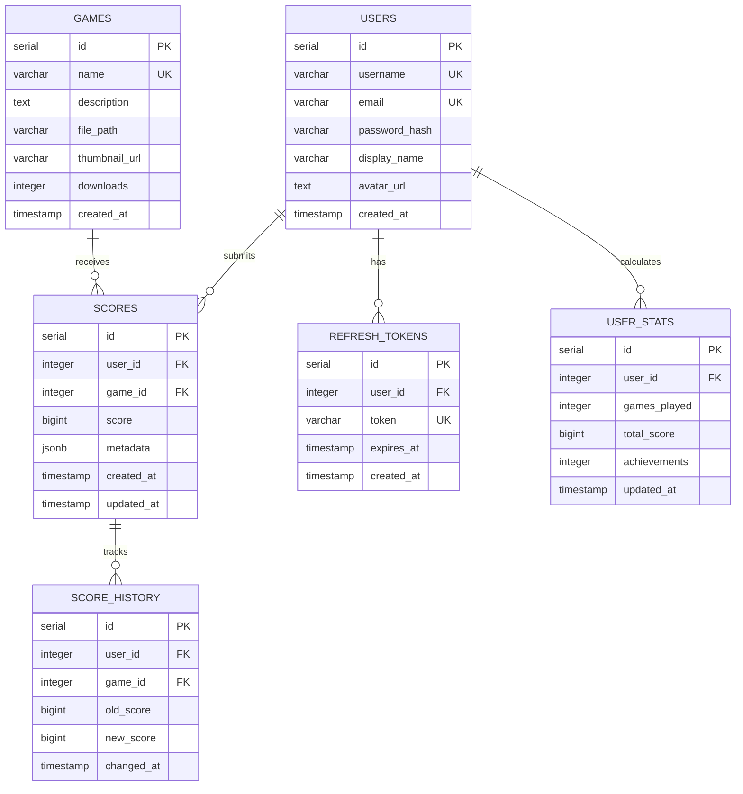

## Base de Datos Unificada

El backend utiliza **una sola base de datos PostgreSQL** con auto-inicialización del esquema. Al iniciar por primera vez, el servicio crea automáticamente todas las tablas necesarias.

<Info>
La base de datos se inicializa automáticamente en el primer arranque ejecutando el script `src/config/init-schema.sql`
</Info>

## Diagrama ER



## Tablas Principales

### users

Almacena información de usuarios registrados con autenticación.

```sql
CREATE TABLE users (
    id SERIAL PRIMARY KEY,
    username VARCHAR(50) UNIQUE NOT NULL,
    email VARCHAR(255) UNIQUE,
    password_hash VARCHAR(255) NOT NULL,  -- bcrypt hash
    display_name VARCHAR(100),
    avatar_url TEXT,
    created_at TIMESTAMP DEFAULT CURRENT_TIMESTAMP,
    updated_at TIMESTAMP DEFAULT CURRENT_TIMESTAMP
);

-- Índices
CREATE INDEX idx_users_username ON users(username);
CREATE INDEX idx_users_email ON users(email);
```

**Campos clave:**
- `username`: Identificador único del usuario (requerido para login)
- `password_hash`: Hash bcrypt con 10 rounds (nunca almacenar contraseñas en texto plano)
- `email`: Opcional, para recuperación de cuenta
- `display_name`: Nombre visible en rankings (por defecto = username)

### games

Catálogo de juegos disponibles en la plataforma.

```sql
CREATE TABLE games (
    id SERIAL PRIMARY KEY,
    name VARCHAR(100) UNIQUE NOT NULL,
    description TEXT,
    file_path VARCHAR(255) NOT NULL,      -- Ruta del .jsdos en CDN
    thumbnail_url VARCHAR(255),
    downloads INTEGER DEFAULT 0,
    created_at TIMESTAMP DEFAULT CURRENT_TIMESTAMP,
    updated_at TIMESTAMP DEFAULT CURRENT_TIMESTAMP
);

-- Índices
CREATE INDEX idx_games_name ON games(name);
```

**Datos de ejemplo:**
```sql
INSERT INTO games (name, description, file_path, thumbnail_url) VALUES
('DOOM', 'Shooter clásico de id Software', '/cdn/juegos/doom.jsdos', '/cdn/img/doom.png'),
('Duke Nukem 3D', 'Acción en primera persona', '/cdn/juegos/duke3d.jsdos', '/cdn/img/duke3d.png'),
('Mortal Kombat', 'Fighting game legendario', '/cdn/juegos/mortalkombat.jsdos', '/cdn/img/mk.png');
```

### scores

Almacena la **mejor puntuación** de cada usuario por juego.

```sql
CREATE TABLE scores (
    id SERIAL PRIMARY KEY,
    user_id INTEGER NOT NULL REFERENCES users(id) ON DELETE CASCADE,
    game_id INTEGER NOT NULL REFERENCES games(id) ON DELETE CASCADE,
    score BIGINT NOT NULL DEFAULT 0,
    metadata JSONB,                      -- Datos extra: nivel, tiempo, etc.
    created_at TIMESTAMP DEFAULT CURRENT_TIMESTAMP,
    updated_at TIMESTAMP DEFAULT CURRENT_TIMESTAMP,
    UNIQUE(user_id, game_id)            -- Un score por usuario/juego
);

-- Índices para performance de rankings
CREATE INDEX idx_scores_user_id ON scores(user_id);
CREATE INDEX idx_scores_game_id ON scores(game_id);
CREATE INDEX idx_scores_game_score ON scores(game_id, score DESC);
CREATE INDEX idx_scores_global ON scores(score DESC);
```

**Lógica de actualización:**
```javascript
// Solo actualizar si el nuevo score es mayor
const existingScore = await db.query(
  'SELECT score FROM scores WHERE user_id = $1 AND game_id = $2',
  [userId, gameId]
);

if (!existingScore || newScore > existingScore.score) {
  await db.query(
    'INSERT INTO scores (user_id, game_id, score) VALUES ($1, $2, $3)
     ON CONFLICT (user_id, game_id) DO UPDATE SET score = $3, updated_at = NOW()',
    [userId, gameId, newScore]
  );
}
```

### score_history

Historial de cambios de puntuaciones para auditoría.

```sql
CREATE TABLE score_history (
    id SERIAL PRIMARY KEY,
    user_id INTEGER NOT NULL REFERENCES users(id) ON DELETE CASCADE,
    game_id INTEGER NOT NULL REFERENCES games(id) ON DELETE CASCADE,
    old_score BIGINT,
    new_score BIGINT NOT NULL,
    changed_at TIMESTAMP DEFAULT CURRENT_TIMESTAMP
);

-- Índice para consultas de historial
CREATE INDEX idx_score_history_user ON score_history(user_id, changed_at DESC);
```

**Trigger automático:**
```sql
CREATE OR REPLACE FUNCTION log_score_change()
RETURNS TRIGGER AS $$
BEGIN
    INSERT INTO score_history (user_id, game_id, old_score, new_score)
    VALUES (NEW.user_id, NEW.game_id, OLD.score, NEW.score);
    RETURN NEW;
END;
$$ LANGUAGE plpgsql;

CREATE TRIGGER score_update_trigger
AFTER UPDATE ON scores
FOR EACH ROW
WHEN (OLD.score IS DISTINCT FROM NEW.score)
EXECUTE FUNCTION log_score_change();
```

### user_stats

Estadísticas agregadas por usuario (calculadas periódicamente).

```sql
CREATE TABLE user_stats (
    id SERIAL PRIMARY KEY,
    user_id INTEGER UNIQUE NOT NULL REFERENCES users(id) ON DELETE CASCADE,
    games_played INTEGER DEFAULT 0,
    total_score BIGINT DEFAULT 0,
    achievements INTEGER DEFAULT 0,
    global_rank INTEGER,
    updated_at TIMESTAMP DEFAULT CURRENT_TIMESTAMP
);

-- Índice para rankings
CREATE INDEX idx_user_stats_rank ON user_stats(total_score DESC);
```

**Actualización periódica:**
```sql
-- View materializada para performance
CREATE MATERIALIZED VIEW user_stats_mv AS
SELECT 
    u.id AS user_id,
    COUNT(DISTINCT s.game_id) AS games_played,
    COALESCE(SUM(s.score), 0) AS total_score,
    RANK() OVER (ORDER BY COALESCE(SUM(s.score), 0) DESC) AS global_rank
FROM users u
LEFT JOIN scores s ON u.id = s.user_id
GROUP BY u.id;

-- Refresh cada hora
REFRESH MATERIALIZED VIEW user_stats_mv;
```

### refresh_tokens

Gestión de tokens de refresco para sesiones persistentes.

```sql
CREATE TABLE refresh_tokens (
    id SERIAL PRIMARY KEY,
    user_id INTEGER NOT NULL REFERENCES users(id) ON DELETE CASCADE,
    token VARCHAR(255) UNIQUE NOT NULL,
    expires_at TIMESTAMP NOT NULL,
    created_at TIMESTAMP DEFAULT CURRENT_TIMESTAMP
);

-- Índices
CREATE INDEX idx_refresh_tokens_user ON refresh_tokens(user_id);
CREATE INDEX idx_refresh_tokens_token ON refresh_tokens(token);
CREATE INDEX idx_refresh_tokens_expires ON refresh_tokens(expires_at);
```

**Limpieza automática de tokens expirados:**
```sql
-- Ejecutar diariamente
DELETE FROM refresh_tokens WHERE expires_at < NOW();
```

## Queries Comunes

### Obtener Ranking Global

```sql
SELECT 
    u.username,
    u.display_name,
    SUM(s.score) AS total_score,
    COUNT(DISTINCT s.game_id) AS games_played,
    RANK() OVER (ORDER BY SUM(s.score) DESC) AS position
FROM users u
INNER JOIN scores s ON u.id = s.user_id
GROUP BY u.id, u.username, u.display_name
ORDER BY total_score DESC
LIMIT 100;
```

### Obtener Ranking por Juego

```sql
SELECT 
    u.username,
    u.display_name,
    s.score,
    s.updated_at,
    RANK() OVER (ORDER BY s.score DESC) AS position
FROM scores s
INNER JOIN users u ON s.user_id = u.id
WHERE s.game_id = $1
ORDER BY s.score DESC
LIMIT 100;
```

### Estadísticas de Usuario

```sql
SELECT 
    u.username,
    COUNT(DISTINCT s.game_id) AS games_played,
    SUM(s.score) AS total_score,
    AVG(s.score) AS avg_score,
    MAX(s.score) AS best_score
FROM users u
LEFT JOIN scores s ON u.id = s.user_id
WHERE u.id = $1
GROUP BY u.id, u.username;
```

## Migrations

El proyecto NO utiliza herramientas de migration como Prisma o TypeORM. Las tablas se crean automáticamente mediante script SQL.

### Script de Inicialización

```javascript
// src/config/database.js
const { Pool } = require('pg');
const fs = require('fs');

const pool = new Pool({
  connectionString: process.env.DATABASE_URL
});

async function initDatabase() {
  try {
    const schema = fs.readFileSync('./src/config/init-schema.sql', 'utf8');
    await pool.query(schema);
    console.log('✅ Database schema initialized');
  } catch (error) {
    console.error('❌ Error initializing database:', error);
    process.exit(1);
  }
}

module.exports = { pool, initDatabase };
```

## Backup y Restore

### Backup Completo

```bash
# Dump completo
pg_dump -h localhost -U postgres -d retrogamedb -F c -f backup_$(date +%Y%m%d).dump

# Backup solo datos (sin esquema)
pg_dump -h localhost -U postgres -d retrogamedb --data-only -f data_backup.sql
```

### Restore

```bash
# Restore desde dump
pg_restore -h localhost -U postgres -d retrogamedb backup_20241207.dump

# Restore desde SQL
psql -h localhost -U postgres -d retrogamedb -f data_backup.sql
```

## Próximos Pasos

<CardGroup cols={2}>
  <Card title="API Endpoints" icon="code" href="/backend/api-endpoints">
    Documentación de todos los endpoints
  </Card>
  <Card title="Backend Overview" icon="server" href="/backend/overview">
    Arquitectura del backend unificado
  </Card>
</CardGroup>
