## Flujo Completo CI/CD

RetroGame Cloud implementa un pipeline completo de CI/CD que automatiza desde el commit hasta el despliegue en producción, incluyendo validación exhaustiva y tests end-to-end.

```mermaid
graph TB
    A[📝 Commit to main] --> B[🔨 GitHub Actions Build]
    B --> C[🧪 Unit Tests]
    C --> D[🎭 E2E Tests]
    D --> E[🔍 Security Scan]
    E --> F[🐳 Build Docker Image]
    F --> G[📦 Push to ECR]
    G --> H[📋 Update K8s Manifests]
    H --> I[🔄 ArgoCD Sync]
    I --> J[🚀 Deploy to EKS]
    J --> K[💨 Smoke Tests]
    K --> L[✅ Production Ready]

    C -->|❌ Fail| M[🚫 Stop Pipeline]
    D -->|❌ Fail| M
    E -->|🚨 Vulnerabilities| M
    K -->|❌ Fail| N[🔄 Rollback]

    style A fill:#e1f5fe
    style L fill:#e8f5e8
    style M fill:#ffebee
    style N fill:#fff3e0

```



## Workflows Implementados

<CardGroup cols={3}>
  <Card title="docker-publish-and-update-k8s.yml" icon="docker">
    **Pipeline principal CI/CD**

    Build, test E2E, push Docker y actualizar manifiestos K8s

    *En todos los servicios*
  </Card>

  <Card title="ci.yml" icon="check">
    **Validación de manifiestos**

    Tests y validación de YAMLs de Kubernetes

    *Repo: kubernetes/*
  </Card>

  <Card title="e2e-tests.yml" icon="play">
    **Tests End-to-End**

    Validación de flujos completos de usuario

    *Todos los repos de servicios*
  </Card>

  <Card title="update-docs-with-claude.yml" icon="robot">
    **Actualización automática de docs**

    Claude AI actualiza la wiki/documentación

    *Repo: docs/*
  </Card>

  <Card title="deploy-mintlify-docs.yml" icon="book">
    **Despliegue de documentación**

    Deploy automático a Mintlify

    *Repo: docs/*
  </Card>

  <Card title="terraform-plan.yml" icon="code">
    **Validación de Terraform**

    Plan y validación de infraestructura

    *Repo: infrastructure/*
  </Card>

  <Card title="terraform-apply.yml" icon="rocket">
    **Despliegue de infraestructura**

    Apply de Terraform en producción

    *Repo: infrastructure/*
  </Card>
</CardGroup>

- --

## Workflow Principal: Build & Deploy

Este es el workflow que se ejecuta en cada repositorio de servicio (frontend, auth, game-catalog, score, ranking, user).

### Estructura del Workflow

<CodeGroup>

```yaml Configuración
name: Compilar, Publicar y Actualizar Kubernetes

on:
  push:
    branches:
      - main
    paths-ignore:
      - '**.md'
      - '.gitignore'
  pull_request:
    branches:
      - main
    paths-ignore:
      - '**.md'
      - '.gitignore'

env:
  REGISTRY: 471112987599.dkr.ecr.us-east-1.amazonaws.com
  IMAGE_NAME: retrogame-cloud-auth
  AWS_REGION: us-east-1

```

```yaml Jobs - Build y Test
jobs:
  build-and-push:
    runs-on: ubuntu-latest
    permissions:
      contents: read
      packages: write

    steps:
    - name: Checkout repository
      uses: actions/checkout@v4

    - name: Set up Node.js
      uses: actions/setup-node@v4
      with:
        node-version: '20'
        cache: 'npm'

    - name: Install dependencies
      run: npm ci

    - name: Run unit tests
      run: npm test

    - name: Run E2E tests
      run: npm run test:e2e

```

```yaml Security y Docker
    - name: Run security audit
      run: npm audit --audit-level high

    - name: Configure AWS credentials
      uses: aws-actions/configure-aws-credentials@v4
      with:
        aws-access-key-id: ${{ secrets.AWS_ACCESS_KEY_ID }}
        aws-secret-access-key: ${{ secrets.AWS_SECRET_ACCESS_KEY }}
        aws-region: ${{ env.AWS_REGION }}

    - name: Login to Amazon ECR
      uses: aws-actions/amazon-ecr-login@v2

    - name: Build Docker image
      run: |
        docker build -t $REGISTRY/$IMAGE_NAME:$GITHUB_SHA .
        docker build -t $REGISTRY/$IMAGE_NAME:latest .

    - name: Push to ECR
      run: |
        docker push $REGISTRY/$IMAGE_NAME:$GITHUB_SHA
        docker push $REGISTRY/$IMAGE_NAME:latest

```

```yaml Update Kubernetes
    - name: Update Kubernetes manifests
      run: |
        git clone https://github.com/cuervolu/retrogame-cloud-kubernetes.git
        cd retrogame-cloud-kubernetes

        # Update image tag in deployment
        sed -i "s|image: $REGISTRY/$IMAGE_NAME:.*|image: $REGISTRY/$IMAGE_NAME:$GITHUB_SHA|g" \
          manifests/auth/deployment.yaml

        # Commit and push changes
        git config --local user.email "action@github.com"
        git config --local user.name "GitHub Action"
        git add .
        git commit -m "Update $IMAGE_NAME to $GITHUB_SHA" || exit 0
        git push

```

</CodeGroup>

### Características Clave

<CardGroup cols={2}>
  <Card title="Tests Automáticos" icon="vial">
    - Unit tests con Jest
    - E2E tests con Playwright
    - Security audit con npm
    - Smoke tests post-deploy
  </Card>

  <Card title="Integración GitOps" icon="git-branch">
    - Push automático a ECR
    - Update de manifiestos K8s
    - ArgoCD detecta cambios
    - Deploy automático a EKS
  </Card>

  <Card title="Seguridad" icon="shield-check">
    - Scan de vulnerabilidades
    - Secrets en GitHub Secrets
    - RBAC en EKS
    - Network policies
  </Card>

  <Card title="Rollback Automático" icon="arrow-rotate-left">
    - Health checks fallan → rollback
    - Smoke tests fallan → rollback
    - Preserva versión anterior
    - Notificación a equipo
  </Card>
</CardGroup>

- --

## Smoke Tests Post-Deploy

Después de cada despliegue, se ejecutan smoke tests para validar la funcionalidad básica:

<CodeGroup>

```yaml Smoke Tests Workflow
name: Post-Deploy Smoke Tests

on:
  repository_dispatch:
    types: [deployment-complete]

jobs:
  smoke-tests:
    runs-on: ubuntu-latest
    steps:
    - name: Health Check API
      run: |
        curl -f https://api.retrogame-cloud.com/health || exit 1

    - name: Test Authentication
      run: |
        response=$(curl -s -X POST https://api.retrogame-cloud.com/auth/login \
          -H "Content-Type: application/json" \
          -d '{"email":"test@example.com","password":"test123"}')
        echo $response | jq '.token' || exit 1

    - name: Test Game Catalog
      run: |
        curl -f https://api.retrogame-cloud.com/games || exit 1

```

```bash Rollback on Failure
    - name: Rollback on failure
      if: failure()
      run: |
        # Trigger ArgoCD rollback
        argocd app rollback retrogame-cloud --revision HEAD~1

        # Notify team
        curl -X POST ${{ secrets.SLACK_WEBHOOK }} \
          -d '{"text":"🚨 Smoke tests failed. Rolling back deployment."}'

```

</CodeGroup>

## Métricas y Monitoring

El pipeline reporta métricas clave para visibilidad del proceso:

- **Build time**: Tiempo total del pipeline

- **Test coverage**: Cobertura de tests unitarios y E2E

- **Security score**: Resultado del análisis de vulnerabilidades

- **Deploy frequency**: Frecuencia de despliegues exitosos

- **Mean time to recovery**: Tiempo promedio de recuperación ante fallos

<Tip>
Todas las métricas se envían a CloudWatch para análisis y alertas automáticas.
</Tip>