## Workflows Implementados

RetroGame Cloud utiliza GitHub Actions para automatizar completamente el ciclo de vida del código desde commit hasta producción.

<CardGroup cols={3}>
  <Card title="docker-publish-and-update-k8s.yml" icon="docker">
    **Pipeline principal CI/CD**

    Build, test, push Docker y actualizar manifiestos K8s
    
    *En todos los servicios*
  </Card>
  
  <Card title="ci.yml" icon="check">
    **Validación de manifiestos**

    Tests y validación de YAMLs de Kubernetes
    
    *Repo: kubernetes/*
  </Card>
  
  <Card title="update-docs-with-claude.yml" icon="robot">
    **Actualización automática de docs**

    Claude AI actualiza la wiki/documentación
    
    *Repo: docs/*
  </Card>
  
  <Card title="deploy-mintlify-docs.yml" icon="book">
    **Despliegue de documentación**

    Deploy automático a Mintlify
    
    *Repo: docs/*
  </Card>
  
  <Card title="terraform-plan.yml" icon="code">
    **Validación de Terraform**

    Plan y validación de infraestructura
    
    *Repo: infrastructure/*
  </Card>
  
  <Card title="terraform-apply.yml" icon="rocket">
    **Despliegue de infraestructura**

    Apply de Terraform en producción
    
    *Repo: infrastructure/*
  </Card>
</CardGroup>

---

## Workflow Principal: Build & Deploy

Este es el workflow que se ejecuta en cada repositorio de servicio (frontend, auth, game-catalog, score, ranking, user).

### Estructura del Workflow

<CodeGroup>

```yaml Configuración
name: Compilar, Publicar y Actualizar Kubernetes

on:
  push:
    branches:
      - main
    paths-ignore:
      - '**.md'
      - '.gitignore'
  pull_request:
    branches:
      - main
    paths-ignore:
      - '**.md'
      - '.gitignore'

env:
  REGISTRY_GHCR: ghcr.io
  REGISTRY_DOCKERHUB: docker.io
  IMAGE_NAME: retrogamecloud/frontend  # Cambia por servicio
  K8S_REPO: retrogamecloud/kubernetes
  K8S_MANIFEST_FILE: 04-frontend.yaml  # Cambia por servicio
```

</CodeGroup>

### Job 1: Tests

Ejecuta tests unitarios y de integración.

<Steps>
  <Step title="Configurar Entorno">
    ```yaml
    - name: Clonar repositorio
      uses: actions/checkout@v4
    
    - name: Configurar Node.js
      uses: actions/setup-node@v4
      with:
        node-version: '20'
        cache: 'npm'
    ```
  </Step>
  <Step title="Instalar Dependencias">
    ```yaml
    - name: Instalar dependencias
      run: npm ci
    ```

    Usa `npm ci` en lugar de `npm install` para:

    - Instalación más rápida
    - Reproducibilidad garantizada
    - Respeta package-lock.json exactamente
  </Step>
  <Step title="Ejecutar Tests">
    ```yaml
    - name: Ejecutar tests
      run: npm test
    
    - name: Generar reporte de cobertura
      run: npm run test:coverage
    ```

    Los tests deben pasar con mínimo 80% de cobertura.
  </Step>
  <Step title="Subir Cobertura">
    ```yaml
    - name: Subir reporte de cobertura
      uses: codecov/codecov-action@v3
      if: always()
      with:
        files: ./coverage/lcov.info
        flags: unittests
        name: frontend-coverage
    ```

    Se ejecuta incluso si los tests fallan (`if: always()`).
  </Step>
</Steps>

### Job 2: Build & Push Docker

Construye y publica la imagen Docker.

<Steps>
  <Step title="Setup Docker">
    ```yaml
    - name: Configurar Docker Buildx
      uses: docker/setup-buildx-action@v3
    ```

    Buildx permite:

    - Multi-platform builds
    - Cache avanzado
    - BuildKit features
  </Step>
  <Step title="Login en Registries">
    ```yaml
    - name: Iniciar sesión en GitHub Container Registry
      uses: docker/login-action@v3
      with:
        registry: ${{ env.REGISTRY_GHCR }}
        username: ${{ github.actor }}
        password: ${{ secrets.GITHUB_TOKEN }}
    
    - name: Iniciar sesión en Docker Hub
      uses: docker/login-action@v3
      with:
        registry: ${{ env.REGISTRY_DOCKERHUB }}
        username: ${{ secrets.DOCKERHUB_USERNAME }}
        password: ${{ secrets.DOCKERHUB_TOKEN }}
    ```

    Publicamos en dos registries para redundancia.
  </Step>
  <Step title="Generar Versión">
    ```yaml
    - name: Generar etiqueta de versión y SHA
      id: version
      run: |
        COMMIT_COUNT=$(git rev-list --count HEAD)
        VERSION="v1.0.${COMMIT_COUNT}"
        SHORT_SHA=$(git rev-parse --short HEAD)
        
        echo "version=${VERSION}" >> $GITHUB_OUTPUT
        echo "short_sha=${SHORT_SHA}" >> $GITHUB_OUTPUT
    ```

    **Versionado semántico automático:**

    - `v1.0.1` → Primer commit
    - `v1.0.50` → Commit número 50
    - `sha-a1b2c3d` → SHA corto del commit
  </Step>
  <Step title="Build y Push">
    ```yaml
    - name: Compilar y publicar imagen Docker
      uses: docker/build-push-action@v5
      with:
        context: .
        push: true
        tags: |
          retrogamehub/frontend:latest
          retrogamehub/frontend:${{ steps.version.outputs.version }}
          retrogamehub/frontend:sha-${{ steps.version.outputs.short_sha }}
        cache-from: type=registry,ref=ghcr.io/retrogamecloud/frontend:buildcache
        cache-to: type=registry,ref=ghcr.io/retrogamecloud/frontend:buildcache,mode=max
        platforms: linux/amd64
    ```

    **Tres tags por build:**

    1. `latest` - Última versión estable
    2. `v1.0.X` - Versión específica
    3. `sha-XXXXXX` - Commit específico
  </Step>
</Steps>

### Job 3: Update Kubernetes Manifest

Actualiza el repositorio GitOps con la nueva imagen.

<Steps>
  <Step title="Clonar Repo Kubernetes">
    ```yaml
    - name: Clonar repositorio de Kubernetes
      uses: actions/checkout@v4
      with:
        repository: ${{ env.K8S_REPO }}
        token: ${{ secrets.K8S_UPDATE_TOKEN }}
        ref: main
    ```

    Usa un Personal Access Token (PAT) con permisos:

    - `repo` (acceso completo)
    - `workflow` (crear PRs)
  </Step>
  <Step title="Actualizar YAML">
    ```yaml
    - name: Actualizar manifiesto de Kubernetes
      run: |
        IMAGE_TAG="sha-${SHORT_SHA}"
        
        sed -i "s|image: retrogamehub/frontend:.*|image: retrogamehub/frontend:${IMAGE_TAG}|g" 04-frontend.yaml
        
        sed -i "s|# Imagen del frontend.*|# Imagen del frontend - ${VERSION} (${IMAGE_TAG})|g" 04-frontend.yaml
    ```

    Usa `sed` para actualizar:

    - La línea `image:` con el nuevo tag
    - El comentario con la versión
  </Step>
  <Step title="Crear Pull Request">
    ```yaml
    - name: Crear rama y PR con cambios
      run: |
        BRANCH_NAME="auto/frontend-${IMAGE_TAG}"
        
        git checkout -b "${BRANCH_NAME}"
        git add 04-frontend.yaml
        git commit -m "chore: Actualizar imagen de frontend a ${IMAGE_TAG}"
        git push origin "${BRANCH_NAME}"
        
        gh pr create \
          --repo retrogamecloud/kubernetes \
          --base main \
          --head "${BRANCH_NAME}" \
          --title "chore(frontend): Actualizar a ${IMAGE_TAG}" \
          --body "Version: ${VERSION}, SHA: ${SHORT_SHA}"
      env:
        GH_TOKEN: ${{ secrets.K8S_UPDATE_TOKEN }}
    ```

    Cada despliegue crea un PR automático con:

    - Rama descriptiva
    - Mensaje de commit estructurado
    - Metadata en el body del PR
  </Step>
</Steps>

## Workflow de Validación: Manifiestos K8s

Este workflow valida los manifiestos de Kubernetes en el repositorio `kubernetes/`.

```yaml
name: Kubernetes Manifests CI

on:
  push:
    branches: [ main ]
  pull_request:
    branches: [ main ]

jobs:
  test:
    runs-on: ubuntu-latest
    steps:
    - uses: actions/checkout@v4
    
    - name: Setup Node.js
      uses: actions/setup-node@v4
      with:
        node-version: '20'
    
    - name: Install dependencies
      run: npm install
    
    - name: Run tests
      run: npm test
    
    - name: Upload coverage to Codecov
      uses: codecov/codecov-action@v4
      with:
        file: ./coverage/lcov.info

  validate-yamls:
    runs-on: ubuntu-latest
    steps:
    - uses: actions/checkout@v4
    
    - name: Validate YAML syntax
      run: |
        sudo apt-get install -y yamllint
        yamllint *.yaml

  kubectl-validate:
    runs-on: ubuntu-latest
    steps:
    - uses: actions/checkout@v4
    
    - name: Setup kubectl
      uses: azure/setup-kubectl@v4
    
    - name: Setup kind
      uses: helm/kind-action@v1.10.0
      with:
        install_only: true
    
    - name: Create kind cluster
      run: kind create cluster
    
    - name: Validate Kubernetes manifests
      run: |
        for file in *.yaml; do
          kubectl apply --dry-run=client -f "$file"
        done
```

**Tres niveles de validación:**

1. **Tests unitarios**: Valida estructura de YAMLs
2. **yamllint**: Valida sintaxis YAML
3. **kubectl dry-run**: Valida que sean manifiestos K8s válidos

---

## 🤖 Workflow: Actualización Automática de Documentación con Claude

Este es el workflow más innovador del proyecto: utiliza **Claude AI** para mantener la documentación actualizada automáticamente.

### ¿Qué hace?

Cuando se hace un cambio importante en el proyecto (código, infraestructura, configuración), Claude:
1. 📖 Lee los cambios del commit
2. 🔍 Analiza qué documentación necesita actualizarse
3. ✍️ Genera las actualizaciones necesarias
4. 📝 Crea un Pull Request con los cambios

### Estructura del Workflow

```yaml
name: Update Documentation with Claude

on:
  workflow_dispatch:  # Manual trigger
    inputs:
      change_description:
        description: 'Descripción del cambio a documentar'
        required: true
        type: string
      affected_areas:
        description: 'Áreas afectadas (comma-separated): api,infrastructure,deployment'
        required: false
        type: string
  
  repository_dispatch:  # Trigger desde otros repos
    types: [code-change-requires-docs]

jobs:
  update-documentation:
    runs-on: ubuntu-latest
    permissions:
      contents: write
      pull-requests: write
    
    steps:
      - name: Checkout docs repository
        uses: actions/checkout@v4
        with:
          fetch-depth: 0
      
      - name: Setup Node.js
        uses: actions/setup-node@v4
        with:
          node-version: '20'
      
      - name: Instalar dependencias
        run: |
          npm install --global @anthropic-ai/sdk
          npm install yaml markdown-it
      
      - name: Obtener contexto del cambio
        id: context
        run: |
          # Si es workflow_dispatch, usar inputs
          if [ "${{ github.event_name }}" == "workflow_dispatch" ]; then
            echo "description=${{ inputs.change_description }}" >> $GITHUB_OUTPUT
            echo "areas=${{ inputs.affected_areas }}" >> $GITHUB_OUTPUT
          else
            # Si es repository_dispatch, usar payload
            echo "description=${{ github.event.client_payload.description }}" >> $GITHUB_OUTPUT
            echo "areas=${{ github.event.client_payload.areas }}" >> $GITHUB_OUTPUT
            echo "commit_sha=${{ github.event.client_payload.commit_sha }}" >> $GITHUB_OUTPUT
          fi
      
      - name: Llamar a Claude API para generar actualizaciones
        id: claude
        env:
          ANTHROPIC_API_KEY: ${{ secrets.ANTHROPIC_API_KEY }}
        run: |
          node .github/scripts/update-docs-with-claude.js \
            --description "${{ steps.context.outputs.description }}" \
            --areas "${{ steps.context.outputs.areas }}" \
            --commit "${{ steps.context.outputs.commit_sha }}"
      
      - name: Crear branch para cambios
        run: |
          BRANCH_NAME="docs/auto-update-$(date +%Y%m%d-%H%M%S)"
          git checkout -b "$BRANCH_NAME"
          echo "branch_name=$BRANCH_NAME" >> $GITHUB_ENV
      
      - name: Commit cambios
        run: |
          git config user.name "Claude Documentation Bot"
          git config user.email "bot@retrogamehub.games"
          
          git add .
          git commit -m "docs: actualización automática por Claude
          
          Cambio: ${{ steps.context.outputs.description }}
          Áreas afectadas: ${{ steps.context.outputs.areas }}
          
          Co-authored-by: Claude AI <claude@anthropic.com>"
      
      - name: Push branch
        run: git push origin "${{ env.branch_name }}"
      
      - name: Crear Pull Request
        env:
          GH_TOKEN: ${{ secrets.GITHUB_TOKEN }}
        run: |
          gh pr create \
            --title "📚 docs: Actualización automática - ${{ steps.context.outputs.description }}" \
            --body "## 🤖 Actualización Automática de Documentación
          
          Claude AI ha detectado cambios que requieren actualización de documentación.
          
          ### Cambio Original
          ${{ steps.context.outputs.description }}
          
          ### Áreas Afectadas
          ${{ steps.context.outputs.areas }}
          
          ### Archivos Modificados
          $(git diff --name-only HEAD~1)
          
          ### Checklist de Revisión
          - [ ] Los cambios reflejan correctamente las actualizaciones del código
          - [ ] La redacción es clara y concisa
          - [ ] Los ejemplos de código son correctos
          - [ ] Los enlaces internos funcionan
          - [ ] No hay información sensible expuesta
          
          ---
          
          *Generado automáticamente por Claude AI*
          *Revisa y aprueba antes de merge*" \
            --label "documentation,automated" \
            --base main \
            --head "${{ env.branch_name }}"
```

### Script de Claude (update-docs-with-claude.js)

```javascript
// .github/scripts/update-docs-with-claude.js
const Anthropic = require('@anthropic-ai/sdk');
const fs = require('fs').promises;
const path = require('path');
const yaml = require('yaml');

const anthropic = new Anthropic({
  apiKey: process.env.ANTHROPIC_API_KEY,
});

async function main() {
  const args = parseArgs();
  
  // 1. Leer estructura de documentación
  const docsStructure = await getDocsStructure();
  
  // 2. Identificar archivos relevantes
  const relevantFiles = await identifyRelevantFiles(args.areas);
  
  // 3. Leer contenido actual
  const currentContent = await readFiles(relevantFiles);
  
  // 4. Llamar a Claude para generar actualizaciones
  const updates = await generateUpdates(
    args.description,
    args.areas,
    currentContent,
    docsStructure
  );
  
  // 5. Aplicar cambios
  await applyUpdates(updates);
  
  console.log('✅ Documentación actualizada exitosamente');
}

async function generateUpdates(description, areas, content, structure) {
  const message = await anthropic.messages.create({
    model: 'claude-sonnet-4-20250514',
    max_tokens: 16000,
    temperature: 0.7,
    messages: [{
      role: 'user',
      content: `Eres un experto en documentación técnica. 

Cambio realizado:
${description}

Áreas afectadas: ${areas}

Estructura de documentación actual:
${JSON.stringify(structure, null, 2)}

Contenido actual de archivos relevantes:
${JSON.stringify(content, null, 2)}

Genera actualizaciones necesarias para la documentación en formato JSON:
{
  "files": [
    {
      "path": "ruta/archivo.mdx",
      "action": "update|create",
      "changes": [
        {
          "section": "nombre de sección",
          "oldContent": "contenido a reemplazar (si update)",
          "newContent": "nuevo contenido"
        }
      ],
      "reasoning": "por qué este cambio es necesario"
    }
  ],
  "summary": "resumen de cambios realizados"
}`
    }]
  });
  
  const response = message.content[0].text;
  return JSON.parse(response);
}

async function applyUpdates(updates) {
  for (const file of updates.files) {
    const filePath = path.join(process.cwd(), file.path);
    
    if (file.action === 'create') {
      // Crear nuevo archivo
      await fs.mkdir(path.dirname(filePath), { recursive: true });
      await fs.writeFile(filePath, file.changes[0].newContent);
      console.log(`✅ Creado: ${file.path}`);
    } else {
      // Actualizar archivo existente
      let content = await fs.readFile(filePath, 'utf-8');
      
      for (const change of file.changes) {
        if (change.oldContent) {
          content = content.replace(change.oldContent, change.newContent);
        } else {
          // Añadir al final de la sección
          content += '\n\n' + change.newContent;
        }
      }
      
      await fs.writeFile(filePath, content);
      console.log(`✅ Actualizado: ${file.path}`);
    }
  }
}

// ... más funciones helper ...

main().catch(console.error);
```

### Triggers del Workflow

#### 1. Manual (workflow_dispatch)

```bash
# Desde GitHub UI: Actions → Update Documentation → Run workflow

# O desde CLI:
gh workflow run update-docs-with-claude.yml \
  -f change_description="Añadido nuevo endpoint /api/v2/users" \
  -f affected_areas="api,backend"
```

#### 2. Automático desde otros repos

En el workflow de un servicio:

```yaml
- name: Trigger documentación update
  if: github.event_name == 'push' && github.ref == 'refs/heads/main'
  run: |
    curl -X POST \
      -H "Authorization: token ${{ secrets.DOCS_UPDATE_TOKEN }}" \
      -H "Accept: application/vnd.github.v3+json" \
      https://api.github.com/repos/retrogamecloud/docs/dispatches \
      -d '{
        "event_type": "code-change-requires-docs",
        "client_payload": {
          "description": "Nuevo endpoint añadido en auth-service",
          "areas": "api,authentication",
          "commit_sha": "${{ github.sha }}",
          "repository": "${{ github.repository }}"
        }
      }'
```

### Ejemplos de Uso

<Tabs>
  <Tab title="Nuevo Endpoint API">
    **Cambio**: Añadido endpoint `POST /api/auth/refresh-token`
    
    **Claude actualiza**:
    - `api-reference/auth/refresh-token.mdx` (nuevo)
    - `api-reference/auth-service.mdx` (añade referencia)
    - `quickstart.mdx` (actualiza ejemplo de autenticación)
    - `CHANGELOG.md` (añade entrada)
  </Tab>
  
  <Tab title="Nueva Variable Terraform">
    **Cambio**: Añadida variable `enable_waf` en Terraform
    
    **Claude actualiza**:
    - `infrastructure/terraform-variables.mdx` (documenta variable)
    - `deployment.mdx` (menciona en troubleshooting)
    - `quickstart.mdx` (añade a ejemplo de terraform.tfvars)
  </Tab>
  
  <Tab title="Cambio en ArgoCD">
    **Cambio**: Actualizado a ArgoCD v2.10.0
    
    **Claude actualiza**:
    - `infrastructure/argocd-gitops.mdx` (versión)
    - `CHANGELOG.md` (breaking changes si aplica)
    - `troubleshooting.mdx` (nuevos errores conocidos)
  </Tab>
</Tabs>

### Ventajas del Enfoque

<CardGroup cols={2}>
  <Card title="🚀 Documentación Always Up-to-Date" icon="check">
    La docs nunca se queda desactualizada porque se actualiza automáticamente con cada cambio
  </Card>
  
  <Card title="⏰ Ahorro de Tiempo" icon="clock">
    Los developers no pierden tiempo actualizando docs manualmente
  </Card>
  
  <Card title="🎯 Consistencia" icon="target">
    Claude mantiene un estilo y estructura consistente en toda la documentación
  </Card>
  
  <Card title="🔍 Cobertura Completa" icon="magnifying-glass">
    Claude identifica todas las áreas que necesitan actualización, no solo las obvias
  </Card>
</CardGroup>

### Configuración Necesaria

<Steps>
  <Step title="Obtener API Key de Anthropic">
    ```bash
    # 1. Ir a https://console.anthropic.com/
    # 2. Crear API Key
    # 3. Copiar el key (sk-ant-...)
    ```
  </Step>
  
  <Step title="Añadir Secret en GitHub">
    ```bash
    # Repo: docs
    # Settings → Secrets → Actions → New repository secret
    # Name: ANTHROPIC_API_KEY
    # Value: sk-ant-...
    ```
  </Step>
  
  <Step title="Configurar Permisos">
    ```yaml
    # En el workflow
    permissions:
      contents: write      # Para crear branches
      pull-requests: write # Para crear PRs
    ```
  </Step>
  
  <Step title="Crear Script">
    ```bash
    mkdir -p .github/scripts
    # Copiar update-docs-with-claude.js
    chmod +x .github/scripts/update-docs-with-claude.js
    ```
  </Step>
</Steps>

### Costos Estimados

<Table>
  <thead>
    <tr>
      <th>Métrica</th>
      <th>Valor</th>
    </tr>
  </thead>
  <tbody>
    <tr>
      <td>**Tokens por actualización**</td>
      <td>~8,000 input + 4,000 output</td>
    </tr>
    <tr>
      <td>**Costo por actualización**</td>
      <td>~$0.15 (Claude Sonnet 4)</td>
    </tr>
    <tr>
      <td>**Actualizaciones/mes**</td>
      <td>~20-30</td>
    </tr>
    <tr>
      <td>**Costo mensual total**</td>
      <td>**~$3-5/mes**</td>
    </tr>
  </tbody>
</Table>

<Note>
  El costo es mínimo comparado con el tiempo ahorrado (20-30 horas/mes de documentación manual).
</Note>

---

## 📚 Workflow: Despliegue de Documentación a Mintlify

Despliega automáticamente la documentación a Mintlify cuando hay cambios.

```yaml
name: Deploy to Mintlify

on:
  push:
    branches:
      - main
    paths:
      - '**.mdx'
      - '**.md'
      - 'mint.json'
      - 'images/**'

jobs:
  deploy:
    runs-on: ubuntu-latest
    steps:
      - uses: actions/checkout@v4
      
      - name: Deploy to Mintlify
        uses: mintlify/action@v1
        with:
          mintlify-api-key: ${{ secrets.MINTLIFY_API_KEY }}
          
      - name: Notify on Slack
        if: success()
        run: |
          curl -X POST ${{ secrets.SLACK_WEBHOOK }} \
            -H 'Content-Type: application/json' \
            -d '{
              "text": "✅ Documentación desplegada: https://docs.retrogamehub.games"
            }'
```

**Trigger**: Cualquier cambio en archivos `.mdx`, `.md` o `mint.json`

**Duración**: ~1-2 minutos

---

## 🏗️ Workflow: Validación de Terraform

Valida cambios en infraestructura antes de aplicarlos.

```yaml
name: Terraform Plan

on:
  pull_request:
    branches:
      - main
    paths:
      - 'terraform/**'
      - '**.tf'

jobs:
  terraform-plan:
    runs-on: ubuntu-latest
    defaults:
      run:
        working-directory: terraform/eks_test
    
    steps:
      - uses: actions/checkout@v4
      
      - name: Setup Terraform
        uses: hashicorp/setup-terraform@v3
        with:
          terraform_version: 1.6.6
      
      - name: Configure AWS Credentials
        uses: aws-actions/configure-aws-credentials@v4
        with:
          aws-access-key-id: ${{ secrets.AWS_ACCESS_KEY_ID }}
          aws-secret-access-key: ${{ secrets.AWS_SECRET_ACCESS_KEY }}
          aws-region: eu-west-1
      
      - name: Terraform Format Check
        run: terraform fmt -check -recursive
      
      - name: Terraform Init
        run: terraform init
      
      - name: Terraform Validate
        run: terraform validate
      
      - name: Terraform Plan
        id: plan
        run: |
          terraform plan -no-color -out=tfplan
          terraform show -no-color tfplan > plan_output.txt
      
      - name: Comment Plan on PR
        uses: actions/github-script@v7
        with:
          script: |
            const fs = require('fs');
            const plan = fs.readFileSync('terraform/eks_test/plan_output.txt', 'utf8');
            
            github.rest.issues.createComment({
              issue_number: context.issue.number,
              owner: context.repo.owner,
              repo: context.repo.repo,
              body: `## Terraform Plan
              
              \`\`\`terraform
              ${plan.slice(0, 65000)}
              \`\`\`
              
              [Ver plan completo en Actions](${context.payload.pull_request.html_url}/checks)`
            });
      
      - name: Check for Destructive Changes
        run: |
          if grep -q "destroy" plan_output.txt; then
            echo "⚠️ ADVERTENCIA: El plan incluye recursos a DESTRUIR"
            echo "destructive=true" >> $GITHUB_ENV
          fi
      
      - name: Upload Plan Artifact
        uses: actions/upload-artifact@v4
        with:
          name: terraform-plan
          path: terraform/eks_test/tfplan
```

**Características**:
- ✅ Valida formato de Terraform
- ✅ Ejecuta `terraform plan`
- ✅ Comenta el plan en el PR
- ✅ Detecta cambios destructivos
- ✅ Guarda plan para aplicar después

---

## 🚀 Workflow: Aplicar Terraform

Aplica cambios de infraestructura en producción (manual trigger).

```yaml
name: Terraform Apply

on:
  workflow_dispatch:
    inputs:
      confirm:
        description: 'Type "apply" to confirm'
        required: true
        type: string

jobs:
  terraform-apply:
    runs-on: ubuntu-latest
    if: github.event.inputs.confirm == 'apply'
    defaults:
      run:
        working-directory: terraform/eks_test
    
    steps:
      - uses: actions/checkout@v4
      
      - name: Setup Terraform
        uses: hashicorp/setup-terraform@v3
      
      - name: Configure AWS Credentials
        uses: aws-actions/configure-aws-credentials@v4
        with:
          aws-access-key-id: ${{ secrets.AWS_ACCESS_KEY_ID }}
          aws-secret-access-key: ${{ secrets.AWS_SECRET_ACCESS_KEY }}
          aws-region: eu-west-1
      
      - name: Terraform Init
        run: terraform init
      
      - name: Terraform Apply
        run: terraform apply -auto-approve
      
      - name: Save Outputs
        run: terraform output -json > terraform-outputs.json
      
      - name: Upload Outputs
        uses: actions/upload-artifact@v4
        with:
          name: terraform-outputs
          path: terraform/eks_test/terraform-outputs.json
      
      - name: Notify on Slack
        if: always()
        run: |
          STATUS="${{ job.status }}"
          
          if [ "$STATUS" == "success" ]; then
            ICON="✅"
            COLOR="good"
          else
            ICON="❌"
            COLOR="danger"
          fi
          
          curl -X POST ${{ secrets.SLACK_WEBHOOK }} \
            -H 'Content-Type: application/json' \
            -d "{
              \"attachments\": [{
                \"color\": \"$COLOR\",
                \"title\": \"$ICON Terraform Apply - $STATUS\",
                \"text\": \"Infraestructura actualizada en producción\",
                \"fields\": [
                  {
                    \"title\": \"Ejecutado por\",
                    \"value\": \"${{ github.actor }}\",
                    \"short\": true
                  },
                  {
                    \"title\": \"Commit\",
                    \"value\": \"${{ github.sha }}\",
                    \"short\": true
                  }
                ]
              }]
            }"
```

**Seguridad**:
- ⚠️ Solo manual trigger
- ⚠️ Requiere confirmación explícita
- ⚠️ Notifica en Slack
- ⚠️ Guarda outputs para auditoría

---

## 🚀 Mejoras Inteligentes del Workflow (2025)

El workflow de análisis inteligente ha sido **potenciado con 5 nuevas capacidades automáticas** que lo hacen mucho más eficiente y completo:

### 1. ⚡ Auto-fix de Quick Wins

Aplica **automáticamente** correcciones simples sin necesidad de review humano:

<CardGroup cols={2}>
  <Card title="✨ Iconos en Frontmatter" icon="icons">
    Añade iconos apropiados a archivos que no los tienen
  </Card>
  
  <Card title="📝 Descripciones Generadas" icon="file-lines">
    Genera descriptions automáticas basadas en títulos
  </Card>
  
  <Card title="📐 Formato Estandarizado" icon="align-left">
    Corrige espaciado de encabezados, listas y código
  </Card>
  
  <Card title="🔤 Títulos Normalizados" icon="heading">
    Estandariza capitalización y formato de títulos
  </Card>
</CardGroup>

```python
# Ejemplo de corrección automática
# ANTES:
---
title:introducción al sistema
---

# DESPUÉS:
---
title: Introducción al Sistema
description: Documentación sobre Introducción al Sistema
icon: book-open
---
```

**Ahorro de tiempo**: ~2-3 horas/semana en correcciones manuales

---

### 2. 🔄 Análisis Incremental con Cache

Sistema inteligente de cache que **reduce costos en 80-90%**:

<Steps>
  <Step title="Cache SHA256">
    Calcula hash de cada archivo para detectar cambios reales
  </Step>
  
  <Step title="Detección Git">
    Integra con `git diff` para ver archivos modificados
  </Step>
  
  <Step title="Análisis Selectivo">
    Solo analiza archivos que cambiaron desde último análisis
  </Step>
  
  <Step title="Full Analysis Programado">
    Análisis completo automático 1x/semana
  </Step>
</Steps>

```bash
# Ejemplo de output
🔄 Análisis INCREMENTAL
   📝 Cambios por git: 3 archivos
   🔒 Cambios por hash: 2 archivos
   ⚡ Total a analizar: 5/50 archivos
   💰 Ahorro: 90% en tokens/costos
```

**Reducción de costos**: De ~$20/mes a ~$3-5/mes

---

### 3. 🔗 Validación de Links

Verifica **todos los links** en la documentación automáticamente:

<Accordion title="Links Internos">
  - Verifica que archivos `.mdx` existan
  - Resuelve paths relativos y absolutos
  - Detecta links rotos entre secciones
  - Valida anchors dentro de páginas
</Accordion>

<Accordion title="Links Externos">
  - Hace requests HTTP HEAD/GET
  - Rate limiting configurable (0.5s por defecto)
  - Cache de URLs ya verificadas
  - Timeout de 10 segundos
</Accordion>

<Accordion title="Imágenes y Assets">
  - Verifica que imágenes existan
  - Valida CSS y JavaScript externos
  - Detecta assets rotos
  - Soporte para URLs remotas
</Accordion>

```markdown
# Reporte generado: BROKEN_LINKS_REPORT.md

## 🔗 Links Rotos Encontrados

### 📄 Links Internos (2)
- `api-reference/auth.mdx`: `/api/old-endpoint.mdx` → Archivo no encontrado

### 🌐 Links Externos (1)
- `infrastructure/overview.mdx`: `https://old-domain.com` → HTTP 404

### 🖼️ Imágenes (1)
- `quickstart.mdx`: `/images/screenshot-old.png` → Imagen no encontrada
```

---

### 4. 📝 Análisis de Código con AST

Parser automático de código fuente para detectar **APIs no documentadas**:

<Tabs>
  <Tab title="Python">
    ```python
    # Detecta:
    - Funciones y clases públicas sin docstrings
    - Endpoints Flask/FastAPI sin documentar
    - Parámetros de funciones
    - Decoradores aplicados
    
    # Ejemplo:
    @app.route('/api/users', methods=['POST'])
    def create_user(username, email):  # ⚠️ Sin docstring
        pass
    
    # Generará reporte:
    - Endpoint: POST /api/users
    - Archivo: services/user_service.py:45
    - Parámetros: username, email
    - Estado: ⚠️ Sin documentar
    ```
  </Tab>
  
  <Tab title="JavaScript/TypeScript">
    ```javascript
    // Detecta:
    - Exports sin JSDoc
    - Endpoints Express/Fastify
    - Funciones arrow exportadas
    - Clases y métodos públicos
    
    // Ejemplo:
    export function validateToken(token) {  // ⚠️ Sin JSDoc
      return jwt.verify(token, SECRET);
    }
    
    // Generará reporte:
    - Función: validateToken
    - Archivo: utils/auth.js:12
    - Parámetros: token
    - Estado: ⚠️ Sin documentar
    ```
  </Tab>
</Tabs>

**Cobertura de documentación**: El script genera un score de cobertura (ej: 87.5%)

---

### 5. 🎨 Generación Automática de Diagramas

Crea diagramas Mermaid **desde el código fuente** automáticamente:

<CardGroup cols={2}>
  <Card title="🔄 Sequence Diagrams" icon="diagram-project">
    Desde endpoints de API detecta flujos de ejecución
  </Card>
  
  <Card title="🏗️ Architecture Diagrams" icon="sitemap">
    Desde docker-compose.yml genera arquitectura de servicios
  </Card>
  
  <Card title="📊 Flow Diagrams" icon="diagram-next">
    Desde GitHub Actions workflows genera flujos CI/CD
  </Card>
  
  <Card title="📐 Component Diagrams" icon="cubes">
    Desde estructura de repos genera diagrama de componentes
  </Card>
</CardGroup>

```yaml
# Ejemplo: De docker-compose.yml a diagrama
services:
  backend:
    depends_on: [postgres, redis]
  kong:
    depends_on: [backend]

# Genera automáticamente:


Los diagramas se **insertan automáticamente** en archivos `.mdx` relevantes.

---

## 📊 Impacto de las Mejoras

<Table>
  <thead>
    <tr>
      <th>Métrica</th>
      <th>Antes</th>
      <th>Después</th>
      <th>Mejora</th>
    </tr>
  </thead>
  <tbody>
    <tr>
      <td>**Tiempo de ejecución**</td>
      <td>~15 min</td>
      <td>~5 min</td>
      <td>🟢 67% más rápido</td>
    </tr>
    <tr>
      <td>**Costo mensual**</td>
      <td>~$20</td>
      <td>~$3-5</td>
      <td>🟢 80% reducción</td>
    </tr>
    <tr>
      <td>**Correcciones manuales**</td>
      <td>2-3 h/semana</td>
      <td>0 h</td>
      <td>🟢 100% automatizado</td>
    </tr>
    <tr>
      <td>**Links rotos detectados**</td>
      <td>Manual</td>
      <td>Automático</td>
      <td>🟢 100% cobertura</td>
    </tr>
    <tr>
      <td>**APIs documentadas**</td>
      <td>~70%</td>
      <td>Tracking 100%</td>
      <td>🟢 Visibilidad total</td>
    </tr>
    <tr>
      <td>**Diagramas actualizados**</td>
      <td>Manual</td>
      <td>Automático</td>
      <td>🟢 Siempre actuales</td>
    </tr>
  </tbody>
</Table>

---

## ⚙️ Configuración del Workflow Mejorado

### Secrets Requeridos

```bash
# GitHub Secrets necesarios:
ANTHROPIC_API_KEY=sk-ant-...  # API key de Claude
PAT_TOKEN=ghp_...             # Personal Access Token con permisos
```

### Ejecución Manual

```bash
# Desde GitHub UI
Actions → Daily Documentation Analysis → Run workflow

# Opciones:
- analysis_depth: quick | full | deep
- reorganize_structure: true | false

# Desde CLI:
gh workflow run intelligent-docs-review.yml \
  -f analysis_depth=full \
  -f reorganize_structure=true
```

### Flujo Completo

```mermaid
flowchart TD
    Start([Trigger Manual/Diario])
    Start --> Clone[Clonar Repos]
    Clone --> AutoFix[1. Auto-fix Quick Wins]
    AutoFix --> Links[2. Validar Links]
    Links --> AST[3. Analizar Código AST]
    AST --> Diagrams[4. Generar Diagramas]
    Diagrams --> Cache[5. Check Cache]
    
    Cache -->|Full Needed| Analyze[6. Análisis Claude]
    Cache -->|Incremental| Skip[Skip Análisis]
    
    Analyze --> Reorganize[7. Reorganizar docs.json]
    Skip --> Reorganize
    
    Reorganize --> PR[8. Crear PR]
    PR --> End([Fin])
    
    style AutoFix fill:#90EE90
    style Links fill:#87CEEB
    style AST fill:#FFB6C1
    style Diagrams fill:#DDA0DD
    style Cache fill:#F0E68C
```



---

## 🎯 Próximas Mejoras Planeadas

<Note>
  Las siguientes capacidades están en el roadmap para 2025:
</Note>

1. **Métricas de Uso**: Integración con Mintlify analytics para priorizar mejoras
2. **GitHub Issues Automation**: Crear issues automáticamente para critical gaps
3. **Comparación con Best Practices**: Benchmark contra docs de Stripe, Twilio, AWS
4. **Multi-idioma**: Detectar términos sin traducir y generar glosario
5. **Feedback Loop**: Integrar comentarios de PRs y issues en análisis

---

## Configuración de Secrets

### En Repositorios de Servicios

<Steps>
  <Step title="Ir a Settings">
    `https://github.com/retrogamecloud/<repo>/settings/secrets/actions`
  </Step>
  <Step title="Agregar Secrets">
    <Table>
  <thead>
    <tr>
      <th>Secret</th>
      <th>Valor</th>
      <th>Uso</th>
    </tr>
  </thead>

  <tbody>
    <tr>
      <td>`DOCKERHUB_USERNAME`</td>
      <td>Tu usuario de Docker Hub</td>
      <td>Login en Docker Hub</td>
    </tr>

    <tr>
      <td>`DOCKERHUB_TOKEN`</td>
      <td>Access Token de Docker Hub</td>
      <td>Autenticación (no usar password)</td>
    </tr>

    <tr>
      <td>`K8S_UPDATE_TOKEN`</td>
      <td>GitHub PAT</td>
      <td>Actualizar repo kubernetes/</td>
    </tr>

    <tr>
      <td>`CODECOV_TOKEN`</td>
      <td>Token de Codecov</td>
      <td>Subir cobertura (opcional)</td>
    </tr>
  </tbody>
</Table>
  </Step>
</Steps>

### Generar Docker Hub Token

```bash
# 1. Ir a https://hub.docker.com/settings/security
# 2. Click en "New Access Token"
# 3. Descripción: "GitHub Actions - RetroGame"
# 4. Permisos: Read & Write
# 5. Copiar el token (solo se muestra una vez)
```

### Generar GitHub PAT

```bash
# 1. Ir a https://github.com/settings/tokens
# 2. Click en "Generate new token (classic)"
# 3. Descripción: "K8s Manifest Updates"
# 4. Scopes:
#    - repo (todo)
#    - workflow
# 5. Copiar el token
```

## Variables de Entorno por Servicio

Cada servicio necesita personalizar estas variables en el workflow:

<CodeGroup>

```yaml Frontend
env:
  IMAGE_NAME: retrogamecloud/frontend
  K8S_MANIFEST_FILE: 04-frontend.yaml
```


```yaml Auth Service
env:
  IMAGE_NAME: retrogamecloud/auth-service
  K8S_MANIFEST_FILE: 06-auth-service.yaml
```


```yaml Game Catalog
env:
  IMAGE_NAME: retrogamecloud/game-catalog-service
  K8S_MANIFEST_FILE: 07-game-catalog.yaml
```

</CodeGroup>

## Optimizaciones del Pipeline

### 1. Cache de Dependencias

```yaml
- name: Configurar Node.js
  uses: actions/setup-node@v4
  with:
    node-version: '20'
    cache: 'npm'  # Cachea node_modules
```

**Beneficio**: Tests 2-3x más rápidos (1 min → 20s)

### 2. Docker Build Cache

```yaml
cache-from: type=registry,ref=ghcr.io/.../buildcache
cache-to: type=registry,ref=ghcr.io/.../buildcache,mode=max
```

**Beneficio**: Builds 3-5x más rápidos (5 min → 1-2 min)

### 3. Conditional Jobs

```yaml
jobs:
  build-and-push:
    needs: test  # Solo ejecuta si tests pasan
    if: github.event_name == 'push'  # Solo en push, no en PR
```

**Beneficio**: Ahorra minutos de CI cuando tests fallan

### 4. Path Filters

```yaml
on:
  push:
    paths-ignore:
      - '**.md'
      - '.gitignore'
```

**Beneficio**: No ejecuta pipeline en cambios de documentación

## Monitoreo y Debugging

### Ver Logs en Tiempo Real

```bash
# Usando GitHub CLI
gh run watch

# Ver logs de un job específico
gh run view --log

# Lista de runs recientes
gh run list --limit 10
```

### Debugging con SSH (Emergencias)

Agrega este step temporalmente:

```yaml
- name: Setup tmate session
  uses: mxschmitt/action-tmate@v3
  if: failure()  # Solo si el job falla
```

Esto te da acceso SSH al runner para debugging.

## Métricas del Pipeline

<CardGroup cols={2}>
  <Card title="Tiempo Promedio" icon="clock">
    **6 minutos**

    - Tests: 1-2 min
    - Build: 2-3 min
    - Push & Update: 1-2 min
  </Card>
  <Card title="Tasa de Éxito" icon="chart-line">
    **94.5%**

    Basado en últimos 100 runs
  </Card>
  <Card title="Ejecuciones/Día" icon="calendar">
    **~15 runs**

    Promedio entre todos los servicios
  </Card>
  <Card title="Costo Mensual" icon="dollar-sign">
    **\$0 (gratis)**

    GitHub Actions es gratis para repos públicos
  </Card>
</CardGroup>

## Best Practices Implementadas

<AccordionGroup>
  <Accordion title="✅ Jobs Independientes">
    Cada job puede fallar independientemente. Si los tests fallan, no se ejecuta el build.
  </Accordion>
  <Accordion title="✅ Fail Fast">
    El pipeline se detiene al primer error. No desperdicia tiempo en builds que fallarán.
  </Accordion>
  <Accordion title="✅ Immutable Tags">
    Cada build tiene un tag único basado en el SHA del commit. Nunca se sobreescribe.
  </Accordion>
  <Accordion title="✅ Audit Trail">
    Cada despliegue genera un PR con metadata completa. Historial completo en Git.
  </Accordion>
  <Accordion title="✅ Security Scanning">
    Docker Scout escanea vulnerabilidades en cada imagen antes del push.
  </Accordion>
</AccordionGroup>

## Troubleshooting

<AccordionGroup>
  <Accordion title="Error: Docker login failed">
    **Causa**: Token de Docker Hub inválido o expirado

    **Solución**:

    ```bash
    # Generar nuevo token en Docker Hub
    # Actualizar secret DOCKERHUB_TOKEN en GitHub
    ```
  </Accordion>
  <Accordion title="Error: Tests failing">
    **Causa**: Tests no pasan localmente tampoco

    **Solución**:

    ```bash
    # Ejecutar tests localmente primero
    npm test
    npm run test:coverage
    
    # Fix tests antes de push
    ```
  </Accordion>
  <Accordion title="Error: Permission denied updating K8s repo">
    **Causa**: PAT sin permisos suficientes

    **Solución**:

    - Verificar que el PAT tenga scope `repo` y `workflow`
    - Regenerar PAT si es necesario
    - Actualizar secret `K8S_UPDATE_TOKEN`
  </Accordion>
  <Accordion title="Workflow no se ejecuta">
    **Causa**: Cambios solo en archivos ignorados (\*.md)

    **Solución**: Normal. El workflow solo se ejecuta en cambios de código.
  </Accordion>
</AccordionGroup>

## Próximos Pasos

<CardGroup cols={2}>
  <Card title="GitOps Workflow" icon="code-branch" href="/cicd/gitops-workflow">
    Flujo completo de GitOps
  </Card>
  <Card title="CI/CD Overview" icon="rocket" href="/cicd/overview">
    Visión general del pipeline
  </Card>
  <Card title="Monitoreo" icon="chart-line" href="/infrastructure/monitoring">
    Observabilidad del sistema
  </Card>
  <Card title="Infraestructura" icon="server" href="/infrastructure/overview">
    Setup de AWS y Kubernetes
  </Card>
</CardGroup>