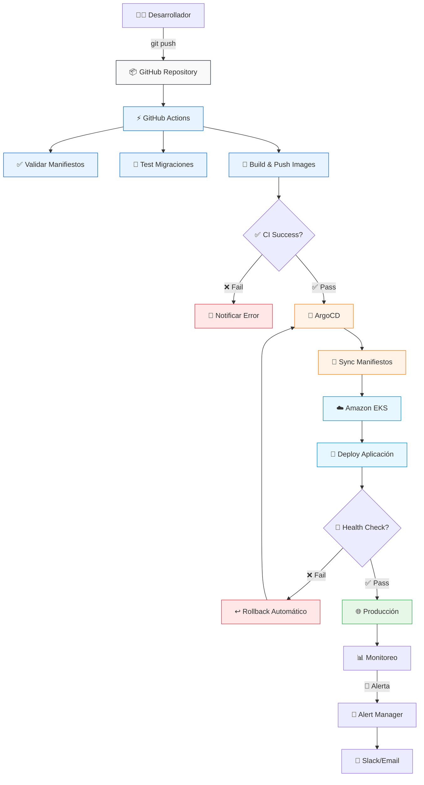

## ¿Qué es GitOps?

GitOps es una metodología de despliegue donde **Git es la única fuente de verdad** para la infraestructura y aplicaciones.

<CardGroup cols={3}>
  <Card title="Declarativo" icon="file-code">
    Todo el estado deseado en Git

    YAMLs de Kubernetes
  </Card>

  <Card title="Versionado" icon="clock-rotate-left">
    Historial completo

    Rollback con `git revert`
  </Card>

  <Card title="Automático" icon="wand-magic-sparkles">
    Deploy automático

    Sin kubectl manual
  </Card>
</CardGroup>

## Flujo de Trabajo Completo

El siguiente diagrama muestra el flujo completo desde el desarrollo hasta la producción:



## Repositorio GitOps: `kubernetes/`

Este repositorio centraliza todos los manifiestos de Kubernetes y scripts de migración de base de datos.

### Estructura del Repositorio

```
kubernetes/
├── .github/
│   └── workflows/
│       ├── ci.yml                    # Validación de manifiestos
│       └── migration-tests.yml      # Tests de migración
├── tests/
│   └── validate-manifests.test.js   # Tests unitarios
├── migrations/
│   ├── V001__initial_schema.sql     # Migración inicial
│   ├── V002__add_users_table.sql    # Tabla de usuarios
│   ├── V003__add_games_indexes.sql  # Índices de juegos
│   ├── U003__remove_games_indexes.sql # Rollback V003
│   └── flyway.conf                   # Configuración Flyway
├── 00-namespace.yaml                 # Namespace retrogame
├── 01-postgres.yaml                  # Base de datos PostgreSQL
├── 02-backend.yaml                   # Servicios backend (monolito)
├── 03-cdn.yaml                       # CDN de juegos (Nginx)
├── 04-frontend.yaml                  # Frontend web
├── 05-kong.yaml                      # API Gateway Kong
├── 06-auth-service.yaml              # Servicio de autenticación
├── 07-game-catalog.yaml             # Catálogo de juegos
├── 08-score-service.yaml            # Servicio de puntuaciones
├── 09-ranking-service.yaml          # Servicio de ranking
├── 10-redis.yaml                    # Cache Redis
└── 11-monitoring.yaml               # Stack de monitoreo
```

### Pipeline de CI/CD

<Tabs>
  <Tab title="GitHub Actions">
    ```yaml
    name: Validar Manifiestos
    on:
      push:
        branches: [main, develop]
      pull_request:
        branches: [main]

    jobs:
      validate:
        runs-on: ubuntu-latest
        steps:
          - uses: actions/checkout@v4
          
          - name: Validar YAML
            run: |
              yamllint *.yaml
              kubeval *.yaml
              
          - name: Test Migraciones
            run: |
              docker run --rm -v $(pwd)/migrations:/flyway/sql \
                flyway/flyway validate
    ```
  </Tab>

  <Tab title="ArgoCD Application">
    ```yaml
    apiVersion: argoproj.io/v1alpha1
    kind: Application
    metadata:
      name: retrogame-platform
      namespace: argocd
    spec:
      project: default
      source:
        repoURL: https://github.com/empresa/kubernetes
        targetRevision: main
        path: .
      destination:
        server: https://kubernetes.default.svc
        namespace: retrogame
      syncPolicy:
        automated:
          prune: true
          selfHeal: true
        syncOptions:
        - CreateNamespace=true
    ```
  </Tab>

  <Tab title="Rollback Strategy">
    ```bash
    # Rollback automático en caso de fallo
    # ArgoCD detecta fallos en health checks
    
    # 1. Rollback de aplicación
    argocd app rollback retrogame-platform
    
    # 2. Rollback de base de datos (si necesario)
    docker run --rm \
      -v $(pwd)/migrations:/flyway/sql \
      flyway/flyway undo
    
    # 3. Notificación automática
    curl -X POST $SLACK_WEBHOOK \
      -d "Rollback ejecutado en retrogame-platform"
    ```
  </Tab>
</Tabs>

## Gestión de Base de Datos

### Migraciones con Flyway

<Warning>
Las migraciones se ejecutan **antes** del despliegue de aplicaciones para garantizar compatibilidad del esquema.
</Warning>

```sql
-- migrations/V004__add_achievements_table.sql
CREATE TABLE achievements (
    id SERIAL PRIMARY KEY,
    user_id INTEGER REFERENCES users(id),
    game_id VARCHAR(50) NOT NULL,
    achievement_type VARCHAR(100) NOT NULL,
    points INTEGER DEFAULT 0,
    unlocked_at TIMESTAMP DEFAULT CURRENT_TIMESTAMP
);

CREATE INDEX idx_achievements_user_game 
ON achievements(user_id, game_id);
```

### Rollback de Migraciones

```sql
-- migrations/U004__remove_achievements_table.sql
DROP TABLE IF EXISTS achievements CASCADE;
```

## Monitoreo y Alertas

El flujo GitOps incluye monitoreo continuo:

<CardGroup cols={2}>
  <Card title="Health Checks" icon="heart-pulse">
    - Liveness probes
    - Readiness probes  
    - Startup probes
    - Database connectivity
  </Card>

  <Card title="Métricas Clave" icon="chart-line">
    - Deployment success rate
    - Rollback frequency
    - Time to recovery
    - Migration duration
  </Card>
</CardGroup>

## Estrategias de Despliegue

### Blue-Green Deployment

```yaml
# Configuración para despliegue blue-green
spec:
  replicas: 3
  strategy:
    type: RollingUpdate
    rollingUpdate:
      maxSurge: 100%
      maxUnavailable: 0
```

### Canary Releases

```yaml
# ArgoCD Rollouts para canary
apiVersion: argoproj.io/v1alpha1
kind: Rollout
spec:
  strategy:
    canary:
      steps:
      - setWeight: 10
      - pause: {duration: 5m}
      - setWeight: 50
      - pause: {duration: 10m}
```

<Tip>
El flujo GitOps garantiza **despliegues consistentes** y **rollbacks rápidos** manteniendo siempre la trazabilidad completa en Git.
</Tip>