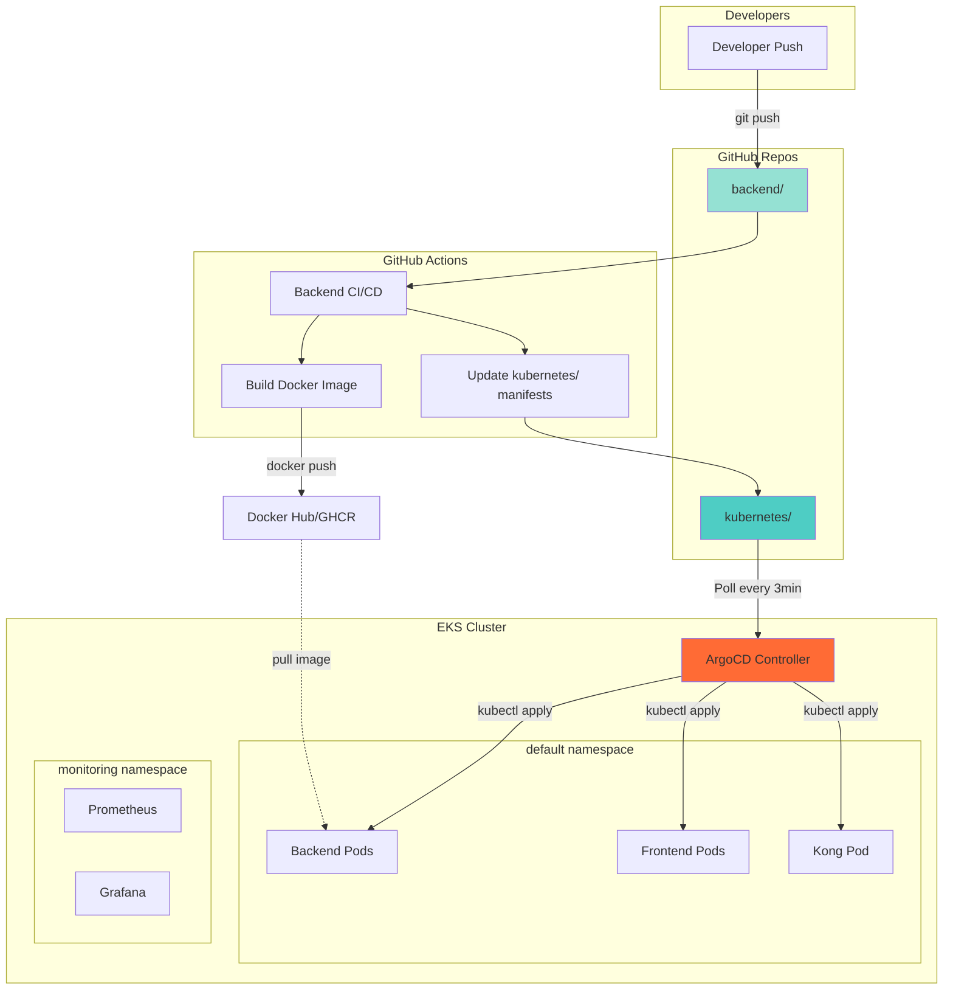

## Visión General

Esta guía documenta el **proceso completo de despliegue** de aplicaciones en Amazon EKS utilizando ArgoCD para GitOps. Los manifiestos Kubernetes están centralizados en el repositorio `kubernetes/` y ArgoCD sincroniza automáticamente el estado deseado.

<CardGroup cols={2}>
  <Card title="ArgoCD GitOps" icon="code-branch">
    Despliegue automatizado desde Git
  </Card>
  <Card title="Helm Charts" icon="box">
    Templating y reutilización
  </Card>
  <Card title="Namespace Isolation" icon="layer-group">
    Separación por entorno
  </Card>
  <Card title="Rolling Updates" icon="arrows-spin">
    Zero-downtime deployments
  </Card>
</CardGroup>

## Arquitectura de Despliegue



## Estructura del Repositorio kubernetes/

### Organización de Manifiestos

```
kubernetes/
├── applications/               # ArgoCD Applications
│   ├── backend-app.yaml
│   ├── frontend-app.yaml
│   ├── kong-app.yaml
│   └── monitoring-app.yaml
│
├── backend/                    # Backend manifests
│   ├── deployment.yaml
│   ├── service.yaml
│   ├── configmap.yaml
│   └── secrets.yaml (encrypted)
│
├── frontend/                   # Frontend manifests
│   ├── deployment.yaml
│   └── service.yaml
│
├── kong/                       # Kong API Gateway
│   ├── deployment.yaml
│   ├── service.yaml
│   └── configmap.yaml
│
├── cdn/                        # Nginx CDN
│   ├── deployment.yaml
│   ├── service.yaml
│   └── pvc.yaml
│
├── monitoring/                 # Prometheus/Grafana
│   ├── namespace.yaml
│   ├── prometheus-deployment.yaml
│   ├── grafana-deployment.yaml
│   └── servicemonitor.yaml
│
├── ingress/                    # ALB Ingress
│   ├── ingress-backend.yaml
│   └── ingress-monitoring.yaml
│
└── migrations/                 # Database migrations
    ├── V001__initial_schema.sql
    ├── V002__add_users_table.sql
    └── ...
```

## ArgoCD Applications

### Backend Application

**Archivo**: `kubernetes/applications/backend-app.yaml`

```yaml
apiVersion: argoproj.io/v1alpha1
kind: Application
metadata:
  name: backend
  namespace: argocd
  finalizers:
    - resources-finalizer.argocd.argoproj.io
spec:
  project: default
  
  # Source: GitHub repository
  source:
    repoURL: https://github.com/RetroGameCloud/kubernetes.git
    targetRevision: main
    path: backend
  
  # Destination: EKS cluster
  destination:
    server: https://kubernetes.default.svc
    namespace: default
  
  # Sync policy
  syncPolicy:
    automated:
      prune: true      # Delete resources not in Git
      selfHeal: true   # Revert manual changes
      allowEmpty: false
    syncOptions:
      - CreateNamespace=true
      - PruneLast=true
    retry:
      limit: 5
      backoff:
        duration: 5s
        factor: 2
        maxDuration: 3m
  
  # Health assessment
  ignoreDifferences:
    - group: apps
      kind: Deployment
      jsonPointers:
        - /spec/replicas  # Ignore HPA changes
```

### Frontend Application

**Archivo**: `kubernetes/applications/frontend-app.yaml`

```yaml
apiVersion: argoproj.io/v1alpha1
kind: Application
metadata:
  name: frontend
  namespace: argocd
spec:
  project: default
  source:
    repoURL: https://github.com/RetroGameCloud/kubernetes.git
    targetRevision: main
    path: frontend
  destination:
    server: https://kubernetes.default.svc
    namespace: default
  syncPolicy:
    automated:
      prune: true
      selfHeal: true
```

### Kong Application

**Archivo**: `kubernetes/applications/kong-app.yaml`

```yaml
apiVersion: argoproj.io/v1alpha1
kind: Application
metadata:
  name: kong
  namespace: argocd
spec:
  project: default
  source:
    repoURL: https://github.com/RetroGameCloud/kubernetes.git
    targetRevision: main
    path: kong
  destination:
    server: https://kubernetes.default.svc
    namespace: default
  syncPolicy:
    automated:
      prune: true
      selfHeal: true
```

### Monitoring Application

**Archivo**: `kubernetes/applications/monitoring-app.yaml`

```yaml
apiVersion: argoproj.io/v1alpha1
kind: Application
metadata:
  name: monitoring
  namespace: argocd
spec:
  project: default
  source:
    repoURL: https://github.com/RetroGameCloud/kubernetes.git
    targetRevision: main
    path: monitoring
  destination:
    server: https://kubernetes.default.svc
    namespace: monitoring
  syncPolicy:
    automated:
      prune: true
      selfHeal: true
    syncOptions:
      - CreateNamespace=true
```

## Manifiestos Kubernetes

### Backend Deployment

**Archivo**: `kubernetes/backend/deployment.yaml`

```yaml
apiVersion: apps/v1
kind: Deployment
metadata:
  name: backend
  labels:
    app: backend
    version: v1.0.0
spec:
  replicas: 3
  strategy:
    type: RollingUpdate
    rollingUpdate:
      maxSurge: 1
      maxUnavailable: 0
  selector:
    matchLabels:
      app: backend
  template:
    metadata:
      labels:
        app: backend
        version: v1.0.0
      annotations:
        prometheus.io/scrape: "true"
        prometheus.io/port: "3000"
        prometheus.io/path: "/metrics"
    spec:
      containers:
      - name: backend
        image: retrogamecloud/backend:latest
        imagePullPolicy: Always
        ports:
        - containerPort: 3000
          name: http
          protocol: TCP
        
        env:
        - name: NODE_ENV
          value: "production"
        - name: PORT
          value: "3000"
        - name: DB_HOST
          valueFrom:
            secretKeyRef:
              name: rds-credentials
              key: DB_HOST
        - name: DB_PORT
          valueFrom:
            secretKeyRef:
              name: rds-credentials
              key: DB_PORT
        - name: DB_NAME
          valueFrom:
            secretKeyRef:
              name: rds-credentials
              key: DB_NAME
        - name: DB_USER
          valueFrom:
            secretKeyRef:
              name: rds-credentials
              key: DB_USER
        - name: DB_PASSWORD
          valueFrom:
            secretKeyRef:
              name: rds-credentials
              key: DB_PASSWORD
        - name: DB_SSL
          value: "true"
        - name: JWT_SECRET
          valueFrom:
            secretKeyRef:
              name: backend-secrets
              key: JWT_SECRET
        - name: JWT_REFRESH_SECRET
          valueFrom:
            secretKeyRef:
              name: backend-secrets
              key: JWT_REFRESH_SECRET
        - name: GITHUB_CLIENT_ID
          valueFrom:
            secretKeyRef:
              name: backend-secrets
              key: GITHUB_CLIENT_ID
              optional: true
        - name: GITHUB_CLIENT_SECRET
          valueFrom:
            secretKeyRef:
              name: backend-secrets
              key: GITHUB_CLIENT_SECRET
              optional: true
        
        resources:
          requests:
            memory: "256Mi"
            cpu: "250m"
          limits:
            memory: "512Mi"
            cpu: "500m"
        
        livenessProbe:
          httpGet:
            path: /health
            port: 3000
          initialDelaySeconds: 30
          periodSeconds: 10
          timeoutSeconds: 5
          failureThreshold: 3
        
        readinessProbe:
          httpGet:
            path: /health
            port: 3000
          initialDelaySeconds: 10
          periodSeconds: 5
          timeoutSeconds: 3
          successThreshold: 1
          failureThreshold: 3
      
      # Security
      securityContext:
        runAsNonRoot: true
        runAsUser: 1000
        fsGroup: 1000
      
      # Affinity for HA
      affinity:
        podAntiAffinity:
          preferredDuringSchedulingIgnoredDuringExecution:
          - weight: 100
            podAffinityTerm:
              labelSelector:
                matchExpressions:
                - key: app
                  operator: In
                  values:
                  - backend
              topologyKey: kubernetes.io/hostname
```

### Backend Service

**Archivo**: `kubernetes/backend/service.yaml`

```yaml
apiVersion: v1
kind: Service
metadata:
  name: backend
  labels:
    app: backend
spec:
  type: ClusterIP
  ports:
  - port: 3000
    targetPort: 3000
    protocol: TCP
    name: http
  selector:
    app: backend
```

### Frontend Deployment

**Archivo**: `kubernetes/frontend/deployment.yaml`

```yaml
apiVersion: apps/v1
kind: Deployment
metadata:
  name: frontend
  labels:
    app: frontend
spec:
  replicas: 2
  strategy:
    type: RollingUpdate
    rollingUpdate:
      maxSurge: 1
      maxUnavailable: 0
  selector:
    matchLabels:
      app: frontend
  template:
    metadata:
      labels:
        app: frontend
    spec:
      containers:
      - name: frontend
        image: retrogamecloud/frontend:latest
        imagePullPolicy: Always
        ports:
        - containerPort: 8080
          name: http
        
        env:
        - name: API_URL
          value: "http://kong:8000"
        
        resources:
          requests:
            memory: "128Mi"
            cpu: "100m"
          limits:
            memory: "256Mi"
            cpu: "200m"
        
        livenessProbe:
          httpGet:
            path: /
            port: 8080
          initialDelaySeconds: 15
          periodSeconds: 10
        
        readinessProbe:
          httpGet:
            path: /
            port: 8080
          initialDelaySeconds: 5
          periodSeconds: 5
```

### Kong Deployment

**Archivo**: `kubernetes/kong/deployment.yaml`

```yaml
apiVersion: apps/v1
kind: Deployment
metadata:
  name: kong
  labels:
    app: kong
spec:
  replicas: 2
  selector:
    matchLabels:
      app: kong
  template:
    metadata:
      labels:
        app: kong
    spec:
      containers:
      - name: kong
        image: retrogamecloud/kong:v1.0.0
        ports:
        - containerPort: 8000
          name: proxy
        - containerPort: 8001
          name: admin
        
        env:
        - name: KONG_DATABASE
          value: "off"
        - name: KONG_DECLARATIVE_CONFIG
          value: "/usr/local/kong/declarative/kong.yml"
        - name: KONG_PROXY_ACCESS_LOG
          value: "/dev/stdout"
        - name: KONG_ADMIN_ACCESS_LOG
          value: "/dev/stdout"
        - name: KONG_PROXY_ERROR_LOG
          value: "/dev/stderr"
        - name: KONG_ADMIN_ERROR_LOG
          value: "/dev/stderr"
        
        volumeMounts:
        - name: kong-config
          mountPath: /usr/local/kong/declarative
          readOnly: true
        
        resources:
          requests:
            memory: "256Mi"
            cpu: "200m"
          limits:
            memory: "512Mi"
            cpu: "500m"
        
        livenessProbe:
          httpGet:
            path: /status
            port: 8001
          initialDelaySeconds: 30
          periodSeconds: 10
        
        readinessProbe:
          httpGet:
            path: /status
            port: 8001
          initialDelaySeconds: 10
          periodSeconds: 5
      
      volumes:
      - name: kong-config
        configMap:
          name: kong-config
```

### Kong ConfigMap

**Archivo**: `kubernetes/kong/configmap.yaml`

```yaml
apiVersion: v1
kind: ConfigMap
metadata:
  name: kong-config
data:
  kong.yml: |
    _format_version: "3.0"
    
    services:
      - name: backend-service
        url: http://backend:3000
        routes:
          - name: backend-route
            paths:
              - /api
            strip_path: false
        plugins:
          - name: cors
            config:
              origins:
                - "*"
              methods:
                - GET
                - POST
                - PUT
                - DELETE
              headers:
                - Accept
                - Authorization
                - Content-Type
              credentials: true
              max_age: 3600
          
          - name: rate-limiting
            config:
              minute: 100
              policy: local
          
          - name: jwt
            config:
              secret_is_base64: false
              claims_to_verify:
                - exp
```

## Proceso de Despliegue

### 1. Developer Push Code

```bash
# Desarrollador hace cambios en backend
cd backend
git add src/
git commit -m "feat: add new endpoint"
git push origin main
```

### 2. GitHub Actions CI/CD

El workflow `.github/workflows/docker-publish-and-update-k8s.yml` se activa:

```yaml
name: Backend CI/CD

on:
  push:
    branches: [main]

jobs:
  build-and-push:
    runs-on: ubuntu-latest
    steps:
      - uses: actions/checkout@v4
      
      - name: Build Docker image
        run: docker build -t retrogamecloud/backend:${{ github.sha }} .
      
      - name: Push to Docker Hub
        run: |
          echo "${{ secrets.DOCKER_PASSWORD }}" | docker login -u "${{ secrets.DOCKER_USERNAME }}" --password-stdin
          docker push retrogamecloud/backend:${{ github.sha }}
          docker tag retrogamecloud/backend:${{ github.sha }} retrogamecloud/backend:latest
          docker push retrogamecloud/backend:latest
  
  update-k8s:
    needs: build-and-push
    runs-on: ubuntu-latest
    steps:
      - name: Checkout kubernetes repo
        uses: actions/checkout@v4
        with:
          repository: RetroGameCloud/kubernetes
          token: ${{ secrets.GH_PAT }}
      
      - name: Update image tag
        run: |
          sed -i "s|image: retrogamecloud/backend:.*|image: retrogamecloud/backend:${{ github.sha }}|g" backend/deployment.yaml
      
      - name: Commit and push
        run: |
          git config user.name "GitHub Actions"
          git config user.email "actions@github.com"
          git add backend/deployment.yaml
          git commit -m "chore: update backend image to ${{ github.sha }}"
          git push
```

### 3. ArgoCD Detecta Cambios

ArgoCD hace polling cada 3 minutos:

```bash
# Ver estado de sincronización
argocd app get backend

# Forzar sincronización manual
argocd app sync backend
```

### 4. Rolling Update en EKS

ArgoCD aplica los manifiestos:

```bash
# Ver progreso del rollout
kubectl rollout status deployment/backend

# Ver pods nuevos y viejos
kubectl get pods -l app=backend -w

# Ver eventos
kubectl get events --sort-by='.lastTimestamp'
```

**Proceso**:
1. Crear nuevo ReplicaSet con imagen nueva
2. Crear 1 pod nuevo (maxSurge: 1)
3. Esperar a que pase readinessProbe
4. Terminar 1 pod viejo (maxUnavailable: 0)
5. Repetir hasta reemplazar todos los pods

### 5. Verificación Post-Despliegue

```bash
# Healthcheck
kubectl exec -it backend-xxx -- curl localhost:3000/health

# Logs
kubectl logs -l app=backend --tail=50 -f

# Metrics
kubectl top pods -l app=backend
```

## Estrategias de Despliegue

### Rolling Update (Default)

```yaml
strategy:
  type: RollingUpdate
  rollingUpdate:
    maxSurge: 1        # Max pods extra durante update
    maxUnavailable: 0  # Min pods siempre disponibles
```

**Ventajas**: Zero-downtime, gradual
**Desventajas**: Versiones mezcladas temporalmente

### Blue/Green Deployment

Cambiar service selector:

```yaml
# deployment-green.yaml
metadata:
  name: backend-green
spec:
  template:
    metadata:
      labels:
        app: backend
        version: green

---
# Switch service
apiVersion: v1
kind: Service
metadata:
  name: backend
spec:
  selector:
    app: backend
    version: green  # Cambiar de blue a green
```

### Canary Deployment

Usar Argo Rollouts:

```yaml
apiVersion: argoproj.io/v1alpha1
kind: Rollout
metadata:
  name: backend
spec:
  strategy:
    canary:
      steps:
      - setWeight: 20   # 20% tráfico a nueva versión
      - pause: {duration: 5m}
      - setWeight: 50
      - pause: {duration: 5m}
      - setWeight: 100
```

## Rollback

### Automático con ArgoCD

ArgoCD detecta pods crasheando y hace rollback automático si:
- `selfHeal: true` está habilitado
- Deployment anterior estaba healthy

### Manual con kubectl

```bash
# Ver historial de deployments
kubectl rollout history deployment/backend

# Rollback a revisión anterior
kubectl rollout undo deployment/backend

# Rollback a revisión específica
kubectl rollout undo deployment/backend --to-revision=5
```

### Con GitHub Actions

Workflow `backend/.github/workflows/rollback-backend.yml`:

```bash
# Trigger manual workflow
gh workflow run rollback-backend.yml \
  -f target_sha=abc123def \
  -f reason="Critical bug in latest version"
```

## Secrets Management

### Crear Secrets

```bash
# RDS credentials
kubectl create secret generic rds-credentials \
  --from-literal=DB_HOST="xxx.rds.amazonaws.com" \
  --from-literal=DB_PORT="5432" \
  --from-literal=DB_NAME="retrogamehub" \
  --from-literal=DB_USER="admin" \
  --from-literal=DB_PASSWORD="xxx"

# Backend secrets
kubectl create secret generic backend-secrets \
  --from-literal=JWT_SECRET="xxx" \
  --from-literal=JWT_REFRESH_SECRET="xxx" \
  --from-literal=GITHUB_CLIENT_ID="xxx" \
  --from-literal=GITHUB_CLIENT_SECRET="xxx"
```

### Sealed Secrets (Opcional)

Para versionarlos en Git:

```bash
# Instalar Sealed Secrets controller
kubectl apply -f https://github.com/bitnami-labs/sealed-secrets/releases/download/v0.24.0/controller.yaml

# Sellar secret
kubeseal -f secret.yaml -w sealed-secret.yaml

# Commitear sealed-secret.yaml a Git
```

## Monitoring de Despliegues

### ArgoCD UI

```bash
# Port-forward ArgoCD UI
kubectl port-forward svc/argocd-server -n argocd 8080:443

# Login
argocd login localhost:8080
```

Navegar a: https://localhost:8080

### Prometheus Metrics

```promql
# Deployment status
kube_deployment_status_replicas_available{deployment="backend"}

# Rollout duration
argocd_app_sync_total{dest_server="https://kubernetes.default.svc",name="backend"}
```

### Grafana Dashboard

Importar dashboard: **ArgoCD** (ID: 14584)

## Troubleshooting

### ArgoCD App OutOfSync

```bash
# Ver diferencias
argocd app diff backend

# Forzar sync
argocd app sync backend --force

# Refresh manifests
argocd app get backend --refresh
```

### Pods CrashLoopBackOff

```bash
# Ver logs
kubectl logs backend-xxx --previous

# Describir pod
kubectl describe pod backend-xxx

# Eventos
kubectl get events --field-selector involvedObject.name=backend-xxx
```

### Rolling Update Stuck

```bash
# Ver estado
kubectl rollout status deployment/backend

# Pausar rollout
kubectl rollout pause deployment/backend

# Fix y resumir
kubectl rollout resume deployment/backend

# Rollback
kubectl rollout undo deployment/backend
```

### Secrets Not Found

```bash
# Listar secrets
kubectl get secrets

# Ver contenido (base64)
kubectl get secret rds-credentials -o jsonpath='{.data.DB_HOST}' | base64 -d

# Recrear si necesario
kubectl delete secret rds-credentials
kubectl create secret generic rds-credentials --from-literal=...
```

## Best Practices

1. **Immutable Tags**: Usar SHA específicos, no `latest`
2. **Resource Limits**: Definir requests/limits para scheduling
3. **Health Probes**: Configurar liveness y readiness
4. **Pod Disruption Budgets**: Garantizar availability durante updates
5. **Namespace Isolation**: Separar por entorno (prod, staging)
6. **RBAC**: Principle of least privilege
7. **Network Policies**: Restringir tráfico entre pods
8. **Monitoring**: Exportar métricas a Prometheus
9. **Logging**: Centralizar logs en CloudWatch
10. **Automated Rollback**: Habilitar `selfHeal` en ArgoCD

## Referencias

- [ArgoCD Documentation](https://argo-cd.readthedocs.io/)
- [Kubernetes Deployments](https://kubernetes.io/docs/concepts/workloads/controllers/deployment/)
- [Rolling Updates Best Practices](https://kubernetes.io/docs/tutorials/kubernetes-basics/update/update-intro/)
- [kubectl Cheat Sheet](https://kubernetes.io/docs/reference/kubectl/cheatsheet/)
