## Filosofía CI/CD

Retro Game Hub implementa un pipeline completo de CI/CD que automatiza desde el commit hasta el despliegue en producción, siguiendo principios GitOps con zero-downtime deployments y mecanismos de rollback automático.

<CardGroup cols={3}>
  <Card title="Automatización Total" icon="robot">
    Desde commit hasta producción

    Pipeline completamente automatizado
  </Card>

  <Card title="GitOps" icon="code-branch">
    Git como fuente de verdad

    Declarativo e inmutable
  </Card>

  <Card title="Zero Downtime" icon="shield-halved">
    Rolling updates y health checks

    Rollback automático
  </Card>
</CardGroup>

## Pipeline Completo de CI/CD

El siguiente diagrama muestra el flujo completo desde el desarrollo hasta producción, incluyendo gates de aprobación y mecanismos de rollback:

```mermaid
graph TB
    subgraph DEV["💻 DESARROLLO"]
        A[👨‍💻 Developer] -->|git push| B[📁 GitHub Repository]
        B --> B1[🔔 Trigger Webhook]
    end

    subgraph CI["⚙️ CONTINUOUS INTEGRATION - GitHub Actions"]
        B1 --> C1[🔍 Lint & Format Check]
        C1 --> C2[🧪 Unit Tests]
        C2 --> C3[🔧 Integration Tests]
        C3 --> C4[🛡️ Security Scan]
        C4 --> D{✅ All Tests Pass?}

        D -->|❌ Fail| STOP[🚫 Stop Pipeline<br/>Notify Developer]
        D -->|✅ Success| E[🏗️ Build Docker Image]

        E --> F[📦 Multi-stage Build]
        F --> G[🔒 Security Scan Image]
        G --> H[📤 Push to AWS ECR]
        H --> I[🏷️ Tag: latest, v1.0.X, sha-xxx]
    end

    subgraph GITOPS["📦 GITOPS WORKFLOW"]
        I --> J[📝 Update K8s Manifests]
        J --> K[⚙️ Kustomize Build]
        K --> L[✅ Validate Manifests]
        L --> M[📋 Create PR to Config Repo]

        M --> N{🤖 Auto-merge?}
        N -->|No| P[👀 Manual Review]
        N -->|Yes| O[🔀 Auto-merge PR]
        P --> O
        O --> Q[📦 Config Repo Updated]
    end

    subgraph STAGING["🧪 STAGING DEPLOYMENT"]
        Q --> R[🔄 ArgoCD Detects Change]
        R --> S[🚀 Deploy to Staging]
        S --> T[⚡ Rolling Update]
        T --> U[🏥 Health Check]
        U --> V{💚 Staging Healthy?}
        
        V -->|❌ Fail| ROLLBACK_STG[⏪ Rollback Staging]
        V -->|✅ Success| W[🎯 E2E Tests]
        
        W --> X{🧪 E2E Pass?}
        X -->|❌ Fail| ROLLBACK_STG
        X -->|✅ Success| Y[✅ Staging Validated]
    end

    subgraph APPROVAL["👥 APPROVAL GATE"]
        Y --> Z{🛡️ Manual Approval<br/>Required?}
        Z -->|No - Hotfix| AA[🚨 Auto-promote]
        Z -->|Yes| BB[👨‍💼 Approval Request]
        BB --> CC{✅ Approved?}
        CC -->|❌ Rejected| END1[⛔ Deployment Stopped]
        CC -->|✅ Approved| AA
    end

    subgraph PROD["🌟 PRODUCTION DEPLOYMENT"]
        AA --> DD[🎯 ArgoCD Sync to Prod]
        DD --> EE[🚀 Rolling Update Prod]
        EE --> FF[🏥 Health Check Prod]
        FF --> GG{💚 Production Healthy?}
        
        GG -->|❌ Fail| HH[🚨 Auto Rollback Prod]
        GG -->|✅ Success| II[📊 Post-deploy Monitoring]
        
        HH --> JJ[🔔 Alert Team]
        II --> KK{📈 Metrics OK?}
        KK -->|❌ Degraded| HH
        KK -->|✅ Success| LL[✅ Deployment Complete]
    end

    subgraph MONITORING["📊 CONTINUOUS MONITORING"]
        LL --> MM[📈 Application Metrics]
        MM --> NN[🏥 Health Checks]
        NN --> OO[📋 Log Aggregation]
        OO --> PP{🚨 Issues Detected?}
        PP -->|Yes| QQ[🔔 Alert & Consider Rollback]
        PP -->|No| RR[✅ Stable Production]
    end

    style STOP fill:#ff6b6b
    style ROLLBACK_STG fill:#ffa726
    style HH fill:#ffa726
    style END1 fill:#ff6b6b
    style LL fill:#4caf50
    style RR fill:#4caf50
```



## Etapas Detalladas del Pipeline

### 1. Continuous Integration (CI)

<Steps>
  <Step title="Code Quality & Testing">
    - **Lint & Format**: ESLint, Prettier para frontend; gofmt, golint para backend
    - **Unit Tests**: Jest para React, Go test para APIs
    - **Integration Tests**: Testcontainers para bases de datos
    - **Security Scan**: SonarQube, Snyk para vulnerabilidades
  </Step>

  <Step title="Build & Package">
    - **Multi-stage Docker Build**: Optimización de capas e imagen final mínima
    - **Security Scanning**: Trivy para escaneo de vulnerabilidades en imagen
    - **Registry Push**: AWS ECR con tags semánticos y SHA commits
  </Step>
</Steps>

### 2. GitOps Workflow

<Steps>
  <Step title="Manifest Update">
    - Actualización automática de manifiestos Kubernetes
    - Validación con Kustomize y Kubeval
    - Creación de PR al repositorio de configuración
  </Step>

  <Step title="Review Process">
    - Auto-merge para hotfixes y patches menores
    - Review manual para cambios mayores
    - Validación de configuración antes del merge
  </Step>
</Steps>

### 3. Deployment Stages

<Steps>
  <Step title="Staging Deployment">
    - **Automático**: ArgoCD detecta cambios y despliega
    - **Rolling Update**: Zero-downtime deployment
    - **E2E Testing**: Cypress para testing completo
    - **Rollback Automático**: Si health checks fallan
  </Step>

  <Step title="Approval Gate">
    - Configuración por tipo de cambio (major/minor/patch)
    - Notificaciones a equipos de aprobación
    - Bypass automático para hotfixes críticos
  </Step>

  <Step title="Production Deployment">
    - **Rolling Update**: Actualización gradual de pods
    - **Health Checks**: Readiness y liveness probes
    - **Circuit Breaker**: Parada automática si falla
    - **Auto Rollback**: Retorno a versión anterior estable
  </Step>
</Steps>

### 4. Monitoring & Observability

<Tabs>
  <Tab title="Health Monitoring">
    ```yaml
    # Health check configuration
    readinessProbe:
      httpGet:
        path: /health/ready
        port: 8080
      initialDelaySeconds: 10
      periodSeconds: 5
      timeoutSeconds: 3
      successThreshold: 1
      failureThreshold: 3

    livenessProbe:
      httpGet:
        path: /health/live
        port: 8080
      initialDelaySeconds: 30
      periodSeconds: 10
      timeoutSeconds: 5
      failureThreshold: 3
    ```
  </Tab>

  <Tab title="Rollback Strategy">
    ```bash
    # Automatic rollback triggers
    - Health check failures > 3 consecutive
    - Error rate > 5% for 2 minutes
    - Response time > 2s for 5 minutes
    - Critical alerts from monitoring

    # Rollback execution
    kubectl rollout undo deployment/retro-game-hub
    argocd app sync retro-game-hub --revision previous
    ```
  </Tab>

  <Tab title="Notification Channels">
    ```yaml
    # Alert configuration
    notifications:
      - trigger: deployment.failed
        channels: [slack, email, pagerduty]
      - trigger: rollback.executed
        channels: [slack, email]
      - trigger: approval.required
        channels: [slack, email]
    ```
  </Tab>
</Tabs>

## Configuración de Gates y Políticas

<CardGroup cols={2}>
  <Card title="Approval Policies" icon="shield-check">
    **Major Changes (v1.0.0 → v2.0.0)**
    - Require manual approval
    - Security team review
    - Stakeholder sign-off

    **Minor Changes (v1.0.0 → v1.1.0)**
    - Team lead approval
    - Automated after 2 hours

    **Patches (v1.0.0 → v1.0.1)**
    - Auto-approve if tests pass
    - Immediate deployment
  </Card>

  <Card title="Rollback Triggers" icon="arrow-rotate-left">
    **Automatic Rollback**
    - Health check failures
    - Error rate spikes
    - Performance degradation
    - Critical security alerts

    **Manual Rollback**
    - Business decision
    - User feedback
    - Feature flag disable
  </Card>
</CardGroup>

## Métricas y SLOs

El pipeline mantiene los siguientes Service Level Objectives:

- **Lead Time**: < 30 minutos desde commit hasta staging
- **Deployment Frequency**: Múltiples despliegues por día
- **MTTR (Mean Time To Recovery)**: < 15 minutos con rollback automático
- **Change Failure Rate**: < 5% con gates de calidad