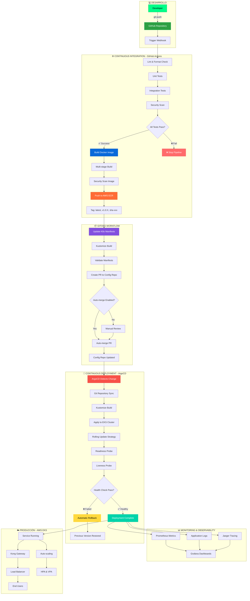

## Filosofía CI/CD

Retro Game Hub implementa un pipeline completo de CI/CD que automatiza desde el commit hasta el despliegue en producción, siguiendo principios GitOps con zero-downtime deployments.

<CardGroup cols={3}>
  <Card title="Automatización Total" icon="robot">
    Desde commit hasta producción

    Pipeline completamente automatizado
  </Card>

  <Card title="GitOps" icon="code-branch">
    Git como fuente de verdad

    Declarativo e inmutable
  </Card>

  <Card title="Zero Downtime" icon="shield-halved">
    Rolling updates y health checks

    Rollback automático
  </Card>
</CardGroup>

## Pipeline Completo de CI/CD

El siguiente diagrama muestra el flujo completo desde el desarrollo hasta producción:



## Etapas del Pipeline

### 🔍 Validación y Testing

<AccordionGroup>
  <Accordion title="Análisis Estático" icon="magnifying-glass">
    - **ESLint**: Análisis de código JavaScript/TypeScript
    - **Prettier**: Formato consistente del código
    - **SonarQube**: Análisis de calidad y vulnerabilidades
    - **Hadolint**: Linting de Dockerfiles
  </Accordion>

  <Accordion title="Testing Automatizado" icon="flask">
    - **Unit Tests**: Jest para componentes individuales
    - **Integration Tests**: Cypress para flujos E2E
    - **API Tests**: Postman/Newman para endpoints
    - **Performance Tests**: k6 para carga
  </Accordion>

  <Accordion title="Seguridad" icon="shield">
    - **Dependency Scan**: npm audit y Snyk
    - **Container Scan**: Trivy para imágenes Docker
    - **Secrets Detection**: GitLeaks
    - **SAST**: Static Application Security Testing
  </Accordion>
</AccordionGroup>

### 🏗️ Build y Containerización

```yaml

# Ejemplo de multi-stage Dockerfile
FROM node:18-alpine AS builder
WORKDIR /app
COPY package*.json ./
RUN npm ci --only=production

FROM node:18-alpine AS runtime
WORKDIR /app
COPY --from=builder /app/node_modules ./node_modules
COPY . .
EXPOSE 3000
CMD ["npm", "start"]

```

<CardGroup cols={2}>
  <Card title="Multi-stage Build" icon="layer-group">
    Optimización del tamaño de imagen

    Separación de dependencias build/runtime
  </Card>

  <Card title="Registry Push" icon="cloud-upload">
    AWS ECR como registry privado

    Versionado semántico automático
  </Card>
</CardGroup>

### 🔄 GitOps y Despliegue

<Steps>
  <Step title="Actualización de Manifiestos">
    GitHub Actions actualiza automáticamente los manifiestos de Kubernetes con la nueva imagen
  </Step>

  <Step title="Validación de Configuración">
    Kustomize valida la sintaxis y estructura de los manifiestos
  </Step>

  <Step title="Pull Request Automático">
    Se crea un PR al repositorio de configuración con los cambios
  </Step>

  <Step title="Sincronización ArgoCD">
    ArgoCD detecta cambios y sincroniza el estado deseado
  </Step>

  <Step title="Rolling Update">
    Despliegue progresivo sin interrupciones de servicio
  </Step>
</Steps>

## Estrategias de Despliegue

<CardGroup cols={2}>
  <Card title="Rolling Update" icon="arrows-spin">
    **Por defecto**: Actualización progresiva

    - maxUnavailable: 25%
    - maxSurge: 25%
    - Zero downtime garantizado
  </Card>

  <Card title="Blue-Green" icon="toggle-on">
    **Para releases críticas**: Cambio instantáneo

    - Ambiente completo duplicado
    - Switch inmediato de tráfico
    - Rollback instantáneo
  </Card>
</CardGroup>

## Monitoreo y Observabilidad

### 📊 Métricas de Pipeline

```yaml

# Métricas clave tracked
pipeline_metrics:
  - deployment_frequency: "Multiple times per day"
  - lead_time_for_changes: "< 1 hour"
  - time_to_restore_service: "< 30 minutes"
  - change_failure_rate: "< 5%"

```

### 🚨 Alertas y Notificaciones

<Tabs>
  <Tab title="Slack Integration">
    - Notificaciones de despliegue
    - Alertas de fallos en pipeline
    - Métricas de rendimiento
  </Tab>

  <Tab title="Email Alerts">
    - Resumen diario de deployments
    - Alertas críticas de seguridad
    - Reportes semanales de calidad
  </Tab>

  <Tab title="PagerDuty">
    - Incidentes críticos en producción
    - Escalation automático
    - On-call rotation
  </Tab>
</Tabs>

## Beneficios del Pipeline

<CardGroup cols={2}>
  <Card title="Velocidad" icon="gauge-high">
    **Deploy en < 10 minutos**

    Desde commit hasta producción automatizado
  </Card>

  <Card title="Confiabilidad" icon="check-double">
    **99.9% Success Rate**

    Tests exhaustivos y validaciones automáticas
  </Card>

  <Card title="Seguridad" icon="lock">
    **Security by Design**

    Scans automáticos en cada etapa del pipeline
  </Card>

  <Card title="Observabilidad" icon="chart-line">
    **Full Visibility**

    Métricas, logs y tracing completos
  </Card>
</CardGroup>

## Próximos Pasos

En las siguientes secciones profundizaremos en cada componente:

- **GitHub Actions**: Configuración de workflows y jobs

- **Docker & ECR**: Estrategias de containerización y registry

- **ArgoCD**: GitOps y continuous deployment

- **Monitoreo**: Observabilidad y alertas del pipeline