## Filosofía CI/CD

Retro Game Hub implementa un pipeline completo de CI/CD que automatiza desde el commit hasta el despliegue en producción, siguiendo principios GitOps con zero-downtime deployments y mecanismos de rollback automático.

<CardGroup cols={3}>
  <Card title="Automatización Total" icon="robot">
    Desde commit hasta producción

    Pipeline completamente automatizado
  </Card>

  <Card title="GitOps" icon="code-branch">
    Git como fuente de verdad

    Declarativo e inmutable
  </Card>

  <Card title="Zero Downtime" icon="shield-halved">
    Rolling updates y health checks

    Rollback automático
  </Card>
</CardGroup>

## Pipeline Completo de CI/CD

El siguiente diagrama muestra el flujo completo desde el desarrollo hasta producción, incluyendo gates de calidad, aprobación y mecanismos de rollback:

```mermaid
graph TB
    subgraph DEV["💻 DESARROLLO"]
        A[👨‍💻 Developer] -->|git push| B[📁 GitHub Repository]
        B --> B1[🔔 Trigger Webhook]
    end

    subgraph CI["⚙️ CONTINUOUS INTEGRATION - GitHub Actions"]
        B1 --> C1[🔍 Lint & Format Check]
        C1 --> C2[🧪 Unit Tests]
        C2 --> C3[🔧 Integration Tests]
        C3 --> C4[🛡️ Security Scan]
        C4 --> D{✅ All Tests Pass?}

        D -->|❌ Fail| STOP[🚫 Stop Pipeline<br/>Notify Developer]
        D -->|✅ Success| E[🏗️ Build Docker Image]

        E --> F[📦 Multi-stage Build]
        F --> G[🔒 Security Scan Image]
        G --> H1{🎯 Quality Gate 1}
        H1 -->|❌ Fail| STOP2[🚫 Block Deployment]
        H1 -->|✅ Pass| H[📤 Push to AWS ECR]
        H --> I[🏷️ Tag: latest, v1.0.X, sha-xxx]
    end

    subgraph ECR["🐳 AWS ELASTIC CONTAINER REGISTRY"]
        I --> I1[📦 Store Multi-arch Images]
        I1 --> I2[🔒 Image Scanning]
        I2 --> I3{🛡️ Vulnerability Gate}
        I3 -->|❌ Critical Vulns| STOP3[🚫 Block Deployment]
        I3 -->|✅ Secure| I4[✅ Ready for Deployment]
    end

    subgraph GITOPS["📦 GITOPS WORKFLOW"]
        I4 --> J[📝 Update K8s Manifests]
        J --> K[⚙️ Kustomize Build]
        K --> L[✅ Validate Manifests]
        L --> M[📋 Create PR to Config Repo]

        M --> N{🤖 Auto-merge?}
        N -->|No| P[👀 Manual Review]
        N -->|Yes| P2[🔄 Auto-merge]
        P -->|✅ Approved| P2
        P2 --> Q[🎯 Manifest Updated]
    end

    subgraph ARGOCD["🔄 ARGOCD - CONTINUOUS DEPLOYMENT"]
        Q --> R[👁️ Detect Changes]
        R --> S[📥 Pull New Manifests]
        S --> T[🔍 Diff Analysis]
        T --> U{🎯 Quality Gate 2}
        
        U -->|❌ Fail| STOP4[🚫 Block Sync]
        U -->|✅ Pass| V[🚀 Sync to EKS]
    end

    subgraph EKS["☸️ AWS EKS CLUSTER"]
        V --> W[📊 Rolling Update]
        W --> X[🏥 Health Checks]
        X --> Y[🔍 Readiness Probes]
        Y --> Z{🎯 Deployment Status}

        Z -->|❌ Unhealthy| AA[⏪ Automatic Rollback]
        Z -->|✅ Healthy| BB[🎉 Deployment Success]
        
        AA --> CC[📱 Slack Notification]
        BB --> DD[📱 Success Notification]
    end

    subgraph MONITORING["📈 MONITORING & OBSERVABILITY"]
        BB --> EE[📊 Prometheus Metrics]
        EE --> FF[📈 Grafana Dashboards]
        FF --> GG[🚨 Alert Manager]
        GG --> HH[📱 PagerDuty/Slack]
    end

    style D fill:#f9f,stroke:#333,stroke-width:2px
    style H1 fill:#f96,stroke:#333,stroke-width:2px
    style I3 fill:#f96,stroke:#333,stroke-width:2px
    style U fill:#f96,stroke:#333,stroke-width:2px
    style Z fill:#9f6,stroke:#333,stroke-width:2px
    style STOP fill:#f66,stroke:#333,stroke-width:2px
    style STOP2 fill:#f66,stroke:#333,stroke-width:2px
    style STOP3 fill:#f66,stroke:#333,stroke-width:2px
    style STOP4 fill:#f66,stroke:#333,stroke-width:2px
```



## Gates de Calidad y Seguridad

### 🎯 Quality Gate 1 - Build Stage
- **Cobertura de código**: Mínimo 80%
- **Complejidad ciclomática**: Máximo 10
- **Duplicación de código**: Máximo 3%
- **Deuda técnica**: Máximo rating B

### 🛡️ Security Gate - Container Registry
- **Vulnerabilidades críticas**: 0 permitidas
- **Vulnerabilidades altas**: Máximo 5
- **Secrets scan**: Sin secrets expuestos
- **Compliance**: OWASP Top 10 verificado

### 🎯 Quality Gate 2 - Pre-deployment
- **Manifest validation**: Sintaxis K8s válida
- **Resource limits**: Definidos correctamente
- **Security contexts**: Configurados apropiadamente
- **Network policies**: Implementadas según política

## Mecanismos de Rollback

<CardGroup cols={2}>
  <Card title="Rollback Automático" icon="rotate-left">
    **Triggers automáticos:**
    - Health checks fallan > 2min
    - Error rate > 5%
    - Latencia P95 > 2s
    - CPU/Memory > 90%

    **Tiempo de rollback:** < 30 segundos
  </Card>

  <Card title="Rollback Manual" icon="hand">
    **Comandos disponibles:**
    ```bash
    argocd app rollback retro-game-hub
    kubectl rollout undo deployment/api
    ```

    **UI disponible:** ArgoCD Dashboard
  </Card>
</CardGroup>

## Métricas y Monitoreo

### 📊 Deployment Metrics
- **Deployment Frequency**: 5-10 deploys/día
- **Lead Time**: < 30 minutos
- **Mean Time to Recovery**: < 5 minutos
- **Change Failure Rate**: < 5%

### 🚨 Alertas Configuradas
- Pipeline failures → Slack #dev-alerts
- Security vulnerabilities → Slack #security
- Production issues → PagerDuty
- Rollbacks → Slack #ops-critical

## Beneficios del Pipeline

<CardGroup cols={2}>
  <Card title="Velocidad" icon="gauge-high">
    **Despliegue rápido y confiable**
    - Automatización completa
    - Feedback inmediato
    - Deploy en 15-30 minutos
  </Card>

  <Card title="Seguridad" icon="shield-check">
    **Múltiples capas de seguridad**
    - Escaneo de vulnerabilidades
    - Gates de calidad obligatorios
    - Compliance automático
  </Card>

  <Card title="Confiabilidad" icon="check-double">
    **Alta disponibilidad garantizada**
    - Zero-downtime deployments
    - Rollback automático
    - Health checks continuos
  </Card>

  <Card title="Visibilidad" icon="eye">
    **Observabilidad completa**
    - Métricas en tiempo real
    - Trazabilidad completa
    - Alertas proactivas
  </Card>
</CardGroup>

## Próximos Pasos

En las siguientes secciones profundizaremos en cada componente del pipeline:

- **GitHub Actions**: Configuración de workflows y jobs
- **Docker & ECR**: Estrategias de build y registro
- **ArgoCD**: Configuración GitOps y sincronización
- **Monitoring**: Métricas, alertas y observabilidad