## Filosofía CI/CD

Retro Game Hub implementa un pipeline completo de CI/CD que automatiza desde el commit hasta el despliegue en producción, siguiendo principios GitOps con zero-downtime deployments y mecanismos de rollback automático.

<CardGroup cols={3}>
  <Card title="Automatización Total" icon="robot">
    Desde commit hasta producción

    Pipeline completamente automatizado
  </Card>

  <Card title="GitOps" icon="code-branch">
    Git como fuente de verdad

    Declarativo e inmutable
  </Card>

  <Card title="Zero Downtime" icon="shield-halved">
    Rolling updates y health checks

    Rollback automático
  </Card>
</CardGroup>

## Pipeline Completo de CI/CD

El siguiente diagrama muestra el flujo completo desde el desarrollo hasta producción, incluyendo gates de aprobación y mecanismos de rollback:

```mermaid
graph TB
    subgraph DEV["💻 DESARROLLO"]
        A[👨‍💻 Developer] -->|git push| B[📁 GitHub Repository]
        B --> B1[🔔 Trigger Webhook]
    end

    subgraph CI["⚙️ CONTINUOUS INTEGRATION - GitHub Actions"]
        B1 --> C1[🔍 Lint & Format Check]
        C1 --> C2[🧪 Unit Tests]
        C2 --> C3[🔧 Integration Tests]
        C3 --> C4[🛡️ Security Scan]
        C4 --> D{✅ All Tests Pass?}

        D -->|❌ Fail| STOP[🚫 Stop Pipeline<br/>Notify Developer]
        D -->|✅ Success| E[🏗️ Build Docker Image]

        E --> F[📦 Multi-stage Build]
        F --> G[🔒 Security Scan Image]
        G --> H[📤 Push to AWS ECR]
        H --> I[🏷️ Tag: latest, v1.0.X, sha-xxx]
    end

    subgraph GITOPS["📦 GITOPS WORKFLOW"]
        I --> J[📝 Update K8s Manifests]
        J --> K[⚙️ Kustomize Build]
        K --> L[✅ Validate Manifests]
        L --> M[📋 Create PR to Config Repo]

        M --> N{🤖 Auto-merge?}
        N -->|No| P[👀 Manual Review]
        P --> P1[✅ Approve & Merge]
        N -->|Yes| P1
        P1 --> Q[📁 Config Repo Updated]
    end

    subgraph CD["🚀 CONTINUOUS DEPLOYMENT - ArgoCD"]
        Q --> R[🔍 ArgoCD Detects Changes]
        R --> S[📥 Sync Application]
        S --> T[🔄 Rolling Update]
        T --> U[🏥 Health Checks]

        U --> V{💚 Healthy?}
        V -->|❌ Fail| W[⏪ Automatic Rollback]
        V -->|✅ Success| X[✅ Deployment Complete]

        W --> W1[📧 Alert Operators]
        X --> X1[📊 Update Metrics]
    end

    subgraph MONITOR["📊 MONITORING"]
        X1 --> Y[📈 Prometheus Metrics]
        Y --> Z[📊 Grafana Dashboard]
        Z --> Z1[🔔 Slack Notifications]
    end

    style STOP fill:#ff6b6b
    style X fill:#51cf66
    style W fill:#ffd43b
    style D fill:#74c0fc
    style V fill:#74c0fc
    style N fill:#74c0fc

```



## Componentes del Pipeline

### 1. Continuous Integration (CI)

<CardGroup cols={2}>
  <Card title="GitHub Actions" icon="github">
    **Automatización completa**
    - Triggers automáticos
    - Workflows paralelos
    - Caché inteligente
    - Secrets management
  </Card>

  <Card title="Quality Gates" icon="shield-check">
    **Control de calidad**
    - Tests unitarios e integración
    - Code coverage > 80%
    - Security scanning
    - Performance tests
  </Card>
</CardGroup>

### 2. Container Registry

<CardGroup cols={2}>
  <Card title="AWS ECR" icon="docker">
    **Registry seguro**
    - Image vulnerability scanning
    - Lifecycle policies
    - Cross-region replication
    - IAM integration
  </Card>

  <Card title="Multi-tagging" icon="tags">
    **Versionado inteligente**
    - Semantic versioning
    - SHA-based tags
    - Environment tags
    - Latest promotion
  </Card>
</CardGroup>

### 3. GitOps Deployment

<CardGroup cols={2}>
  <Card title="ArgoCD" icon="arrows-rotate">
    **GitOps nativo**
    - Declarative deployments
    - Automatic sync
    - Drift detection
    - Multi-cluster support
  </Card>

  <Card title="Kustomize" icon="puzzle-piece">
    **Configuration management**
    - Environment overlays
    - Secret management
    - Resource patching
    - Composition patterns
  </Card>
</CardGroup>

## Estrategias de Despliegue

### Rolling Updates

- **Zero downtime**: Actualizaciones sin interrupciones

- **Gradual rollout**: Pods se actualizan gradualmente

- **Health checks**: Verificación continua de salud

- **Automatic rollback**: Reversión automática en fallos

### Blue/Green Deployment

- **Parallel environments**: Dos versiones ejecutándose

- **Traffic switching**: Cambio instantáneo de tráfico

- **Risk mitigation**: Rollback inmediato disponible

- **Resource efficiency**: Optimización de recursos

### Canary Releases

- **Progressive exposure**: Exposición gradual del tráfico

- **A/B testing**: Comparación de versiones

- **Metrics-driven**: Decisiones basadas en métricas

- **Automated promotion**: Promoción automática exitosa

## Gates de Aprobación

### Automated Gates

```yaml
quality_gates:
  unit_tests:
    coverage: "> 80%"
    status: "required"

  integration_tests:
    status: "required"
    timeout: "10m"

  security_scan:
    severity: "high"
    action: "block"

  performance:
    response_time: "< 500ms"
    error_rate: "< 1%"

```

### Manual Gates

```yaml
approval_gates:
  staging_deploy:
    reviewers: ["team-lead", "devops"]
    timeout: "24h"

  production_deploy:
    reviewers: ["tech-lead", "product-owner"]
    timeout: "48h"
    require_all: true

```

## Rollback Automático

### Trigger Conditions

- **Health check failures**: Pods no pasan health checks

- **Error rate spike**: Tasa de errores > threshold

- **Performance degradation**: Latencia > SLA

- **Resource exhaustion**: CPU/Memory limits

### Rollback Process
1. **Detect failure**: Monitoring detecta anomalías
2. **Trigger rollback**: Proceso automático iniciado
3. **Revert deployment**: Vuelta a versión anterior
4. **Verify health**: Confirmación de estabilidad
5. **Alert team**: Notificación a equipo

## Métricas y Observabilidad

<CardGroup cols={3}>
  <Card title="Deployment Metrics" icon="chart-line">
    - Deployment frequency
    - Lead time
    - MTTR (Mean Time to Recovery)
    - Change failure rate
  </Card>

  <Card title="Pipeline Health" icon="heart-pulse">
    - Build success rate
    - Test execution time
    - Quality gate pass rate
    - Security scan results
  </Card>

  <Card title="Business Impact" icon="chart-bar">
    - Feature adoption
    - User satisfaction
    - Performance impact
    - Rollback frequency
  </Card>
</CardGroup>

## Beneficios del Pipeline

### Para Desarrolladores

- **Fast feedback**: Retroalimentación rápida en cambios

- **Reduced toil**: Menos tareas manuales repetitivas

- **Confidence**: Despliegues seguros y confiables

- **Focus**: Más tiempo en desarrollo de features

### Para el Negocio

- **Faster TTM**: Tiempo al mercado reducido

- **Quality**: Mayor calidad y estabilidad

- **Risk reduction**: Menor riesgo en deployments

- **Compliance**: Trazabilidad y auditabilidad

<Note>
El pipeline está diseñado para ser **self-healing** y **resilient**, con múltiples capas de verificación y mecanismos de recuperación automática que garantizan la estabilidad del sistema en producción.
</Note>