## Filosofía CI/CD

Retro Game Hub implementa un pipeline completo de CI/CD que automatiza desde el commit hasta el despliegue en producción, siguiendo principios GitOps.

<CardGroup cols={3}>
  <Card title="Automatización Total" icon="robot">
    Desde commit hasta producción

    Sin intervención manual
  </Card>

  <Card title="GitOps" icon="code-branch">
    Git como fuente de verdad

    Pull Requests para todo
  </Card>

  <Card title="Seguridad" icon="shield-halved">
    Tests, validación y revisión

    Despliegue controlado
  </Card>
</CardGroup>

## Arquitectura del Pipeline

```mermaid
graph TB
    subgraph DEV["💻 DESARROLLO"]
        A[Developer] -->|git push main| B[GitHub Repository]
    end

    subgraph CI["⚙️ CONTINUOUS INTEGRATION - GitHub Actions"]
        B --> C{Tests Pass?}
        C -->|✅ Success| D[Build Docker Image]
        C -->|❌ Fail| STOP[Stop Pipeline]
        D --> E[Push to Docker Hub]
        E --> F[Tag: latest, v1.0.X, sha-xxx]
    end

    subgraph GITOPS["📦 GITOPS WORKFLOW"]
        F --> G[Update K8s Manifest]
        G --> H[Create Pull Request]
        H --> I{Auto-merge?}
        I -->|Yes| J[Merge to main]
        I -->|No| K[Manual Review]
        K --> J
    end

    subgraph CD["🚀 CONTINUOUS DEPLOYMENT - ArgoCD"]
        J --> L[ArgoCD Detects Change]
        L --> M[Sync Application]
        M --> N[Rolling Update]
        N --> O[Health Check]
        O -->|✅| P[Deployment Complete]
        O -->|❌| Q[Rollback]
    end

    subgraph PROD["☁️ PRODUCCIÓN - AWS EKS"]
        P --> R[Service Running]
        R --> S[Kong Gateway]
        S --> T[Users]
    end

    style A fill:#00ff88,stroke:#00aa55,color:#000
    style B fill:#2ea043,stroke:#00aa55,color:#fff
    style D fill:#0969da,stroke:#0550ae,color:#fff
    style E fill:#0969da,stroke:#0550ae,color:#fff
    style G fill:#8250df,stroke:#6639ba,color:#fff
    style L fill:#bf3989,stroke:#99247a,color:#fff
    style P fill:#1a7f37,stroke:#00aa55,color:#fff
    style R fill:#1a7f37,stroke:#00aa55,color:#fff
    style STOP fill:#cf222e,stroke:#a40e26,color:#fff
    style Q fill:#cf222e,stroke:#a40e26,color:#fff

```



## Repositorios

<CardGroup cols={2}>
  <Card title="Repositorios de Aplicación" icon="code">
    **6 repositorios independientes**

    - `frontend/`
    - `auth-service/`
    - `game-catalog-service/`
    - `score-service/`
    - `ranking-service/`
    - `user-service/`

    Cada uno con su propio pipeline CI/CD
  </Card>

  <Card title="Repositorio GitOps" icon="cube">
    **1 repositorio centralizado**

    - `kubernetes/`

    Manifiestos K8s para todos los servicios

    Única fuente de verdad del estado deseado
  </Card>
</CardGroup>

## Flujo de Trabajo Completo

<Steps>
  <Step title="Developer Push">
    El desarrollador hace push a `main` en cualquier repositorio de servicio.

    ```bash
    git add .
    git commit -m "feat: nueva funcionalidad"
    git push origin main
    ```

  </Step>

  <Step title="CI Pipeline (Tests)">
    GitHub Actions ejecuta tests automáticamente:

    - Tests unitarios (Jest)
    - Tests de integración
    - Análisis de cobertura (Codecov)
    - Linting y validación

    Si fallan los tests, el pipeline se detiene.
  </Step>

  <Step title="Build & Push (Docker)">
    Si los tests pasan, se construye la imagen Docker:

    - Genera versión semántica: `v1.0.X`
    - Construye imagen multi-arch
    - Push a Docker Hub con tags:
      - `latest`
      - `v1.0.X` (versión)
      - `sha-XXXXXX` (commit SHA)
  </Step>

  <Step title="Update Manifest (GitOps)">
    El workflow actualiza el repositorio `kubernetes/`:

    - Clona el repo de manifiestos
    - Actualiza la imagen en el YAML correspondiente
    - Crea un Pull Request automático
    - El PR incluye versión, SHA y link al commit
  </Step>

  <Step title="Review & Merge (Opcional)">
    El PR puede:

    - **Auto-merge**: Si tiene label `auto-merge`
    - **Manual review**: Para cambios críticos

    Una vez merged, ArgoCD detecta el cambio.
  </Step>

  <Step title="Deploy (ArgoCD)">
    ArgoCD sincroniza automáticamente:

    - Detecta cambios en Git (cada 3 minutos)
    - Aplica los cambios en EKS
    - Rolling update sin downtime
    - Health checks automáticos
  </Step>
</Steps>

## Beneficios del Approach GitOps

<AccordionGroup>
  <Accordion title="🔍 Trazabilidad Total">
    - Cada cambio registrado en Git
    - Historial completo de despliegues
    - Auditoría y compliance
    - Rollback fácil (git revert)
  </Accordion>

  <Accordion title="🔒 Seguridad Mejorada">
    - Credenciales nunca en CI/CD
    - ArgoCD pull desde Git (no push)
    - RBAC granular en Kubernetes
    - Revisión de código obligatoria
  </Accordion>

  <Accordion title="🚀 Velocidad de Despliegue">
    - Pipeline completo: ~5-8 minutos
    - Zero-downtime deployments
    - Rollback instantáneo
    - Múltiples despliegues por día
  </Accordion>

  <Accordion title="🎯 Consistencia">
    - Mismo proceso para todos los servicios
    - Ambiente reproducible
    - Infra as Code
    - Disaster recovery simplificado
  </Accordion>
</AccordionGroup>

## Herramientas Utilizadas

<Table>
  <thead>
    <tr>
      <th>Herramienta</th>
      <th>Propósito</th>
      <th>Estado</th>
    </tr>
  </thead>
  <tbody>
    <tr>
      <td>**GitHub Actions**</td>
      <td>CI/CD Pipeline</td>
      <td>✅ Implementado</td>
    </tr>
    <tr>
      <td>**Docker Hub**</td>
      <td>Registry de imágenes</td>
      <td>✅ Implementado</td>
    </tr>
    <tr>
      <td>**Codecov**</td>
      <td>Cobertura de tests</td>
      <td>✅ Implementado</td>
    </tr>
    <tr>
      <td>**ArgoCD**</td>
      <td>GitOps deployment</td>
      <td>🚧 Planeado</td>
    </tr>
    <tr>
      <td>**GitHub Container Registry**</td>
      <td>Registry alternativo</td>
      <td>✅ Configurado</td>
    </tr>
    <tr>
      <td>**Renovate Bot**</td>
      <td>Actualización de dependencias</td>
      <td>📋 Futuro</td>
    </tr>
  </tbody>
</Table>

## Métricas de Pipeline

<CardGroup cols={2}>
  <Card title="Tiempo de Pipeline" icon="clock">
    **5-8 minutos**

    - Tests: 2-3 min
    - Build: 2-3 min
    - Update manifest: 1-2 min
  </Card>

  <Card title="Frecuencia de Despliegue" icon="chart-line">
    **~10 deploys/día**

    Pipeline ejecutado en cada push a main
  </Card>

  <Card title="Tasa de Éxito" icon="check">
    **~95%**

    Fallos principalmente por tests
  </Card>

  <Card title="Rollback Time" icon="rotate-left">
    **< 2 minutos**

    Git revert + sync automático
  </Card>
</CardGroup>

## Seguridad en CI/CD

### Secrets Management

Los secrets se gestionan exclusivamente en GitHub Secrets:

<CodeGroup>

```yaml Secrets por Repositorio

# Cada repositorio de servicio necesita:
DOCKERHUB_USERNAME    # Usuario de Docker Hub
DOCKERHUB_TOKEN       # Token de acceso (no password)
K8S_UPDATE_TOKEN      # PAT para actualizar repo kubernetes/
CODECOV_TOKEN         # Token de Codecov (opcional)

```

```yaml Secrets del Repo Kubernetes

# Repositorio kubernetes/ necesita:
ARGOCD_TOKEN          # Para ArgoCD (futuro)
KUBECONFIG            # Para validación en CI

```

</CodeGroup>

<Warning>
  Nunca commitear secrets en Git. Usar siempre GitHub Secrets o herramientas como Sealed Secrets en Kubernetes.
</Warning>

### Best Practices Implementadas

- ✅ Tests obligatorios antes de build

- ✅ Análisis de vulnerabilidades (Docker Scout)

- ✅ Imágenes firmadas digitalmente

- ✅ SBOM (Software Bill of Materials)

- ✅ Escaneo de secrets en código (git-secrets)

- ✅ Dependabot para updates de dependencias

## Monitoreo del Pipeline

### GitHub Actions Dashboard

Accede a:

```

https://github.com/retrogamecloud/<repo>/actions

```

Cada workflow muestra:

- Estado (success/failure/pending)

- Duración

- Logs detallados

- Artefactos generados

### Badges en README

Cada repositorio muestra badges de estado:

```markdown
[](https://github.com/retrogamecloud/frontend/actions)
[](https://codecov.io/gh/retrogamecloud/frontend)

```

## Próximos Pasos

<CardGroup cols={2}>
  <Card title="GitHub Actions" icon="github" href="/cicd/github-actions">
    Detalles de workflows y configuración
  </Card>

  <Card title="GitOps Workflow" icon="code-branch" href="/cicd/gitops-workflow">
    Flujo GitOps completo con ejemplos
  </Card>

  <Card title="Monitoreo" icon="chart-line" href="/infrastructure/monitoring">
    Observabilidad del sistema
  </Card>

  <Card title="Servicios" icon="cubes" href="/services/auth-service">
    Documentación de microservicios
  </Card>
</CardGroup>
