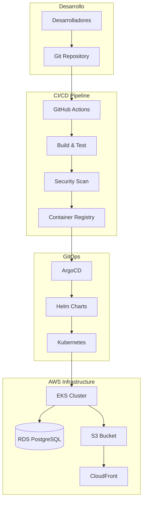

# Guía de Despliegue y CI/CD con GitOps

Esta guía cubre el despliegue completo de Retro Game Hub utilizando prácticas modernas de GitOps, incluyendo infraestructura como código, pipelines de CI/CD automatizados y despliegue continuo con ArgoCD.

## 📋 Arquitectura de Despliegue



## 🔧 Pre-requisitos

### Herramientas Requeridas

```bash
# AWS CLI
aws --version  # >= 2.x

# Terraform
terraform --version  # >= 1.5.0

# kubectl
kubectl version --client  # >= 1.28

# Helm
helm version  # >= 3.12

# Docker
docker --version  # >= 24.0

# ArgoCD CLI
argocd version  # >= 2.9
```

### Credenciales y Configuración

```bash
# Configurar credenciales AWS
aws configure

# Verificar acceso
aws sts get-caller-identity

# Variables de entorno base
export AWS_REGION="eu-west-1"
export CLUSTER_NAME="retrogame-eks-cluster"
export DOMAIN="retrogamehub.games"
export ARGOCD_NAMESPACE="argocd"
```

### Permisos AWS Necesarios

```json
{
  "Version": "2012-10-17",
  "Statement": [
    {
      "Effect": "Allow",
      "Action": [
        "ec2:*",
        "eks:*",
        "rds:*",
        "s3:*",
        "cloudfront:*",
        "iam:*",
        "route53:*",
        "ecr:*"
      ],
      "Resource": "*"
    }
  ]
}
```

---

## 🏗️ Fase 1: Infraestructura con Terraform

### 1.1 Configuración Inicial

```bash
# Clonar repositorio de infraestructura
git clone https://github.com/retrogamecloud/infrastructure.git
cd infrastructure

# Crear archivo de variables
cp terraform.tfvars.example terraform.tfvars
```

### 1.2 Variables de Terraform

```hcl
# terraform.tfvars
aws_region = "eu-west-1"
environment = "production"

# VPC Configuration
vpc_cidr = "10.0.0.0/16"
availability_zones = ["eu-west-1a", "eu-west-1b", "eu-west-1c"]

# EKS Configuration
cluster_name = "retrogame-eks-cluster"
cluster_version = "1.29"
node_instance_type = "t3.medium"
desired_nodes = 3
min_nodes = 2
max_nodes = 10

# RDS Configuration
db_instance_class = "db.t3.micro"
db_name = "retrogamedb"
db_username = "postgres"
# ⚠️ Usar AWS Secrets Manager en producción
db_password = "CHANGE_ME_IN_PRODUCTION"

# S3 Configuration
cdn_bucket_name = "retrogame-cdn-production"

# ArgoCD Configuration
argocd_enabled = true
argocd_version = "5.51.6"

# Tags
tags = {
  Environment = "production"
  Project     = "retrogame-hub"
  ManagedBy   = "terraform"
}
```

### 1.3 Desplegar Infraestructura

```bash
# Inicializar Terraform
terraform init

# Planificar cambios
terraform plan

# Aplicar infraestructura
terraform apply

# Obtener outputs importantes
terraform output eks_cluster_endpoint
terraform output rds_endpoint
terraform output s3_bucket_name
```

### 1.4 Configurar kubectl

```bash
# Configurar acceso al cluster
aws eks update-kubeconfig --region $AWS_REGION --name $CLUSTER_NAME

# Verificar conexión
kubectl cluster-info
kubectl get nodes
```

---

## 🚀 Fase 2: Configuración de ArgoCD

### 2.1 Instalación de ArgoCD

```bash
# Crear namespace
kubectl create namespace argocd

# Instalar ArgoCD usando Helm
helm repo add argo https://argoproj.github.io/argo-helm
helm repo update

# Instalar con configuración personalizada
cat <<EOF > argocd-values.yaml
server:
  service:
    type: LoadBalancer
  extraArgs:
    - --insecure
  config:
    url: "https://argocd.${DOMAIN}"
    application.instanceLabelKey: argocd.argoproj.io/instance

controller:
  metrics:
    enabled: true
    serviceMonitor:
      enabled: true

repoServer:
  metrics:
    enabled: true
    serviceMonitor:
      enabled: true

redis:
  metrics:
    enabled: true
    serviceMonitor:
      enabled: true

notifications:
  enabled: true
  argocdUrl: "https://argocd.${DOMAIN}"
EOF

helm install argocd argo/argo-cd \
  --namespace argocd \
  --values argocd-values.yaml \
  --version 5.51.6
```

### 2.2 Configurar Acceso a ArgoCD

```bash
# Esperar a que ArgoCD esté listo
kubectl wait --for=condition=available --timeout=300s deployment/argocd-server -n argocd

# Obtener password inicial del admin
ARGOCD_INITIAL_PASSWORD=$(kubectl -n argocd get secret argocd-initial-admin-secret -o jsonpath="{.data.password}" | base64 -d)
echo "ArgoCD Admin Password: $ARGOCD_INITIAL_PASSWORD"

# Port forward para acceso local (temporal)
kubectl port-forward svc/argocd-server -n argocd 8080:443 &

# Login con ArgoCD CLI
argocd login localhost:8080 --username admin --password $ARGOCD_INITIAL_PASSWORD --insecure
```

### 2.3 Configurar Repositorios Git

```bash
# Agregar repositorio de aplicaciones
argocd repo add https://github.com/retrogamecloud/retrogame-hub.git \
  --type git \
  --name retrogame-app

# Agregar repositorio de Helm charts
argocd repo add https://github.com/retrogamecloud/helm-charts.git \
  --type git \
  --name retrogame-charts

# Listar repositorios
argocd repo list
```

---

## 🔄 Fase 3: Pipeline CI/CD con GitHub Actions

### 3.1 Configuración de Secrets

En GitHub, configurar los siguientes secrets:

```bash
# AWS Credentials
AWS_ACCESS_KEY_ID
AWS_SECRET_ACCESS_KEY
AWS_REGION

# Container Registry
ECR_REPOSITORY_URI

# Kubernetes
KUBE_CONFIG_DATA  # Base64 encoded kubeconfig

# ArgoCD
ARGOCD_SERVER
ARGOCD_TOKEN
```

### 3.2 Pipeline Principal

```yaml
# .github/workflows/ci-cd.yml
name: CI/CD Pipeline

on:
  push:
    branches: [main, develop]
  pull_request:
    branches: [main]

env:
  AWS_REGION: eu-west-1
  ECR_REPOSITORY: retrogame-hub
  EKS_CLUSTER_NAME: retrogame-eks-cluster

jobs:
  test:
    runs-on: ubuntu-latest
    steps:
      - name: Checkout code
        uses: actions/checkout@v4

      - name: Setup Node.js
        uses: actions/setup-node@v4
        with:
          node-version: '20'
          cache: 'npm'

      - name: Install dependencies
        run: npm ci

      - name: Run tests
        run: |
          npm run test:unit
          npm run test:integration

      - name: Run security audit
        run: npm audit --audit-level high

  security-scan:
    runs-on: ubuntu-latest
    needs: test
    steps:
      - name: Checkout code
        uses: actions/checkout@v4

      - name: Run Trivy vulnerability scanner
        uses: aquasecurity/trivy-action@master
        with:
          scan-type: 'fs'
          scan-ref: '.'
          format: 'sarif'
          output: 'trivy-results.sarif'

      - name: Upload Trivy scan results to GitHub Security tab
        uses: github/codeql-action/upload-sarif@v2
        with:
          sarif_file: 'trivy-results.sarif'

  build-and-push:
    runs-on: ubuntu-latest
    needs: [test, security-scan]
    if: github.ref == 'refs/heads/main'
    outputs:
      image-tag: ${{ steps.meta.outputs.tags }}
      image-digest: ${{ steps.build.outputs.digest }}
    steps:
      - name: Checkout code
        uses: actions/checkout@v4

      - name: Configure AWS credentials
        uses: aws-actions/configure-aws-credentials@v4
        with:
          aws-access-key-id: ${{ secrets.AWS_ACCESS_KEY_ID }}
          aws-secret-access-key: ${{ secrets.AWS_SECRET_ACCESS_KEY }}
          aws-region: ${{ env.AWS_REGION }}

      - name: Login to Amazon ECR
        id: login-ecr
        uses: aws-actions/amazon-ecr-login@v2

      - name: Extract metadata
        id: meta
        uses: docker/metadata-action@v5
        with:
          images: ${{ steps.login-ecr.outputs.registry }}/${{ env.ECR_REPOSITORY }}
          tags: |
            type=ref,event=branch
            type=ref,event=pr
            type=sha,prefix={{branch}}-
            type=raw,value=latest,enable={{is_default_branch}}

      - name: Build and push Docker image
        id: build
        uses: docker/build-push-action@v5
        with:
          context: .
          push: true
          tags: ${{ steps.meta.outputs.tags }}
          labels: ${{ steps.meta.outputs.labels }}
          cache-from: type=gha
          cache-to: type=gha,mode=max

  deploy:
    runs-on: ubuntu-latest
    needs: build-and-push
    environment: production
    steps:
      - name: Checkout GitOps repo
        uses: actions/checkout@v4
        with:
          repository: retrogamecloud/gitops-configs
          token: ${{ secrets.GITOPS_TOKEN }}
          path: gitops

      - name: Update image tag
        run: |
          cd gitops
          IMAGE_TAG=$(echo "${{ needs.build-and-push.outputs.image-tag }}" | grep -o 'main-[a-f0-9]\{7\}')
          
          # Update Helm values
          sed -i "s|tag:.*|tag: ${IMAGE_TAG}|g" apps/retrogame-hub/values-production.yaml
          
          # Commit changes
          git config user.name "github-actions[bot]"
          git config user.email "github-actions[bot]@users.noreply.github.com"
          git add .
          git commit -m "Update image tag to ${IMAGE_TAG}"
          git push

      - name: Sync ArgoCD Application
        run: |
          argocd login ${{ secrets.ARGOCD_SERVER }} --auth-token ${{ secrets.ARGOCD_TOKEN }}
          argocd app sync retrogame-hub --prune
          argocd app wait retrogame-hub --timeout 300
```

### 3.3 Pipeline de Release

```yaml
# .github/workflows/release.yml
name: Release

on:
  release:
    types: [published]

env:
  AWS_REGION: eu-west-1
  ECR_REPOSITORY: retrogame-hub

jobs:
  release-deploy:
    runs-on: ubuntu-latest
    steps:
      - name: Checkout code
        uses: actions/checkout@v4

      - name: Configure AWS credentials
        uses: aws-actions/configure-aws-credentials@v4
        with:
          aws-access-key-id: ${{ secrets.AWS_ACCESS_KEY_ID }}
          aws-secret-access-key: ${{ secrets.AWS_SECRET_ACCESS_KEY }}
          aws-region: ${{ env.AWS_REGION }}

      - name: Login to Amazon ECR
        id: login-ecr
        uses: aws-actions/amazon-ecr-login@v2

      - name: Build and push release image
        uses: docker/build-push-action@v5
        with:
          context: .
          push: true
          tags: |
            ${{ steps.login-ecr.outputs.registry }}/${{ env.ECR_REPOSITORY }}:${{ github.event.release.tag_name }}
            ${{ steps.login-ecr.outputs.registry }}/${{ env.ECR_REPOSITORY }}:stable

      - name: Update production deployment
        run: |
          # Update production GitOps configuration
          git clone https://${{ secrets.GITOPS_TOKEN }}@github.com/retrogamecloud/gitops-configs.git
          cd gitops-configs
          
          sed -i "s|tag:.*|tag: ${{ github.event.release.tag_name }}|g" apps/retrogame-hub/values-production.yaml
          
          git config user.name "github-actions[bot]"
          git config user.email "github-actions[bot]@users.noreply.github.com"
          git add .
          git commit -m "Release ${{ github.event.release.tag_name }} to production"
          git push
```

---

## 🎯 Fase 4: Configuración de Aplicaciones ArgoCD

### 4.1 Estructura de Repositorio GitOps

```
gitops-configs/
├── apps/
│   └── retrogame-hub/
│       ├── base/
│       │   ├── kustomization.yaml
│       │   ├── deployment.yaml
│       │   ├── service.yaml
│       │   └── ingress.yaml
│       ├── overlays/
│       │   ├── development/
│       │   │   ├── kustomization.yaml
│       │   │   └── values.yaml
│       │   └── production/
│       │       ├── kustomization.yaml
│       │       └── values.yaml
│       ├── values-development.yaml
│       └── values-production.yaml
├── charts/
│   └── retrogame-hub/
│       ├── Chart.yaml
│       ├
```