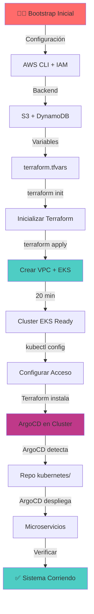

# Guía de Despliegue en Producción

Esta guía cubre el despliegue completo de Retro Game Hub en AWS utilizando EKS, RDS, CloudFront y toda la infraestructura necesaria.

<Warning>
  **IMPORTANTE**: Antes de proceder, completa el [Bootstrap Inicial](/infrastructure/bootstrap) para configurar credenciales AWS, backend de Terraform y variables necesarias.
</Warning>

## 📊 Flujo de Despliegue Completo


```mermaid
graph TD
    A[👨‍💻 Bootstrap Inicial] -->|Configuración| B[AWS CLI + IAM]
    B -->|Backend| C[S3 + DynamoDB]
    C -->|Variables| D[terraform.tfvars]
    D -->|terraform init| E[Inicializar Terraform]
    E -->|terraform apply| F[Crear VPC + EKS]
    F -->|20 min| G[Cluster EKS Ready]
    G -->|kubectl config| H[Configurar Acceso]
    H -->|Terraform instala| I[ArgoCD en Cluster]
    I -->|ArgoCD detecta| J[Repo kubernetes/]
    J -->|ArgoCD despliega| K[Microservicios]
    K -->|Verificar| L[✅ Sistema Corriendo]
    
    style A fill:#ff6b6b
    style F fill:#4ecdc4
    style I fill:#bf3989
    style L fill:#4ecdc4
```

## 📋 Pre-requisitos

### Herramientas Requeridas

```bash
# AWS CLI
aws --version  # >= 2.x

# Terraform
terraform --version  # >= 1.5.0

# kubectl
kubectl version --client  # >= 1.28

# Helm (opcional, para futuros componentes)
helm version  # >= 3.12

# Docker
docker --version  # >= 24.0
```

### Credenciales AWS

```bash
# Configurar credenciales AWS
aws configure

# Verificar acceso
aws sts get-caller-identity

# Permisos necesarios:
# - EC2 (VPC, Subnets, Security Groups)
# - EKS (Cluster, Node Groups)
# - RDS (Databases, Snapshots)
# - S3 (Buckets, Objects)
# - CloudFront (Distributions)
# - IAM (Roles, Policies)
# - Route53 (Hosted Zones, Records)
```

### Variables de Entorno Base

```bash
export AWS_REGION="eu-west-1"
export CLUSTER_NAME="retrogame-eks-cluster"
export DOMAIN="retrogamehub.games"
```

---

## 🏗️ Fase 1: Infraestructura AWS con Terraform

<Note>
  Si no completaste el bootstrap, ve a [Bootstrap Inicial](/infrastructure/bootstrap) antes de continuar.
</Note>

### 1.1 Clonar el Repositorio

```bash
git clone https://github.com/retrogamecloud/infrastructure.git
cd infrastructure/terraform/eks_test
```

### 1.2 Verificar Backend de Terraform

```bash
# Verificar que main.tf tiene configuración de backend
grep -A 5 'backend "s3"' main.tf

# Debería mostrar:
# backend "s3" {
#   bucket         = "retrogame-terraform-state-xxx"
#   key            = "terraform.tfstate"
#   region         = "eu-west-1"
#   dynamodb_table = "terraform-lock"
#   encrypt        = true
# }
```

<Accordion title="¿No ves configuración de backend?">
  Si `main.tf` no tiene backend configurado, sigue la guía de [Backend de Terraform](/infrastructure/terraform-backend) para crearlo.
</Accordion>

### 1.3 Revisar terraform.tfvars

```bash
# Verificar que terraform.tfvars existe
ls -la terraform.tfvars

# Ver contenido (¡cuidado con secrets!)
cat terraform.tfvars
```

Variables mínimas requeridas:
- ✅ `db_password`
- ✅ `github_oauth_client_id`
- ✅ `github_oauth_client_secret`

<Tip>
  Ver todas las variables disponibles en [Variables de Terraform](/infrastructure/terraform-variables)
</Tip>

### 1.4 Inicializar Terraform

```hcl
# terraform.tfvars
aws_region = "eu-west-1"
environment = "production"

# VPC Configuration
vpc_cidr = "10.0.0.0/16"
availability_zones = ["eu-west-1a", "eu-west-1b", "eu-west-1c"]

# EKS Configuration
cluster_name = "retrogame-eks-cluster"
cluster_version = "1.34"
node_instance_type = "t3.medium"
desired_nodes = 3
min_nodes = 2
max_nodes = 5

# RDS Configuration
db_instance_class = "db.t3.micro"
db_name = "retrogamedb"
db_username = "postgres"
# ⚠️ CAMBIAR en producción
db_password = "CHANGE_ME_IN_PRODUCTION"

# S3 Configuration
cdn_bucket_name = "retrogame-cdn-production"

# Tags
project = "RetroGameCloud"
team = "DevOps"
```

### 1.4 Inicializar Terraform

```bash
# Inicializar Terraform con backend remoto
terraform init

# Output esperado:
# Initializing the backend...
# Successfully configured the backend "s3"!
# 
# Terraform has been successfully initialized!
```

<Accordion title="Troubleshooting: Error inicializando backend">
**Error: Failed to get existing workspaces**

```bash
# Verificar credenciales
aws sts get-caller-identity

# Verificar permisos en bucket
aws s3 ls s3://retrogame-terraform-state/

# Si falla, revisar política IAM (ver Bootstrap)
```

**Error: Backend configuration changed**

```bash
# Reconfigurar backend
terraform init -reconfigure
```
</Accordion>

### 1.5 Validar y Planear

```bash
# Validar sintaxis de archivos
terraform validate

# Ver plan completo de lo que se creará
terraform plan

# Guardar plan para revisión
terraform plan -out=tfplan
terraform show tfplan
```

**Recursos que se crearán** (~52 recursos):
- 1 VPC con 6 subnets (3 públicas + 3 privadas)
- 1 Cluster EKS con addons
- 1 Node Group (2-4 nodos t3.medium)
- 1 Instancia RDS PostgreSQL
- 3 Buckets S3 + 1 CloudFront distribution
- 1 Application Load Balancer
- 1 Hosted Zone Route53 + Certificados ACM
- Stack de monitoreo (Prometheus, Grafana, AlertManager)
- ArgoCD para GitOps

### 1.6 Aplicar Infraestructura (⏱️ 20-30 minutos)

# Guardar outputs importantes
terraform output -json > terraform-outputs.json
```

### 1.4 Outputs Importantes

Terraform generará outputs críticos:

```bash
# Ver todos los outputs
terraform output

# Outputs clave:
# - vpc_id
# - eks_cluster_endpoint
# - eks_cluster_name
# - rds_endpoint
# - cloudfront_domain
# - s3_bucket_name
```

---

## ⚙️ Fase 2: Configuración de Kubernetes

### 2.1 Configurar kubectl

```bash
# Actualizar kubeconfig para EKS
aws eks update-kubeconfig \
  --region eu-west-1 \
  --name retrogame-eks-cluster

# Verificar conexión
kubectl get nodes

# Deberías ver 3 nodos en estado Ready:
# NAME                          STATUS   ROLES    AGE   VERSION
# ip-10-0-1-100.eu-west-1...    Ready    <none>   5m    v1.34.1-eks-3025e55
# ip-10-0-2-101.eu-west-1...    Ready    <none>   5m    v1.34.1-eks-3025e55
# ip-10-0-3-102.eu-west-1...    Ready    <none>   5m    v1.34.1-eks-3025e55
```

### 2.2 Crear Namespaces

```bash
# Crear namespaces para organización
kubectl create namespace backend
kubectl create namespace frontend
kubectl create namespace monitoring

# Etiquetar namespaces
kubectl label namespace backend environment=production
kubectl label namespace frontend environment=production
```

### 2.3 Configurar Secrets

```bash
# Database credentials
kubectl create secret generic db-credentials \
  --namespace=backend \
  --from-literal=username=postgres \
  --from-literal=password=YOUR_SECURE_PASSWORD \
  --from-literal=host=YOUR_RDS_ENDPOINT \
  --from-literal=database=retrogamedb

# JWT Secret
kubectl create secret generic jwt-secret \
  --namespace=backend \
  --from-literal=secret=$(openssl rand -base64 32)

# Redis password (si usas Redis)
kubectl create secret generic redis-credentials \
  --namespace=backend \
  --from-literal=password=$(openssl rand -base64 24)
```

### 2.4 Configurar ConfigMaps

```bash
# Backend configuration
kubectl create configmap backend-config \
  --namespace=backend \
  --from-literal=NODE_ENV=production \
  --from-literal=PORT=3000 \
  --from-literal=REDIS_HOST=redis-service \
  --from-literal=REDIS_PORT=6379
```

---

## 📦 Fase 3: Despliegue de Servicios Backend

### 3.1 Clonar Repositorio Backend

```bash
cd ~/projects
git clone https://github.com/retrogamecloud/backend.git
cd backend
```

### 3.2 Build y Push de Imágenes Docker

```bash
# Configurar variables
export DOCKER_USERNAME="your-dockerhub-username"
export VERSION="1.0.0"

# Build de cada servicio
services=("auth-service" "user-service" "game-catalog-service" "score-service" "ranking-service")

for service in "${services[@]}"; do
  echo "Building $service..."
  
  docker build -t $DOCKER_USERNAME/$service:$VERSION \
    -f $service/Dockerfile \
    $service/
  
  docker tag $DOCKER_USERNAME/$service:$VERSION \
    $DOCKER_USERNAME/$service:latest
  
  docker push $DOCKER_USERNAME/$service:$VERSION
  docker push $DOCKER_USERNAME/$service:latest
done
```

### 3.3 Desplegar Servicios en Kubernetes

```bash
# Aplicar manifiestos de Kubernetes
cd kubernetes/

# Desplegar en orden de dependencias
kubectl apply -f auth-service/ -n backend
kubectl apply -f user-service/ -n backend
kubectl apply -f game-catalog-service/ -n backend
kubectl apply -f score-service/ -n backend
kubectl apply -f ranking-service/ -n backend

# Verificar deployments
kubectl get deployments -n backend

# Verificar pods
kubectl get pods -n backend

# Todos deben estar en estado Running:
# NAME                                  READY   STATUS    RESTARTS   AGE
# auth-service-7d9c8b5f4-x7k2m         1/1     Running   0          2m
# user-service-6f8a9c4d3-m5n8p         1/1     Running   0          2m
# game-catalog-service-5e7b8a2c1-q9r4  1/1     Running   0          2m
# score-service-4d6c7b3a2-w8t5v        1/1     Running   0          2m
# ranking-service-3c5d6e2b1-y7u6n      1/1     Running   0          2m
```

### 3.4 Verificar Servicios

```bash
# Ver servicios creados
kubectl get services -n backend

# Verificar logs de un pod
kubectl logs -f deployment/auth-service -n backend

# Probar conectividad interna
kubectl run test-pod --image=busybox -it --rm -n backend \
  --command -- wget -qO- http://auth-service:3000/health
```

---

## 🌐 Fase 4: Despliegue de Kong API Gateway

### 4.1 Desplegar Kong

```bash
# Aplicar manifiestos de Kong
kubectl apply -f kong/

# Verificar deployment
kubectl get pods -n backend -l app=kong

# Esperar a que Kong esté Ready
kubectl wait --for=condition=ready pod \
  -l app=kong \
  -n backend \
  --timeout=300s
```

### 4.2 Obtener Load Balancer URL

```bash
# Obtener URL del Load Balancer
export KONG_LB=$(kubectl get svc kong-proxy \
  -n backend \
  -o jsonpath='{.status.loadBalancer.ingress[0].hostname}')

echo "Kong Load Balancer: http://$KONG_LB"

# Probar Kong Admin API
curl http://$KONG_LB:8001/status
```

### 4.3 Configurar Rutas de Kong

```bash
# Las rutas ya están configuradas en kong.yml
# Verificar configuración
kubectl exec -it deployment/kong -n backend -- kong config db_export
```

---

## 🔄 Fase 4.5: Configurar ArgoCD para GitOps

<Info>
  ArgoCD ya está instalado por Terraform en el namespace `argocd`. Ahora lo configuraremos para gestionar tus aplicaciones.
</Info>

### 4.5.1 Verificar Instalación de ArgoCD

```bash
# Ver pods de ArgoCD
kubectl get pods -n argocd

# Deberías ver varios pods Running
# Ver servicios
kubectl get svc -n argocd
```

### 4.5.2 Acceder a ArgoCD UI

```bash
# URL de ArgoCD
echo "https://retrogamehub.games/argocd"

# Obtener password de admin
kubectl get secret argocd-initial-admin-secret -n argocd \
  -o jsonpath="{.data.password}" | base64 -d
```

### 4.5.3 Crear Applications

```bash
# Aplicar definiciones de aplicaciones
kubectl apply -f argocd/apps/

# Verificar estado
kubectl get applications -n argocd
# NAME       SYNC STATUS   HEALTH STATUS
# backend    Synced        Healthy
# frontend   Synced        Healthy
# kong       Synced        Healthy
```

Ver guía completa en [ArgoCD y GitOps](/infrastructure/argocd-gitops)

---

## 🎮 Fase 5: Despliegue del Frontend

### 5.1 Subir Archivos al S3

```bash
cd frontend/

# Obtener nombre del bucket de Terraform
export S3_BUCKET=$(terraform output -raw s3_bucket_name)

# Sincronizar archivos
aws s3 sync . s3://$S3_BUCKET/ \
  --exclude "node_modules/*" \
  --exclude ".git/*" \
  --exclude "Dockerfile" \
  --exclude "package*.json"

# Verificar archivos subidos
aws s3 ls s3://$S3_BUCKET/ --recursive
```

### 5.2 Configurar Variables del Frontend

Editar `frontend/score-tracker.js` con URLs de producción:

```javascript
const API_BASE_URL = 'https://api.retrogamehub.games';
```

Volver a sincronizar:

```bash
aws s3 cp score-tracker.js s3://$S3_BUCKET/
```

### 5.3 Configurar CloudFront

```bash
# Obtener ID de distribución CloudFront
export CF_DIST_ID=$(terraform output -raw cloudfront_distribution_id)

# Invalidar caché para forzar actualización
aws cloudfront create-invalidation \
  --distribution-id $CF_DIST_ID \
  --paths "/*"

# Obtener URL de CloudFront
export CF_URL=$(terraform output -raw cloudfront_domain_name)
echo "Frontend disponible en: https://$CF_URL"
```

---

## 🌍 Fase 6: Configuración de Dominio (Opcional pero Recomendado)

### 6.1 Crear Hosted Zone en Route53

```bash
# Si compraste dominio en Route53, ya está creado
# Si compraste en otro registrador:
aws route53 create-hosted-zone \
  --name retrogamehub.games \
  --caller-reference $(date +%s)

# Obtener nameservers
aws route53 list-hosted-zones-by-name \
  --dns-name retrogamehub.games
```

### 6.2 Solicitar Certificados SSL

```bash
# Certificado para CloudFront (debe ser en us-east-1)
aws acm request-certificate \
  --region us-east-1 \
  --domain-name retrogamehub.games \
  --subject-alternative-names "*.retrogamehub.games" \
  --validation-method DNS

# Certificado para Load Balancer (en región de EKS)
aws acm request-certificate \
  --region eu-west-1 \
  --domain-name api.retrogamehub.games \
  --validation-method DNS

# ⚠️ Validar certificados en Route53 (proceso automático si usas Route53)
```

### 6.3 Configurar DNS Records

```bash
# Obtener Hosted Zone ID
export ZONE_ID=$(aws route53 list-hosted-zones-by-name \
  --dns-name retrogamehub.games \
  --query 'HostedZones[0].Id' \
  --output text)

# Crear record para API (apunta a Kong Load Balancer)
cat > api-record.json <<EOF
{
  "Changes": [{
    "Action": "CREATE",
    "ResourceRecordSet": {
      "Name": "api.retrogamehub.games",
      "Type": "CNAME",
      "TTL": 300,
      "ResourceRecords": [{"Value": "$KONG_LB"}]
    }
  }]
}
EOF

aws route53 change-resource-record-sets \
  --hosted-zone-id $ZONE_ID \
  --change-batch file://api-record.json

# Crear record para Frontend (apunta a CloudFront)
cat > frontend-record.json <<EOF
{
  "Changes": [{
    "Action": "CREATE",
    "ResourceRecordSet": {
      "Name": "retrogamehub.games",
      "Type": "A",
      "AliasTarget": {
        "HostedZoneId": "Z2FDTNDATAQYW2",
        "DNSName": "$CF_URL",
        "EvaluateTargetHealth": false
      }
    }
  }]
}
EOF

aws route53 change-resource-record-sets \
  --hosted-zone-id $ZONE_ID \
  --change-batch file://frontend-record.json
```

---

## ✅ Fase 7: Verificación Post-Despliegue

### 7.1 Health Checks

```bash
# Verificar todos los servicios
services=("auth" "user" "games" "scores" "rankings")

for service in "${services[@]}"; do
  echo "Testing $service service..."
  curl -f https://api.retrogamehub.games/$service/health || echo "❌ $service FAILED"
done
```

### 7.2 Tests End-to-End

```bash
# Test de registro
curl -X POST https://api.retrogamehub.games/auth/register \
  -H "Content-Type: application/json" \
  -d '{
    "username": "testuser",
    "email": "test@example.com",
    "password": "Test123!"
  }'

# Test de login
curl -X POST https://api.retrogamehub.games/auth/login \
  -H "Content-Type: application/json" \
  -d '{
    "username": "testuser",
    "password": "Test123!"
  }'

# Test de listado de juegos
curl https://api.retrogamehub.games/games

# Test de frontend
curl -I https://retrogamehub.games
```

### 7.3 Verificar Logs

```bash
# Ver logs de todos los servicios
kubectl logs -f deployment/auth-service -n backend --tail=50
kubectl logs -f deployment/score-service -n backend --tail=50
kubectl logs -f deployment/ranking-service -n backend --tail=50

# Ver eventos del cluster
kubectl get events -n backend --sort-by='.lastTimestamp'
```

### 7.4 Verificar Base de Datos

```bash
# Conectar a RDS (desde un pod en el cluster)
kubectl run psql-client --rm -it --image=postgres:15 -n backend -- \
  psql -h YOUR_RDS_ENDPOINT -U postgres -d retrogamedb

# Verificar tablas
\dt

# Verificar datos de prueba
SELECT COUNT(*) FROM users;
SELECT COUNT(*) FROM games;
```

---

## 🔄 Fase 8: Configuración de CI/CD (Opcional)

### 8.1 GitHub Actions Secrets

Configurar secrets en GitHub:

```bash
# En GitHub repo → Settings → Secrets and variables → Actions
AWS_ACCESS_KEY_ID=<your-key-id>
AWS_SECRET_ACCESS_KEY=<your-secret-key>
DOCKER_USERNAME=<dockerhub-username>
DOCKER_PASSWORD=<dockerhub-token>
KUBE_CONFIG_DATA=<base64-encoded-kubeconfig>
```

### 8.2 Workflow de Deploy Automático

Ya configurado en `.github/workflows/deploy.yml`. Cada push a `main` desplegará automáticamente.

---

## 📊 Fase 9: Monitoreo (Próximamente)

<Info>
El stack de monitoreo con Prometheus y Grafana se desplegará próximamente según el ROADMAP.
</Info>

### Métricas a Monitorear

- **EKS Cluster**: CPU, memoria, disco de nodos
- **Pods**: CPU, memoria, restarts, crash loops
- **RDS**: Conexiones, queries, latencia
- **Kong**: Request rate, latencia, errores
- **CloudFront**: Requests, cache hit ratio

---

## 🚨 Troubleshooting

### Pods no inician

```bash
# Describir el pod con problemas
kubectl describe pod <pod-name> -n backend

# Ver logs
kubectl logs <pod-name> -n backend

# Problemas comunes:
# - Image pull errors → Verificar nombre de imagen en DockerHub
# - CrashLoopBackOff → Revisar logs, variables de entorno
# - Pending → Verificar recursos disponibles en nodos
```

### Servicios no responden

```bash
# Verificar endpoints
kubectl get endpoints -n backend

# Verificar conectividad desde otro pod
kubectl run test --rm -it --image=busybox -n backend -- \
  wget -qO- http://auth-service:3000/health

# Verificar Security Groups de AWS
aws ec2 describe-security-groups --filters "Name=vpc-id,Values=<vpc-id>"
```

### Base de datos no conecta

```bash
# Verificar Security Group de RDS permite tráfico desde EKS
# Verificar secret de DB está creado correctamente
kubectl get secret db-credentials -n backend -o yaml

# Test de conexión manual
kubectl run psql-test --rm -it --image=postgres:15 -n backend -- \
  psql -h <rds-endpoint> -U postgres -d retrogamedb
```

### CloudFront no actualiza

```bash
# Invalidar caché
aws cloudfront create-invalidation \
  --distribution-id <dist-id> \
  --paths "/*"

# Esperar 5-10 minutos para propagación
```

---

## 🔐 Checklist de Seguridad Pre-Producción

- [ ] Todos los secrets en Kubernetes Secrets (no hardcodeados)
- [ ] Database password fuerte y único
- [ ] JWT secret generado aleatoriamente
- [ ] SSL/TLS habilitado en Kong y CloudFront
- [ ] Security Groups configurados con principio de mínimo privilegio
- [ ] RDS con automated backups habilitados
- [ ] IAM roles con permisos mínimos necesarios
- [ ] Network policies de Kubernetes configuradas
- [ ] Rate limiting habilitado en Kong
- [ ] CORS configurado correctamente

---

## 💰 Estimación de Costos

| Recurso | Costo Mensual Estimado |
|---------|------------------------|
| EKS Control Plane | $73 |
| 3x t3.medium nodes | $90 |
| RDS t3.micro PostgreSQL | $20 |
| NAT Gateway | $45 |
| CloudFront + S3 | $10-15 |
| Load Balancer | $20 |
| Route53 | $0.50 |
| **TOTAL** | **~$258-263/mes** |

<Warning>
Recuerda destruir la infraestructura con `terraform destroy` cuando no la necesites para evitar costos.
</Warning>

---

## 🔧 Troubleshooting de Terraform

<AccordionGroup>
  <Accordion title="Error: InsufficientCapabilitiesException">
    **Síntoma**: Error creating EKS Node Group
    
    **Solución**:
    ```bash
    # Verificar y adjuntar políticas IAM necesarias
    aws iam attach-role-policy \
      --role-name eks-node-group-role \
      --policy-arn arn:aws:iam::aws:policy/AmazonEKSWorkerNodePolicy
    ```
  </Accordion>
  
  <Accordion title="Error: InvalidParameterException (Subnets)">
    **Causa**: CIDR blocks muy pequeños
    
    **Solución**: Ajustar en `terraform.tfvars`:
    ```hcl
    vpc_cidr = "10.0.0.0/16"  # Más amplio
    ```
  </Accordion>
  
  <Accordion title="Estado Corrupto de Terraform">
    **Solución**:
    ```bash
    terraform refresh
    # O restaurar desde S3 backup
    ```
  </Accordion>
  
  <Accordion title="Error: DynamoDB Lock Timeout">
    **Solución**:
    ```bash
    terraform force-unlock <LOCK_ID>
    ```
  </Accordion>
</AccordionGroup>

---

## 📞 Soporte

Si encuentras problemas durante el despliegue:

1. Revisa los logs: `kubectl logs <pod-name> -n backend`
2. Verifica eventos: `kubectl get events -n backend`
3. Consulta la [documentación de troubleshooting](/troubleshooting)
4. Abre un issue en GitHub

---

## 🎯 Próximos Pasos

Una vez desplegado exitosamente:

1. **Configurar Monitoreo**: Implementar Prometheus + Grafana
2. **Configurar Alertas**: AlertManager para notificaciones
3. **Implementar GitOps**: ArgoCD para deploy declarativo
4. **Optimizar Costos**: Revisar usage y ajustar recursos
5. **Backup Strategy**: Configurar backups de RDS

<Card title="¿Listo para Producción?" icon="rocket">
  Con esta guía tu aplicación está desplegada y lista para recibir tráfico real. ¡Felicidades! 🎉
</Card>
