# Guía de Despliegue y CI/CD con GitOps

Esta guía cubre el despliegue completo de Retro Game Hub utilizando prácticas modernas de GitOps, incluyendo infraestructura como código, pipelines de CI/CD automatizados y despliegue continuo con ArgoCD.

## 📋 Arquitectura de Despliegue

```mermaid
graph TB
    subgraph "Desarrollo"
        DEV[👩‍💻 Desarrolladores]
        GIT[📁 Git Repository]
        COMMIT[📝 Commit & Push]
    end

    subgraph "CI/CD Pipeline"
        subgraph "GitHub Actions"
            TRIGGER[🎯 Webhook Trigger]
            CHECKOUT[📥 Checkout Code]
            BUILD[🔨 Build & Test]
            SCAN[🛡️ Security Scan]
            DOCKER[🐳 Docker Build]
            PUSH[📤 Push to ECR]
            UPDATE[📝 Update Manifests]
        end
    end

    subgraph "Container Registry"
        ECR[🐳 AWS ECR]
        IMAGES[Docker Images]
    end

    subgraph "GitOps"
        ARGO[🔄 ArgoCD]
        SYNC[🔄 Auto Sync]
        HELM[⚓ Helm Charts]
        MANIFEST[📋 K8s Manifests]
    end

    subgraph "Kubernetes Cluster"
        EKS[☸️ EKS Cluster]
        DEPLOY[🚀 Deployment]
        PODS[📦 Pods]
        SVC[🌐 Services]
        INGRESS[🌍 Ingress]
    end

    subgraph "Health Checks"
        READINESS[✅ Readiness Probes]
        LIVENESS[❤️ Liveness Probes]
        METRICS[📊 Metrics]
        ALERTS[🚨 Alerts]
    end

    subgraph "AWS Infrastructure"
        RDS[(🗄️ RDS PostgreSQL)]
        S3[📦 S3 Bucket]
        CF[☁️ CloudFront]
        ALB[⚖️ Application Load Balancer]
    end

    %% Flujo principal
    DEV --> COMMIT
    COMMIT --> GIT
    GIT --> TRIGGER
    TRIGGER --> CHECKOUT
    CHECKOUT --> BUILD
    BUILD --> SCAN
    SCAN --> DOCKER
    DOCKER --> PUSH
    PUSH --> ECR
    ECR --> IMAGES
    PUSH --> UPDATE
    UPDATE --> ARGO
    ARGO --> SYNC
    SYNC --> HELM
    HELM --> MANIFEST
    MANIFEST --> EKS
    EKS --> DEPLOY
    DEPLOY --> PODS
    PODS --> SVC
    SVC --> INGRESS
    INGRESS --> ALB

    %% Health checks
    PODS --> READINESS
    PODS --> LIVENESS
    PODS --> METRICS
    METRICS --> ALERTS

    %% Conexiones de infraestructura
    PODS --> RDS
    PODS --> S3
    ALB --> CF

    %% Estilos
    classDef cicd fill:#e1f5fe
    classDef gitops fill:#f3e5f5
    classDef k8s fill:#e8f5e8
    classDef aws fill:#fff3e0
    classDef health fill:#fce4ec

    class TRIGGER,CHECKOUT,BUILD,SCAN,DOCKER,PUSH,UPDATE cicd
    class ARGO,SYNC,HELM,MANIFEST gitops
    class EKS,DEPLOY,PODS,SVC,INGRESS k8s
    class RDS,S3,CF,ALB aws
    class READINESS,LIVENESS,METRICS,ALERTS health

```



## 🔧 Pre-requisitos

### Herramientas Requeridas

```bash

# AWS CLI
aws --version  # >= 2.x

# Terraform
terraform --version  # >= 1.5.0

# kubectl
kubectl version --client  # >= 1.28

# Helm
helm version  # >= 3.12

# Docker
docker --version  # >= 24.0

# ArgoCD CLI
argocd version  # >= 2.9

```

### Credenciales y Configuración

```bash

# Configurar credenciales AWS
aws configure

# Verificar acceso
aws sts get-caller-identity

# Variables de entorno base
export AWS_REGION="eu-west-1"
export CLUSTER_NAME="retrogame-eks-cluster"
export DOMAIN="retrogamehub.games"
export ARGOCD_NAMESPACE="argocd"

```

### Permisos AWS Necesarios

```json
{
  "Version": "2012-10-17",
  "Statement": [
    {
      "Effect": "Allow",
      "Action": [
        "ec2:*",
        "eks:*",
        "rds:*",
        "s3:*",
        "cloudfront:*",
        "iam:*",
        "ecr:*",
        "elasticloadbalancing:*",
        "route53:*",
        "acm:*"
      ],
      "Resource": "*"
    }
  ]
}

```

## 🏗️ Configuración de Infraestructura

### 1. Terraform - Infraestructura Base

```hcl

# terraform/main.tf
terraform {
  required_version = ">= 1.5.0"
  required_providers {
    aws = {
      source  = "hashicorp/aws"
      version = "~> 5.0"
    }
    kubernetes = {
      source  = "hashicorp/kubernetes"
      version = "~> 2.20"
    }
    helm = {
      source  = "hashicorp/helm"
      version = "~> 2.10"
    }
  }

  backend "s3" {
    bucket = "retrogame-terraform-state"
    key    = "infrastructure/terraform.tfstate"
    region = "eu-west-1"
  }
}

# Variables
variable "cluster_name" {
  description = "Nombre del cluster EKS"
  type        = string
  default     = "retrogame-eks-cluster"
}

variable "environment" {
  description = "Ambiente de despliegue"
  type        = string
  default     = "production"
}

# EKS Cluster
module "eks" {
  source = "terraform-aws-modules/eks/aws"

  cluster_name    = var.cluster_name
  cluster_version = "1.28"

  vpc_id     = module.vpc.vpc_id
  subnet_ids = module.vpc.private_subnets

  node_groups = {
    main = {
      desired_capacity = 3
      max_capacity     = 10
      min_capacity     = 2

      instance_types = ["t3.medium"]

      k8s_labels = {
        Environment = var.environment
        Application = "retrogame-hub"
      }
    }
  }

  tags = {
    Environment = var.environment
    Project     = "retrogame-hub"
  }
}

# ECR Repository
resource "aws_ecr_repository" "app_repos" {
  for_each = toset([
    "retrogame-frontend",
    "retrogame-backend",
    "retrogame-game-service"
  ])

  name                 = each.value
  image_tag_mutability = "MUTABLE"

  image_scanning_configuration {
    scan_on_push = true
  }
}

# RDS Database
resource "aws_db_instance" "postgres" {
  identifier = "retrogame-db"

  engine         = "postgres"
  engine_version = "15.4"
  instance_class = "db.t3.micro"

  allocated_storage     = 20
  max_allocated_storage = 100
  storage_encrypted     = true

  db_name  = "retrogame"
  username = "retrogame_user"
  password = random_password.db_password.result

  vpc_security_group_ids = [aws_security_group.rds.id]
  db_subnet_group_name   = aws_db_subnet_group.main.name

  backup_retention_period = 7
  backup_window          = "03:00-04:00"
  maintenance_window     = "sun:04:00-sun:05:00"

  skip_final_snapshot = false
  final_snapshot_identifier = "retrogame-db-final-snapshot-${formatdate("YYYY-MM-DD-hhmm", timestamp())}"

  tags = {
    Name        = "retrogame-database"
    Environment = var.environment
  }
}

# S3 Bucket para assets
resource "aws_s3_bucket" "assets" {
  bucket = "retrogame-hub-assets-${random_id.bucket_suffix.hex}"
}

resource "aws_s3_bucket_public_access_block" "assets" {
  bucket = aws_s3_bucket.assets.id

  block_public_acls       = false
  block_public_policy     = false
  ignore_public_acls      = false
  restrict_public_buckets = false
}

```

### 2. Desplegar Infraestructura

```bash

# Inicializar Terraform
cd terraform
terraform init

# Planificar cambios
terraform plan -var="environment=production"

# Aplicar cambios
terraform apply -var="environment=production" -auto-approve

# Configurar kubectl
aws eks update-kubeconfig --region eu-west-1 --name retrogame-eks-cluster

```

## 🔄 Configuración de CI/CD

### 1. GitHub Actions - Pipeline Principal

```yaml

# .github/workflows/deploy.yml
name: Deploy to Production

on:
  push:
    branches: [main]
    paths:
      - 'src/**'
      - 'Dockerfile*'
      - 'package*.json'
  pull_request:
    branches: [main]

env:
  AWS_REGION: eu-west-1
  EKS_CLUSTER: retrogame-eks-cluster

jobs:
  test:
    name: Tests y Quality Gates
    runs-on: ubuntu-latest

    steps:
    - name: Checkout código
      uses: actions/checkout@v4

    - name: Setup Node.js
      uses: actions/setup-node@v4
      with:
        node-version: '20'
        cache: 'npm'

    - name: Instalar dependencias
      run: |
        npm ci
        cd backend && npm ci

    - name: Ejecutar tests
      run: |
        npm run test:coverage
        cd backend && npm run test:coverage

    - name: SonarCloud Scan
      uses: SonarSource/sonarcloud-github-action@master
      env:
        GITHUB_TOKEN: ${{ secrets.GITHUB_TOKEN }}
        SONAR_TOKEN: ${{ secrets.SONAR_TOKEN }}

    - name: Upload coverage to Codecov
      uses: codecov/codecov-action@v3

  security:
    name: Security Scanning
    runs-on: ubuntu-latest
    needs: test

    steps:
    - name: Checkout
      uses: actions/checkout@v4

    - name: Run Trivy vulnerability scanner
      uses: aquasecurity/trivy-action@master
      with:
        scan-type: 'fs'
        scan-ref: '.'
        format: 'sarif'
        output: 'trivy-results.sarif'

    - name: Upload Trivy scan results
      uses: github/codeql-action/upload-sarif@v2
      with:
        sarif_file: 'trivy-results.sarif'

  build-and-push:
    name: Build y Push Images
    runs-on: ubuntu-latest
    needs: [test, security]
    if: github.ref == 'refs/heads/main'

    strategy:
      matrix:
        service: [frontend, backend, game-service]

    steps:
    - name: Checkout
      uses: actions/checkout@v4

    - name: Configure AWS credentials
      uses: aws-actions/configure-aws-credentials@v4
      with:
        aws-access-key-id: ${{ secrets.AWS_ACCESS_KEY_ID }}
        aws-secret-access-key: ${{ secrets.AWS_SECRET_ACCESS_KEY }}
        aws-region: ${{ env.AWS_REGION }}

    - name: Login to Amazon ECR
      id: login-ecr
      uses: aws-actions/amazon-ecr-login@v1

    - name: Build, tag, and push image
      env:
        ECR_REGISTRY: ${{ steps.login-ecr.outputs.registry }}
        ECR_REPOSITORY: retrogame-${{ matrix.service }}
        IMAGE_TAG: ${{ github.sha }}
      run: |
        # Build Docker image
        docker build -t $ECR_REGISTRY/$ECR_REPOSITORY:$IMAGE_TAG \
          -f docker/${{ matrix.service }}/Dockerfile .

        # Tag as latest
        docker tag $ECR_REGISTRY/$ECR_REPOSITORY:$IMAGE_TAG \
          $ECR_REGISTRY/$ECR_REPOSITORY:latest

        # Push images
        docker push $ECR_REGISTRY/$ECR_REPOSITORY:$IMAGE_TAG
        docker push $ECR_REGISTRY/$ECR_REPOSITORY:latest

    - name: Scan image with Trivy
      uses: aquasecurity/trivy-action@master
      with:
        image-ref: '${{ steps.login-ecr.outputs.registry }}/retrogame-${{ matrix.service }}:${{ github.sha }}'
        format: 'sarif'
        output: 'trivy-image-results.sarif'

    outputs:
      image-tag: ${{ github.sha }}

  update-manifests:
    name: Update Kubernetes Manifests
    runs-on: ubuntu-latest
    needs: build-and-push

    steps:
    - name: Checkout GitOps repo
      uses: actions/checkout@v4
      with:
        repository: your-org/retrogame-gitops
        token: ${{ secrets.GITOPS_TOKEN }}
        path: gitops

    - name: Update image tags
      env:
        IMAGE_TAG: ${{ needs.build-and-push.outputs.image-tag }}
      run: |
        cd gitops

        # Update Helm values
        yq eval '.frontend.image.tag = env(IMAGE_TAG)' -i environments/production/values.yaml
        yq eval '.backend.image.tag = env(IMAGE_TAG)' -i environments/production/values.yaml
        yq eval '.gameService.image.tag = env(IMAGE_TAG)' -i environments/production/values.yaml

    - name: Commit and push changes
      run: |
        cd gitops
        git config user.name "github-actions[bot]"
        git config user.email "github-actions[bot]@users.noreply.github.com"
        git add .
        git commit -m "Update image tags to ${{ needs.build-and-push.outputs.image-tag }}"
        git push

  notify:
    name: Notify Deployment
    runs-on: ubuntu-latest
    needs: update-manifests
    if: always()

    steps:
    - name: Slack Notification
      uses: 8398a7/action-slack@v3
      with:
        status: ${{ job.status }}
        channel: '#deployments'
        webhook_url: ${{ secrets.SLACK_WEBHOOK }}

```

### 2. Pipeline de Rollback

```yaml

# .github/workflows/rollback.yml
name: Rollback Deployment

on:
  workflow_dispatch:
    inputs:
      environment:
        description: 'Environment to rollback'
        required: true
        default: 'production'
        type: choice
        options:
        - production
        - staging
      previous_version:
        description: 'Previous version to rollback to'
        required: true
        type: string

jobs:
  rollback:
    name: Rollback to Previous Version
    runs-on: ubuntu-latest

    steps:
    - name: Configure AWS credentials
      uses: aws-actions/configure-aws-credentials@v4
      with:
        aws-access-key-id: ${{ secrets.AWS_ACCESS_KEY_ID }}
        aws-secret-access-key: ${{ secrets.AWS_SECRET_ACCESS_KEY }}
        aws-region: ${{ env.AWS_REGION }}

    - name: Update kubeconfig
      run: |
        aws eks update-kubeconfig --region ${{ env.AWS_REGION }} --name ${{ env.EKS_CLUSTER }}

    - name: Rollback deployment
      run: |
        kubectl rollout undo deployment/retrogame-frontend -n retrogame-${{ inputs.environment }}
        kubectl rollout undo deployment/retrogame-backend -n retrogame-${{ inputs.environment }}
        kubectl rollout undo deployment/retrogame-game-service -n retrogame-${{ inputs.environment }}

    - name: Wait for rollback completion
      run: |
        kubectl rollout status deployment/retrogame-frontend -n retrogame-${{ inputs.environment }} --timeout=300s
        kubectl rollout status deployment/retrogame-backend -n retrogame-${{ inputs.environment }} --timeout=300s
        kubectl rollout status deployment/retrogame-game-service -n retrogame-${{ inputs.environment }} --timeout=300s

    - name: Verify rollback
      run: |
        kubectl get pods -n retrogame-${{ inputs.environment }}
        kubectl get services -n retrogame-${{ inputs.environment }}

```

## 🚀 ArgoCD - GitOps Setup

### 1. Instalar ArgoCD

```bash

# Crear namespace
kubectl create namespace argocd

# Instalar ArgoCD
kubectl apply -n argocd -f https://raw.githubusercontent.com/argoproj/argo-cd/stable/manifests/install.yaml

# Esperar a que los pods estén listos
kubectl wait --for=condition=available --timeout=300s deployment/argocd-server -n argocd

# Obtener password inicial de admin
kubectl -n argocd get secret argocd-initial-admin-secret -o jsonpath="{.data.password}" | base64 -d

# Port forward para acceso web
kubectl port-forward svc/argocd-server -n argocd 8080:443

```

### 2. Configurar ArgoCD

```yaml

# argocd/application.yaml
apiVersion: argoproj.io/v1alpha1
kind: Application
metadata:
  name: retrogame-hub
  namespace: argocd
  finalizers:
    - resources-finalizer.argocd.argoproj.io
spec:
  project: default

  source:
    repoURL: https://github.com/your-org/retrogame-gitops
    targetRevision: HEAD
    path: environments/production
    helm:
      valueFiles:
      - values.yaml

  destination:
    server: https://kubernetes.default.svc
    namespace: retrogame-production

  syncPolicy:
    automated:
      prune: true
      selfHeal: true
      allowEmpty: false
    syncOptions:
    - CreateNamespace=true
    - PrunePropagationPolicy=foreground
    - PruneLast=true
    retry:
      limit: 5
      backoff:
        duration: 5s
        factor: 2
        maxDuration: 3m

- --
apiVersion: argoproj.io/v1alpha1
kind: AppProject
metadata:
  name: retrogame
  namespace: argocd
spec:
  description: Retro Game Hub Project

  sourceRepos:
  - 'https://github.com/your-org/retrogame-gitops'
  - 'https://charts.bitnami.com/bitnami'

  destinations:
  - namespace: 'retrogame-*'
    server: https://kubernetes.default.svc

  clusterResourceWhitelist:
  - group: ''
    kind: Namespace
  - group: 'networking.k8s.io'
    kind: Ingress

  namespaceResourceWhitelist:
  - group: ''
    kind: '*'
  - group: 'apps'
    kind: '*'
  - group: 'networking.k8s.io'
    kind: '*'

```

### 3. Aplicar Configuración ArgoCD

```bash

# Aplicar configuración
kubectl apply -f argocd/application.yaml

# Verificar aplicación
argocd app list
argocd app get retrogame-hub

# Sincronizar manualmente (primera vez)
argocd app sync retrogame-hub

```

## ☸️ Helm Charts y Manifiestos

### 1. Estructura de Helm Chart

```

helm/
├── Chart.yaml
├── values.yaml
├── templates/
│   ├── frontend/
│   │   ├── deployment.yaml
│   │   ├── service.yaml
│   │   └── ingress.yaml
│   ├── backend/
│   │   ├── deployment.yaml
│   │   ├── service.yaml
│   │   └── configmap.yaml
│   ├── game-service/
│   │   ├── deployment.yaml
│   │   └── service.yaml
│   ├── database/
│   │   └── secret.yaml
│   └── monitoring/
│       ├── servicemonitor.yaml
│       └── prometheusrule.yaml
└── environments/
    ├── production/
    │   └── values.yaml
    └── staging/
        └── values.yaml

```

### 2. Chart.yaml

```yaml

# helm/Chart.yaml
apiVersion: v2
name: retrogame-hub
description: Retro Game Hub Application
version: 1.0.0
appVersion: "1.0.0"

dependencies:

- name: postgresql
  version: 12.1.9
  repository: https://charts.bitnami.com/bitnami
  condition: postgresql.enabled

- name: redis
  version: 17.3.7
  repository: https://charts.bitnami.com/bitnami
  condition: redis.enabled

maintainers:

- name: Retro Game Hub Team
  email: devops@retrogamehub.games

```

### 3. Values.yaml Principal

```yaml

# helm/values.yaml
global:
  imageRegistry: "123456789012.dkr.ecr.eu-west-1.amazonaws.com"
  imagePullPolicy: IfNotPresent
  storageClass: "gp2"

replicaCount: 3

frontend:
  enabled: true
  image:
    repository: retrogame-frontend
    tag: "latest"
    pullPolicy: IfNotPresent

  service:
    type: ClusterIP
    port: 80
    targetPort: 3000

  resources:
    requests:
      cpu: 100m
      memory: 128Mi
    limits:
      cpu: 500m
      memory: 512Mi

  autoscaling:
    enabled: true
    minReplicas: 2
    maxReplicas: 10
    targetCPUUtilizationPercentage: 70

  probes:
    liveness:
      httpGet:
        path: /health
        port: 3000
      initialDelaySeconds: 30
      periodSeconds: 10
    readiness:
      httpGet:
        path: /ready
        port: 3000
      initialDelaySeconds: 5
      periodSeconds: 5

backend:
  enabled: true
  image:
    repository: retrogame-backend
    tag: "latest"

  service:
    type: ClusterIP
    port: 8080

  config:
    nodeEnv: production
    logLevel: info

  secrets:
    dbPassword: ""
    jwtSecret: ""

  resources:
    requests:
      cpu: 200m
      memory: 256Mi
    limits:
      cpu: 1000m
      memory: 1Gi

  autoscaling:
    enabled: true
    minReplicas: 3
    maxReplicas: 20
    targetCPUUtilizationPercentage: 70

gameService:
  enabled: true
  image:
    repository: retrogame-game-service
    tag: "latest"

  service:
    type: ClusterIP
    port: 8081

  resources:
    requests:
      cpu: 500m
      memory: 512Mi
    limits:
      cpu: 2000m
      memory: 2Gi

ingress:
  enabled: true
  className: "alb"
  annotations:
    kubernetes.io/ingress.class: alb
    alb.ingress.kubernetes.io/scheme: internet-facing
    alb.ingress.kubernetes.io/target-type: ip
    alb.ingress.kubernetes.io/ssl-redirect: '443'
    alb.ingress.kubernetes.io/certificate-arn: "arn:aws:acm:eu-west-1:123456789012:certificate/your-cert-id"

  hosts:
  - host: retrogamehub.games
    paths:
    - path: /
      pathType: Prefix
      backend:
        service:
          name: retrogame-frontend
          port:
            number: 80
    - path: /api
      pathType: Prefix
      backend:
        service:
          name: retrogame-backend
          port:
            number: 8080
    - path: /games
      pathType: Prefix
      backend:
        service:
          name: retrogame-game-service
          port:
            number: 8081

  tls:
  - secretName: retrogame-tls
    hosts:
    - retrogamehub.games

# Database externa (RDS)
postgresql:
  enabled: false

externalDatabase:
  host: "retrogame-db.cluster-xyz.eu-west-1.rds.amazonaws.com"
  port: 5432
  database: retrogame
  username: retrogame_user
  existingSecret: retrogame-db-secret

# Redis para cache
redis:
  enabled: true
  auth:
    enabled: true
    password: "your-redis-password"
  master:
    persistence:
      enabled: true
      size: 8Gi

monitoring:
  enabled: true
  serviceMonitor:
    enabled: true
    namespace: monitoring
  prometheusRule:
    enabled: true

```

### 4. Deployment Templates

```yaml

# helm/templates/backend/deployment.yaml
apiVersion: apps/v1
kind: Deployment
metadata:
  name: {{ include "retrogame-hub.fullname" . }}-backend
  labels:
    {{- include "retrogame-hub.labels" . | nindent 4 }}
    app.kubernetes.io/component: backend
spec:
  replicas: {{ .Values.backend.replicaCount | default .Values.replicaCount }}
  selector:
    matchLabels:
      {{- include "retrogame-hub.selectorLabels" . | nindent 6 }}
      app.kubernetes.io/component: backend
  template:
    metadata:
      annotations:
        checksum/config: {{ include (print $.Template.BasePath "/backend/configmap.yaml") . | sha256sum }}
        checksum/secret: {{ include (print $.Template.BasePath "/database/secret.yaml") . | sha256sum }}
      labels:
        {{- include "retrogame-hub.selectorLabels" . | nindent 8 }}
        app.kubernetes.io/component: backend
    spec:
      serviceAccountName: {{ include "retrogame-hub.serviceAccountName" . }}
      containers:
      - name: backend
        image: "{{ .Values.global.imageRegistry }}/{{ .Values.backend.image.repository }}:{{ .Values.backend.image.tag }}"
        imagePullPolicy: {{ .Values.backend.image.pullPolicy | default .Values.global.imagePullPolicy }}
        ports:
        - name: http
          containerPort: 8080
          protocol: TCP
        env:
        - name: NODE_ENV
          value: {{ .Values.backend.config.nodeEnv }}
        - name: LOG_LEVEL
          value: {{ .Values.backend.config.logLevel }}
        - name: DATABASE_URL
          valueFrom:
            secretKeyRef:
              name: {{ include "retrogame-hub.fullname" . }}-db-secret
              key: database-url
        - name: JWT_SECRET
          valueFrom:
            secretKeyRef:
              name: {{ include "retrogame-hub.fullname" . }}-backend-secret
              key: jwt-secret
        - name: REDIS_URL
          value: "redis://{{ include "retrogame-hub.fullname" . }}-redis-master:6379"
        livenessProbe:
          httpGet:
            path: /health
            port: http
          initialDelaySeconds: 30
          periodSeconds: 10
          timeoutSeconds: 5
          failureThreshold: 3
        readinessProbe:
          httpGet:
            path: /ready
            port: http
          initialDelaySeconds: 5
          periodSeconds: 5
          timeoutSeconds: 3
          failureThreshold: 3
        resources:
          {{- toYaml .Values.backend.resources | nindent 10 }}
        securityContext:
          allowPrivilegeEscalation: false
          runAsNonRoot: true
          runAsUser: 1001
          capabilities:
            drop:
            - ALL
      securityContext:
        fsGroup: 1001

```

## 🔍 Health Checks y Monitoring

### 1. Health Check Endpoints

```javascript
// backend/src/health/health.controller.js
import { Controller, Get } from '@nestjs/common';
import { HealthCheckService, HttpHealthIndicator, TypeOrmHealthIndicator } from '@nestjs/terminus';

@Controller('health')
export class HealthController {
  constructor(
    private health: HealthCheckService,
    private http: HttpHealthIndicator,
    private db: TypeOrmHealthIndicator,
  ) {}

  @Get()
  check() {
    return this.health.check([
      () => this.db.pingCheck('database'),
      () => this.http.pingCheck('redis', 'http://localhost:6379'),
    ]);
  }

  @Get('ready')
  ready() {
    return this.health.check([
      () => this.db.pingCheck('database'),
    ]);
  }

  @Get('live')
  live() {
    return { status: 'ok', timestamp: new Date().toISOString() };
  }
}

```

### 2. Prometheus ServiceMonitor

```yaml

# helm/templates/monitoring/servicemonitor.yaml
{{- if .Values.monitoring.enabled }}
apiVersion: monitoring.coreos.com/v1
kind: ServiceMonitor
metadata:
  name: {{ include "retrogame-hub.fullname" . }}
  namespace: {{ .Values.monitoring.serviceMonitor.namespace | default .Release.Namespace }}
  labels:
    {{- include "retrogame-hub.labels" . | nindent 4 }}
spec:
  selector:
    matchLabels:
      {{- include "retrogame-hub.selectorLabels" . | nindent 6 }}
  endpoints:
  - port: http
    path: /metrics
    interval: 30s
    scrapeTimeout: 10s
  - port: http
    path: /health
    interval: 10s
    scrapeTimeout: 5s
{{- end }}

```

### 3. Alerting Rules

```yaml

# helm/templates/monitoring/prometheusrule.yaml
{{- if .Values.monitoring.prometheusRule.enabled }}
apiVersion: monitoring.coreos.com/v1
kind: PrometheusRule
metadata:
  name: {{ include "retrogame-hub.fullname" . }}
  namespace: {{ .Release.Namespace }}
  labels:
    {{- include "retrogame-hub.labels" . | nindent 4 }}
spec:
  groups:
  - name: retrogame-hub.rules
    rules:
    - alert: HighErrorRate
      expr: |
        (
          rate(http_requests_total{job="retrogame-hub",status=~"5.."}[5m]) /
          rate(http_requests_total{job="retrogame-hub"}[5m])
        ) > 0.05
      for: 5m
      labels:
        severity: warning
      annotations:
        summary: "High error rate detected"
        description: "Error rate is {{ $value | humanizePercentage }} for {{ $labels.service }}"

    - alert: HighMemoryUsage
      expr: |
        (
          container_memory_working_set_bytes{pod=~"retrogame-.*"} /
          container_spec_memory_limit_bytes{pod=~"retrogame-.*"}
        ) > 0.85
      for: 2m
      labels:
        severity: warning
      annotations:
        summary: "High memory usage"
        description: "Memory usage is {{ $value | humanizePercentage }} for {{ $labels.pod }}"

    - alert: PodCrashLooping
      expr: |
        rate(kube_pod_container_status_restarts_total{pod=~"retrogame-.*"}[15m]) > 0
      for: 5m
      labels:
        severity: critical
      annotations:
        summary: "Pod is crash looping"
        description: "Pod {{ $labels.pod }} is restarting frequently"

    - alert: DatabaseConnectionFailure
      expr: |
        up{job="retrogame-hub"} == 0
      for: 1m
      labels:
        severity: critical
      annotations:
        summary: "Cannot connect to database"
        description: "Database connection is failing for {{ $labels.instance }}"
{{- end }}

```

## 🔒 Security y Secrets

### 1. Secrets Management

```yaml

# helm/templates/database/secret.yaml
apiVersion: v1
kind: Secret
metadata:
  name: {{ include "retrogame-hub.fullname" . }}-db-secret
  labels:
    {{- include "retrogame-hub.labels" . | nindent 4 }}
type: Opaque
data:
  database-url: {{ printf "postgresql://%s:%s@%s:%d/%s" .Values.externalDatabase.username .Values.backend.secrets.dbPassword .Values.externalDatabase.host (.Values.externalDatabase.port | int) .Values.externalDatabase.database | b64enc }}
  username: {{ .Values.externalDatabase.username | b64enc }}
  password: {{ .Values.backend.secrets.dbPassword | b64enc }}

- --
apiVersion: v1
kind: Secret
metadata:
  name: {{ include "retrogame-hub.fullname" . }}-backend-secret
  labels:
    {{- include "retrogame-hub.labels" . | nindent 4 }}
type: Opaque
data:
  jwt-secret: {{ .Values.backend.secrets.jwtSecret | b64enc }}

```

### 2. AWS Secrets Manager Integration

```bash

# Instalar External Secrets Operator
helm repo add external-secrets https://charts.external-secrets.io
helm install external-secrets external-secrets/external-secrets -n external-secrets-system --create-namespace

# Crear ClusterSecretStore para AWS
kubectl apply -f - <<EOF
apiVersion: external-secrets.io/v1beta1
kind: ClusterSecretStore
metadata:
  name: aws-secrets-manager
spec:
  provider:
    aws:
      service: SecretsManager
      region: eu-west-1
      auth:
        jwt:
          serviceAccountRef:
            name: external-secrets-sa
            namespace: external-secrets-system
EOF

```

### 3. ExternalSecret para Database

```yaml

# helm/templates/database/externalsecret.yaml
{{- if .Values.externalSecrets.enabled }}
apiVersion: external-secrets.io/v1beta1
kind: ExternalSecret
metadata:
  name: {{ include "retrogame-hub.fullname" . }}-db-external-secret
  namespace: {{ .Release.Namespace }}
spec:
  refreshInterval: 15s
  secretStoreRef:
    name: aws-secrets-manager
    kind: ClusterSecretStore
  target:
    name: {{ include "retrogame-hub.fullname" . }}-db-secret
    creationPolicy: Owner
  data:
  - secretKey: database-url
    remoteRef:
      key: retrogame/database
      property: url
  - secretKey: username
    remoteRef:
      key: retrogame/database
      property: username
  - secretKey: password
    remoteRef:
      key: retrogame/database
      property: password
{{- end }}

```

## 📊 Monitoreo y Observabilidad

### 1. Grafana Dashboard

```json
{
  "dashboard": {
    "id": null,
    "title": "Retro Game Hub - Production",
    "tags": ["retrogame", "production"],
    "timezone": "browser",
    "panels": [
      {
        "id": 1,
        "title": "Request Rate",
        "type": "graph",
        "targets": [
          {
            "expr": "rate(http_requests_total{job=\"retrogame-hub\"}[5m])",
            "legendFormat": "{{service}} - {{method}} {{status}}"
          }
        ]
      },
      {
        "id": 2,
        "title": "Response Time",
        "type": "graph",
        "targets": [
          {
            "expr": "histogram_quantile(0.95, rate(http_request_duration_seconds_bucket{job=\"retrogame-hub\"}[5m]))",
            "legendFormat": "95th percentile"
          }
        ]
      },
      {
        "id": 3,
        "title": "Error Rate",
        "type": "singlestat",
        "targets": [
          {
            "expr": "rate(http_requests_total{job=\"retrogame-hub\",status=~\"5..\"}[5m]) / rate(http_requests_total{job=\"retrogame-hub\"}[5m])",
            "legendFormat": "Error Rate"
          }
        ]
      }
    ]
  }
}

```

### 2. Logging con Fluentd

```yaml

# monitoring/fluentd-configmap.yaml
apiVersion: v1
kind: ConfigMap
metadata:
  name: fluentd-config
  namespace: kube-system
data:
  fluent.conf: |
    <source>
      @type tail
      path /var/log/containers/*retrogame*.log
      pos_file /var/log/fluentd-containers.log.pos
      tag kubernetes.*
      read_from_head true
      <parse>
        @type kubernetes
      </parse>
    </source>

    <filter kubernetes.**>
      @type kubernetes_metadata
    </filter>

    <match kubernetes.**>
      @type cloudwatch_logs
      region eu-west-1
      log_group_name /aws/eks/retrogame-cluster
      log_stream_name ${tag}
      auto_create_stream true
    </match>

```

## 🚦 Testing en Producción

### 1. Smoke Tests Post-Deploy

```bash
#!/bin/bash

# scripts/smoke-tests.sh

set -e

DOMAIN=${DOMAIN:-"https://retrogamehub.games"}
TIMEOUT=30

echo "🔍 Running smoke tests for $DOMAIN..."

# Test 1: Frontend availability
echo "Testing frontend..."
response=$(curl -s -o /dev/null -w "%{http_code}" --max-time $TIMEOUT "$DOMAIN/")
if [ "$response" != "200" ]; then
    echo "❌ Frontend test failed: HTTP $response"
    exit 1
fi
echo "✅ Frontend is responding"

# Test 2: API health check
echo "Testing API health..."
response=$(curl -s -o /dev/null -w "%{http_code}" --max-time $TIMEOUT "$DOMAIN/api/health")
if [ "$response" != "200" ]; then
    echo "❌ API health test failed: HTTP $response"
    exit 1
fi
echo "✅ API health check passed"

# Test 3: Game service
echo "Testing game service..."
response=$(curl -s -o /dev/null -w "%{http_code}" --max-time $TIMEOUT "$DOMAIN/games/health")
if [ "$response" != "200" ]; then
    echo "❌ Game service test failed: HTTP $response"
    exit 1
fi
echo "✅ Game service is responding"

# Test 4: Database connectivity
echo "Testing database connectivity..."
db_response=$(curl -s "$DOMAIN/api/health" | jq -r '.database.status')
if [ "$db_response" != "up" ]; then
    echo "❌ Database connectivity test failed"
    exit 1
fi
echo "✅ Database is connected"

# Test 5: Load a game
echo "Testing game loading..."
response=$(curl -s -o /dev/null -w "%{http_code}" --max-time $TIMEOUT "$DOMAIN/api/games/1")
if [ "$response" != "200" ]; then
    echo "❌ Game loading test failed: HTTP $response"
    exit 1
fi
echo "✅ Game loading works"

echo "🎉 All smoke tests passed!"

```

### 2. Canary Deployment Strategy

```yaml

# helm/templates/frontend/canary-deployment.yaml
{{- if .Values.canary.enabled }}
apiVersion: apps/v1
kind: Deployment
metadata:
  name: {{ include "retrogame-hub.fullname" . }}-frontend-canary
  labels:
    {{- include "retrogame-hub.labels" . | nindent 4 }}
    app.kubernetes.io/component: frontend
    deployment-type: canary
spec:
  replicas: {{ .Values.canary.replicas }}
  selector:
    matchLabels:
      {{- include "retrogame-hub.selectorLabels" . | nindent 6 }}
      app.kubernetes.io/component: frontend
      deployment-type: canary
  template:
    metadata:
      labels:
        {{- include "retrogame-hub.selectorLabels" . | nindent 8 }}
        app.kubernetes.io/component: frontend
        deployment-type: canary
    spec:
      containers:
      - name: frontend
        image: "{{ .Values.global.imageRegistry }}/{{ .Values.frontend.image.repository }}:{{ .Values.canary.image.tag }}"
        # ... resto de la configuración igual
{{- end }}

- --
{{- if .Values.canary.enabled }}
apiVersion: v1
kind: Service
metadata:
  name: {{ include "retrogame-hub.fullname" . }}-frontend-canary
  labels:
    {{- include "retrogame-hub.labels" . | nindent 4 }}
    app.kubernetes.io/component: frontend
    deployment-type: canary
spec:
  type: {{ .Values.frontend.service.type }}
  ports:
  - port: {{ .Values.frontend.service.port }}
    targetPort: {{ .Values.frontend.service.targetPort }}
    protocol: TCP
    name: http
  selector:
    {{- include "retrogame-hub.selectorLabels" . | nindent 4 }}
    app.kubernetes.io/component: frontend
    deployment-type: canary
{{- end }}

```

### 3. Ingress con Traffic Splitting

```yaml

# helm/templates/frontend/ingress-canary.yaml
{{- if and .Values.ingress.enabled .Values.canary.enabled }}
apiVersion: networking.k8s.io/v1
kind: Ingress
metadata:
  name: {{ include "retrogame-hub.fullname" . }}-canary
  labels:
    {{- include "retrogame-hub.labels" . | nindent 4 }}
  annotations:
    {{- with .Values.ingress.annotations }}
    {{- toYaml . | nindent 4 }}
    {{- end }}
    nginx.ingress.kubernetes.io/canary: "true"
    nginx.ingress.kubernetes.io/canary-weight: "{{ .Values.canary.weight }}"
    nginx.ingress.kubernetes.io/canary-by-header: "X-Canary"
    nginx.ingress.kubernetes.io/canary-by-header-value: "always"
spec:
  ingressClassName: {{ .Values.ingress.className }}
  {{- if .Values.ingress.tls }}
  tls:
    {{- range .Values.ingress.tls }}
    - hosts:
        {{- range .hosts }}
        - {{ . | quote }}
        {{- end }}
      secretName: {{ .secretName }}
    {{- end }}
  {{- end }}
  rules:
    {{- range .Values.ingress.hosts }}
    - host: {{ .host | quote }}
      http:
        paths:
          {{- range .paths }}
          - path: {{ .path }}
            pathType: {{ .pathType }}
            backend:
              service:
                name: {{ include "retrogame-hub.fullname" $ }}-frontend-canary
                port:
                  number: {{ $.Values.frontend.service.port }}
          {{- end }}
    {{- end }}
{{- end }}

```

## 🔄 Operaciones de Mantenimiento

### 1. Backup y Restore

```bash
#!/bin/bash

# scripts/backup.sh

set -e

BACKUP_DATE=$(date +%Y%m%d-%H%M%S)
S3_BUCKET="retrogame-backups"
NAMESPACE="retrogame-production"

echo "🗃️ Starting backup process..."

# Database backup
echo "Backing up database..."
kubectl exec -n $NAMESPACE deployment/retrogame-backend -- pg_dump $DATABASE_URL | \
  aws s3 cp - s3://$S3_BUCKET/database/backup-$BACKUP_DATE.sql

# Persistent volumes backup
echo "Backing up persistent volumes..."
kubectl get pvc -n $NAMESPACE -o json | \
  aws s3 cp - s3://$S3_BUCKET/pvc/pvc-$BACKUP_DATE.json

# Configuration backup
echo "Backing up configurations..."
kubectl get configmaps,secrets -n $NAMESPACE -o yaml | \
  aws s3 cp - s3://$S3_BUCKET/config/config-$BACKUP_DATE.yaml

echo "✅ Backup completed: $BACKUP_DATE"

```

### 2. Scaling Operations

```bash
#!/bin/bash

# scripts/scale.sh

NAMESPACE="retrogame-production"
SCALE_FACTOR=${1:-1}

echo "🔄 Scaling application by factor: $SCALE_FACTOR"

# Scale deployments
kubectl scale deployment retrogame-frontend --replicas=$((3 * $SCALE_FACTOR)) -n $NAMESPACE
kubectl scale deployment retrogame-backend --replicas=$((5 * $SCALE_FACTOR)) -n $NAMESPACE
kubectl scale deployment retrogame-game-service --replicas=$((2 * $SCALE_FACTOR)) -n $NAMESPACE

# Wait for rollout
kubectl rollout status deployment/retrogame-frontend -n $NAMESPACE
kubectl rollout status deployment/retrogame-backend -n $NAMESPACE
kubectl rollout status deployment/retrogame-game-service -n $NAMESPACE

echo "✅ Scaling completed"

```

### 3. Disaster Recovery

```yaml

# disaster-recovery/restore-procedure.yaml
apiVersion: v1
kind: ConfigMap
metadata:
  name: disaster-recovery-procedure
data:
  restore.sh: |
    #!/bin/bash
    set -e

    BACKUP_DATE=$1
    S3_BUCKET="retrogame-backups"
    NAMESPACE="retrogame-production"

    if [ -z "$BACKUP_DATE" ]; then
        echo "Usage: $0 <backup-date>"
        echo "Available backups:"
        aws s3 ls s3://$S3_BUCKET/database/ | grep backup-
        exit 1
    fi

    echo "🔄 Starting disaster recovery for backup: $BACKUP_DATE"

    # Scale down applications
    kubectl scale deployment retrogame-frontend --replicas=0 -n $NAMESPACE
    kubectl scale deployment retrogame-backend --replicas=0 -n $NAMESPACE
    kubectl scale deployment retrogame-game-service --replicas=0 -n $NAMESPACE

    # Restore database
    echo "Restoring database..."
    aws s3 cp s3://$S3_BUCKET/database/backup-$BACKUP_DATE.sql - | \
      kubectl exec -i -n $NAMESPACE deployment/postgresql -- psql -U postgres -d retrogame

    # Restore configurations
    echo "Restoring configurations..."
    aws s3 cp s3://$S3_BUCKET/config/config-$BACKUP_DATE.yaml - | \
      kubectl apply -f -

    # Scale up applications
    kubectl scale deployment retrogame-frontend --replicas=3 -n $NAMESPACE
    kubectl scale deployment retrogame-backend --replicas=5 -n $NAMESPACE
    kubectl scale deployment retrogame-game-service --replicas=2 -n $NAMESPACE

    # Wait for readiness
    kubectl rollout status deployment/retrogame-frontend -n $NAMESPACE
    kubectl rollout status deployment/retrogame-backend -n $NAMESPACE
    kubectl rollout status deployment/retrogame-game-service -n $NAMESPACE

    echo "✅ Disaster recovery completed"

```

## 🚀 Comandos de Despliegue

### Setup Inicial Completo

```bash

# 1. Clonar repositorios
git clone https://github.com/your-org/retrogame-hub.git
git clone https://github.com/your-org/retrogame-gitops.git

# 2. Crear infraestructura
cd retrogame-hub/terraform
terraform init
terraform plan -var="environment=production"
terraform apply -auto-approve

# 3. Configurar kubectl
aws eks update-kubeconfig --region eu-west-1 --name retrogame-eks-cluster

# 4. Instalar ArgoCD
kubectl create namespace argocd
kubectl apply -n argocd -f https://raw.githubusercontent.com/argoproj/argo-cd/stable/manifests/install.yaml

# 5. Configurar ArgoCD
kubectl apply -f argocd/application.yaml

# 6. Ejecutar primer deploy
cd ../
docker build -t retrogame-frontend -f docker/frontend/Dockerfile .
docker build -t retrogame-backend -f docker/backend/Dockerfile .
docker build -t retrogame-game-service -f docker/game-service/Dockerfile .

# Tag and push to ECR
aws ecr get-login-password --region eu-west-1 | docker login --username AWS --password-stdin 123456789012.dkr.ecr.eu-west-1.amazonaws.com

docker tag retrogame-frontend:latest 123456789012.dkr.ecr.eu-west-1.amazonaws.com/retrogame-frontend:latest
docker push 123456789012.dkr.ecr.eu-west-1.amazonaws.com/retrogame-frontend:latest

# 7. Sincronizar ArgoCD
argocd app sync retrogame-hub

# 8. Verificar despliegue
kubectl get pods -n retrogame-production
kubectl get services -n retrogame-production
kubectl get ingress -n retrogame-production

# 9. Ejecutar smoke tests
./scripts/smoke-tests.sh

```

### Deploy de Actualización

```bash

# Trigger desde GitHub Actions o manual
git add .
git commit -m "feat: new game feature"
git push origin main

# Monitorear progreso
argocd app get retrogame-hub
kubectl rollout status deployment/retrogame-frontend -n retrogame-production

```

### Rollback de Emergencia

```bash

# Rollback automático vía GitHub Actions
gh workflow run rollback.yml -f environment=production -f previous_version=v1.2.3

# O rollback manual
kubectl rollout undo deployment/retrogame-frontend -n retrogame-production
kubectl rollout undo deployment/retrogame-backend -n retrogame-production

```

## 📈 Métricas y KPIs

### Métricas de Despliegue

- **Deployment Frequency**: Frecuencia de despliegues

- **Lead Time**: Tiempo desde commit hasta producción

- **MTTR (Mean Time To Recovery)**: Tiempo promedio de recuperación

- **Change Failure Rate**: Tasa de fallos en cambios

### Dashboards Recomendados

- **ArgoCD**: Estado de sincronización GitOps

- **Grafana**: Métricas de aplicación y infraestructura

- **Prometheus**: Alertas y monitoreo de salud

- **Jaeger**: Tracing distribuido de requests

Esta guía proporciona una base sólida para implementar un pipeline de CI/CD robusto y escalable para Retro Game Hub, siguiendo las mejores prácticas de la industria y asegurando alta disponibilidad y confiabilidad en producción.