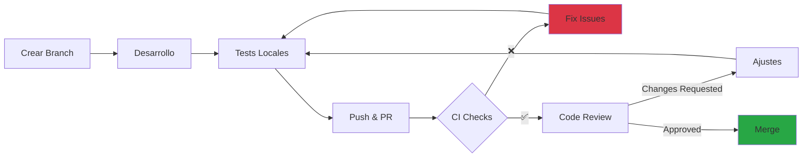

# Estándares de Código

Esta guía establece los estándares de código, convenciones de nomenclatura y mejores prácticas para mantener un código base consistente y mantenible en RetroGameCloud.

## Filosofía de Código

<CardGroup cols={2}>
  <Card title="Clean Code" icon="broom">
    Código legible y auto-documentado
  </Card>

  <Card title="SOLID Principles" icon="cube">
    Principios de diseño orientado a objetos
  </Card>

  <Card title="DRY" icon="clone">
    Don't Repeat Yourself
  </Card>

  <Card title="KISS" icon="heart">
    Keep It Simple, Stupid
  </Card>
</CardGroup>

## Convenciones de Nomenclatura

### Variables y Funciones

<Tabs>
  <Tab title="TypeScript/JavaScript">

```typescript
// ✅ CORRECTO: camelCase para variables y funciones
const userName = 'John Doe';
const userAge = 25;

function calculateScore(points: number): number {
  return points * 10;
}

// ❌ INCORRECTO
const UserName = 'John Doe';  // PascalCase solo para clases
const user_name = 'John Doe'; // snake_case no se usa en JS/TS

```

  </Tab>

  <Tab title="Python">

```python

# ✅ CORRECTO: snake_case para variables y funciones
user_name = "John Doe"
user_age = 25

def calculate_score(points: int) -> int:
    return points * 10

# ❌ INCORRECTO
userName = "John Doe"  # camelCase no es pythonic
UserName = "John Doe"  # PascalCase solo para clases

```

  </Tab>
</Tabs>

### Clases e Interfaces

<Tabs>
  <Tab title="TypeScript">

```typescript
// ✅ CORRECTO: PascalCase para clases e interfaces
class UserService {
  private readonly repository: UserRepository;

  constructor(repository: UserRepository) {
    this.repository = repository;
  }

  async findById(id: string): Promise<User> {
    return this.repository.findById(id);
  }
}

interface GameScore {
  userId: string;
  gameId: string;
  score: number;
  timestamp: Date;
}

// ❌ INCORRECTO
class userService {} // debe ser PascalCase
interface gameScore {} // debe ser PascalCase

```

  </Tab>

  <Tab title="Python">

```python

# ✅ CORRECTO: PascalCase para clases
class UserService:
    def __init__(self, repository: UserRepository):
        self.repository = repository

    async def find_by_id(self, user_id: str) -> User:
        return await self.repository.find_by_id(user_id)

# ❌ INCORRECTO
class user_service:  # debe ser PascalCase
    pass

```

  </Tab>
</Tabs>

### Constantes

```typescript
// ✅ CORRECTO: SCREAMING_SNAKE_CASE para constantes
const MAX_RETRY_ATTEMPTS = 3;
const API_BASE_URL = 'https://api.retrogamehub.games';
const DEFAULT_TIMEOUT_MS = 5000;

// ❌ INCORRECTO
const maxRetryAttempts = 3;  // debe ser SCREAMING_SNAKE_CASE
const apiBaseUrl = 'https://api.example.com';

```

## Estructura de Archivos

### Organización por Feature

```

src/
├── features/
│   ├── auth/
│   │   ├── services/
│   │   │   └── auth.service.ts
│   │   ├── controllers/
│   │   │   └── auth.controller.ts
│   │   ├── models/
│   │   │   └── user.model.ts
│   │   ├── repositories/
│   │   │   └── user.repository.ts
│   │   └── tests/
│   │       ├── auth.service.test.ts
│   │       └── auth.controller.test.ts
│   ├── games/
│   │   ├── services/
│   │   ├── controllers/
│   │   └── models/
│   └── scores/
│       ├── services/
│       ├── controllers/
│       └── models/
├── shared/
│   ├── utils/
│   ├── middleware/
│   └── types/
└── config/
    ├── database.ts
    ├── redis.ts
    └── aws.ts

```

## Mejores Prácticas por Lenguaje

### TypeScript/Node.js

<Tabs>
  <Tab title="Async/Await">

```typescript
// ✅ CORRECTO: Usar async/await
async function getUserScores(userId: string): Promise<Score[]> {
  try {
    const scores = await scoreRepository.findByUserId(userId);
    return scores;
  } catch (error) {
    logger.error('Error fetching scores', { userId, error });
    throw new DatabaseError('Failed to fetch scores');
  }
}

// ❌ INCORRECTO: Promises anidadas
function getUserScores(userId: string): Promise<Score[]> {
  return scoreRepository.findByUserId(userId)
    .then(scores => {
      return scores;
    })
    .catch(error => {
      logger.error('Error', error);
      throw error;
    });
}

```

  </Tab>

  <Tab title="Error Handling">

```typescript
// ✅ CORRECTO: Errores tipados y específicos
class NotFoundError extends Error {
  constructor(resource: string, id: string) {
    super(`${resource} with id ${id} not found`);
    this.name = 'NotFoundError';
  }
}

async function getGame(id: string): Promise<Game> {
  const game = await gameRepository.findById(id);

  if (!game) {
    throw new NotFoundError('Game', id);
  }

  return game;
}

// ❌ INCORRECTO: Errores genéricos
async function getGame(id: string): Promise<Game | null> {
  try {
    return await gameRepository.findById(id);
  } catch (e) {
    console.log('Error:', e);  // No usar console.log
    return null;  // Oculta el error
  }
}

```

  </Tab>

  <Tab title="Dependency Injection">

```typescript
// ✅ CORRECTO: Inyección de dependencias
class ScoreService {
  constructor(
    private readonly repository: ScoreRepository,
    private readonly cache: CacheService,
    private readonly eventBus: EventBus
  ) {}

  async submitScore(data: SubmitScoreDto): Promise<Score> {
    const score = await this.repository.create(data);
    await this.cache.invalidate(`scores:${data.gameId}`);
    await this.eventBus.publish('score.submitted', score);
    return score;
  }
}

// ❌ INCORRECTO: Dependencias hardcoded
class ScoreService {
  async submitScore(data: SubmitScoreDto): Promise<Score> {
    const repository = new ScoreRepository();  // ❌ No testeable
    const cache = Redis.getInstance();  // ❌ Acoplamiento alto
    // ...
  }
}

```

  </Tab>
</Tabs>

### Python

<Tabs>
  <Tab title="Type Hints">

```python

# ✅ CORRECTO: Usar type hints
from typing import List, Optional
from datetime import datetime

def calculate_ranking(
    scores: List[dict],
    limit: int = 10
) -> List[dict]:
    """
    Calcula el ranking de jugadores basado en scores.

    Args:
        scores: Lista de scores con user_id y points
        limit: Número máximo de resultados

    Returns:
        Lista ordenada de rankings
    """
    sorted_scores = sorted(
        scores,
        key=lambda x: x['points'],
        reverse=True
    )
    return sorted_scores[:limit]

# ❌ INCORRECTO: Sin type hints
def calculate_ranking(scores, limit=10):
    return sorted(scores, key=lambda x: x['points'], reverse=True)[:limit]

```

  </Tab>

  <Tab title="Context Managers">

```python

# ✅ CORRECTO: Usar context managers
async def get_user_data(user_id: str) -> dict:
    async with db_pool.acquire() as conn:
        async with conn.cursor() as cursor:
            await cursor.execute(
                "SELECT * FROM users WHERE id = %s",
                (user_id,)
            )
            return await cursor.fetchone()

# ❌ INCORRECTO: Gestión manual de recursos
async def get_user_data(user_id: str) -> dict:
    conn = await db_pool.acquire()
    cursor = await conn.cursor()
    await cursor.execute("SELECT * FROM users WHERE id = %s", (user_id,))
    result = await cursor.fetchone()
    await cursor.close()  # Puede olvidarse
    await conn.close()  # Puede olvidarse
    return result

```

  </Tab>
</Tabs>

## Code Review Guidelines

### Checklist del Reviewer

<Steps>
  <Step title="Funcionalidad">
    - ¿El código hace lo que se supone que debe hacer?
    - ¿Los edge cases están manejados correctamente?
    - ¿Los tests cubren los casos principales?
  </Step>

  <Step title="Diseño">
    - ¿El código sigue principios SOLID?
    - ¿Las responsabilidades están bien separadas?
    - ¿Hay código duplicado que pueda extraerse?
  </Step>

  <Step title="Legibilidad">
    - ¿Los nombres de variables/funciones son descriptivos?
    - ¿El código es auto-documentado o necesita comentarios?
    - ¿La lógica compleja está explicada?
  </Step>

  <Step title="Performance">
    - ¿Hay operaciones O(n²) que puedan optimizarse?
    - ¿Se están cacheando datos cuando corresponde?
    - ¿Las queries de DB están optimizadas?
  </Step>

  <Step title="Seguridad">
    - ¿Los inputs están validados?
    - ¿Hay riesgos de SQL injection o XSS?
    - ¿Los secretos están en variables de entorno?
  </Step>
</Steps>

### Proceso de PR



## Herramientas de Linting

### ESLint Configuration

```json
{
  "extends": [
    "eslint:recommended",
    "plugin:@typescript-eslint/recommended",
    "plugin:prettier/recommended"
  ],
  "parser": "@typescript-eslint/parser",
  "plugins": ["@typescript-eslint", "prettier"],
  "rules": {
    "@typescript-eslint/explicit-function-return-type": "warn",
    "@typescript-eslint/no-explicit-any": "error",
    "@typescript-eslint/no-unused-vars": "error",
    "no-console": "warn",
    "prettier/prettier": "error"
  }
}

```

### Prettier Configuration

```json
{
  "semi": true,
  "trailingComma": "es5",
  "singleQuote": true,
  "printWidth": 100,
  "tabWidth": 2,
  "useTabs": false,
  "arrowParens": "avoid"
}

```

### Python (Ruff + Black)

```toml
[tool.ruff]
line-length = 100
select = ["E", "F", "W", "I", "N"]
ignore = ["E501"]

[tool.black]
line-length = 100
target-version = ['py311']

```

## Git Commit Messages

### Convenciones

```bash

# Formato
<type>(<scope>): <subject>

<body>

<footer>

# Tipos
feat:     Nueva funcionalidad
fix:      Corrección de bug
docs:     Cambios en documentación
style:    Formato (no afecta lógica)
refactor: Refactorización de código
test:     Agregar o modificar tests
chore:    Mantenimiento (deps, config)
perf:     Mejoras de performance

# Ejemplos
feat(auth): agregar autenticación con GitHub OAuth
fix(scores): corregir cálculo de ranking global
docs(api): actualizar documentación de endpoints
refactor(game-service): extraer lógica de validación
test(auth-service): agregar tests de integración

```

### Ejemplo de Buen Commit

```

feat(ranking): implementar cache de leaderboards

- Agregar Redis cache para rankings globales y por juego

- TTL de 5 minutos para rankings dinámicos

- Invalidar cache automáticamente al enviar nuevo score

- Reducir latencia de GET /rankings de 350ms a 45ms

Closes #234

```

## Documentación de Código

### JSDoc/TSDoc

```typescript
/**
 * Calcula el ranking global de jugadores basado en sus scores totales.
 *
 * @param {string} gameId - ID del juego para filtrar scores
 * @param {number} limit - Número máximo de resultados (default: 100)
 * @param {Date} startDate - Fecha inicio del período (opcional)
 * @returns {Promise<RankingEntry[]>} Array de entradas de ranking ordenadas
 * @throws {NotFoundError} Si el gameId no existe
 * @throws {DatabaseError} Si hay error de conexión a DB
 *
 * @example
 * ```typescript
 * const ranking = await calculateRanking('pac-man', 10);
 * console.log(ranking[0]); // Top player
 * ```

 */
async function calculateRanking(
  gameId: string,
  limit: number = 100,
  startDate?: Date
): Promise<RankingEntry[]> {
  // Implementation
}

```

### Python Docstrings

```python
def calculate_ranking(
    game_id: str,
    limit: int = 100,
    start_date: Optional[datetime] = None
) -> List[RankingEntry]:
    """
    Calcula el ranking global de jugadores basado en sus scores totales.

    Args:
        game_id: ID del juego para filtrar scores
        limit: Número máximo de resultados (default: 100)
        start_date: Fecha inicio del período (opcional)

    Returns:
        Lista de entradas de ranking ordenadas por score

    Raises:
        NotFoundError: Si el game_id no existe
        DatabaseError: Si hay error de conexión a DB

    Example:
        >>> ranking = calculate_ranking('pac-man', limit=10)
        >>> print(ranking[0])
        RankingEntry(user_id='123', score=50000, rank=1)
    """
    # Implementation

```

## Recursos

<CardGroup cols={2}>
  <Card title="Clean Code" icon="book" href="https://www.amazon.com/Clean-Code-Handbook-Software-Craftsmanship/dp/0132350882">
    Robert C. Martin
  </Card>

  <Card title="Refactoring" icon="arrows-rotate" href="https://refactoring.com/">
    Martin Fowler
  </Card>

  <Card title="TypeScript Handbook" icon="code" href="https://www.typescriptlang.org/docs/handbook/intro.html">
    Documentación oficial
  </Card>

  <Card title="Python Style Guide" icon="python" href="https://peps.python.org/pep-0008/">
    PEP 8
  </Card>
</CardGroup>

- --

Mantener estos estándares garantiza un código base consistente, mantenible y escalable para todo el equipo de RetroGameCloud.
