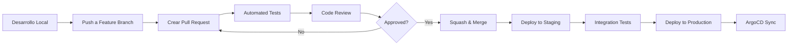

# Guía de Contribución y Estándares de Código

Esta guía define el proceso completo para contribuir al proyecto RetroGameCloud, incluyendo estándares de código, requisitos de testing y el flujo de trabajo de desarrollo.

## Proceso de Contribución

### 1. Preparación del Entorno

<Tabs>
  <Tab title="Configuración Inicial">
    ```bash
    # Fork del repositorio y clonado
    git clone https://github.com/tu-usuario/retro-game-cloud.git
    cd retro-game-cloud

    # Configuración de upstream
    git remote add upstream https://github.com/original/retro-game-cloud.git

    # Instalación de dependencias
    npm install

    # Configuración de hooks de pre-commit
    npm run prepare
    ```

  </Tab>

  <Tab title="Variables de Entorno">
    ```bash
    # Copia el archivo de ejemplo
    cp .env.example .env.local

    # Configuración mínima para desarrollo
    NODE_ENV=development
    DATABASE_URL=postgresql://localhost:5432/retrogame_dev
    JWT_SECRET=your-dev-secret
    AWS_REGION=eu-west-1
    ```

  </Tab>
</Tabs>

### 2. Creación de Branches

<Note>
Siempre crea tu branch desde `main` actualizado y usa nomenclatura descriptiva.
</Note>

```bash

# Actualizar main
git checkout main
git pull upstream main

# Crear nueva rama
git checkout -b feature/nueva-funcionalidad

# o
git checkout -b fix/correccion-bug

# o
git checkout -b docs/actualizacion-readme

```

## Convenciones de Commits

### Formato Estándar

Utilizamos [Conventional Commits](https://www.conventionalcommits.org/es/) con el siguiente formato:

```

<tipo>(<ámbito>): <descripción>

[cuerpo opcional]

[pie opcional]

```

### Tipos de Commit

<Card title="Tipos Principales" icon="git-branch">

- `feat`: Nueva funcionalidad

- `fix`: Corrección de errores

- `docs`: Cambios en documentación

- `style`: Formato, punto y coma faltante, etc.

- `refactor`: Cambio de código que no corrige errores ni añade funcionalidad

- `test`: Añadir tests faltantes o corregir existentes

- `chore`: Cambios en build, dependencias, etc.
</Card>

### Ejemplos de Commits

```bash

# Funcionalidad nueva
git commit -m "feat(auth): implementar autenticación OAuth2 con Kong"

# Corrección de error
git commit -m "fix(game-catalog): resolver error de paginación en listado de juegos"

# Documentación
git commit -m "docs(api): añadir ejemplos de uso para endpoints de ranking"

# Refactorización
git commit -m "refactor(user-service): migrar callbacks a async/await"

```

## Estándares de Código

### JavaScript/Node.js

<Tabs>
  <Tab title="Async/Await">
    ```javascript
    // ✅ Correcto - Usar async/await
    async function getUserGames(userId) {
      try {
        const user = await User.findById(userId);
        const games = await GameCatalog.findByUser(userId);
        return { user, games };
      } catch (error) {
        logger.error('Error fetching user games:', error);
        throw new Error('Failed to fetch user games');
      }
    }

    // ❌ Incorrecto - Evitar callbacks
    function getUserGames(userId, callback) {
      User.findById(userId, (err, user) => {
        if (err) return callback(err);
        GameCatalog.findByUser(userId, (err, games) => {
          if (err) return callback(err);
          callback(null, { user, games });
        });
      });
    }
    ```

  </Tab>

  <Tab title="Manejo de Errores">
    ```javascript
    // ✅ Correcto - Try-catch estructurado
    async function createGame(gameData) {
      try {
        // Validación de entrada
        const validatedData = await gameSchema.validateAsync(gameData);

        // Operación principal
        const game = await Game.create(validatedData);

        logger.info('Game created successfully', { gameId: game.id });
        return game;

      } catch (validationError) {
        if (validationError.isJoi) {
          logger.warn('Invalid game data', validationError.details);
          throw new ValidationError('Invalid game data');
        }

        logger.error('Failed to create game', validationError);
        throw new DatabaseError('Game creation failed');
      }
    }
    ```

  </Tab>

  <Tab title="Logging">
    ```javascript
    // ✅ Configuración de Winston
    const winston = require('winston');

    const logger = winston.createLogger({
      level: process.env.LOG_LEVEL || 'info',
      format: winston.format.combine(
        winston.format.timestamp(),
        winston.format.errors({ stack: true }),
        winston.format.json()
      ),
      transports: [
        new winston.transports.Console(),
        new winston.transports.File({ filename: 'logs/app.log' })
      ]
    });

    // Uso del logger
    logger.info('User authenticated', { userId, timestamp: new Date() });
    logger.error('Database connection failed', { error: error.message });
    ```

  </Tab>
</Tabs>

### Validación de Datos

<Warning>
Siempre valida los datos de entrada usando Joi antes de procesarlos.
</Warning>

```javascript
const Joi = require('joi');

// Schema de validación
const gameSchema = Joi.object({
  title: Joi.string().min(1).max(100).required(),
  description: Joi.string().max(500),
  category: Joi.string().valid('arcade', 'platform', 'puzzle', 'rpg'),
  romFile: Joi.string().required(),
  coverImage: Joi.string().uri(),
  releaseYear: Joi.number().integer().min(1970).max(new Date().getFullYear())
});

// Middleware de validación
const validateGame = (req, res, next) => {
  const { error, value } = gameSchema.validate(req.body);

  if (error) {
    return res.status(400).json({
      error: 'Validation failed',
      details: error.details.map(detail => detail.message)
    });
  }

  req.validatedData = value;
  next();
};

```

## Requisitos de Testing

### Cobertura Mínima

<Card title="Requisitos de Cobertura" icon="chart-line">

- **Cobertura general**: > 80%

- **Funciones críticas**: > 95%

- **Nuevas funcionalidades**: 100%

- **Archivos de configuración**: > 70%
</Card>

### Estructura de Tests

```javascript
// tests/unit/game-service.test.js
const { GameService } = require('../../src/services');
const { Game } = require('../../src/models');

describe('GameService', () => {
  beforeEach(async () => {
    await Game.deleteMany({});
  });

  describe('createGame', () => {
    it('should create a new game with valid data', async () => {
      // Arrange
      const gameData = {
        title: 'Pac-Man',
        category: 'arcade',
        romFile: 'pacman.zip',
        releaseYear: 1980
      };

      // Act
      const result = await GameService.createGame(gameData);

      // Assert
      expect(result).toHaveProperty('id');
      expect(result.title).toBe('Pac-Man');
      expect(result.category).toBe('arcade');
    });

    it('should throw ValidationError for invalid data', async () => {
      // Arrange
      const invalidData = { title: '' };

      // Act & Assert
      await expect(GameService.createGame(invalidData))
        .rejects
        .toThrow('Invalid game data');
    });
  });
});

```

### Comandos de Testing

```bash

# Ejecutar todos los tests
npm test

# Tests con cobertura
npm run test:coverage

# Tests en modo watch
npm run test:watch

# Tests de integración
npm run test:integration

# Linting
npm run lint

# Formateo de código
npm run format

```

## Configuración de ESLint

Utilizamos la configuración de Airbnb con algunas personalizaciones:

```json
{
  "extends": [
    "airbnb-base",
    "plugin:jest/recommended"
  ],
  "env": {
    "node": true,
    "jest": true,
    "es2021": true
  },
  "rules": {
    "no-console": "warn",
    "no-unused-vars": ["error", { "argsIgnorePattern": "^_" }],
    "max-len": ["error", { "code": 120 }],
    "import/no-extraneous-dependencies": ["error", {
      "devDependencies": ["**/*.test.js", "**/*.spec.js"]
    }]
  }
}

```

## Template de Pull Request

### Checklist Obligatorio

Crea tus PR usando este template:

```markdown

## Descripción
Breve descripción de los cambios realizados.

## Tipo de Cambio

- [ ] Bug fix (cambio que corrige un error)

- [ ] Nueva funcionalidad (cambio que añade funcionalidad)

- [ ] Breaking change (cambio que puede romper funcionalidad existente)

- [ ] Actualización de documentación

## Checklist Pre-merge

- [ ] Los tests pasan localmente (`npm test`)

- [ ] El código cumple con los estándares de linting (`npm run lint`)

- [ ] La cobertura de tests es > 80% (`npm run test:coverage`)

- [ ] Se ha actualizado la documentación si es necesario

- [ ] No hay secretos o credenciales en el código

- [ ] Se han añadido logs apropiados para debugging

- [ ] Las migraciones de BD están incluidas (si aplica)

- [ ] Se ha probado en entorno de desarrollo

## Tests Realizados
Describe las pruebas realizadas para verificar los cambios.

## Screenshots (si aplica)
Añade capturas de pantalla si hay cambios visuales.

## Notas Adicionales
Cualquier información adicional relevante para los revisores.

```

## Proceso de Code Review

### Requisitos

<Note>
Cada PR debe ser revisado por **mínimo 2 personas** antes del merge.
</Note>

### Checklist para Revisores

#### Código

- [ ] El código es legible y está bien comentado

- [ ] Sigue las convenciones de nomenclatura del proyecto

- [ ] No hay código duplicado

- [ ] Gestión adecuada de errores

- [ ] Sin hardcoded values o secrets

#### Tests

- [ ] Tests cubren casos principales y edge cases

- [ ] Tests son deterministas (no flaky)

- [ ] Mocks apropiados para dependencias externas

- [ ] Tests de integración incluidos si necesario

#### Seguridad

- [ ] Validación adecuada de inputs

- [ ] No hay vulnerabilidades de inyección

- [ ] Autenticación y autorización correctas

- [ ] Datos sensibles correctamente manejados

#### Performance

- [ ] No hay operaciones bloqueantes innecesarias

- [ ] Consultas de BD optimizadas

- [ ] Gestión adecuada de memoria

- [ ] Paginación en listados grandes

### Merge Strategy

<Warning>
Utilizamos **Squash and Merge** para mantener un historial limpio en `main`.
</Warning>

```bash

# El merge se realiza automáticamente tras aprobación

# Título del commit de merge:
feat(scope): descripción concisa del PR (#123)

```

## Flujo de Trabajo GitOps



## Herramientas y Scripts Útiles

### Scripts de Desarrollo

```json
{
  "scripts": {
    "dev": "nodemon src/index.js",
    "test": "jest",
    "test:coverage": "jest --coverage",
    "test:watch": "jest --watch",
    "lint": "eslint src/ tests/",
    "lint:fix": "eslint src/ tests/ --fix",
    "format": "prettier --write 'src/**/*.js' 'tests/**/*.js'",
    "pre-commit": "lint-staged",
    "prepare": "husky install"
  }
}

```

### Configuración de Pre-commit

```json
{
  "lint-staged": {
    "*.js": [
      "eslint --fix",
      "prettier --write",
      "git add"
    ],
    "*.{json,md}": [
      "prettier --write",
      "git add"
    ]
  }
}

```

## Contacto y Soporte

<Card title="Canales de Comunicación" icon="message-circle">

- **Slack**: `#retrogame-dev` para dudas generales

- **GitHub Issues**: Para bugs y feature requests

- **Tech Leads**: Para arquitectura y decisiones técnicas

- **DevOps**: `#infrastructure` para temas de despliegue
</Card>

¿Tienes preguntas sobre el proceso de contribución? ¡No dudes en preguntar en nuestros canales de comunicación!