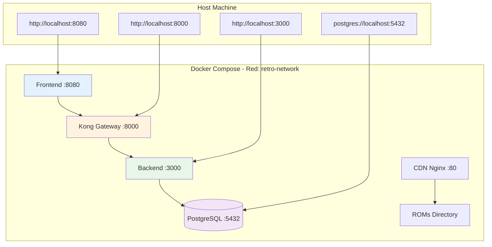

## Visión General

Docker Compose proporciona un **entorno de desarrollo local completo** que replica la arquitectura de producción sin necesidad de AWS. Ideal para desarrollo, debugging y testing.

<CardGroup cols={2}>
  <Card title="Backend Unificado" icon="server">
    Node.js Express en puerto 3000 con hot-reload
  </Card>
  <Card title="PostgreSQL" icon="database">
    Base de datos con datos de prueba pre-cargados
  </Card>
  <Card title="Kong Gateway" icon="shield">
    API Gateway con mismos plugins que producción
  </Card>
  <Card title="Frontend" icon="display">
    HTML/JS vanilla servido por Express en puerto 8080
  </Card>
</CardGroup>

## Arquitectura Local



## Archivo docker-compose.yml

**Ubicación**: `/docker-compose.yml` (raíz del proyecto)

```yaml
version: '3.8'

services:
  # Base de datos PostgreSQL
  postgres:
    image: postgres:15-alpine
    container_name: retro-postgres
    environment:
      POSTGRES_DB: retrogamehub
      POSTGRES_USER: postgres
      POSTGRES_PASSWORD: postgres
      POSTGRES_INITDB_ARGS: "--encoding=UTF-8"
    ports:
      - "5432:5432"
    volumes:
      - postgres_data:/var/lib/postgresql/data
      - ./backend/src/config/init.sql:/docker-entrypoint-initdb.d/init.sql:ro
    networks:
      - retro-network
    healthcheck:
      test: ["CMD-SHELL", "pg_isready -U postgres"]
      interval: 10s
      timeout: 5s
      retries: 5

  # Backend unificado
  backend:
    build:
      context: ./backend
      dockerfile: Dockerfile
      target: development
    container_name: retro-backend
    environment:
      NODE_ENV: development
      PORT: 3000
      DB_HOST: postgres
      DB_PORT: 5432
      DB_NAME: retrogamehub
      DB_USER: postgres
      DB_PASSWORD: postgres
      JWT_SECRET: dev-secret-key-change-in-production
      JWT_REFRESH_SECRET: dev-refresh-secret-key
      GITHUB_CLIENT_ID: ${GITHUB_CLIENT_ID:-}
      GITHUB_CLIENT_SECRET: ${GITHUB_CLIENT_SECRET:-}
      GITHUB_CALLBACK_URL: http://localhost:3000/api/auth/github/callback
    ports:
      - "3000:3000"
    volumes:
      - ./backend/src:/app/src:ro
      - ./backend/package.json:/app/package.json:ro
      - backend_node_modules:/app/node_modules
    depends_on:
      postgres:
        condition: service_healthy
    networks:
      - retro-network
    command: npm run dev
    healthcheck:
      test: ["CMD", "curl", "-f", "http://localhost:3000/health"]
      interval: 30s
      timeout: 10s
      retries: 3

  # Kong Gateway
  kong:
    image: kong:3.3-alpine
    container_name: retro-kong
    environment:
      KONG_DATABASE: "off"
      KONG_DECLARATIVE_CONFIG: /usr/local/kong/declarative/kong.yml
      KONG_PROXY_ACCESS_LOG: /dev/stdout
      KONG_ADMIN_ACCESS_LOG: /dev/stdout
      KONG_PROXY_ERROR_LOG: /dev/stderr
      KONG_ADMIN_ERROR_LOG: /dev/stderr
      KONG_ADMIN_LISTEN: 0.0.0.0:8001
      KONG_PROXY_LISTEN: 0.0.0.0:8000
    ports:
      - "8000:8000"  # Proxy port
      - "8001:8001"  # Admin API
    volumes:
      - ./kong/kong.yml:/usr/local/kong/declarative/kong.yml:ro
    depends_on:
      - backend
    networks:
      - retro-network
    healthcheck:
      test: ["CMD", "kong", "health"]
      interval: 10s
      timeout: 10s
      retries: 5

  # Frontend
  frontend:
    build:
      context: ./frontend
      dockerfile: Dockerfile
      target: development
    container_name: retro-frontend
    environment:
      NODE_ENV: development
      PORT: 8080
    ports:
      - "8080:8080"
    volumes:
      - ./frontend:/app:ro
      - frontend_node_modules:/app/node_modules
    depends_on:
      - kong
    networks:
      - retro-network
    command: npm run dev

  # CDN (Nginx para servir ROMs)
  cdn:
    image: nginx:alpine
    container_name: retro-cdn
    ports:
      - "80:80"
    volumes:
      - ./infraestructure/cdn/cdn.conf:/etc/nginx/conf.d/default.conf:ro
      - ./infraestructure/cdn/juegos:/usr/share/nginx/html/juegos:ro
      - ./infraestructure/cdn/img:/usr/share/nginx/html/img:ro
    networks:
      - retro-network

volumes:
  postgres_data:
    driver: local
  backend_node_modules:
    driver: local
  frontend_node_modules:
    driver: local

networks:
  retro-network:
    driver: bridge
```

## Inicio Rápido

### Paso 1: Clonar Repositorio

```bash
git clone https://github.com/RetroGameCloud/retro-game-hub.git
cd retro-game-hub
```

### Paso 2: Configurar Variables (Opcional)

Para autenticación GitHub OAuth:

```bash
cp .env.example .env
nano .env
```

```bash
# GitHub OAuth (opcional, solo si quieres probar OAuth)
GITHUB_CLIENT_ID=tu_client_id
GITHUB_CLIENT_SECRET=tu_client_secret
```

### Paso 3: Iniciar Servicios

```bash
docker-compose up -d
```

**Tiempo de inicio**: 2-3 minutos (primera vez descarga imágenes)

### Paso 4: Verificar Servicios

```bash
docker-compose ps
```

Output esperado:
```
NAME              STATUS    PORTS
retro-backend     Up        0.0.0.0:3000->3000/tcp
retro-postgres    Up        0.0.0.0:5432->5432/tcp
retro-kong        Up        0.0.0.0:8000->8000/tcp, 0.0.0.0:8001->8001/tcp
retro-frontend    Up        0.0.0.0:8080->8080/tcp
retro-cdn         Up        0.0.0.0:80->80/tcp
```

### Paso 5: Acceder a la Aplicación

<CardGroup cols={3}>
  <Card title="Frontend" icon="display">
    [http://localhost:8080](http://localhost:8080)
    
    Interfaz de usuario principal
  </Card>
  
  <Card title="Backend API" icon="code">
    [http://localhost:3000](http://localhost:3000)
    
    API REST directa (sin Kong)
  </Card>
  
  <Card title="Kong Gateway" icon="shield">
    [http://localhost:8000](http://localhost:8000)
    
    API a través de Kong (recomendado)
  </Card>
  
  <Card title="Kong Admin" icon="gear">
    [http://localhost:8001](http://localhost:8001)
    
    Kong Admin API
  </Card>
  
  <Card title="PostgreSQL" icon="database">
    `postgres://localhost:5432`
    
    user: postgres, pass: postgres
  </Card>
  
  <Card title="CDN" icon="image">
    [http://localhost/juegos/doom.jsdos](http://localhost/juegos/doom.jsdos)
    
    ROMs de juegos
  </Card>
</CardGroup>

## Datos de Prueba

La base de datos se inicializa automáticamente con datos de prueba:

### Usuarios de Prueba

```sql
-- Usuario: testuser
-- Email: testuser@example.com
-- Password: password123

-- Usuario: admin
-- Email: admin@example.com
-- Password: admin123
```

### Juegos Pre-cargados

```sql
-- 10 juegos DOS clásicos:
- Doom (id: 1)
- Duke Nukem 3D (id: 2)
- Wolfenstein 3D (id: 3)
- Mortal Kombat (id: 4)
- Street Fighter 2 (id: 5)
- Tetris (id: 6)
- Digger (id: 7)
- Dangerous Dave 2 (id: 8)
- Lost Vikings (id: 9)
- Heroes of Might and Magic 2 (id: 10)
```

### Scores de Ejemplo

```bash
# Ver scores en la base de datos
docker-compose exec postgres psql -U postgres -d retrogamehub -c "SELECT * FROM scores LIMIT 5;"
```

## Desarrollo con Hot-Reload

### Backend Hot-Reload

El backend usa **nodemon** para detectar cambios automáticamente:

```bash
# Editar código
nano backend/src/controllers/authController.js

# Cambios se reflejan automáticamente sin reiniciar contenedor
# Ver logs:
docker-compose logs -f backend
```

### Frontend Hot-Reload

El frontend también recarga automáticamente:

```bash
# Editar HTML/CSS/JS
nano frontend/index.html

# Refrescar navegador (http://localhost:8080)
```

### Kong Reload

Kong requiere reinicio manual si cambias `kong.yml`:

```bash
# Editar configuración
nano kong/kong.yml

# Reiniciar Kong
docker-compose restart kong
```

## Comandos Útiles

### Ver Logs

```bash
# Todos los servicios
docker-compose logs -f

# Solo backend
docker-compose logs -f backend

# Últimas 100 líneas
docker-compose logs --tail=100 backend
```

### Acceso a Contenedores

```bash
# Shell en backend
docker-compose exec backend sh

# Shell en PostgreSQL
docker-compose exec postgres psql -U postgres -d retrogamehub

# Shell en Kong
docker-compose exec kong sh
```

### Reiniciar Servicios

```bash
# Reiniciar todo
docker-compose restart

# Reiniciar solo backend
docker-compose restart backend

# Reconstruir imagen y reiniciar
docker-compose up -d --build backend
```

### Detener Servicios

```bash
# Detener sin eliminar volúmenes
docker-compose stop

# Detener y eliminar contenedores
docker-compose down

# Detener y eliminar VOLÚMENES (borra base de datos)
docker-compose down -v
```

### Limpiar Todo

```bash
# Eliminar todo (contenedores + volúmenes + networks)
docker-compose down -v --remove-orphans

# Eliminar imágenes también
docker-compose down -v --rmi all
```

## Testing de APIs

### Healthcheck

```bash
# Backend
curl http://localhost:3000/health

# Kong
curl http://localhost:8001/status
```

### Autenticación

```bash
# Registrar usuario
curl -X POST http://localhost:8000/api/auth/register \
  -H "Content-Type: application/json" \
  -d '{
    "username": "newuser",
    "email": "newuser@example.com",
    "password": "password123"
  }'

# Login
curl -X POST http://localhost:8000/api/auth/login \
  -H "Content-Type: application/json" \
  -d '{
    "email": "newuser@example.com",
    "password": "password123"
  }'

# Respuesta incluye access_token y refresh_token
```

### APIs Protegidas

```bash
# Obtener perfil (requiere JWT)
TOKEN="jwt_access_token_here"

curl http://localhost:8000/api/users/profile \
  -H "Authorization: Bearer $TOKEN"

# Crear score
curl -X POST http://localhost:8000/api/scores \
  -H "Authorization: Bearer $TOKEN" \
  -H "Content-Type: application/json" \
  -d '{
    "gameId": 1,
    "score": 50000,
    "metadata": {"level": 5, "difficulty": "hard"}
  }'
```

## Debugging

### Backend Debugging con VS Code

**Archivo**: `.vscode/launch.json`

```json
{
  "version": "0.2.0",
  "configurations": [
    {
      "type": "node",
      "request": "attach",
      "name": "Docker: Attach to Backend",
      "remoteRoot": "/app",
      "localRoot": "${workspaceFolder}/backend",
      "port": 9229,
      "restart": true,
      "sourceMaps": true
    }
  ]
}
```

Modificar `docker-compose.yml`:

```yaml
backend:
  command: npm run dev:debug
  ports:
    - "3000:3000"
    - "9229:9229"  # Debug port
```

**package.json**:

```json
{
  "scripts": {
    "dev:debug": "nodemon --inspect=0.0.0.0:9229 src/index.js"
  }
}
```

### Database Debugging

```bash
# Conectar con psql
docker-compose exec postgres psql -U postgres -d retrogamehub

# Ver todas las tablas
\dt

# Describir tabla
\d users

# Query de ejemplo
SELECT * FROM users WHERE email = 'testuser@example.com';

# Ver logs de PostgreSQL
docker-compose logs -f postgres
```

## Diferencias con Producción

| Aspecto | Local (Docker Compose) | Producción (AWS EKS) |
|---------|------------------------|----------------------|
| **Base de datos** | PostgreSQL local en Docker | RDS PostgreSQL Multi-AZ |
| **Secrets** | `.env` file | Kubernetes Secrets |
| **Escalabilidad** | 1 contenedor por servicio | Múltiples pods con HPA |
| **Persistencia** | Volúmenes Docker | EBS volumes |
| **DNS** | localhost | Route53 + ALB |
| **SSL/TLS** | No (HTTP) | Sí (HTTPS con ACM) |
| **Monitoreo** | Docker logs | Prometheus + Grafana |
| **Load Balancer** | Kong directo | ALB → Kong |

## Paridad con Producción

### Variables de Entorno

Mantén paridad usando mismo formato:

```bash
# Local (.env)
NODE_ENV=development
JWT_SECRET=dev-secret

# Producción (K8s Secret)
NODE_ENV=production
JWT_SECRET=<generated-secure-key>
```

### Kong Configuración

El archivo `kong.yml` debe ser **idéntico** entre local y producción:

```yaml
# kong/kong.yml - mismo en local y prod
_format_version: "3.0"
services:
  - name: backend-service
    url: http://backend:3000  # Local usa nombre de servicio Docker
    # url: http://backend.default.svc.cluster.local:3000  # Prod usa DNS K8s
```

## Troubleshooting

### Puerto Ya en Uso

```bash
Error: Bind for 0.0.0.0:3000 failed: port is already allocated
```

**Solución**: Cambiar puerto en `docker-compose.yml`:

```yaml
backend:
  ports:
    - "3001:3000"  # Host:Container
```

### Contenedor No Inicia

```bash
# Ver logs de error
docker-compose logs backend

# Verificar healthcheck
docker-compose ps
```

Si healthcheck falla:

```bash
# Acceder al contenedor
docker-compose exec backend sh

# Ejecutar comando manualmente
curl http://localhost:3000/health
```

### Base de Datos No Conecta

```bash
# Verificar que PostgreSQL está healthy
docker-compose ps postgres

# Verificar logs
docker-compose logs postgres

# Probar conexión desde backend
docker-compose exec backend sh
nc -zv postgres 5432
```

### Kong No Rutea a Backend

```bash
# Verificar Kong config
docker-compose exec kong kong config parse /usr/local/kong/declarative/kong.yml

# Ver rutas configuradas
curl http://localhost:8001/routes

# Test directo al backend
curl http://localhost:3000/health
```

## Referencias

- [Docker Compose Documentation](https://docs.docker.com/compose/)
- [PostgreSQL Docker Image](https://hub.docker.com/_/postgres)
- [Kong Docker Image](https://hub.docker.com/_/kong)
- [Node.js Best Practices](https://github.com/goldbergyoni/nodebestpractices)
