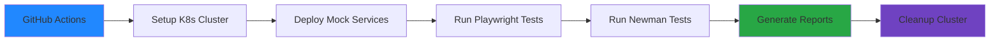
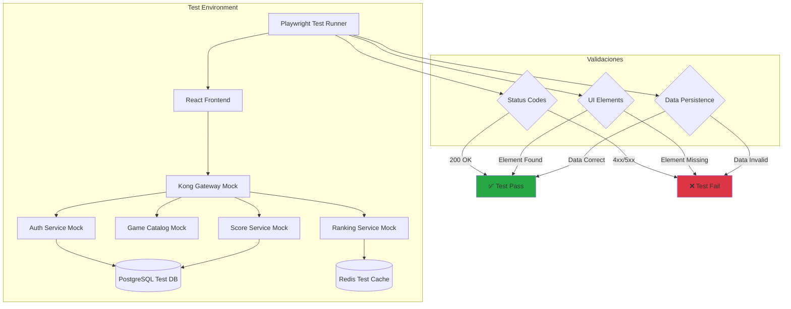

# Tests End-to-End

Los tests End-to-End (E2E) validan los flujos completos de usuario en RetroGameCloud, asegurando que todos los microservicios funcionen correctamente en conjunto desde la perspectiva del usuario final.

<Note>
Los tests E2E son ejecutados automáticamente en cada pull request y deployment, proporcionando confianza en la estabilidad del sistema completo.
</Note>

## Herramientas Utilizadas

<Tabs>
<Tab title="Playwright">
**Playwright** es nuestra herramienta principal para tests de interfaz de usuario:
- Tests en múltiples navegadores (Chrome, Firefox, Safari)
- Paralelización automática
- Screenshots y videos en caso de fallos
- API robusta para interacciones complejas

```bash
npm install @playwright/test
npx playwright install
```
</Tab>
<Tab title="Newman">
**Newman** ejecuta nuestras colecciones de Postman para validar APIs:
- Validación de contratos de API
- Tests de integración entre servicios
- Verificación de flujos OAuth2

```bash
npm install -g newman
newman run postman-collection.json -e environment.json
```
</Tab>
</Tabs>

## Escenarios Críticos

### E2E-001: Flujo Completo de Jugador

<Card title="Flujo de Usuario Nuevo" icon="user-plus">
Este test valida el ciclo completo desde el registro hasta la aparición en el ranking.
</Card>

#### Pasos del Test

1. **Registro de Usuario Nuevo**
   ```javascript
   await page.goto('/register');
   await page.fill('[data-testid="username"]', 'testuser');
   await page.fill('[data-testid="email"]', 'test@example.com');
   await page.fill('[data-testid="password"]', 'SecurePass123!');
   await page.click('[data-testid="register-button"]');
   ```

2. **Login y Obtención de JWT**
   ```javascript
   await page.goto('/login');
   await page.fill('[data-testid="email"]', 'test@example.com');
   await page.fill('[data-testid="password"]', 'SecurePass123!');
   await page.click('[data-testid="login-button"]');
   
   // Verificar token en localStorage
   const token = await page.evaluate(() => localStorage.getItem('jwt'));
   expect(token).toBeTruthy();
   ```

3. **Listar Catálogo de Juegos**
   ```javascript
   await page.goto('/games');
   await expect(page.locator('[data-testid="game-card"]')).toHaveCountGreaterThan(0);
   ```

4. **Cargar Juego con JS-DOS**
   ```javascript
   await page.click('[data-testid="game-card"]:first-child');
   await page.waitForSelector('[data-testid="js-dos-canvas"]');
   await expect(page.locator('[data-testid="game-loaded"]')).toBeVisible();
   ```

5. **Guardar Puntuación**
   ```javascript
   // Simular finalización de juego
   await page.evaluate(() => {
     window.submitScore(1500);
   });
   await expect(page.locator('[data-testid="score-saved"]')).toBeVisible();
   ```

6. **Verificar Aparición en Ranking**
   ```javascript
   await page.goto('/ranking');
   await expect(page.locator('[data-testid="user-score"]')).toContainText('1500');
   ```

### E2E-002: Flujo de Autenticación OAuth2

<Warning>
Este test requiere configuración especial de Google OAuth2 para entornos de testing.
</Warning>

#### Configuración OAuth2 para Tests

<Tabs>
<Tab title="Google OAuth2">
```javascript
// playwright.config.js
module.exports = {
  use: {
    baseURL: process.env.TEST_BASE_URL || 'http://localhost:3000',
    extraHTTPHeaders: {
      'X-Test-OAuth': 'enabled'
    }
  },
  projects: [
    {
      name: 'oauth-tests',
      use: {
        ...devices['Desktop Chrome'],
        storageState: 'tests/auth-state.json'
      }
    }
  ]
};
```
</Tab>
<Tab title="Mock OAuth Response">
```javascript
// Mock de respuesta OAuth2 para tests
await page.route('**/auth/google/callback*', route => {
  route.fulfill({
    status: 200,
    contentType: 'application/json',
    body: JSON.stringify({
      token: 'mock-jwt-token',
      user: {
        id: 'test-user-id',
        email: 'test@example.com',
        name: 'Test User'
      }
    })
  });
});
```
</Tab>
</Tabs>

#### Pasos del Flujo OAuth2

1. **Inicio de Sesión con Google**
   ```javascript
   await page.goto('/login');
   await page.click('[data-testid="google-login"]');
   
   // Manejar popup de OAuth2
   const [popup] = await Promise.all([
     page.waitForEvent('popup'),
     page.click('[data-testid="google-login"]')
   ]);
   ```

2. **Callback y Generación de JWT**
   ```javascript
   await popup.waitForURL('**/auth/google/callback*');
   await popup.close();
   
   // Verificar redirección y token
   await expect(page).toHaveURL('/dashboard');
   const token = await page.evaluate(() => localStorage.getItem('jwt'));
   expect(token).toMatch(/^eyJ/); // JWT format
   ```

3. **Acceso a Recursos Protegidos**
   ```javascript
   await page.goto('/profile');
   await expect(page.locator('[data-testid="user-name"]')).toBeVisible();
   await expect(page.locator('[data-testid="user-email"]')).toContainText('test@example.com');
   ```

## Ejecución en CI/CD

Los tests E2E se ejecutan automáticamente en GitHub Actions utilizando un cluster efímero de Kubernetes con servicios mock.



### Configuración de GitHub Actions

```yaml
name: E2E Tests
on:
  pull_request:
    branches: [main, develop]

jobs:
  e2e-tests:
    runs-on: ubuntu-latest
    steps:
      - uses: actions/checkout@v3
      
      - name: Setup Kubernetes
        uses: helm/kind-action@v1.4.0
        with:
          cluster_name: retrogame-test
          
      - name: Deploy Test Environment
        run: |
          kubectl apply -f k8s/test/
          kubectl wait --for=condition=ready pod -l app=test-backend --timeout=300s
          
      - name: Install Dependencies
        run: |
          npm ci
          npx playwright install --with-deps
          
      - name: Run Playwright Tests
        run: |
          npx playwright test
        env:
          TEST_BASE_URL: http://localhost:3000
          
      - name: Run Newman Tests
        run: |
          newman run tests/postman/api-tests.json \
            -e tests/postman/test-environment.json \
            --reporters cli,junit \
            --reporter-junit-export newman-results.xml
            
      - name: Upload Test Results
        uses: actions/upload-artifact@v3
        if: always()
        with:
          name: test-results
          path: |
            test-results/
            newman-results.xml
```

## Arquitectura de Testing



## Escenarios de Testing Avanzados

### E2E-003: Flujo de Recuperación de Fallos

<Card title="Resilencia del Sistema" icon="shield-check">
Valida que el sistema se recupere correctamente de fallos temporales de servicios.
</Card>

```javascript
test('should handle service failures gracefully', async ({ page }) => {
  // Simular fallo del servicio de puntuaciones
  await page.route('**/api/scores*', route => {
    route.abort('failed');
  });
  
  await page.goto('/games/pac-man');
  await page.evaluate(() => window.submitScore(2000));
  
  // Verificar mensaje de error amigable
  await expect(page.locator('[data-testid="error-message"]'))
    .toContainText('Error temporal. Reintentando...');
  
  // Restaurar servicio y verificar retry
  await page.unroute('**/api/scores*');
  await page.waitForSelector('[data-testid="score-saved"]');
});
```

### E2E-004: Tests de Performance

```javascript
test('should load games catalog within performance budget', async ({ page }) => {
  const startTime = Date.now();
  
  await page.goto('/games');
  await page.waitForSelector('[data-testid="game-card"]');
  
  const loadTime = Date.now() - startTime;
  expect(loadTime).toBeLessThan(3000); // 3 segundos máximo
  
  // Verificar Core Web Vitals
  const metrics = await page.evaluate(() => {
    return new Promise(resolve => {
      new PerformanceObserver(list => {
        resolve(list.getEntries());
      }).observe({ entryTypes: ['largest-contentful-paint'] });
    });
  });
  
  expect(metrics[0].startTime).toBeLessThan(2500); // LCP < 2.5s
});
```

## Informes y Monitorización

### Integración con Allure Reports

```javascript
// playwright.config.js
module.exports = {
  reporter: [
    ['allure-playwright'],
    ['html', { outputFolder: 'playwright-report' }]
  ],
  use: {
    trace: 'retain-on-failure',
    screenshot: 'only-on-failure',
    video: 'retain-on-failure'
  }
};
```

### Métricas de Testing

<Note>
Las métricas de testing se envían automáticamente a Grafana para monitorización continua.
</Note>

- **Tiempo de ejecución de tests**: < 15 minutos
- **Tasa de éxito**: > 95%
- **Cobertura de flujos críticos**: 100%
- **Tiempo de feedback**: < 5 minutos después del commit

## Mantenimiento y Mejores Prácticas

### Datos de Prueba

```javascript
// fixtures/test-data.js
export const TEST_USERS = {
  newUser: {
    username: 'e2e-test-user',
    email: 'e2e-test@retrogamecloud.com',
    password: 'TestPassword123!'
  },
  existingUser: {
    email: 'existing@retrogamecloud.com',
    password: 'ExistingUserPass123!'
  }
};

export const TEST_GAMES = {
  pacman: {
    id: 'pac-man-1980',
    name: 'Pac-Man',
    expectedLoadTime: 5000
  }
};
```

### Limpieza de Datos

```javascript
// hooks/cleanup.js
export async function cleanupTestData() {
  const response = await fetch('/api/test/cleanup', {
    method: 'POST',
    headers: {
      'Authorization': `Bearer ${process.env.TEST_ADMIN_TOKEN}`,
      'Content-Type': 'application/json'
    }
  });
  
  if (!response.ok) {
    throw new Error('Failed to cleanup test data');
  }
}
```

<Warning>
Ejecuta siempre la limpieza de datos de prueba después de cada ejecución de tests para evitar interferencias entre tests.
</Warning>

## Resolución de Problemas Comunes

### Timeouts en JS-DOS

```javascript
// Aumentar timeout para carga de juegos retro
test.setTimeout(60000);

await page.waitForSelector('[data-testid="js-dos-canvas"]', {
  timeout: 30000
});
```

### Flakiness en Tests OAuth2

```javascript
// Usar retry automático para tests OAuth2
test.describe.configure({ retries: 2 });

// Esperar a elementos específicos en lugar de timeouts fijos
await expect(page.locator('[data-testid="oauth-success"]')).toBeVisible({
  timeout: 10000
});
```

Los tests End-to-End son fundamentales para mantener la confianza en RetroGameCloud. Esta estrategia asegura que todos los flujos críticos funcionen correctamente en cada deployment.