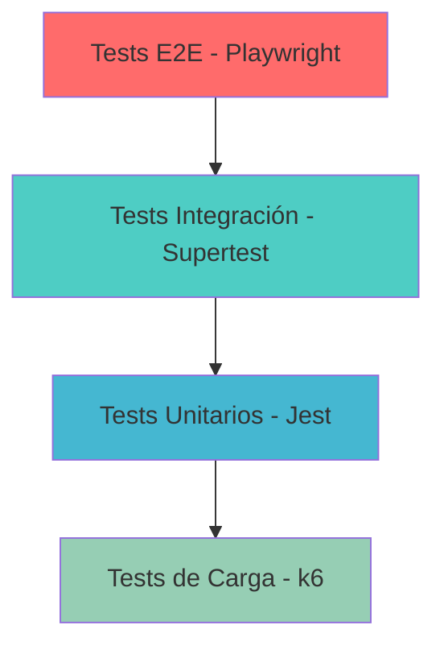

# Testing y QA

RetroGameCloud implementa una estrategia de testing integral que abarca desde pruebas unitarias hasta tests end-to-end, garantizando la calidad y fiabilidad de la plataforma de juegos retro.

## Estrategia de Testing

### Pirámide de Testing



### Cobertura de Testing

<CardGroup cols={2}>
  <Card title="Unitarios" icon="flask">
    **80%+ coverage**
    
    Tests rápidos de lógica de negocio individual
  </Card>
  
  <Card title="Integración" icon="plug">
    **Componentes críticos**
    
    Interacción entre servicios y bases de datos
  </Card>
  
  <Card title="E2E" icon="robot">
    **Flujos principales**
    
    Simulación completa de usuario final
  </Card>
  
  <Card title="Carga" icon="chart-line">
    **Performance**
    
    Tests de resistencia y escalabilidad
  </Card>
</CardGroup>

## Tests Unitarios

### Configuración con Jest

Los tests unitarios se ejecutan con **Jest** y deben mantener un **coverage superior al 80%**.

<Tabs>
  <Tab title="package.json">
```json
{
  "scripts": {
    "test": "jest",
    "test:watch": "jest --watch",
    "test:coverage": "jest --coverage",
    "test:ci": "jest --coverage --watchAll=false"
  },
  "jest": {
    "testEnvironment": "node",
    "collectCoverageFrom": [
      "src/**/*.{js,ts}",
      "!src/**/*.test.{js,ts}",
      "!src/config/**"
    ],
    "coverageThreshold": {
      "global": {
        "branches": 80,
        "functions": 80,
        "lines": 80,
        "statements": 80
      }
    }
  }
}
```
  </Tab>

  <Tab title="jest.config.js">
```javascript
module.exports = {
  preset: 'ts-jest',
  testEnvironment: 'node',
  roots: ['<rootDir>/src'],
  testMatch: ['**/__tests__/**/*.ts', '**/?(*.)+(spec|test).ts'],
  transform: {
    '^.+\\.ts$': 'ts-jest',
  },
  collectCoverageFrom: [
    'src/**/*.{js,ts}',
    '!src/**/*.d.ts',
    '!src/**/*.test.ts',
  ],
  coverageDirectory: 'coverage',
  verbose: true,
};
```
  </Tab>
</Tabs>

### Ejemplos de Tests Unitarios

<Tabs>
  <Tab title="Service Test">
```typescript
// tests/unit/score.service.test.ts
import { ScoreService } from '../../src/services/score.service';
import { ScoreRepository } from '../../src/repositories/score.repository';

jest.mock('../../src/repositories/score.repository');

describe('ScoreService', () => {
  let scoreService: ScoreService;
  let mockRepository: jest.Mocked<ScoreRepository>;

  beforeEach(() => {
    mockRepository = new ScoreRepository() as jest.Mocked<ScoreRepository>;
    scoreService = new ScoreService(mockRepository);
  });

  describe('submitScore', () => {
    it('should submit a valid score', async () => {
      const scoreData = {
        userId: 'user-123',
        gameId: 'pac-man',
        score: 25000,
        timestamp: new Date(),
      };

      mockRepository.create.mockResolvedValue({
        id: 'score-456',
        ...scoreData,
      });

      const result = await scoreService.submitScore(scoreData);

      expect(result).toHaveProperty('id');
      expect(result.score).toBe(25000);
      expect(mockRepository.create).toHaveBeenCalledWith(scoreData);
    });

    it('should reject invalid scores', async () => {
      const invalidScore = {
        userId: 'user-123',
        gameId: 'pac-man',
        score: -100,
        timestamp: new Date(),
      };

      await expect(
        scoreService.submitScore(invalidScore)
      ).rejects.toThrow('Score must be positive');
    });
  });
});
```
  </Tab>

  <Tab title="Utility Test">
```typescript
// tests/unit/validators.test.ts
import { validateGameId, validateUserId } from '../../src/utils/validators';

describe('Validators', () => {
  describe('validateGameId', () => {
    it('should accept valid game IDs', () => {
      expect(validateGameId('pac-man')).toBe(true);
      expect(validateGameId('super-mario-bros')).toBe(true);
    });

    it('should reject invalid game IDs', () => {
      expect(validateGameId('')).toBe(false);
      expect(validateGameId('invalid@game')).toBe(false);
      expect(validateGameId(null)).toBe(false);
    });
  });

  describe('validateUserId', () => {
    it('should accept valid UUIDs', () => {
      expect(validateUserId('123e4567-e89b-12d3-a456-426614174000')).toBe(true);
    });

    it('should reject invalid formats', () => {
      expect(validateUserId('not-a-uuid')).toBe(false);
      expect(validateUserId('12345')).toBe(false);
    });
  });
});
```
  </Tab>
</Tabs>

## Tests de Integración

### Configuración con Supertest

<Tabs>
  <Tab title="API Integration Test">
```typescript
// tests/integration/auth.api.test.ts
import request from 'supertest';
import { app } from '../../src/app';
import { setupTestDatabase, teardownTestDatabase } from '../helpers/db';

describe('Authentication API', () => {
  beforeAll(async () => {
    await setupTestDatabase();
  });

  afterAll(async () => {
    await teardownTestDatabase();
  });

  describe('POST /api/auth/register', () => {
    it('should register a new user', async () => {
      const response = await request(app)
        .post('/api/auth/register')
        .send({
          email: 'newuser@test.com',
          password: 'SecurePass123!',
          username: 'newuser',
        })
        .expect(201);

      expect(response.body).toHaveProperty('userId');
      expect(response.body).toHaveProperty('token');
      expect(response.body.email).toBe('newuser@test.com');
    });

    it('should reject duplicate emails', async () => {
      await request(app)
        .post('/api/auth/register')
        .send({
          email: 'duplicate@test.com',
          password: 'Pass123!',
          username: 'user1',
        })
        .expect(201);

      await request(app)
        .post('/api/auth/register')
        .send({
          email: 'duplicate@test.com',
          password: 'Pass123!',
          username: 'user2',
        })
        .expect(409);
    });
  });

  describe('POST /api/auth/login', () => {
    it('should login with valid credentials', async () => {
      const response = await request(app)
        .post('/api/auth/login')
        .send({
          email: 'test@example.com',
          password: 'TestPass123!',
        })
        .expect(200);

      expect(response.body).toHaveProperty('token');
      expect(response.body).toHaveProperty('refreshToken');
    });

    it('should reject invalid credentials', async () => {
      await request(app)
        .post('/api/auth/login')
        .send({
          email: 'test@example.com',
          password: 'WrongPassword',
        })
        .expect(401);
    });
  });
});
```
  </Tab>

  <Tab title="Database Integration">
```typescript
// tests/integration/score.repository.test.ts
import { ScoreRepository } from '../../src/repositories/score.repository';
import { setupTestDatabase, teardownTestDatabase } from '../helpers/db';

describe('ScoreRepository Integration', () => {
  let repository: ScoreRepository;

  beforeAll(async () => {
    await setupTestDatabase();
    repository = new ScoreRepository();
  });

  afterAll(async () => {
    await teardownTestDatabase();
  });

  beforeEach(async () => {
    await repository.clear();
  });

  it('should save and retrieve scores', async () => {
    const score = await repository.create({
      userId: 'user-123',
      gameId: 'pac-man',
      score: 15000,
      timestamp: new Date(),
    });

    const retrieved = await repository.findById(score.id);

    expect(retrieved).toBeDefined();
    expect(retrieved.score).toBe(15000);
    expect(retrieved.gameId).toBe('pac-man');
  });

  it('should get top scores for a game', async () => {
    await repository.create({
      userId: 'user-1',
      gameId: 'pac-man',
      score: 30000,
      timestamp: new Date(),
    });

    await repository.create({
      userId: 'user-2',
      gameId: 'pac-man',
      score: 25000,
      timestamp: new Date(),
    });

    const topScores = await repository.getTopScores('pac-man', 10);

    expect(topScores).toHaveLength(2);
    expect(topScores[0].score).toBe(30000);
    expect(topScores[1].score).toBe(25000);
  });
});
```
  </Tab>
</Tabs>

## Tests End-to-End

### Configuración con Playwright

<Tabs>
  <Tab title="playwright.config.ts">
```typescript
import { defineConfig, devices } from '@playwright/test';

export default defineConfig({
  testDir: './tests/e2e',
  fullyParallel: true,
  forbidOnly: !!process.env.CI,
  retries: process.env.CI ? 2 : 0,
  workers: process.env.CI ? 1 : undefined,
  reporter: 'html',
  use: {
    baseURL: process.env.BASE_URL || 'http://localhost:3000',
    trace: 'on-first-retry',
    screenshot: 'only-on-failure',
  },
  projects: [
    {
      name: 'chromium',
      use: { ...devices['Desktop Chrome'] },
    },
    {
      name: 'firefox',
      use: { ...devices['Desktop Firefox'] },
    },
    {
      name: 'webkit',
      use: { ...devices['Desktop Safari'] },
    },
  ],
});
```
  </Tab>

  <Tab title="auth.spec.ts">
```typescript
import { test, expect } from '@playwright/test';

test.describe('Authentication Flow', () => {
  test('should complete full registration flow', async ({ page }) => {
    await page.goto('/register');

    await page.fill('[data-testid="email-input"]', 'e2e@test.com');
    await page.fill('[data-testid="username-input"]', 'e2euser');
    await page.fill('[data-testid="password-input"]', 'SecurePass123!');
    await page.click('[data-testid="register-button"]');

    await expect(page).toHaveURL('/dashboard');
    await expect(page.locator('[data-testid="welcome-message"]'))
      .toContainText('Welcome, e2euser');
  });

  test('should login with existing user', async ({ page }) => {
    await page.goto('/login');

    await page.fill('[data-testid="email-input"]', 'test@example.com');
    await page.fill('[data-testid="password-input"]', 'TestPass123!');
    await page.click('[data-testid="login-button"]');

    await expect(page).toHaveURL('/dashboard');
  });

  test('should handle OAuth2 GitHub login', async ({ page }) => {
    await page.goto('/login');
    await page.click('[data-testid="github-login-button"]');

    // En entorno de test, mockear OAuth callback
    await page.route('**/api/auth/github/callback*', route => {
      route.fulfill({
        status: 200,
        body: JSON.stringify({
          token: 'mock-jwt-token',
          userId: 'github-user-123',
        }),
      });
    });

    await expect(page).toHaveURL('/dashboard');
  });
});
```
  </Tab>

  <Tab title="game-library.spec.ts">
```typescript
import { test, expect } from '@playwright/test';

test.describe('Game Library', () => {
  test.beforeEach(async ({ page }) => {
    await page.goto('/login');
    await page.fill('[data-testid="email-input"]', 'test@example.com');
    await page.fill('[data-testid="password-input"]', 'TestPass123!');
    await page.click('[data-testid="login-button"]');
    await page.waitForURL('/dashboard');
  });

  test('should display game library', async ({ page }) => {
    await page.goto('/games');

    await expect(page.locator('[data-testid="game-card"]').first()).toBeVisible();
    const gameCount = await page.locator('[data-testid="game-card"]').count();
    expect(gameCount).toBeGreaterThan(0);
  });

  test('should search games', async ({ page }) => {
    await page.goto('/games');
    await page.fill('[data-testid="search-input"]', 'pac-man');
    await page.waitForTimeout(500);

    const results = await page.locator('[data-testid="game-card"]').count();
    expect(results).toBeGreaterThan(0);

    await expect(page.locator('[data-testid="game-card"]').first())
      .toContainText('Pac-Man');
  });

  test('should launch game emulator', async ({ page }) => {
    await page.goto('/games');
    await page.click('[data-testid="game-card"]:has-text("Pac-Man")');

    await expect(page).toHaveURL(/\/games\/pac-man/);
    await expect(page.locator('[data-testid="emulator-canvas"]')).toBeVisible();

    await page.click('[data-testid="play-button"]');
    await expect(page.locator('[data-testid="emulator-running"]')).toBeVisible();
  });
});
```
  </Tab>
</Tabs>

## Tests de Carga

### Configuración con k6

<Tabs>
  <Tab title="load-test.js">
```javascript
import http from 'k6/http';
import { check, sleep } from 'k6';

export let options = {
  stages: [
    { duration: '2m', target: 100 },
    { duration: '5m', target: 100 },
    { duration: '2m', target: 200 },
    { duration: '5m', target: 200 },
    { duration: '2m', target: 0 },
  ],
  thresholds: {
    http_req_duration: ['p(99)<1500'],
    http_req_failed: ['rate<0.1'],
  },
};

export default function () {
  let response = http.get('https://api.retrogamehub.games/games');

  check(response, {
    'status is 200': (r) => r.status === 200,
    'response time < 500ms': (r) => r.timings.duration < 500,
  });

  sleep(1);
}
```
  </Tab>

  <Tab title="spike-test.js">
```javascript
import http from 'k6/http';
import { check, sleep } from 'k6';

export let options = {
  stages: [
    { duration: '10s', target: 100 },
    { duration: '1m', target: 1400 },
    { duration: '10s', target: 100 },
  ],
};

export default function () {
  const baseUrl = 'https://api.retrogamehub.games';

  let responses = http.batch([
    ['GET', `${baseUrl}/games`],
    ['GET', `${baseUrl}/rankings/global`],
    ['GET', `${baseUrl}/games/pac-man`],
  ]);

  responses.forEach(response => {
    check(response, {
      'status is 200': (r) => r.status === 200,
    });
  });

  sleep(1);
}
```
  </Tab>
</Tabs>

## Integración Continua

### GitHub Actions Workflow

```yaml
name: Test Suite

on:
  push:
    branches: [ main, develop ]
  pull_request:
    branches: [ main, develop ]

jobs:
  unit-tests:
    runs-on: ubuntu-latest
    steps:
      - uses: actions/checkout@v3
      - uses: actions/setup-node@v3
        with:
          node-version: '18'
      - run: npm ci
      - run: npm run test:ci
      - uses: codecov/codecov-action@v3
        with:
          files: ./coverage/coverage-final.json

  integration-tests:
    runs-on: ubuntu-latest
    services:
      postgres:
        image: postgres:15
        env:
          POSTGRES_PASSWORD: postgres
        options: >-
          --health-cmd pg_isready
          --health-interval 10s
          --health-timeout 5s
          --health-retries 5
    steps:
      - uses: actions/checkout@v3
      - uses: actions/setup-node@v3
        with:
          node-version: '18'
      - run: npm ci
      - run: npm run test:integration

  e2e-tests:
    runs-on: ubuntu-latest
    steps:
      - uses: actions/checkout@v3
      - uses: actions/setup-node@v3
        with:
          node-version: '18'
      - run: npm ci
      - run: npx playwright install --with-deps
      - run: npm run test:e2e
      - uses: actions/upload-artifact@v3
        if: always()
        with:
          name: playwright-report
          path: playwright-report/
```

## Mejores Prácticas

<AccordionGroup>
  <Accordion title="Nomenclatura de Tests">
    - **describe**: Agrupa tests relacionados
    - **it/test**: Describe comportamiento esperado
    - Usar frases descriptivas: `"should return 404 when game not found"`
  </Accordion>

  <Accordion title="Aislamiento de Tests">
    - Cada test debe ser independiente
    - Usar `beforeEach` para setup
    - Limpiar estado en `afterEach`
    - No depender del orden de ejecución
  </Accordion>

  <Accordion title="Mocking y Stubs">
    - Mockear dependencias externas (APIs, DB)
    - Usar factories para datos de prueba
    - Evitar over-mocking de lógica interna
  </Accordion>

  <Accordion title="Coverage Goals">
    - **Unitarios**: 80%+ coverage
    - **Integración**: Flujos críticos completos
    - **E2E**: Happy paths y edge cases principales
  </Accordion>
</AccordionGroup>

## Comandos Útiles

```bash
# Tests unitarios
npm run test              # Ejecutar todos los tests
npm run test:watch        # Modo watch
npm run test:coverage     # Con reporte de coverage

# Tests de integración
npm run test:integration

# Tests E2E
npm run test:e2e          # Todos los navegadores
npm run test:e2e:chrome   # Solo Chrome
npm run test:e2e:headed   # Con interfaz visible

# Tests de carga
k6 run tests/load/load-test.js
k6 run tests/load/spike-test.js --vus 1000 --duration 1m
```

<Note>
Para ejecutar los tests E2E localmente, asegúrate de tener el entorno de desarrollo corriendo en `http://localhost:3000`.
</Note>

---

Esta estrategia de testing garantiza la calidad y estabilidad de RetroGameCloud en cada despliegue.
