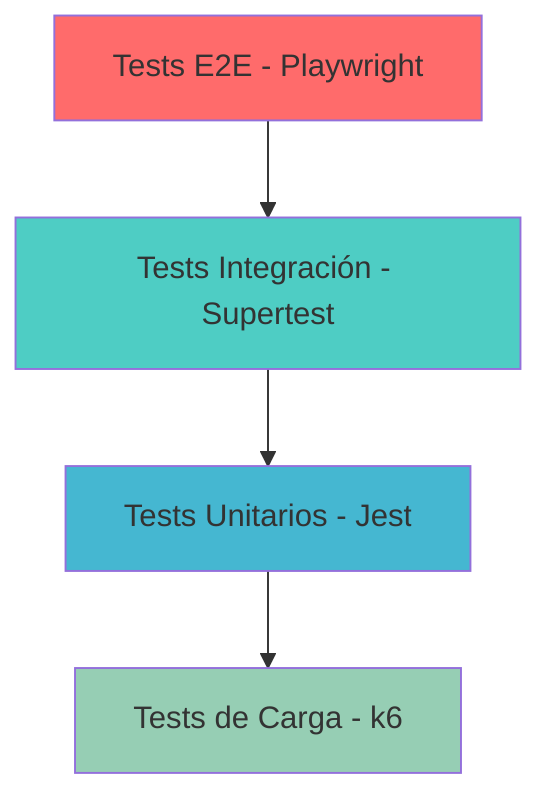

# Testing y QA

RetroGameCloud implementa una estrategia de testing integral que abarca desde pruebas unitarias hasta tests end-to-end, garantizando la calidad y fiabilidad de la plataforma de juegos retro.

## Estrategia de Testing

### Pirámide de Testing



## Tests Unitarios

### Configuración con Jest

Los tests unitarios se ejecutan con **Jest** y deben mantener un **coverage superior al 80%**.

<Tabs>
  <Tab title="package.json">
    ```json
    {
      "scripts": {
        "test": "jest",
        "test:watch": "jest --watch",
        "test:coverage": "jest --coverage",
        "test:ci": "jest --coverage --watchAll=false"
      },
      "jest": {
        "testEnvironment": "node",
        "collectCoverageFrom": [
          "src/**/*.{js,ts}",
          "!src/**/*.test.{js,ts}",
          "!src/config/**"
        ],
        "coverageThreshold": {
          "global": {
            "branches": 80,
            "functions": 80,
            "lines": 80,
            "statements": 80
          }
        }
      }
    }
    ```
  </Tab>
  
  <Tab title="jest.config.js">
    ```javascript
    module.exports = {
      preset: 'ts-jest',
      testEnvironment: 'node',
      roots: ['<rootDir>/src'],
      testMatch: ['**/__tests__/**/*.test.(ts|js)'],
      collectCoverageFrom: [
        'src/**/*.{ts,js}',
        '!src/**/*.d.ts',
        '!src/types/**',
        '!src/config/**'
      ],
      setupFilesAfterEnv: ['<rootDir>/src/test/setup.ts']
    };
    ```
  </Tab>
</Tabs>

### Ejemplo de Test Unitario

```javascript
// src/services/__tests__/authService.test.js
import { AuthService } from '../authService';
import { UserRepository } from '../../repositories/userRepository';
import bcrypt from 'bcrypt';
import jwt from 'jsonwebtoken';

jest.mock('../../repositories/userRepository');
jest.mock('bcrypt');
jest.mock('jsonwebtoken');

describe('AuthService', () => {
  let authService;
  let mockUserRepository;

  beforeEach(() => {
    mockUserRepository = new UserRepository();
    authService = new AuthService(mockUserRepository);
  });

  describe('login', () => {
    it('debería autenticar usuario con credenciales válidas', async () => {
      // Arrange
      const email = 'test@example.com';
      const password = 'password123';
      const hashedPassword = 'hashedPassword123';
      const user = { id: 1, email, password: hashedPassword };
      const token = 'jwt-token';

      mockUserRepository.findByEmail.mockResolvedValue(user);
      bcrypt.compare.mockResolvedValue(true);
      jwt.sign.mockReturnValue(token);

      // Act
      const result = await authService.login(email, password);

      // Assert
      expect(result).toEqual({ token, user: { id: 1, email } });
      expect(mockUserRepository.findByEmail).toHaveBeenCalledWith(email);
      expect(bcrypt.compare).toHaveBeenCalledWith(password, hashedPassword);
    });
  });
});
```

### Comandos de Ejecución

<Card title="Comandos de Testing" icon="terminal">
  ```bash
  # Ejecutar todos los tests
  npm test

  # Ejecutar tests en modo watch
  npm run test:watch

  # Generar reporte de coverage
  npm run test:coverage

  # Tests para CI/CD
  npm run test:ci
  ```
</Card>

## Tests de Integración

### Configuración con Supertest

Los tests de integración validan los endpoints de la API utilizando **Supertest**.

```javascript
// src/test/integration/auth.integration.test.js
import request from 'supertest';
import app from '../../app';
import { setupTestDatabase, cleanupTestDatabase } from '../helpers/database';

describe('Auth Integration Tests', () => {
  beforeAll(async () => {
    await setupTestDatabase();
  });

  afterAll(async () => {
    await cleanupTestDatabase();
  });

  describe('POST /api/auth/login', () => {
    it('debería autenticar usuario correctamente', async () => {
      // Crear usuario de prueba
      await request(app)
        .post('/api/auth/register')
        .send({
          email: 'test@example.com',
          password: 'Password123!',
          username: 'testuser'
        });

      // Intentar login
      const response = await request(app)
        .post('/api/auth/login')
        .send({
          email: 'test@example.com',
          password: 'Password123!'
        });

      expect(response.status).toBe(200);
      expect(response.body).toHaveProperty('token');
      expect(response.body.user).toMatchObject({
        email: 'test@example.com',
        username: 'testuser'
      });
    });

    it('debería fallar con credenciales inválidas', async () => {
      const response = await request(app)
        .post('/api/auth/login')
        .send({
          email: 'invalid@example.com',
          password: 'wrongpassword'
        });

      expect(response.status).toBe(401);
      expect(response.body).toHaveProperty('error');
    });
  });
});
```

### Helper para Base de Datos de Test

```javascript
// src/test/helpers/database.js
import { Pool } from 'pg';
import { migrate } from 'postgres-migrations';

const testDb = new Pool({
  host: process.env.TEST_DB_HOST || 'localhost',
  port: process.env.TEST_DB_PORT || 5432,
  database: process.env.TEST_DB_NAME || 'retrogame_test',
  user: process.env.TEST_DB_USER || 'postgres',
  password: process.env.TEST_DB_PASSWORD || 'password'
});

export async function setupTestDatabase() {
  await migrate({
    client: testDb,
    directory: 'migrations',
    migrationsTable: 'migrations'
  });
}

export async function cleanupTestDatabase() {
  await testDb.query('TRUNCATE TABLE users, games, scores RESTART IDENTITY CASCADE');
}
```

## Tests End-to-End

### Configuración con Playwright

Los tests E2E validan los flujos críticos de usuario utilizando **Playwright**.

<Tabs>
  <Tab title="playwright.config.js">
    ```javascript
    import { defineConfig } from '@playwright/test';

    export default defineConfig({
      testDir: './e2e',
      timeout: 30000,
      retries: 2,
      use: {
        baseURL: process.env.E2E_BASE_URL || 'http://localhost:3000',
        headless: true,
        screenshot: 'only-on-failure',
        video: 'retain-on-failure'
      },
      projects: [
        {
          name: 'Chrome',
          use: { ...devices['Desktop Chrome'] }
        },
        {
          name: 'Firefox',
          use: { ...devices['Desktop Firefox'] }
        },
        {
          name: 'Safari',
          use: { ...devices['Desktop Safari'] }
        }
      ],
      webServer: {
        command: 'npm start',
        port: 3000,
        reuseExistingServer: !process.env.CI
      }
    });
    ```
  </Tab>
  
  <Tab title="e2e/auth.spec.js">
    ```javascript
    import { test, expect } from '@playwright/test';

    test.describe('Autenticación', () => {
      test('flujo completo de registro y login', async ({ page }) => {
        // Ir a página de registro
        await page.goto('/register');
        
        // Llenar formulario de registro
        await page.fill('input[name="username"]', 'testuser');
        await page.fill('input[name="email"]', 'test@example.com');
        await page.fill('input[name="password"]', 'Password123!');
        await page.fill('input[name="confirmPassword"]', 'Password123!');
        
        // Enviar formulario
        await page.click('button[type="submit"]');
        
        // Verificar redirección a login
        await expect(page).toHaveURL('/login');
        await expect(page.locator('.success-message')).toContainText('Registro exitoso');
        
        // Realizar login
        await page.fill('input[name="email"]', 'test@example.com');
        await page.fill('input[name="password"]', 'Password123!');
        await page.click('button[type="submit"]');
        
        // Verificar login exitoso
        await expect(page).toHaveURL('/dashboard');
        await expect(page.locator('.user-menu')).toContainText('testuser');
      });
    });
    ```
  </Tab>
</Tabs>

### Test de Juego Completo

```javascript
// e2e/gameplay.spec.js
import { test, expect } from '@playwright/test';

test.describe('Gameplay', () => {
  test.beforeEach(async ({ page }) => {
    // Login automático
    await page.goto('/login');
    await page.fill('input[name="email"]', 'test@example.com');
    await page.fill('input[name="password"]', 'Password123!');
    await page.click('button[type="submit"]');
    await expect(page).toHaveURL('/dashboard');
  });

  test('iniciar y jugar un juego retro', async ({ page }) => {
    // Ir al catálogo de juegos
    await page.click('nav a[href="/games"]');
    await expect(page).toHaveURL('/games');
    
    // Seleccionar un juego
    await page.click('.game-card[data-game="pac-man"]');
    await expect(page).toHaveURL('/games/pac-man');
    
    // Iniciar juego
    await page.click('button.start-game');
    
    // Esperar a que cargue el emulador
    await expect(page.locator('canvas.dos-canvas')).toBeVisible();
    
    // Verificar que el juego está cargado
    await expect(page.locator('.game-status')).toContainText('Juego cargado');
    
    // Simular interacción (tecla de pausa)
    await page.keyboard.press('Space');
    
    // Verificar guardar puntuación
    await page.click('button.save-score');
    await expect(page.locator('.score-saved')).toBeVisible();
  });
});
```

## Tests de Carga

### Configuración con k6

Los tests de carga simulan **1000 usuarios concurrentes** utilizando **k6**.

```javascript
// k6/load-test.js
import http from 'k6/http';
import { check, group } from 'k6';
import { Rate } from 'k6/metrics';

export let errorRate = new Rate('errors');

export let options = {
  stages: [
    { duration: '2m', target: 100 }, // Ramp up
    { duration: '5m', target: 100 }, // Stay at 100 users
    { duration: '2m', target: 200 }, // Ramp up
    { duration: '5m', target: 200 }, // Stay at 200 users
    { duration: '2m', target: 500 }, // Ramp up
    { duration: '5m', target: 500 }, // Stay at 500 users
    { duration: '2m', target: 1000 }, // Ramp up to 1000
    { duration: '5m', target: 1000 }, // Stay at 1000 users
    { duration: '2m', target: 0 }, // Ramp down
  ],
  thresholds: {
    http_req_duration: ['p(95)<500'], // 95% de requests < 500ms
    http_req_failed: ['rate<0.1'], // Error rate < 10%
  },
};

const BASE_URL = 'https://api.retrogamecloud.com';

export function setup() {
  // Crear usuario de test
  let loginRes = http.post(`${BASE_URL}/api/auth/login`, {
    email: 'loadtest@example.com',
    password: 'LoadTest123!'
  });
  
  return { authToken: loginRes.json().token };
}

export default function(data) {
  let params = {
    headers: {
      'Authorization': `Bearer ${data.authToken}`,
      'Content-Type': 'application/json',
    },
  };

  group('API Load Test', function() {
    // Test endpoint de juegos
    group('Games API', function() {
      let res = http.get(`${BASE_URL}/api/games`, params);
      check(res, {
        'games status 200': (r) => r.status === 200,
        'games response time < 500ms': (r) => r.timings.duration < 500,
      }) || errorRate.add(1);
    });

    // Test endpoint de rankings
    group('Rankings API', function() {
      let res = http.get(`${BASE_URL}/api/rankings/global`, params);
      check(res, {
        'rankings status 200': (r) => r.status === 200,
        'rankings response time < 1s': (r) => r.timings.duration < 1000,
      }) || errorRate.add(1);
    });

    // Test submit score
    group('Submit Score', function() {
      let payload = JSON.stringify({
        gameId: 'pac-man',
        score: Math.floor(Math.random() * 10000),
        level: Math.floor(Math.random() * 10)
      });
      
      let res = http.post(`${BASE_URL}/api/scores`, payload, params);
      check(res, {
        'submit score status 201': (r) => r.status === 201,
        'submit score time < 2s': (r) => r.timings.duration < 2000,
      }) || errorRate.add(1);
    });
  });
}
```

### Ejecutar Tests de Carga

<Card title="Comandos k6" icon="gauge-high">
  ```bash
  # Instalar k6
  brew install k6  # macOS
  # o
  sudo apt-get install k6  # Ubuntu

  # Ejecutar test de carga
  k6 run k6/load-test.js

  # Ejecutar con salida a InfluxDB
  k6 run --out influxdb=http://localhost:8086/k6 k6/load-test.js

  # Test de spike (picos de tráfico)
  k6 run k6/spike-test.js
  ```
</Card>

## Testing Local con Minikube

### Setup del Entorno Local

```bash
```