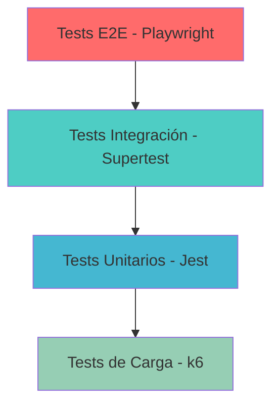

# Testing y QA

RetroGameCloud implementa una estrategia de testing integral que abarca desde pruebas unitarias hasta tests end-to-end, garantizando la calidad y fiabilidad de la plataforma de juegos retro.

## Estrategia de Testing

### Pirámide de Testing



## Tests Unitarios

### Configuración con Jest

Los tests unitarios se ejecutan con **Jest** y deben mantener un **coverage superior al 80%**.

<Tabs>
  <Tab title="package.json">
    ```json
    {
      "scripts": {
        "test": "jest",
        "test:watch": "jest --watch",
        "test:coverage": "jest --coverage",
        "test:ci": "jest --coverage --watchAll=false"
      },
      "jest": {
        "testEnvironment": "node",
        "collectCoverageFrom": [
          "src/**/*.{js,ts}",
          "!src/**/*.test.{js,ts}",
          "!src/config/**"
        ],
        "coverageThreshold": {
          "global": {
            "branches": 80,
            "functions": 80,
            "lines": 80,
            "statements": 80
          }
        }
      }
    }
    ```

  </Tab>

  <Tab title="jest.config.js">
    ```javascript
    module.exports = {
      preset: 'ts-jest',
      testEnvironment: 'node',
      roots: ['<rootDir>/src'],
      testMatch: ['**/__tests__/**/*.test.(ts|js)'],
      collectCoverageFrom: [
        'src/**/*.{ts,js}',
        '!src/**/*.d.ts',
        '!src/types/**',
        '!src/config/**'
      ],
      setupFilesAfterEnv: ['<rootDir>/src/test/setup.ts']
    };
    ```

  </Tab>
</Tabs>

### Ejemplo de Test Unitario

```javascript
// src/services/__tests__/authService.test.ts
import { AuthService } from '../authService';
import { UserModel } from '../../models/User';
import bcrypt from 'bcryptjs';
import jwt from 'jsonwebtoken';

jest.mock('../../models/User');
jest.mock('bcryptjs');
jest.mock('jsonwebtoken');

describe('AuthService', () => {
  let authService: AuthService;

  beforeEach(() => {
    authService = new AuthService();
    jest.clearAllMocks();
  });

  describe('login', () => {
    it('should authenticate user with valid credentials', async () => {
      const mockUser = {
        id: 1,
        email: 'test@example.com',
        password: 'hashedPassword'
      };

      (UserModel.findByEmail as jest.Mock).mockResolvedValue(mockUser);
      (bcrypt.compare as jest.Mock).mockResolvedValue(true);
      (jwt.sign as jest.Mock).mockReturnValue('mock-token');

      const result = await authService.login('test@example.com', 'password');

      expect(result).toEqual({
        success: true,
        token: 'mock-token',
        user: { id: 1, email: 'test@example.com' }
      });
    });

    it('should reject invalid credentials', async () => {
      (UserModel.findByEmail as jest.Mock).mockResolvedValue(null);

      const result = await authService.login('invalid@example.com', 'password');

      expect(result.success).toBe(false);
      expect(result.error).toBe('Invalid credentials');
    });
  });
});

```

## Tests de Integración

### Configuración con Supertest

```javascript
// src/test/integration/auth.test.ts
import request from 'supertest';
import app from '../../app';
import { setupTestDB, cleanupTestDB } from '../helpers/database';

describe('Auth Integration Tests', () => {
  beforeAll(async () => {
    await setupTestDB();
  });

  afterAll(async () => {
    await cleanupTestDB();
  });

  describe('POST /api/auth/login', () => {
    it('should login with valid credentials', async () => {
      const response = await request(app)
        .post('/api/auth/login')
        .send({
          email: 'test@example.com',
          password: 'password123'
        })
        .expect(200);

      expect(response.body).toHaveProperty('token');
      expect(response.body.user.email).toBe('test@example.com');
    });

    it('should reject invalid credentials', async () => {
      const response = await request(app)
        .post('/api/auth/login')
        .send({
          email: 'invalid@example.com',
          password: 'wrongpassword'
        })
        .expect(401);

      expect(response.body.error).toBe('Invalid credentials');
    });
  });
});

```

## Tests End-to-End (E2E)

### Configuración con Playwright

<Tabs>
  <Tab title="playwright.config.ts">
    ```typescript
    import { defineConfig, devices } from '@playwright/test';

    export default defineConfig({
      testDir: './tests/e2e',
      fullyParallel: true,
      forbidOnly: !!process.env.CI,
      retries: process.env.CI ? 2 : 0,
      workers: process.env.CI ? 1 : undefined,
      reporter: [['html'], ['json', { outputFile: 'test-results.json' }]],
      use: {
        baseURL: 'http://localhost:3000',
        trace: 'on-first-retry',
        screenshot: 'only-on-failure'
      },
      projects: [
        {
          name: 'chromium',
          use: { ...devices['Desktop Chrome'] }
        },
        {
          name: 'firefox',
          use: { ...devices['Desktop Firefox'] }
        },
        {
          name: 'webkit',
          use: { ...devices['Desktop Safari'] }
        },
        {
          name: 'Mobile Chrome',
          use: { ...devices['Pixel 5'] }
        }
      ],
      webServer: {
        command: 'npm run dev',
        url: 'http://localhost:3000',
        reuseExistingServer: !process.env.CI
      }
    });
    ```

  </Tab>

  <Tab title="test-setup.ts">
    ```typescript
    // tests/e2e/setup/test-setup.ts
    import { test as baseTest } from '@playwright/test';
    import { AuthPage } from '../pages/auth.page';
    import { GameLibraryPage } from '../pages/game-library.page';
    import { RoomPage } from '../pages/room.page';

    type TestFixtures = {
      authPage: AuthPage;
      gameLibraryPage: GameLibraryPage;
      roomPage: RoomPage;
    };

    export const test = baseTest.extend<TestFixtures>({
      authPage: async ({ page }, use) => {
        const authPage = new AuthPage(page);
        await use(authPage);
      },
      gameLibraryPage: async ({ page }, use) => {
        const gameLibraryPage = new GameLibraryPage(page);
        await use(gameLibraryPage);
      },
      roomPage: async ({ page }, use) => {
        const roomPage = new RoomPage(page);
        await use(roomPage);
      }
    });

    export { expect } from '@playwright/test';
    ```

  </Tab>
</Tabs>

### Page Object Models

<Tabs>
  <Tab title="auth.page.ts">
    ```typescript
    // tests/e2e/pages/auth.page.ts
    import { Page, Locator } from '@playwright/test';

    export class AuthPage {
      readonly page: Page;
      readonly emailInput: Locator;
      readonly passwordInput: Locator;
      readonly loginButton: Locator;
      readonly registerButton: Locator;
      readonly errorMessage: Locator;

      constructor(page: Page) {
        this.page = page;
        this.emailInput = page.locator('[data-testid="email-input"]');
        this.passwordInput = page.locator('[data-testid="password-input"]');
        this.loginButton = page.locator('[data-testid="login-button"]');
        this.registerButton = page.locator('[data-testid="register-button"]');
        this.errorMessage = page.locator('[data-testid="error-message"]');
      }

      async goto() {
        await this.page.goto('/auth/login');
      }

      async login(email: string, password: string) {
        await this.emailInput.fill(email);
        await this.passwordInput.fill(password);
        await this.loginButton.click();
      }

      async register(userData: {
        email: string;
        password: string;
        username: string;
      }) {
        await this.page.goto('/auth/register');
        await this.page.locator('[data-testid="username-input"]').fill(userData.username);
        await this.emailInput.fill(userData.email);
        await this.passwordInput.fill(userData.password);
        await this.registerButton.click();
      }

      async isLoggedIn() {
        await this.page.waitForURL('/dashboard');
        return this.page.url().includes('/dashboard');
      }
    }
    ```

  </Tab>

  <Tab title="game-library.page.ts">
    ```typescript
    // tests/e2e/pages/game-library.page.ts
    import { Page, Locator } from '@playwright/test';

    export class GameLibraryPage {
      readonly page: Page;
      readonly searchInput: Locator;
      readonly gameCards: Locator;
      readonly filterByGenre: Locator;
      readonly createRoomButton: Locator;

      constructor(page: Page) {
        this.page = page;
        this.searchInput = page.locator('[data-testid="game-search"]');
        this.gameCards = page.locator('[data-testid="game-card"]');
        this.filterByGenre = page.locator('[data-testid="genre-filter"]');
        this.createRoomButton = page.locator('[data-testid="create-room-btn"]');
      }

      async goto() {
        await this.page.goto('/games');
      }

      async searchGame(gameName: string) {
        await this.searchInput.fill(gameName);
        await this.page.waitForTimeout(500); // Debounce
      }

      async selectGame(gameTitle: string) {
        await this.page.locator(`[data-testid="game-card"][data-game="${gameTitle}"]`).click();
      }

      async filterByGenre(genre: string) {
        await this.filterByGenre.selectOption(genre);
      }

      async createRoom(gameTitle: string) {
        await this.selectGame(gameTitle);
        await this.createRoomButton.click();
      }
    }
    ```

  </Tab>

  <Tab title="room.page.ts">
    ```typescript
    // tests/e2e/pages/room.page.ts
    import { Page, Locator } from '@playwright/test';

    export class RoomPage {
      readonly page: Page;
      readonly gameCanvas: Locator;
      readonly chatInput: Locator;
      readonly sendMessageButton: Locator;
      readonly playersList: Locator;
      readonly leaveRoomButton: Locator;

      constructor(page: Page) {
        this.page = page;
        this.gameCanvas = page.locator('[data-testid="game-canvas"]');
        this.chatInput = page.locator('[data-testid="chat-input"]');
        this.sendMessageButton = page.locator('[data-testid="send-message"]');
        this.playersList = page.locator('[data-testid="players-list"]');
        this.leaveRoomButton = page.locator('[data-testid="leave-room"]');
      }

      async sendChatMessage(message: string) {
        await this.chatInput.fill(message);
        await this.sendMessageButton.click();
      }

      async waitForGameToLoad() {
        await this.gameCanvas.waitFor({ state: 'visible' });
        await this.page.waitForTimeout(2000); // Esperar carga del juego
      }

      async pressGameKey(key: string) {
        await this.gameCanvas.focus();
        await this.page.keyboard.press(key);
      }

      async leaveRoom() {
        await this.leaveRoomButton.click();
      }

      async getPlayerCount() {
        return await this.playersList.locator('[data-testid="player"]').count();
      }
    }
    ```

  </Tab>
</Tabs>

### Casos de Prueba E2E por Servicio

<Tabs>
  <Tab title="auth.spec.ts">
    ```typescript
    // tests/e2e/auth.spec.ts
    import { test, expect } from './setup/test-setup';

    test.describe('Authentication', () => {
      test('should login with valid credentials', async ({ authPage }) => {
        await authPage.goto();
        await authPage.login('test@example.com', 'password123');

        expect(await authPage.isLoggedIn()).toBe(true);
      });

      test('should show error with invalid credentials', async ({ authPage }) => {
        await authPage.goto();
        await authPage.login('invalid@example.com', 'wrongpassword');

        await expect(authPage.errorMessage).toBeVisible();
        await expect(authPage.errorMessage).toContainText('Invalid credentials');
      });

      test('should register new user', async ({ authPage }) => {
        const userData = {
          email: 'newuser@example.com',
          password: 'newpassword123',
          username: 'newuser'
        };

        await authPage.register(userData);
        expect(await authPage.isLoggedIn()).toBe(true);
      });

      test('should prevent registration with existing email', async ({ authPage }) => {
        const userData = {
          email: 'test@example.com', // Email ya existente
          password: 'password123',
          username: 'testuser'
        };

        await authPage.register(userData);
        await expect(authPage.errorMessage).toContainText('Email already exists');
      });
    });
    ```

  </Tab>

  <Tab title="game-library.spec.ts">
    ```typescript
    // tests/e2e/game-library.spec.ts
    import { test, expect } from './setup/test-setup';

    test.describe('Game Library', () => {
      test.beforeEach(async ({ authPage }) => {
        await authPage.goto();
        await authPage.login('test@example.com', 'password123');
      });

      test('should display game library', async ({ gameLibraryPage }) => {
        await gameLibraryPage.goto();

        await expect(gameLibraryPage.gameCards.first()).toBeVisible();
        expect(await gameLibraryPage.gameCards.count()).toBeGreaterThan(0);
      });

      test('should search games', async ({ gameLibraryPage
</Tab>
</Tab>
</Tab>
</Tab>
</Tab>
</Tabs>

```
