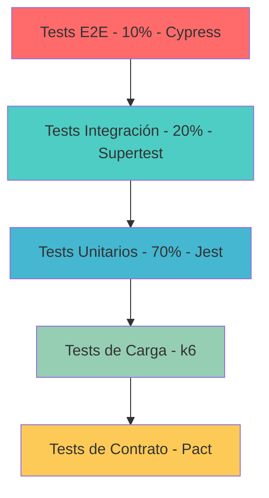

# Testing y QA

RetroGameCloud implementa una estrategia de testing integral que abarca desde pruebas unitarias hasta tests end-to-end, garantizando la calidad y fiabilidad de la plataforma de juegos retro.

## Estrategia de Testing

### Pirámide de Testing



### Distribución de Tests

| Tipo | Porcentaje | Propósito | Framework |
|------|------------|-----------|-----------|
| **Unitarios** | 70% | Lógica de negocio aislada | Jest |
| **Integración** | 20% | Interacción entre componentes | Supertest |
| **E2E** | 10% | Flujos críticos del usuario | Cypress |
| **Carga** | - | Rendimiento bajo estrés | k6 |
| **Contrato** | - | API consistency | Pact |

## Cobertura de Código

### Objetivos de Cobertura

<Card title="Cobertura Mínima Requerida" icon="target">
- **Lógica de Negocio**: 85% mínimo
- **Servicios**: 80% mínimo
- **Controllers**: 75% mínimo
- **Utilities**: 90% mínimo
- **Global**: 80% mínimo
</Card>

### Exclusiones de Cobertura

```javascript
// jest.config.js - Archivos excluidos
collectCoverageFrom: [
  'src/**/*.{ts,js}',
  '!src/**/*.d.ts',
  '!src/types/**',
  '!src/config/**',
  '!src/migrations/**',
  '!src/seeds/**',
  '!src/**/*.interface.ts'
]
```

## Tests Unitarios

### Configuración con Jest

<Tabs>
  <Tab title="package.json">
    ```json
    {
      "scripts": {
        "test": "jest",
        "test:watch": "jest --watch",
        "test:coverage": "jest --coverage",
        "test:ci": "jest --coverage --watchAll=false",
        "test:unit": "jest --testPathPattern=unit",
        "test:integration": "jest --testPathPattern=integration"
      },
      "jest": {
        "testEnvironment": "node",
        "collectCoverageFrom": [
          "src/**/*.{js,ts}",
          "!src/**/*.test.{js,ts}",
          "!src/config/**"
        ],
        "coverageThreshold": {
          "global": {
            "branches": 80,
            "functions": 80,
            "lines": 80,
            "statements": 80
          },
          "src/services/": {
            "statements": 85
          },
          "src/utils/": {
            "statements": 90
          }
        }
      }
    }
    ```
  </Tab>

  <Tab title="jest.config.js">
    ```javascript
    module.exports = {
      preset: 'ts-jest',
      testEnvironment: 'node',
      roots: ['<rootDir>/src'],
      testMatch: [
        '**/__tests__/**/*.test.(ts|js)',
        '**/?(*.)(spec|test).(ts|js)'
      ],
      collectCoverageFrom: [
        'src/**/*.{ts,js}',
        '!src/**/*.d.ts',
        '!src/types/**',
        '!src/config/**'
      ],
      setupFilesAfterEnv: ['<rootDir>/src/test/setup.ts'],
      testTimeout: 10000,
      maxWorkers: '50%'
    };
    ```
  </Tab>
</Tabs>

### Ejemplo de Test Unitario

```javascript
// src/services/__tests__/authService.unit.test.ts
import { AuthService } from '../authService';
import { UserRepository } from '../../repositories/userRepository';
import { JwtService } from '../jwtService';
import { BcryptService } from '../bcryptService';

jest.mock('../../repositories/userRepository');
jest.mock('../jwtService');
jest.mock('../bcryptService');

describe('AuthService', () => {
  let authService: AuthService;
  let mockUserRepository: jest.Mocked<UserRepository>;
  let mockJwtService: jest.Mocked<JwtService>;
  let mockBcryptService: jest.Mocked<BcryptService>;

  beforeEach(() => {
    mockUserRepository = new UserRepository() as jest.Mocked<UserRepository>;
    mockJwtService = new JwtService() as jest.Mocked<JwtService>;
    mockBcryptService = new BcryptService() as jest.Mocked<BcryptService>;
    
    authService = new AuthService(
      mockUserRepository,
      mockJwtService,
      mockBcryptService
    );
  });

  describe('login', () => {
    it('should return token for valid credentials', async () => {
      // Arrange
      const email = 'test@example.com';
      const password = 'password123';
      const user = { id: 1, email, hashedPassword: 'hashed123' };
      
      mockUserRepository.findByEmail.mockResolvedValue(user);
      mockBcryptService.compare.mockResolvedValue(true);
      mockJwtService.generateToken.mockReturnValue('jwt-token');

      // Act
      const result = await authService.login(email, password);

      // Assert
      expect(result).toEqual({
        token: 'jwt-token',
        user: { id: 1, email }
      });
      expect(mockUserRepository.findByEmail).toHaveBeenCalledWith(email);
      expect(mockBcryptService.compare).toHaveBeenCalledWith(password, 'hashed123');
    });

    it('should throw error for invalid credentials', async () => {
      // Arrange
      mockUserRepository.findByEmail.mockResolvedValue(null);

      // Act & Assert
      await expect(authService.login('invalid@email.com', 'wrong'))
        .rejects.toThrow('Invalid credentials');
    });
  });
});
```

## Tests de Integración

### Configuración con Supertest

```javascript
// src/test/__tests__/auth.integration.test.ts
import request from 'supertest';
import { app } from '../../app';
import { DatabaseService } from '../../services/databaseService';
import { testFixtures } from '../fixtures';

describe('Auth Integration Tests', () => {
  let dbService: DatabaseService;

  beforeAll(async () => {
    dbService = new DatabaseService();
    await dbService.connect(process.env.TEST_DATABASE_URL);
  });

  beforeEach(async () => {
    await dbService.clearDatabase();
    await testFixtures.createUsers();
  });

  afterAll(async () => {
    await dbService.disconnect();
  });

  describe('POST /api/auth/login', () => {
    it('should login user with valid credentials', async () => {
      const response = await request(app)
        .post('/api/auth/login')
        .send({
          email: 'test@example.com',
          password: 'password123'
        })
        .expect(200);

      expect(response.body).toHaveProperty('token');
      expect(response.body.user).toHaveProperty('email', 'test@example.com');
    });

    it('should return 401 for invalid credentials', async () => {
      await request(app)
        .post('/api/auth/login')
        .send({
          email: 'invalid@example.com',
          password: 'wrongpassword'
        })
        .expect(401);
    });
  });
});
```

## Estrategia de Mocking

### Niveles de Mocking

<Tabs>
  <Tab title="Dependencias Externas">
    ```javascript
    // src/test/mocks/externalAPIs.ts
    export const mockS3Service = {
      uploadFile: jest.fn().mockResolvedValue({
        url: 'https://mock-s3.com/file.rom',
        key: 'mock-key'
      }),
      deleteFile: jest.fn().mockResolvedValue(true),
      getSignedUrl: jest.fn().mockReturnValue('signed-url')
    };

    export const mockRedisService = {
      get: jest.fn(),
      set: jest.fn(),
      del: jest.fn(),
      exists: jest.fn()
    };

    export const mockEmailService = {
      sendWelcomeEmail: jest.fn().mockResolvedValue(true),
      sendPasswordReset: jest.fn().mockResolvedValue(true)
    };
    ```
  </Tab>

  <Tab title="Base de Datos">
    ```javascript
    // src/test/mocks/database.ts
    import { DatabaseService } from '../../services/databaseService';

    export const mockDatabase = {
      users: new Map(),
      games: new Map(),
      sessions: new Map(),
      
      // Simular operaciones CRUD
      async findUser(id: string) {
        return this.users.get(id);
      },
      
      async createUser(userData: any) {
        const id = Math.random().toString();
        const user = { id, ...userData, createdAt: new Date() };
        this.users.set(id, user);
        return user;
      },
      
      async clear() {
        this.users.clear();
        this.games.clear();
        this.sessions.clear();
      }
    };
    ```
  </Tab>

  <Tab title="Servicios">
    ```javascript
    // src/test/mocks/services.ts
    export const createMockService = <T>(methods: (keyof T)[]) => {
      const mock = {} as jest.Mocked<T>;
      
      methods.forEach(method => {
        mock[method] = jest.fn() as any;
      });
      
      return mock;
    };

    // Uso
    const mockGameService = createMockService<GameService>([
      'findById',
      'create',
      'update',
      'delete',
      'findByUser'
    ]);
    ```
  </Tab>
</Tabs>

## Fixtures y Datos de Prueba

### Sistema de Fixtures

```javascript
// src/test/fixtures/index.ts
import { User, Game, Console } from '../../types';

export class TestFixtures {
  // Usuarios de prueba
  static users = {
    admin: {
      id: 'admin-1',
      email: 'admin@retrogamecloud.com',
      username: 'admin',
      role: 'ADMIN',
      password: 'hashed-password'
    } as User,
    
    regularUser: {
      id: 'user-1',
      email: 'user@example.com',
      username: 'gamer1',
      role: 'USER',
      password: 'hashed-password'
    } as User
  };

  // Juegos de prueba
  static games = {
    tetris: {
      id: 'game-1',
      title: 'Tetris',
      console: 'GAMEBOY',
      romFile: 'tetris.gb',
      coverImage: 'tetris-cover.jpg',
      userId: 'user-1'
    } as Game,
    
    mario: {
      id: 'game-2',
      title: 'Super Mario Bros',
      console: 'NES',
      romFile: 'mario.nes',
      coverImage: 'mario-cover.jpg',
      userId: 'user-1'
    } as Game
  };

  // Métodos de creación
  static async createUsers(db: any) {
    const users = Object.values(this.users);
    return Promise.all(users.map(user => db.users.create(user)));
  }

  static async createGames(db: any) {
    const games = Object.values(this.games);
    return Promise.all(games.map(game => db.games.create(game)));
  }

  static async seedDatabase(db: any) {
    await this.createUsers(db);
    await this.createGames(db);
  }
}
```

## Tests End-to-End

### Configuración con Cypress

<Tabs>
  <Tab title="cypress.config.js">
    ```javascript
    const { defineConfig } = require('cypress');

    module.exports = defineConfig({
      e2e: {
        baseUrl: 'http://localhost:3000',
        supportFile: 'cypress/support/e2e.js',
        specPattern: 'cypress/e2e/**/*.cy.{js,ts}',
        videosFolder: 'cypress/videos',
        screenshotsFolder: 'cypress/screenshots',
        video: true,
        screenshot: true,
        viewportWidth: 1280,
        viewportHeight: 720,
        defaultCommandTimeout: 10000,
        setupNodeEvents(on, config) {
          // Plugins y tareas personalizadas
          on('task', {
            seedDatabase() {
              return require('./cypress/tasks/database').seedTestData();
            },
            clearDatabase() {
              return require('./cypress/tasks/database').clearTestData();
            }
          });
        }
      }
    });
    ```
  </Tab>

  <Tab title="Ejemplo E2E">
    ```javascript
    // cypress/e2e/game-upload.cy.js
    describe('Game Upload Flow', () => {
      beforeEach(() => {
        cy.task('clearDatabase');
        cy.task('seedDatabase');
        cy.login('user@example.com', 'password123');
      });

      it('should upload and play a game', () => {
        // Navegar a upload
        cy.visit('/games/upload');
        
        // Subir ROM
        cy.get('[data-cy=file-input]')
          .selectFile('cypress/fixtures/tetris.gb');
        
        // Completar metadatos
        cy.get('[data-cy=game-title]')
          .type('Tetris Test');
        
        cy.get('[data-cy=console-select]')
          .select('GAMEBOY');
        
        // Subir juego
        cy.get('[data-cy=upload-btn]').click();
        
        // Verificar redirección
        cy.url().should('include', '/games/');
        
        // Verificar que el juego aparece
        cy.get('[data-cy=game-title]')
          .should('contain', 'Tetris Test');
        
        // Iniciar juego
        cy.get('[data-cy=play-btn]').click();
        
        // Verificar que el emulador carga
        cy.get('[data-cy=emulator-canvas]')
          .should('be.visible');
        
        // Verificar controles
        cy.get('[data-cy=game-controls]')
          .should('be.visible');
      });
    });
    ```
  </Tab>
</Tabs>

## Tests de Contrato con Pact

### Consumer Tests

```javascript
// src/test/contract/gameAPI.consumer.test.js
import { Pact } from '@pact-foundation/p
```