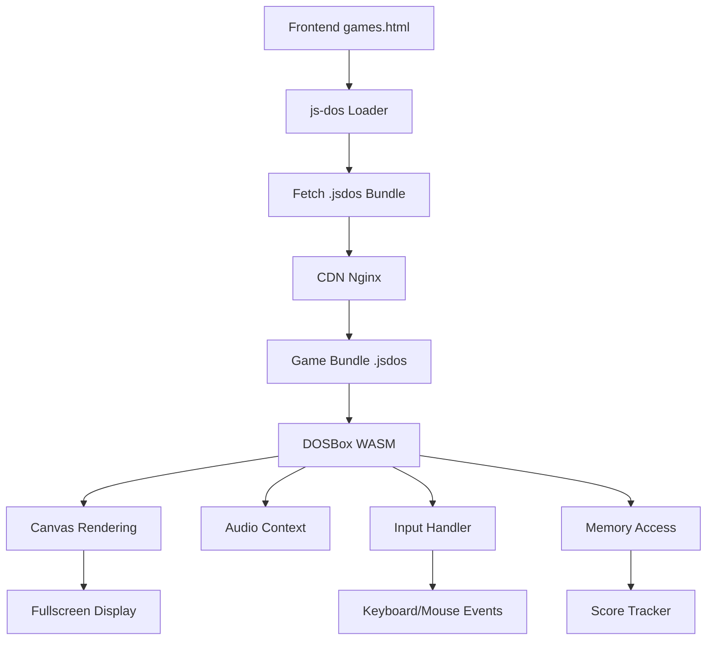

## ¿Qué es js-dos?

js-dos es una biblioteca JavaScript que permite ejecutar juegos y programas de MS-DOS directamente en el navegador usando DOSBox compilado a WebAssembly.

### Ventajas de js-dos

<CardGroup cols={2}>
  <Card title="Sin Instalación" icon="download">
    Juegos ejecutan directamente en el navegador
  </Card>
  <Card title="Alto Rendimiento" icon="gauge-high">
    WebAssembly ofrece velocidad nativa
  </Card>
  <Card title="Cross-Platform" icon="globe">
    Funciona en Windows, Mac, Linux, móviles
  </Card>
  <Card title="Compatibilidad" icon="check">
    Soporta prácticamente todos los juegos DOS
  </Card>
</CardGroup>

## Versión Utilizada

```json
{
  "name": "js-dos",
  "version": "7.xx",
  "files": {
    "js-dos.js": "Core library",
    "wdosbox.js": "DOSBox WebAssembly",
    "wdosbox-x.js": "DOSBox-X variant (más features)",
    "wlibzip.js": "ZIP decompression support"
  }
}

```

<Note>
  Usamos js-dos 7.xx porque ofrece mejor rendimiento y API más limpia que versiones anteriores.
</Note>

## Arquitectura de Integración



## Estructura de un Bundle .jsdos

Un archivo `.jsdos` es un ZIP que contiene:

```

game.jsdos
├── game.exe              # Ejecutable del juego
├── *.dat, *.wad, etc.   # Assets del juego
├── dosbox.conf          # Configuración DOSBox
└── metadata.json        # Información del bundle

```

### Ejemplo: doom.jsdos

```json
{
  "title": "DOOM",
  "year": 1993,
  "publisher": "id Software",
  "executable": "DOOM.EXE",
  "args": [],
  "dosboxConf": {
    "cycles": "max",
    "frameskip": 0,
    "core": "dynamic",
    "machine": "svga_s3",
    "memsize": 16
  }
}

```

## Inicialización de js-dos

### Paso 1: Importar Biblioteca

```html
<!DOCTYPE html>
<html>
<head>
  <link rel="stylesheet" href="/jsdos/js-dos.css">
</head>
<body>
  <div id="dos-container"></div>

  <script src="/jsdos/js-dos.js"></script>
</body>
</html>

```

### Paso 2: Configurar Emulador

```javascript
// Inicializar js-dos
const dosContainer = document.getElementById('dos-container');

Dos(dosContainer, {
  wdosboxUrl: "/jsdos/wdosbox.js",
  cycles: "auto",
  autolock: false
}).ready((fs, main) => {
  console.log('DOSBox listo');

  // Cargar juego
  loadGame(fs, main);
});

```

### Paso 3: Cargar Bundle

```javascript
async function loadGame(fs, main) {
  try {
    // Fetch bundle desde CDN
    const response = await fetch('https://cdn.retrogamehub.games/juegos/doom.jsdos');
    const bundle = await response.arrayBuffer();

    // Extraer bundle en filesystem virtual
    await fs.extract(bundle);

    // Ejecutar juego
    main(['-conf', 'dosbox.conf']);

  } catch (error) {
    console.error('Error cargando juego:', error);
    showErrorModal('No se pudo cargar el juego');
  }
}

```

## Configuración Avanzada

### DOSBox Configuration

```javascript
const dosboxConfig = {
  // CPU
  cycles: "max",           // Velocidad máxima
  core: "dynamic",         // Recompilación dinámica

  // Video
  machine: "svga_s3",      // S3 Trio64 (mejor para juegos 90s)
  output: "surface",       // Direct surface rendering
  aspect: true,            // Mantener aspect ratio 4:3

  // Audio
  sbtype: "sb16",          // Sound Blaster 16
  rate: 44100,             // Sample rate
  oplemu: "default",       // OPL emulation

  // Memoria
  memsize: 16,             // 16 MB RAM (suficiente para DOS)

  // Rendering
  frameskip: 0,            // Sin frame skip
  scaler: "none"           // Sin filtros (pixels perfectos)
};

```

### Optimización de Rendimiento

<Tabs>
  <Tab title="Cycles">
    ```javascript
    // Auto-ajustar según hardware
    if (navigator.hardwareConcurrency > 4) {
      dosboxConfig.cycles = "max";
    } else {
      dosboxConfig.cycles = "20000"; // Fijo para hardware débil
    }
    ```

  </Tab>

  <Tab title="Core">
    ```javascript
    // Dynamic core ofrece mejor rendimiento
    dosboxConfig.core = "dynamic";

    // Pero si hay problemas:
    // dosboxConfig.core = "normal";
    // dosboxConfig.core = "simple";
    ```

  </Tab>

  <Tab title="Graphics">
    ```javascript
    // Para juegos VGA (320x200)
    dosboxConfig.machine = "vgaonly";

    // Para juegos SVGA (640x480+)
    dosboxConfig.machine = "svga_s3";

    // Para juegos EGA (16 colores)
    dosboxConfig.machine = "ega";
    ```

  </Tab>
</Tabs>

## Gestión de Canvas

### Fullscreen API

```javascript
function goFullscreen() {
  const canvas = document.querySelector('canvas');

  if (canvas.requestFullscreen) {
    canvas.requestFullscreen();
  } else if (canvas.webkitRequestFullscreen) {
    canvas.webkitRequestFullscreen(); // Safari
  } else if (canvas.msRequestFullscreen) {
    canvas.msRequestFullscreen(); // IE11
  }

  // Bloquear pointer automáticamente
  canvas.requestPointerLock();
}

// Listener para ESC
document.addEventListener('fullscreenchange', () => {
  if (!document.fullscreenElement) {
    console.log('Salió de fullscreen');
    // Pausar juego o mostrar menú
  }
});

```

### Pointer Lock

```javascript
// Necesario para FPS como DOOM, Duke3D
function lockPointer(canvas) {
  canvas.addEventListener('click', () => {
    canvas.requestPointerLock();
  });
}

document.addEventListener('pointerlockchange', () => {
  if (document.pointerLockElement) {
    console.log('Mouse capturado');
  } else {
    console.log('Mouse liberado');
  }
});

```

## Control de Input

### Keyboard Mapping

```javascript
// Mapear teclas modernas a DOS
const keyMap = {
  'ArrowUp': 'UP',
  'ArrowDown': 'DOWN',
  'ArrowLeft': 'LEFT',
  'ArrowRight': 'RIGHT',
  'Space': 'SPACE',
  'Enter': 'ENTER',
  'Escape': 'ESC',
  'ControlLeft': 'CTRL',
  'AltLeft': 'ALT'
};

// Prevenir comportamiento por defecto
document.addEventListener('keydown', (e) => {
  if (keyMap[e.code]) {
    e.preventDefault();
  }
});

```

### Gamepad Support

```javascript
// Detectar gamepads
window.addEventListener('gamepadconnected', (e) => {
  console.log('Gamepad conectado:', e.gamepad.id);
  startGamepadPolling(e.gamepad);
});

function startGamepadPolling(gamepad) {
  setInterval(() => {
    const gp = navigator.getGamepads()[gamepad.index];

    // Mapear botones a teclas
    if (gp.buttons[0].pressed) simulateKey('SPACE'); // A button
    if (gp.buttons[1].pressed) simulateKey('CTRL');  // B button

    // Mapear joystick a flechas
    if (gp.axes[0] < -0.5) simulateKey('LEFT');
    if (gp.axes[0] > 0.5) simulateKey('RIGHT');
    if (gp.axes[1] < -0.5) simulateKey('UP');
    if (gp.axes[1] > 0.5) simulateKey('DOWN');
  }, 16); // ~60 FPS
}

```

## Acceso a Memoria (Score Tracking)

### Leer Memoria del Emulador

```javascript
class MemoryReader {
  constructor(dosInstance) {
    this.dos = dosInstance;
    this.memory = null;
  }

  async initialize() {
    // Obtener handle de memoria
    this.memory = await this.dos.getMemory();
  }

  readByte(address) {
    return this.memory[address];
  }

  readWord(address) {
    // Little-endian
    return this.memory[address] | (this.memory[address + 1] << 8);
  }

  readDWord(address) {
    return this.memory[address] |
           (this.memory[address + 1] << 8) |
           (this.memory[address + 2] << 16) |
           (this.memory[address + 3] << 24);
  }

  // Buscar score en memoria
  findScore(gameId) {
    const patterns = this.getScorePatterns(gameId);

    for (const pattern of patterns) {
      const value = this.readDWord(pattern.address);
      if (value >= pattern.min && value <= pattern.max) {
        return value;
      }
    }

    return null;
  }

  getScorePatterns(gameId) {
    const patterns = {
      'doom': [
        { address: 0x10000, min: 0, max: 999999 },
        { address: 0x20000, min: 0, max: 999999 }
      ],
      'tetris': [
        { address: 0x5000, min: 0, max: 999999 }
      ],
      'duke3d': [
        { address: 0x15000, min: 0, max: 9999999 }
      ]
    };

    return patterns[gameId] || [];
  }
}

```

### Polling de Score

```javascript
class ScorePoller {
  constructor(memoryReader, gameId) {
    this.reader = memoryReader;
    this.gameId = gameId;
    this.lastScore = 0;
    this.pollInterval = null;
  }

  start() {
    this.pollInterval = setInterval(() => {
      const currentScore = this.reader.findScore(this.gameId);

      if (currentScore !== null && currentScore > this.lastScore) {
        this.onScoreChange(currentScore);
        this.lastScore = currentScore;
      }
    }, 5000); // Check cada 5 segundos
  }

  stop() {
    if (this.pollInterval) {
      clearInterval(this.pollInterval);
    }
  }

  onScoreChange(newScore) {
    console.log('Nuevo score detectado:', newScore);

    // Enviar a backend
    fetch('/api/scores', {
      method: 'POST',
      headers: {
        'Authorization': `Bearer ${localStorage.getItem('token')}`,
        'Content-Type': 'application/json'
      },
      body: JSON.stringify({
        gameId: this.gameId,
        score: newScore,
        timestamp: Date.now()
      })
    });
  }
}

```

## Manejo de Saves

### Guardar Estado

```javascript
async function saveGameState(fs, saveName) {
  try {
    // Extraer filesystem completo
    const state = await fs.extractAll();

    // Serializar a JSON
    const stateJson = JSON.stringify(state);

    // Guardar en localStorage (máx 5MB)
    localStorage.setItem(`save_${saveName}`, stateJson);

    console.log('Juego guardado:', saveName);
    showNotification('¡Partida guardada!');

  } catch (error) {
    console.error('Error guardando:', error);
    showNotification('Error al guardar');
  }
}

```

### Cargar Estado

```javascript
async function loadGameState(fs, saveName) {
  try {
    // Recuperar de localStorage
    const stateJson = localStorage.getItem(`save_${saveName}`);

    if (!stateJson) {
      throw new Error('Save no encontrado');
    }

    // Deserializar
    const state = JSON.parse(stateJson);

    // Restaurar filesystem
    await fs.restoreAll(state);

    console.log('Juego cargado:', saveName);
    showNotification('¡Partida cargada!');

  } catch (error) {
    console.error('Error cargando:', error);
    showNotification('Error al cargar');
  }
}

```

### Auto-Save

```javascript
// Auto-save cada 5 minutos
setInterval(async () => {
  await saveGameState(fs, 'autosave');
}, 5 * 60 * 1000);

// Save al cerrar ventana
window.addEventListener('beforeunload', async (e) => {
  await saveGameState(fs, 'autosave');

  e.preventDefault();
  e.returnValue = '¿Seguro que quieres salir?';
});

```

## Audio Configuration

### Sound Blaster Setup

```javascript
const audioConfig = {
  // Sound Blaster 16
  sbtype: "sb16",
  sbbase: "220",      // I/O address
  irq: 7,             // IRQ
  dma: 1,             // DMA channel
  hdma: 5,            // High DMA

  // Mixer
  rate: 44100,        // Sample rate (44.1 kHz)
  blocksize: 1024,    // Buffer size
  prebuffer: 25,      // Pre-buffer ms

  // OPL (AdLib/FM synthesis)
  oplemu: "default",
  oplrate: 44100
};

```

### Web Audio API Integration

```javascript
// Crear AudioContext
const audioContext = new (window.AudioContext || window.webkitAudioContext)();

// Conectar DOSBox audio al destino
function connectDosAudio(dosAudioNode) {
  const gainNode = audioContext.createGain();
  gainNode.gain.value = 0.8; // 80% volumen

  dosAudioNode.connect(gainNode);
  gainNode.connect(audioContext.destination);
}

// Control de volumen
function setVolume(level) {
  // level: 0.0 - 1.0
  gainNode.gain.value = level;
}

```

## Debugging y Troubleshooting

### Console Logging

```javascript
// Habilitar logs de DOSBox
Dos(container, {
  log: (msg) => console.log('[DOSBox]', msg),
  onerror: (err) => console.error('[DOSBox Error]', err),
  onprogress: (stage, total, current) => {
    console.log(`[Loading] ${stage}: ${current}/${total}`);
  }
});

```

### Performance Monitoring

```javascript
class PerformanceMonitor {
  constructor() {
    this.frameCount = 0;
    this.lastTime = performance.now();
  }

  start() {
    setInterval(() => {
      const now = performance.now();
      const delta = now - this.lastTime;
      const fps = Math.round(this.frameCount / (delta / 1000));

      console.log(`FPS: ${fps}`);

      this.frameCount = 0;
      this.lastTime = now;
    }, 1000);
  }

  countFrame() {
    this.frameCount++;
  }
}

```

### Common Issues

<Accordion title="El juego va muy lento">

* *Soluciones:**
1. Reducir cycles: `cycles: "10000"`
2. Cambiar core: `core: "simple"`
3. Deshabilitar audio: `sbtype: "none"`
4. Reducir frameskip: `frameskip: 5`

</Accordion>

<Accordion title="No se escucha audio">

* *Verificar:**
1. AudioContext iniciado (requiere user gesture)
2. sbtype configurado correctamente
3. Permisos del navegador
4. Volumen del sistema

```javascript
// Iniciar AudioContext con click
document.addEventListener('click', () => {
  audioContext.resume();
}, { once: true });

```

</Accordion>

<Accordion title="Canvas no responde a teclado">

* *Solución:**

```javascript
// Asegurar que canvas tiene focus
canvas.setAttribute('tabindex', '0');
canvas.focus();

// Listener directo en canvas
canvas.addEventListener('keydown', handleKey);

```

</Accordion>

## Ejemplo Completo

```javascript
// games.html - Complete integration example

class GameLauncher {
  constructor(gameId) {
    this.gameId = gameId;
    this.dos = null;
    this.memoryReader = null;
    this.scorePoller = null;
  }

  async launch() {
    try {
      // 1. Crear contenedor
      const container = this.createContainer();

      // 2. Inicializar DOSBox
      this.dos = await Dos(container, {
        wdosboxUrl: "/jsdos/wdosbox.js",
        cycles: "max",
        autolock: false
      });

      // 3. Esperar que esté listo
      this.dos.ready(async (fs, main) => {
        // 4. Cargar bundle
        await this.loadBundle(fs);

        // 5. Iniciar score tracking
        this.startScoreTracking();

        // 6. Ejecutar juego
        main(['-conf', 'dosbox.conf']);

        // 7. Fullscreen
        this.goFullscreen();
      });

    } catch (error) {
      console.error('Error launching game:', error);
      this.showError(error.message);
    }
  }

  createContainer() {
    const container = document.createElement('div');
    container.id = 'dos-container';
    container.style.width = '100vw';
    container.style.height = '100vh';
    document.body.appendChild(container);
    return container;
  }

  async loadBundle(fs) {
    const response = await fetch(
      `https://cdn.retrogamehub.games/juegos/${this.gameId}.jsdos`
    );

    if (!response.ok) {
      throw new Error('Bundle not found');
    }

    const bundle = await response.arrayBuffer();
    await fs.extract(bundle);
  }

  startScoreTracking() {
    this.memoryReader = new MemoryReader(this.dos);
    this.memoryReader.initialize();

    this.scorePoller = new ScorePoller(this.memoryReader, this.gameId);
    this.scorePoller.start();
  }

  goFullscreen() {
    const canvas = document.querySelector('canvas');
    canvas.requestFullscreen();
    canvas.requestPointerLock();
  }

  showError(message) {
    alert(`Error: ${message}`);
  }
}

// Uso
const launcher = new GameLauncher('doom');
launcher.launch();

```

## Próximos Pasos

<CardGroup cols={2}>
  <Card title="Frontend Overview" icon="display" href="/frontend/overview">
    Volver a arquitectura general
  </Card>
  <Card title="Score Service" icon="trophy" href="/services/score-service">
    Sistema de puntuaciones
  </Card>
</CardGroup>
