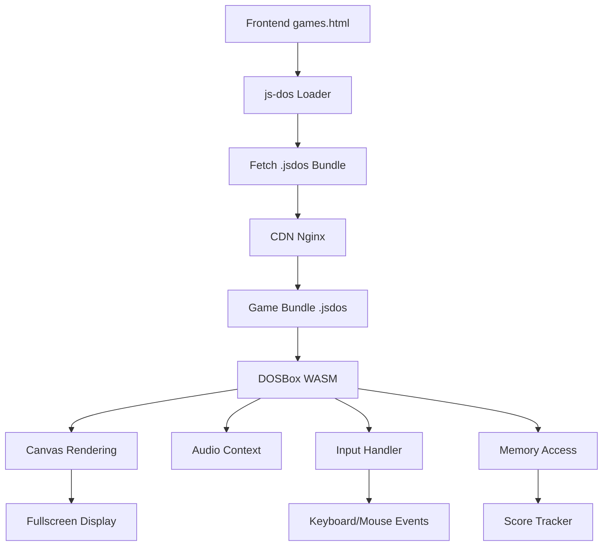

## ¿Qué es js-dos?

js-dos es una biblioteca JavaScript que permite ejecutar juegos y programas de MS-DOS directamente en el navegador usando DOSBox compilado a WebAssembly.

### Ventajas de js-dos

<CardGroup cols={2}>
  <Card title="Sin Instalación" icon="download">
    Juegos ejecutan directamente en el navegador
  </Card>
  <Card title="Alto Rendimiento" icon="gauge-high">
    WebAssembly ofrece velocidad nativa
  </Card>
  <Card title="Cross-Platform" icon="globe">
    Funciona en Windows, Mac, Linux, móviles
  </Card>
  <Card title="Compatibilidad" icon="check">
    Soporta prácticamente todos los juegos DOS
  </Card>
</CardGroup>

## Versión Utilizada

```json
{
  "name": "js-dos",
  "version": "7.xx",
  "files": {
    "js-dos.js": "Core library",
    "wdosbox.js": "DOSBox WebAssembly",
    "wdosbox-x.js": "DOSBox-X variant (más features)",
    "wlibzip.js": "ZIP decompression support"
  }
}

```

<Note>
  Usamos js-dos 7.xx porque ofrece mejor rendimiento y API más limpia que versiones anteriores.
</Note>

## Arquitectura de Integración



## Estructura de un Bundle .jsdos

Un archivo `.jsdos` es un ZIP que contiene:

```

game.jsdos
├── game.exe              # Ejecutable del juego
├── *.dat, *.wad, etc.   # Assets del juego
├── dosbox.conf          # Configuración DOSBox
└── metadata.json        # Información del bundle

```

### Ejemplo: doom.jsdos

```json
{
  "title": "DOOM",
  "year": 1993,
  "publisher": "id Software",
  "executable": "DOOM.EXE",
  "args": ["-skill", "3"],
  "dosbox": {
    "cycles": "max",
    "memsize": 16,
    "sound": {
      "sb": "sb16",
      "irq": 7,
      "dma": 1
    }
  }
}

```

## Implementación Frontend

### 4.2.1. Inicialización de js-dos

```html
<!-- Cargar js-dos desde CDN -->
<script src="https://cdn.jsdelivr.net/npm/js-dos@7.xx/dist/js-dos.js"></script>

<div id="jsdos-container">
  <canvas id="jsdos-canvas"></canvas>
</div>

```

```javascript
// Inicializar emulador
async function loadGame(gameUrl) {
  const canvas = document.getElementById('jsdos-canvas');

  const ci = await Dos(canvas, {
    wdosboxUrl: "/js-dos/wdosbox.js",
    cycles: "auto",
    autolock: false
  });

  const bundle = await fetch(gameUrl);
  const fs = await ci.fs();
  await fs.extract(bundle);

  await ci.main(["-conf", "dosbox.conf"]);
}

```

### 4.2.2. Control de Entrada

```javascript
class InputHandler {
  constructor(ci) {
    this.ci = ci;
    this.setupEventListeners();
  }

  setupEventListeners() {
    // Keyboard events
    document.addEventListener('keydown', (e) => {
      this.ci.events().onKeyDown(e.keyCode, e.key);
    });

    document.addEventListener('keyup', (e) => {
      this.ci.events().onKeyUp(e.keyCode, e.key);
    });

    // Mouse events
    const canvas = this.ci.canvas();
    canvas.addEventListener('mousemove', (e) => {
      const rect = canvas.getBoundingClientRect();
      const x = e.clientX - rect.left;
      const y = e.clientY - rect.top;
      this.ci.events().onMouseMove(x, y);
    });
  }
}

```

### 4.2.3. Gestión de Estado

```javascript
class GameStateManager {
  constructor(ci) {
    this.ci = ci;
    this.memoryWatcher = null;
    this.scoreCallback = null;
  }

  async startScoreTracking(gameType, callback) {
    this.scoreCallback = callback;

    const memory = await this.ci.memory();
    this.memoryWatcher = setInterval(() => {
      this.checkScore(memory, gameType);
    }, 100);
  }

  checkScore(memory, gameType) {
    const config = GAME_MEMORY_CONFIGS[gameType];
    if (!config) return;

    const scoreValue = memory.readUint32(config.scoreAddress);

    if (this.scoreCallback && scoreValue !== this.lastScore) {
      this.scoreCallback(scoreValue);
      this.lastScore = scoreValue;
    }
  }

  stopTracking() {
    if (this.memoryWatcher) {
      clearInterval(this.memoryWatcher);
      this.memoryWatcher = null;
    }
  }
}

```

## Configuraciones por Juego

### 4.2.4. Perfiles de Configuración

```javascript
const GAME_CONFIGS = {
  doom: {
    cycles: "max",
    memsize: 16,
    sound: {
      sb: "sb16",
      irq: 7,
      dma: 1
    },
    memoryAddresses: {
      score: 0x1234,
      health: 0x5678,
      ammo: 0x9ABC
    }
  },

  quake: {
    cycles: "max",
    memsize: 32,
    sound: {
      sb: "sb16",
      irq: 7,
      dma: 1
    },
    memoryAddresses: {
      score: 0xDEF0,
      health: 0x1357,
      armor: 0x2468
    }
  }
};

```

### 4.2.5. Optimización de Rendimiento

```javascript
class PerformanceOptimizer {
  constructor(ci) {
    this.ci = ci;
    this.frameSkip = 0;
    this.targetFPS = 60;
  }

  async optimizeForDevice() {
    const deviceInfo = this.getDeviceInfo();

    if (deviceInfo.isMobile) {
      await this.ci.config({
        cycles: "auto",
        frameskip: 2,
        scaler: "none"
      });
    } else if (deviceInfo.isLowEnd) {
      await this.ci.config({
        cycles: 15000,
        frameskip: 1,
        scaler: "normal2x"
      });
    } else {
      await this.ci.config({
        cycles: "max",
        frameskip: 0,
        scaler: "advmame3x"
      });
    }
  }

  getDeviceInfo() {
    return {
      isMobile: /Android|iPhone|iPad/i.test(navigator.userAgent),
      isLowEnd: navigator.hardwareConcurrency < 4
    };
  }
}

```

## Depuración y Monitoreo

### 4.2.6. Herramientas de Debug

```javascript
class DOSDebugger {
  constructor(ci) {
    this.ci = ci;
    this.enabled = false;
  }

  async enable() {
    this.enabled = true;

    // Monitor de memoria en tiempo real
    this.memoryMonitor = setInterval(async () => {
      const memory = await this.ci.memory();
      console.log('Memory usage:', memory.getUsage());
    }, 1000);

    // Monitor de FPS
    this.fpsMonitor = new FPSMonitor(this.ci.canvas());
    this.fpsMonitor.start();
  }

  logMemoryAt(address, size = 4) {
    this.ci.memory().then(memory => {
      const value = memory.readBytes(address, size);
      console.log(`Memory[0x${address.toString(16)}]:`, value);
    });
  }

  disable() {
    if (this.memoryMonitor) {
      clearInterval(this.memoryMonitor);
    }
    if (this.fpsMonitor) {
      this.fpsMonitor.stop();
    }
    this.enabled = false;
  }
}

```

<Tip>
  La integración de js-dos permite acceso completo al estado del emulador, incluyendo memoria, registros CPU y sistema de archivos virtual.
</Tip>

## Próximos Pasos

Con js-dos integrado, el siguiente paso es implementar la [Arquitectura Frontend](/frontend/architecture) que maneje la interfaz de usuario y las interacciones del jugador.